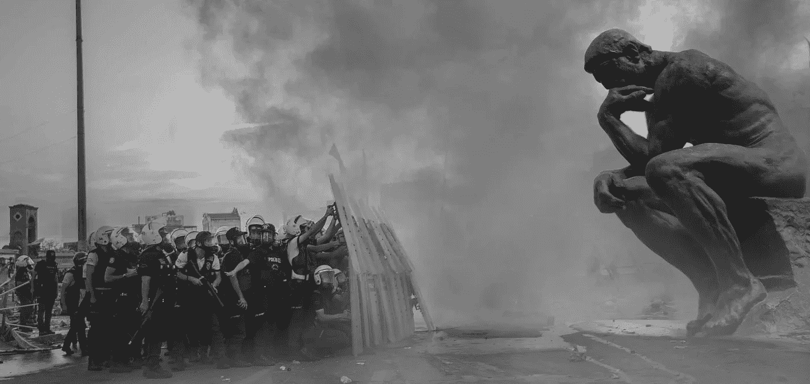

# 一份 15 世纪的手稿如何帮助解决加密货币的争论

> 原文：<https://medium.com/coinmonks/how-a-14th-century-manuscript-helps-resolve-the-cryptocurrency-argument-87541924c2a0?source=collection_archive---------1----------------------->

Memento Mori with manuscript- Image Source: [Pixabay](https://pixabay.com/en/mortality-skull-and-crossbones-401222/)

## 历史暗示了现代银行业的死亡。

> *哪里没有秩序，哪里就有混乱，*——卢卡·帕乔利

当一个人回顾过去时，会发现一些有独创性的例子，他们双手沾满墨水，由于读了太多的书而变得模糊不清，为他人带来震撼。这些明亮的星星照亮了大众；用想法、发明和哲学来扰乱 [*现状*](https://youtu.be/VyClcoLahXU) 。

这个故事我们已经重复过很多次了；每当新技术到来，我们就取代过去的陈旧观念。如今，一些创新者承诺，去中心化的区块链账本将改变我们使用资金的方式。

## 第一本会计账簿

克里斯托弗·哥伦布发现新大陆几年后；一位名叫[卢卡·帕乔利](http://famous-mathematicians.org/luca-pacioli/)的默默无闻的意大利僧侣写了一本有史以来最有影响力的书。现代会计的建立始于 1494 年，当时帕乔利在他的祖国意大利编纂了会计准则。

帕乔利描述的方法被写成了一本名为《算术、几何、比例和比例的一切》的书。

## 人文主义理想

在文艺复兴早期，当帕乔利写《总结》的时候，人文主义运动刚刚开始。意大利文艺复兴时期和欧洲其他地区商人阶层的增长有助于贸易的扩展，促进了人文主义；一种哲学思想，鼓励追求生活的乐趣而不是过奴役的生活。

# 会计之父

Modern Ledger- Image Source: [Pixabay](https://pixabay.com/en/ledger-accounting-business-money-1428230/)

当思想的交流和信息的共享预示着一个繁荣的新时代，也定义了艺术、商业和科学之间的新关系时，acioli 很可能充满活力地观察了这一时期。他在 *Summa* 中描述的记账方法不是他自己的。然而，帕乔利已经被称为“会计之父”。

## 复式会计

今天，商业分类账似乎是常识，但是当帕乔利写《总结》的时候，他们认为这是数学的前沿；过去 500 年来，复式记账法一直是商业交易事实上的标准。⁴

新的会计实务有助于为企业提供稳定和增长；这为发展中的城邦贡献了财富。这种生活水平的提高和正式的分类账系统有助于促进一些人类已知的最伟大的艺术和音乐。

## *Summa in Print*

当古腾堡在 1439 年发明印刷机时，他可能没有预见到它的影响。出版社在意大利和欧洲发行了帕乔利的《T2 摘要》和他的许多其他作品。

就像 Pacioli 一样，现代创新者明白共享信息和合作对于技术的大规模采用至关重要。我们生活在一个信息时代，但印刷机是众多信息时代浪潮中的第一个。例如广播、电话、电视、互联网等

# 你好中本聪

Bitcoin Image Source: [Pixabay](https://pixabay.com/en/bitcoin-blockchain-financial-mining-3406638/)

2008 年，有人以[中本聪](https://bitcoin.org/bitcoin.pdf)的笔名低调地在互联网上发布了一份白皮书。关于中本聪的真实身份有很多猜测，世界认为他对数字货币的扩散有影响。

像帕乔利一样，他在一个经历巨大社会变革的时代写作；人文主义者信奉古典理想，而当前的运动则宣扬增加个人自由，减少政府监管。

白皮书发表的时间也正值人们对银行体系感到不安和不信任的时期；在论文中，Nakamoto 描述了一个基于加密证明而不是信任中间人的点对点数字支付系统，他称之为[比特币](https://bitcoin.org/en/)。这些想法并不新鲜，但和 Pacioli 一样，他写下了现有的想法，并分享了新的分散式分类账系统的信息，以取代现代银行业老化的业务模式。

## 现有货币

大规模采用分散式分类账系统和加密货币的最大障碍是现任货币问题；每个人都以某种形式使用法定货币。⁵我们将世界货币与美元挂钩也是有争议的；使用加密货币的决定，至少在边际上，是停止使用法定货币的决定。

问题:转换成本和网络效应有利于美联储、国际货币基金组织、世界银行和其他国际银行组织。⁵

## 不要诱惑一个绝望的人

Xiamen- Image Source: [Pixabay](https://pixabay.com/en/xiamen-slum-dwellers-824233/)

历史已经多次告诉我们，一个国家的货币可能会失灵，绝望可能会导致突然的戏剧性变化。在希腊戏剧性的债务危机、津巴布韦的恶性通货膨胀和乌克兰的动荡之后，越来越多的陷入困境的公民开始使用比特币。

在经历了多年的恶性通货膨胀后，贫困国家委内瑞拉的人民正在大规模采用比特币。⁶

## 印刷机不利于货币流通

金融教育网站 [Investopedia](https://www.investopedia.com/terms/h/hyperinflation.asp) 将恶性通货膨胀描述为一种每月通货膨胀率达到 50%或以上的货币。价格继续飙升，因为政府印更多的钱来支付他们的开支，这剥夺了人民的购买力。

然而，如果你剥夺了一个国家的印钞机，政府就不能通过印更多的钱来贬值货币。美元已经成为遭受恶性通货膨胀的国家的[【首选】](https://www.forbes.com/sites/forbestechcouncil/2018/07/20/americans-cant-understand-the-value-of-decentralized-currency-but-many-other-countries-can/#34bc51cb637f)资金来源。

厄瓜多尔在 2000 年实行了美元化，并迅速消除了恶性通货膨胀；委内瑞拉现政权无意美元化，甚至拒绝了美国的援助。⁷

Bringing bananas to market in Maracaibo, Venezuela. Source: [Pixabay](https://pixabay.com/en/maracaibo-venezuela-man-working-94781/)

## 石油不是复古

委内瑞拉马杜罗领导的政府铸造了自己版本的加密货币 Petro，并打算出售以换取外汇。

马杜罗声称它们就像一张“石油券”，代表来自委内瑞拉某个特定地区的石油；这样它可以将名义上由实际资源和外汇储备支持的石油与玻利瓦尔联系起来，阻止其下滑。⁸

## 领头羊

一家加密货币 ATM 提供商计划于 2019 年第一季度在委内瑞拉加拉加斯安装一台比特币 ATM。⁹这一事件可能是委内瑞拉石油公司和命运多舛的玻利瓦尔死亡的标志，也表明委内瑞拉人民已经厌倦了，并且对委内瑞拉石油公司会帮助他们几乎没有信心。

委内瑞拉的经济问题很复杂，据报道通货膨胀率高达 100 万玻利瓦尔，给人民带来了生存问题。

## 异常宝藏

Treasure box- Image Source: [Pixabay](https://pixabay.com/en/chest-gold-lock-money-pirate-1294559/)

美国物理学家托马斯·库恩在他写的书《科学革命的结构:**中对科学进步之所以能够实现提出了质疑，他认为反常会导致新的想法，而这些想法会对旧的做事方式提出质疑。⁰**

**区块链技术是一种新的异常现象，一种“异常宝藏”，就像打开了 [*潘多拉魔盒*。](https://www.greekmyths-greekmythology.com/pandoras-box-myth/)**

**托马斯·库恩(Thomas Kuhn)指出“各种想法会竞相取代另一种想法，即使有一种占主导地位的想法，只要人们继续创造新方法，替代方案也会继续存在”。⁰**

**这种情况现在正在发生:人们只需要进行简单的互联网搜索，就可以找到大量各种竞争的加密货币。反对者和专家比比皆是，他们都有自己的观点，许多人都有有效的事实来支持他们对这一令人兴奋的技术的观点。**

# **斗争**

****

**The Struggle Image Source: [Pixabay](https://pixabay.com/en/people-adult-man-hand-rope-3248054/)**

**J 正如帕乔利在 *Summa* 中写下革命性的数学一样，区块链这门新科学正在被中本聪、[布特林](https://www.youtube.com/watch?v=TDGq4aeevgY)、 [Ver](https://rogerver.com/) 、[萨博](https://cointelegraph.com/tags/nick-szabo)、 [Voorhees、](https://youtu.be/rZnwQQF4v_o) [Andersen](http://gavinandresen.ninja/) 以及成千上万其他人的工作所书写和创造:我们的社会将从这些新的发展中受益**

**过去的迹象表明，区块链技术将成为商业交易事实上的新标准，它将迫使现有的金融系统放弃对人民的束缚。**

**过去普通人最明显的经济胜利是欧洲的封建制度随着新形成的商人阶级而分崩离析。这在很大程度上可能是因为复式记账系统。**

**当社会对新技术作出反应时，如在工业革命中，或随着意识形态的变化，如在新教改革中，这些社会阶层之间的财务竞争经常发生。**

**新闻频道[美国消费者新闻与商业频道 2017 年 9 月报道](https://www.cnbc.com/2017/11/14/richest-1-percent-now-own-half-the-worlds-wealth.html)世界上最富有的 1%的人现在拥有世界上大约 50.1%的财富，仅 15 年就增长了近 5%。财富不平等继续扩大，这引出了一个问题[“加密货币能解决收入不平等吗？”](https://hackernoon.com/could-cryptocurrency-be-the-answer-to-income-inequality-59dc8abfdf1d)**

# **无束缚阶级**

**【[无键](http://<a href="https://www.thefreedictionary.com/bondless">bondless</a>) : adj *无键，无限制*。]**

****

**Pondering change Image Source: [Pixabay](https://pixabay.com/en/police-violence-thinking-man-2602626/)**

**像委内瑞拉一样，世界其他地方已经厌倦了贬值的货币、代际贫困和日益增加的政府监管。一个希望摆脱现代农奴制束缚的新阶层似乎正在奋起反抗大银行和大政府的罪恶。**

**这个新成立的无债券类创造的加密货币将会篡夺当前的金融系统。想象一下，如果帕乔利的账目在每一笔商业交易和政治活动中向全世界公开，那么在过去的 500 年里，事情会有多么不同。**

**我预测*无债券阶级*将拥抱区块链技术，同时继续资本主义的理想和原则，同时努力缩小财富差距。现有机构和政府是完全采纳、改变还是完全拒绝加密货币仍然是一个难以捉摸的话题。**

> **帮助是给醒着的人，而不是给睡着的人。——卢卡·帕乔利**

# **参考资料:**

1.  **布朗、麦凯、博伊德、福戈、斯隆和帕特里克(1905)。*会计和会计师的历史*。爱丁堡:杰克。**
2.  **史密斯，m .(2013 年 1 月 1 日)。卢卡·帕乔利:会计之父。*https://papers.ssrn.com/sol3/papers.cfm?abstract_id=2320658 Ssrn 电子期刊*T22**
3.  **McCarthy，p .，Sangster，a .，和 Stoner，g .(2008 年 1 月 1 日)。帕乔利与人文主义:在算术总结中投掷文本。*会计历史，13，* 2，183–206**
4.  **沙特菲尔德，M. (1968 年)。*当代会计思想演变研究*。加州贝尔蒙特:迪肯森酒吧。钴**
5.  **Luther，w . j .(2016 年 1 月 1 日)。比特币和数字支付的未来。*《独立评论》，第 20 期，* 3，397–404 页。[http://www.independent.org/pdf/tir/tir_20_03_12_luther.pdf](http://www.independent.org/pdf/tir/tir_20_03_12_luther.pdf)**
6.  **克里斯汀·阿玛里奥和法比奥拉·桑切斯——美联社。(2017).委内瑞拉人将比特币繁荣视为生存，而非投机。美联社头条新闻。美联社。从[http://search.ebscohost.com/login.aspx?direct=true&AuthType = cookie，ip，geo，url，cpid&custid = s 7324964&geo custid = s 7324964&db = RPS&AN = AP 9516 FD 02 a 5434 ef 2 b 9 d6b 7 b 39655 A8 c 1&site = ehost-live&scope = site](http://search.ebscohost.com/login.aspx?direct=true&AuthType=cookie,ip,geo,url,cpid&custid=s7324964&geocustid=s7324964&db=rps&AN=AP9516fd02a5434ef2b9d6b7b39655a8c1&site=ehost-live&scope=site)**
7.  **科伊和赖雅出版社(2018 年)。委内瑞拉不会接受恶性通货膨胀疗法。彭博商业周刊，(4580)，33。从[http://search.ebscohost.com/login.aspx?direct=true&AuthType = cookie，ip，geo，url，cpid&custid = s 7324964&geo custid = s 7324964&db = f6h&AN = 131157730&site = ehost-live&scope = site](http://search.ebscohost.com/login.aspx?direct=true&AuthType=cookie,ip,geo,url,cpid&custid=s7324964&geocustid=s7324964&db=f6h&AN=131157730&site=ehost-live&scope=site)**
8.  **新科学家，24 岁。从[http://search.ebscohost.com/login.aspx?direct=true&AuthType = cookie，ip，geo，url，cpid&custid = s 7324964&geo custid = s 7324964&db = ulh&AN = 132792140&site = ehost-live&scope = site](http://search.ebscohost.com/login.aspx?direct=true&AuthType=cookie,ip,geo,url,cpid&custid=s7324964&geocustid=s7324964&db=ulh&AN=132792140&site=ehost-live&scope=site)**
9.  **加密买家将在委内瑞拉部署首台比特币 ATM。(2019).新墨西哥州 ATMmarketplace.Com。从[http://search.ebscohost.com/login.aspx?direct=true&AuthType = cookie，ip，geo，url，cpid&custid = s 7324964&geo custid = s 7324964&db = buh&AN = 134232404&site = ehost-live&scope = site](http://search.ebscohost.com/login.aspx?direct=true&AuthType=cookie,ip,geo,url,cpid&custid=s7324964&geocustid=s7324964&db=buh&AN=134232404&site=ehost-live&scope=site)**
10.  **科学革命的结构。3 红色。伊利诺伊州芝加哥:芝加哥大学出版社，1996 年。**
11.  **[https://hacker noon . com/could-crypto currency-be-the-answer-to-income-inequality-59 DC 8 abfdf 1d](https://hackernoon.com/could-cryptocurrency-be-the-answer-to-income-inequality-59dc8abfdf1d)**

> **[在您的收件箱中直接获得最佳软件交易](https://coincodecap.com/?utm_source=coinmonks)**

********