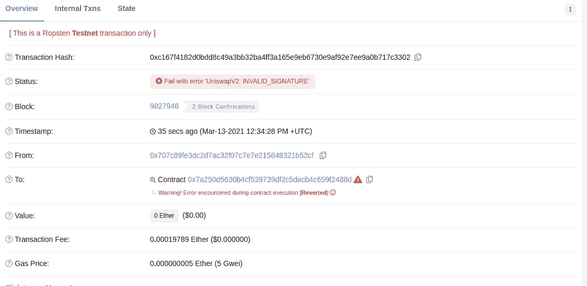

# Uniswap/Sushiswap 路由器中的一个 bug 如何保护您免受恶意攻击？

> 原文：<https://medium.com/coinmonks/how-a-bug-in-the-uniswap-sushiswap-router-can-protect-you-against-rug-pulls-322aff590d56?source=collection_archive---------2----------------------->

TLDR:使用“许可+做某事”模式时要小心

我将使用 uniswap 进行解释，但对于 sushiswap 或任何其他 uniswap 分支也是如此。

当清除流动性时，uniswap 前端使用[*removeliquitywithpree*](https://uniswap.org/docs/v2/smart-contracts/router02#removeliquiditywithpermit)*或*[*removeliquityethwithpree*](https://uniswap.org/docs/v2/smart-contracts/router02#removeliquidityethwithpermit)*方法。*

1.  *这意味着用户首先签署对路由器契约的许可，以使用他们遵循 [EIP-2612 标准](https://github.com/ethereum/EIPs/blob/8a34d644aacf0f9f8f00815307fd7dd5da07655f/EIPS/eip-2612.md)的 Uniswap V2 LP 令牌，然后使用前端*调用路由器契约上的*removeliquiditywithprance 或 removeliquidityethwithprance*方法。**
2.  *路由器合同获取签名并将其提交给 uni WAP V2 LP 令牌合同(参见此处的[和](https://github.com/Uniswap/uniswap-v2-periphery/blob/master/contracts/UniswapV2Router02.sol#L153))，这允许它使用用户的 uni WAP V2 LP 令牌。*
3.  *既然路由器契约具有来自用户的许可，它将令牌从用户转移到它自己，移除流动性并将相应对的令牌给予用户。*

*事情是这样的。还记得用户在步骤 2 中签署的允许路由器使用令牌的签名吗？该签名不必仅由路由器合同提交给 uni WAP V2 LP 令牌合同。任何人都可以提交。这就是 EIP 2612 的意义所在。*

*这里可能发生的情况是，假设有人正在通过移除货币对的所有流动性来欺骗你。您可以做的是，当移除流动性的交易在 mempool 中时，您可以在 rug puller 的交易进入之前，获取 rug puller 在[*removeliquiditywithproperty*](https://uniswap.org/docs/v2/smart-contracts/router02#removeliquiditywithpermit)*或*[*removeliquidityethwithproperty*](https://uniswap.org/docs/v2/smart-contracts/router02#removeliquidityethwithpermit)*参数中提交的签名，并将其提交给Uniswap V2 LP 令牌合同。这将导致地毯拉料器的交易失败。**

# **这怎么可能呢？**

**因为在步骤 2，路由器契约提交的签名变得无效，因为您已经使用了具有相同 nonce 的签名。**

****

**Failed transaction when removing liquidity**

**现在你可以在拉地毯的人再次尝试之前做你的交易，因为第二次你不能做任何其他事情来阻止他们拿走流动性。**

**我做了一个通用的机器人，它为所有试图在 Ropsten testnet 上移除流动性的人做了同样的事情。进入 [uniswap.exchange](https://app.uniswap.org/#/pool) ，将网络切换到 ropsten 并尝试移除流动性(你必须先给任何一对添加一些流动性)来亲眼看看。**

**交易示例:
地毯拉头:[https://ropsten . ethers can . io/tx/0xc 167 f 4182d 0 BDD 8 c 49 a 3 bb 32 ba 4 ff 3a 165 e 9 EB 6730 e 9 af 92 e 7 ee 9 a 0 b 717 c 3302](https://ropsten.etherscan.io/tx/0xc167f4182d0bdd8c49a3bb32ba4ff3a165e9eb6730e9af92e7ee9a0b717c3302) You:
[https://ropsten . ethers can . io/tx/0x deeca 23 e 0704 AE 764180 a 82 e BBB 97 df 3](https://ropsten.etherscan.io/tx/0xdeeca23e0704ae764180a82c2ebbb97df32941c509a7eff3a6ebb3b98594f404)**

# **一个简单的解决方法:**

**在路由器合同[中添加此处](https://github.com/Uniswap/uniswap-v2-periphery/blob/master/contracts/UniswapV2Router02.sol#L153)和[处](https://github.com/Uniswap/uniswap-v2-periphery/blob/master/contracts/UniswapV2Router02.sol#L167)解决了这个问题:**

```
**if (IUniswapV2Pair(pair).allowance(msg.sender,address(this)) != value) {
   UniswapV2Pair(pair).permit(msg.sender, address(this), value,            deadline, v, r, s);
}**
```

**(我向 Uniswap 团队提交了报告，等了 6 个月才发表，所以可以肯定地说，uniswap 团队不认为这是一个 bug。)**