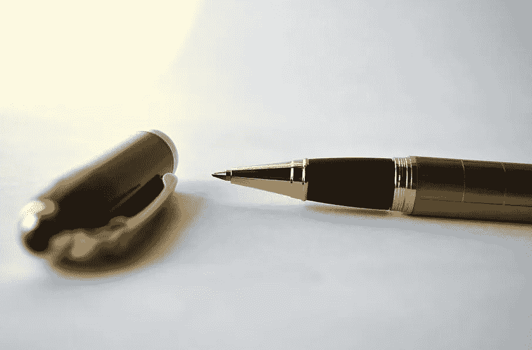

# 一笔交易如何进入卡尔达诺的区块链

> 原文：<https://medium.com/coinmonks/how-a-transaction-gets-into-cardanos-blockchain-4d6fe2b20715?source=collection_archive---------3----------------------->

当爱丽丝给鲍勃寄 1000 枚 ADA 硬币时，她用的是她的钱包。鲍勃将在几秒钟内收到硬币。在文章中，我们将介绍整个过程，并解释在这个场景中幕后发生了什么。

# **阿达币属于它们的主人**

卡尔达诺网络能够分离阿达硬币的所有权和过程…