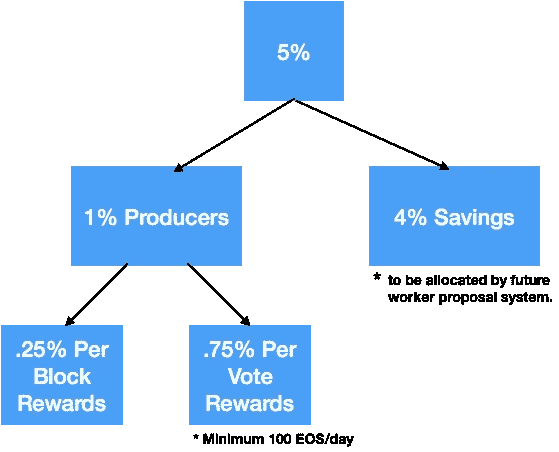

# 如何(以及为什么)为 EOS 块生产商投票——最终指南

> 原文：<https://medium.com/coinmonks/how-and-why-to-vote-for-eos-block-producers-the-ultimate-guide-8a02944c5631?source=collection_archive---------9----------------------->

随着 EOS mainnet 的推出现在几乎完成，许多人都有疑问，投票过程将如何进行，为非常令人垂涎的块生产者的角色。

一条锁链统治所有人！

你可能知道，将有 21 个选定的块生产者运行主要的 EOS mainnet。可能还有其他(不太官方的)EOS 网络，但对于这篇文章，我将重点放在主要的一个，它将由 EOSGO 网站[这里](https://bp.eosgo.io/)列出的块生产者支持

EOSGO 基于一系列标准分析了每一个 BP 候选人，他们的最新 BP 候选人报告可以在[这里](https://steemit.com/eos/@eosgo/eos-block-producer-candidate-report-10-may-30-2018)找到

注意:虽然最初可能会出现一些不同的测试网，但所有主要的区块生产商都同意只创建一个链。与此同时，您可以在以下任一网站上看到各种公共测试网的当前状态:

[https://eosamericas.com/dashboard/](https://eosamericas.com/dashboard/)

[https://eosportal.io/](https://eosportal.io/)

为了让一个链成为“官方”链，至少 15%的 EOS 令牌必须在该链上投票(只有到那时，它才会被“解锁”,并且块生产者开始获得报酬)。

**区块制作者如何获得报酬**

每年，EOS 会有 5%的通货膨胀。

假设初始总数为 1，000，000，000 个令牌，这意味着在第一年将额外创建 50，000，000 个令牌。

4% (40，000，000 英镑)将用于储蓄基金，通过提案制度分配给工人。

1% (10，000，000)将分配给区块生产商和备用区块生产商。

在给砌块生产商的 1%中，只有 0.25%会给实际的 21 个砌块生产商。第一年，这将是 250 万。每个 BP 得到多少将由它们产生多少块决定。

其余的 0.75% (7，500，000)将在所有区块生产者和备用区块生产者之间分享，这取决于他们获得的票数。

他们将获得多少报酬？

实际区块生产商:

假设每个区块生产商生产相同数量的区块，他们每年将获得 2，500，000/21 = 119，047 个 EOS 令牌(以每个 15 美元的价格计算，仅“区块奖励”部分，每个区块生产商就可获得约 1，785，000 美元)。

所有区块生产商(包括备用):

如果总共有 200 个块生产者(21 个生产者和 179 个备用生产者)，则剩余的 7，500，000 个令牌将根据他们获得的票数在所有这些生产者之间进行分配。

现在，我不是 100%确定下一部分(如果我错了，请告诉我)，但根据我的理解，这是它将如何工作:

每个代币有能力投票给 30 个不同的 BP。存在 10 亿个代币，这意味着总共有 300 亿张选票。但是，一个令牌不能用于为同一个 BP 投票两次。这意味着，如果你只投 1 BP，他们将只收到你每一个股份的 1 票。

如果区块生产商 A 获得总票数的 5%，那么他们将获得 0.75%“每票奖励”的 5% = 5% x 7，500，000 = 375，000 代币= 5，625，000 美元(假设每代币 15 美元)。

记住——这是他们实际生产积木所获得的额外收入。

即使大宗生产商仅获得 0.5%的投票(意味着他们可能只是一个“备用”生产商)，他们仍将获得 0.5% x 7，500，000 =每年 37，500 个代币= 562，500 美元(每个代币 15 美元)

为了获得“每票奖励”代币，BPs 必须满足每天 100 个 EOS 的阈值。如果他们每天没有完成至少 100 个 EOS，他们将不会得到任何奖励。

(顺便说一句——这只是我的个人观点，但我认为每枚代币 15 美元是一个保守的估计。在未来几年内，EOS 的价格很可能超过每个令牌数百甚至数千美元)。

正如你所看到的——成为一名街区制作人的动机非常强烈！期待在这个舞台上看到一些非常激烈的竞争。

他们会用那些钱做什么？

除了维护所需的基础设施(不便宜)之外，最好的砌块生产商会将他们的大量报酬再投资于 EOS 社区(事实上，他们被期望这样做作为他们角色的一部分)。

每个 BP 都概述了他们将如何做——从开发人员培训、教育、Dapp 开发到创业孵化。

检查每个块生产者，找出他们会做什么

**如何投票:**

好了，现在你明白了投票的重要性——你实际上是怎么做的呢？

嗯，不同的组织正在开发许多工具(包括区块生产商自己)。

到目前为止，这些是我能找到的:

EOS 门户—【https://eosportal.io/help 

在门户上使用散点—[https://www.youtube.com/watch?v=_hWRAjLKa8w](https://www.youtube.com/watch?v=_hWRAjLKa8w)

桌面应用—[https://github.com/greymass/eos-voter](https://github.com/greymass/eos-voter)

Pomelo 手机 app—[https://stee MIT . com/EOS/@ EOS nation/EOS-wallet-voting-mobile-app](https://steemit.com/eos/@eosnation/eos-wallet-voting-mobile-app)

线下投票—[https://github.com/tokenika/secure-bp-voting](https://github.com/tokenika/secure-bp-voting)

网络应用—【https://eoswalletpro.com/ 

【http://vote.libertyblock.io/ 网络应用

到目前为止，与任何网络应用交互的最安全方式可能是通过由内森·詹姆斯开发的 Chrome 和 Firefox 插件 [SCATTER](https://scatter-eos.com/) 。Scatter 提供了 EOS 区块链和 EOS 应用程序或网站之间的桥梁，无需您直接向应用程序/网站本身提供您的私钥(您只需将其提供给 Scatter)。这与元掩码的工作方式类似。

**代理投票:**

如果你不想自己投票，有一个机制可以让一个可信的第三方为你投票。我仍然不能 100%确定这将如何工作，但你可以做你自己的研究。

**投票衰减:**

Block.one 还希望确保用户经常更新他们的投票，而不是采取“设置好就忘了”的方式。为了促进这一点，他们引入了长达一年的投票权衰减半衰期。这种衰退将在投票后一周开始。如果用户在一周后没有重新投票，投票的强度将会减弱。一年后，投票的强度将是最近投票的 50%。如果用户重新投票，它将立即跳回到最大强度。

**铆接:**

当用户选择投票时，他们将不得不下注他们的 EOS 令牌。当下注时，这些代币被锁定；不可转让和不可交换。对于投机投资者来说，这意味着在此期间你将不能出售你的代币。锁定期为 72 小时，从用户表示希望取消其令牌开始算起。投票不会花费你任何 EOS。

**免责声明:**

这篇文章仍处于草稿阶段，正在提交给社区进行验证。请先做好自己的调研！

投票之前——更安全的做法可能是等到各种工具都经过了知情人士(如可信的区块生产商)的测试和验证。

如果你喜欢这篇文章，请分享它或者考虑加入 [Trybe Network](https://trybe.one) 并创作你自己的高质量文章(为此你将获得基于 EOS 的代币)。

*原载于 2018 年 6 月 3 日*[*trybe . one*](https://trybe.one/how-to-vote-for-eos-block-producers-the-ultimate-guide/)*。*