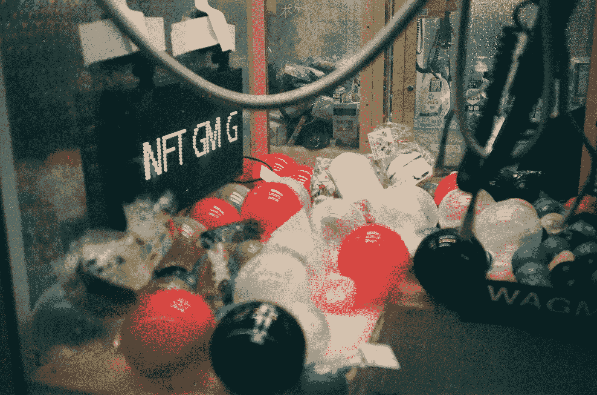

# 人们对 NFT 的看法怎么会如此错误？

> 原文：<https://medium.com/coinmonks/how-are-people-so-wrong-about-nfts-9a1738f44975?source=collection_archive---------1----------------------->

## 解开反对 NFTs 的论据

Photo by [Arstin Chen](https://unsplash.com/@arstinchen?utm_source=medium&utm_medium=referral) on [Unsplash](https://unsplash.com?utm_source=medium&utm_medium=referral)

## 来自 Reddit 的讨论

reddit 上的一个帖子提出了一个问题，“[为什么所有的 NFT 人都讨厌？](https://www.reddit.com/r/OutOfTheLoop/comments/rho91b/whats_up_with_the_nft_hate/horr549/)“最受欢迎的答案，在我写这篇文章的时候已经超过了 14k 次，详细说明了几个要点。对于任何了解 NFTs 的人来说，这些点只是显示了人们对这些数字产品有多么无知…