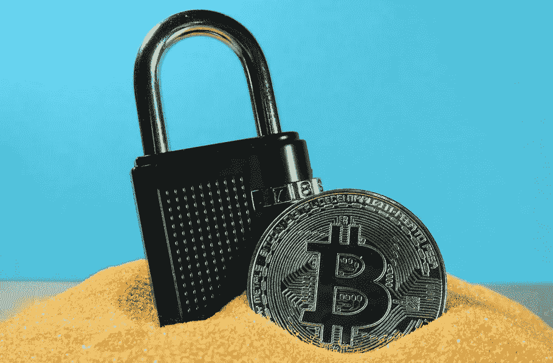

# 被骗走我的加密货币是一件好事

> 原文：<https://medium.com/coinmonks/how-being-scammed-out-of-my-cryptocurrency-turned-out-to-be-a-good-thing-e72a0c92f94d?source=collection_archive---------6----------------------->

[Photo: Ewan Kennedy](https://unsplash.com/@ewankennedy19)

**好奇心诱饵**

我是你们所说的加密领域的新手，在这个领域，理解数字货币对货币兑换、产品和服务的买卖以及作为一种资产持有都有积极的好处。所以，当一个“机会”出现时，你可以每天得到比银行支付的更多的利息…