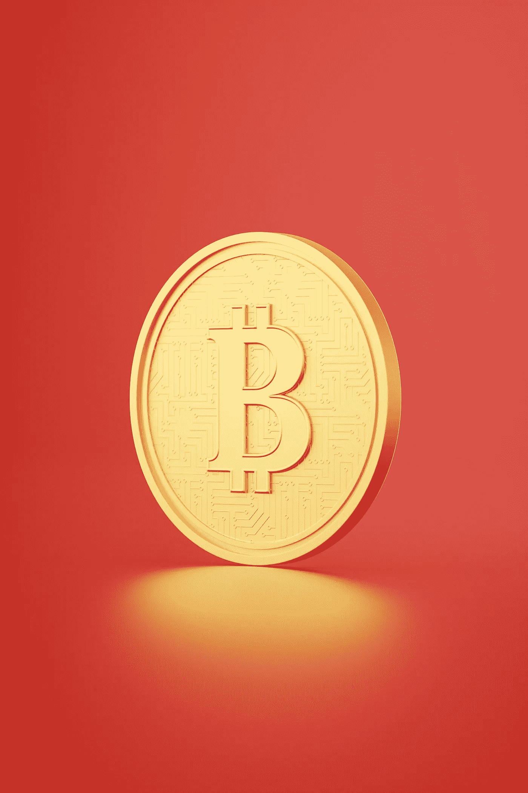
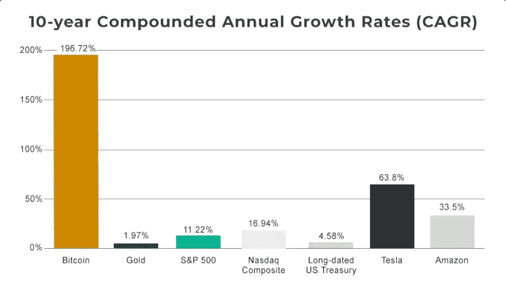
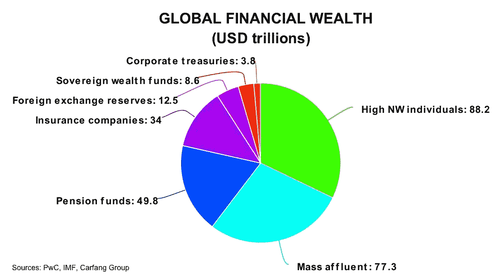

# 比特币到底能有多大？

> 原文：<https://medium.com/coinmonks/how-big-can-bitcoin-really-get-e1cfe06742b8?source=collection_archive---------5----------------------->

unsplash

随着比特币价值存储理念的数字资产使用案例的成熟，我们预计会出现显著增长，其特征是监管清晰、更多机构参与和主流采用。

在我们看来，在未来 20 年内，大多数行业的适用性都将发生巨大变化，而我们仅仅处于这种变化的早期阶段。根据美国银行最新密码货币报告公布的估计，截至 6 月 21 日，全球约有 2.21 亿人交换密码货币或使用基于区块链的应用程序，高于 5 月 20 日末的 6600 万人。

此外，通过投资比特币，大型机构和对冲基金不会冒失去比特币这一数字资产类别的风险。根据普华永道的一项调查，超过五分之一的对冲基金(21%)投资于数字资产，占 AUM 对冲基金总额的 3%。超过 85%的对冲基金希望在 2021 年底前提高其在资产类别中的权益。这可能会随着时间的推移而增加。

Source: casebitcoin.com

## 全球财富数据

Source: PwC, IMF, Carfang Group

如果没有房地产，全球金融财富估计约为 275 万亿美元。机构拥有或管理的资产超过 100 万亿美元。HNW 人拥有的 88 万亿美元中，大部分由金融机构处理。雷伊·达里奥、迈克尔·塞勒、斯坦·德鲁肯米勒和保罗·都铎·琼斯等人都披露了比特币的分配情况。去年，PTJ 宣布上调 2%，今年上调至 5%,摩根大通推出了内部 Bitcon 基金。

新兴富人是大众市场的高端，或拥有 10 万至 100 万美元流动金融资产加上年收入超过 7.5 万美元的个人，持有约 77 万亿美元。

由于时间跨度长，共同控制着 84 万亿美元资产的养老基金和大型保险公司必须保护自己免受法定货币贬值的影响。他们持有的债券已无法跟上通货膨胀的步伐，自 20 世纪 80 年代以来，通货膨胀一直处于历史最高水平。评级为 100 强的老牌保险公司，如 MassMutual，已经开始向比特币分配资金。

民族国家资产总额为 24.4 万亿美元，包括主权财富基金和外汇储备。即使他们认为比特币不太可能成为世界储备货币，拥有比特币也让他们有可能超越所有其他国家。这意味着他们可能会用自己 24 万亿美元的外汇储备购买比特币，而不会让比特币成为法定货币。根据官方数据，新加坡有一个超过 3000 亿美元的国家财富基金，直接从矿商手中购买比特币，而萨尔瓦多则购买了超过 1120 枚比特币，价值超过 6600 万美元。

## 结果

假设 275 万亿美元资产中只有 1 万亿美元被转换为比特币，并考虑到 Glassnode 的统计数据，那里有如此多的比特币长期持有者和有限的供应，购买和市场定价之间不会有 1:1 的相关性。例如，今年 3 月，美国银行(Bank of America)观察到，仅用 9300 万美元的新购买就将比特币价格推高了 1%。鉴于当时的市场规模，这相当于新购买量每增加 1%，市场资本总额就增加 100%。

我们认为这需要时间，考虑到时间框架以及区块链和加密货币的指数级增长，我们估计到 2030 年，一枚比特币的价值将在 40 万至 60 万美元之间。

*免责声明:本文包含的信息仅用于教育目的，不构成 Wheatstones 的任何形式的建议或推荐，也不打算供用户在做出(或避免做出)任何投资决定时依赖。*

> 加入 Coinmonks [电报频道](https://t.me/coincodecap)和 [Youtube 频道](https://www.youtube.com/c/coinmonks/videos)了解加密交易和投资

## 也阅读

 [## 杠杆代币[多头代币]终极指南

### 杠杆化令牌是具有杠杆化风险敞口的 ERC20 令牌，不考虑保证金、要求、管理…

medium.com](/coinmonks/leveraged-token-3f5257808b22)  [## 最佳加密交易所| 2021 年十大加密货币交易所

### 编辑描述

blog.coincodecap.com](https://blog.coincodecap.com/crypto-exchange)  [## 2021 年最佳加密借贷平台| 6 大比特币借贷平台

### 获得比特币和其他加密货币的最佳贷款利率

medium.com](/coinmonks/top-5-crypto-lending-platforms-in-2020-that-you-need-to-know-a1b675cec3fa)  [## 2021 年最佳免费加密交易机器人

### 2021 年币安、比特币基地、库币和其他密码交易所的最佳密码交易机器人。四进制，位间隙…

medium.com](/coinmonks/crypto-trading-bot-c2ffce8acb2a)  [## 最佳 4 个加密交易信号电报通道

### 这是乏味的找到正确的加密交易信号提供商。因此，在本文中，我们将讨论最好的…

medium.com](/coinmonks/best-crypto-signals-telegram-5785cdbc4b2b)  [## 5 个最佳社交交易平台[2021] | CoinCodeCap

### 编辑描述

blog.coincodecap.com](https://blog.coincodecap.com/best-social-trading-platforms)  [## BlockFi 评论 2021:利弊和利率| CoinCodeCap

### 编辑描述

blog.coincodecap.com](https://blog.coincodecap.com/blockfi-review)  [## 如何在印度购买比特币？2021 年购买比特币的 7 款最佳应用[手机版]

### 如何使用移动应用程序购买比特币印度

medium.com](/coinmonks/buy-bitcoin-in-india-feb50ddfef94)  [## 加密税务软件——五大最佳比特币税务计算器[2021]

### 不管你是刚接触加密还是已经在这个领域呆了一段时间，你都需要交税。

medium.com](/coinmonks/best-crypto-tax-tool-for-my-money-72d4b430816b)  [## 存储比特币的最佳加密硬件钱包[2021] | CoinCodeCap

### 编辑描述

blog.coincodecap.com](https://blog.coincodecap.com/best-hardware-wallet-bitcoin)  [## Pionex 评论 2021 |免费加密交易机器人和交换

### Pionex 是为交易自动化提供工具的后起之秀。Pionex 上提供了 9 个加密交易机器人…

medium.com](/coinmonks/pionex-review-exchange-with-crypto-trading-bot-1e459d0191ea)