# 比特币如何放大复利

> 原文：<https://medium.com/coinmonks/how-bitcoin-amplifies-compounding-bd7fddf66835?source=collection_archive---------0----------------------->

## 爱因斯坦称复利为世界第八大奇迹……当你用比特币这样的资产复利时，它是第九大奇迹。让我告诉你为什么和如何使用 FTX。

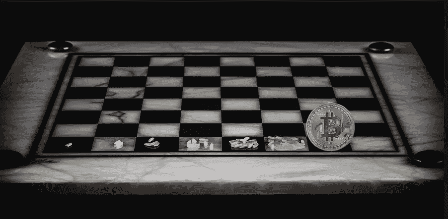

你以前听过这些故事。

从棋盘的第一个方格中的一粒米开始，将随后每个方格中的米量增加一倍。到最后一个方块，你有 180 亿粒米。

或者类似于…

两个年轻人开始为退休储蓄。一个 22 岁，另一个 31 岁。两者的投资每年都有 10%的收益。

22 岁的人每月贡献 300 美元(总共 21，600 美元的资本)……如果 6 年后 22 岁的人不再贡献一分钱，那么到 65 岁时他们将成为百万富翁。

另一方面，31 岁的人做着同样的事情，每月为退休贡献 300 美元，赚取同样的 10%……到 65 岁时，他们也将成为百万富翁。

然而，22 岁的投资了 21，600 美元，而 21 岁的投资了 126，000 美元。

不管人们如何看待它，复利是一个不可思议的投资教训。一旦你明白了这一点，你交易和投资的方式将永远改变。

今天，我想向你展示，当你将同样的经验应用于一种在未来十年将会增长的资产——比特币时，会发生什么。

我们看到的是复合效应被放大了。这就是为什么我称它为第九大奇迹。

# 这是关于资产

在贾维斯实验室，我们的目标是平均每月百分之六到十。人们喜欢它，人们讨厌它。

我们发现在加密中这个数量是最佳点。

这是因为我们关注的是市场上可获得的最佳风险回报。如果没有看起来好的东西，那就没有交易可言。

如果你是棒球击球手，接受投手给你的。这样，当你挥动球棒时，你可以最大化你的成功率。

贾维斯人工智能就是这么操作的。它抓住有利的交易机会。这可能不性感，但很有效。这意味着更高的“命中率”。关键是把它用在未来几年有望增长的资产上…

这是一年和两年内每月 6%的利率。

1 月 1 日你有两个 BTC。

12 个月内的 6%使你的账户价值在年底达到 4.024 BTC。这是你账户的两倍多。

两年后… 8.0978 BTC。

相当不可思议。但是事情在这里被放大了…

你的账户是按 BTC 增长的，而不是美元。这意味着我们需要考虑比特币在这段时间内的增长。出于我们的目的，我们将假设比特币的平均价值会随着时间的推移而增长。

假设第一年比特币的起价是 1 万美元。到第一年年底，它的价值翻了一番，达到 20，000 美元。

就您的美元账户价值而言，这相当于每年增长 302%。

到第二年年底，比特币的价值再次翻倍，达到 4 万美元。

这意味着从你投资 20，000 美元的第一天起，你的账户增长了约 1，520%，达到 323，912 美元。

从你开始的地方的帐户价值$323，912 是相当可观的。这意味着在接下来的 30 天里，如果你又实现了 6%，你的利润将是 19，434 美元。

这是复合放大。

这种设置的关键是找到一种可以作为价值储存手段的资产，并预计其市场将会扩大。那就是比特币。

(黄金是另一项巨大的资产，因为在未来几年，随着全球货币供应的扩张，预计黄金将会升值。尽管它没有从小的利基市场走向主流观众。无论如何，这是一个很大的价值储存，如果你喜欢黄金，我们也可以为你提供定制说明。)

# 做什么

好吧，所以复利比特币似乎是你想尝试的东西。你已经制定了一个持续的策略，并且每个月都会获得很小的百分比收益。

那么假设你了解交易的相关风险，这里有一种方法可以使用 FTX 来预订你的比特币交易利润。

首先，程序是这样工作的…

如果比特币从 10000 美元跌到 8000 美元，你从交易中获利 2000 美元，你的 2000 美元将被用来购买 0.25 BTC(减去费用)。

如果比特币从 8000 美元涨到 10000 美元，你从交易中获得的 2000 美元将用于购买 0.2 BTC(减去手续费)。

这是因为在交易结束时，以美元计价的利润将被用来购买 BTC。

这是通过一个你可以复制并粘贴到 FTX 量子区的代码来完成的。这里有一个循序渐进的指南来帮助您进行设置…

# 如何在 FTX 预订 BTC 的利润

本指南适用于希望增加 BTC 账户价值的用户。为了做到这一点，你需要在你的 FTX 账户中添加一条“规则”,使用这个平台的一个叫做 Quant Zone 的部分。这确保了无论何时有利润，它都会被转换成 BTC 并加入你的账户。

按照以下步骤在您的帐户中创建一个规则，将您的利润转换为 BTC。

1.在[https://ftx.com/](https://ftx.com/#a=3commas)登录您的账户

2.登录后，在一个单独的窗口或标签中打开这个网站:【https://ftx.com/quant-zone/rules。

3.继续并选择“创建新规则”。

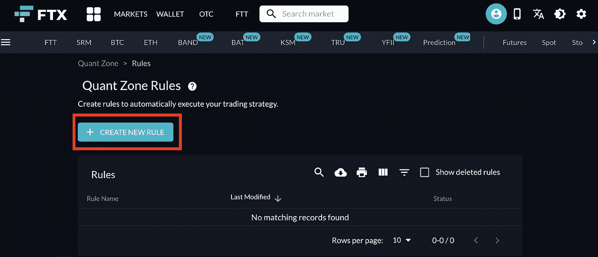

4.现在在“规则名”下输入“collaterisedProfits”。

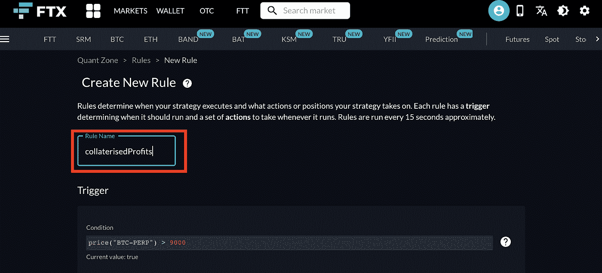

5.接下来复制这行代码:

```
balance(“USD”)>0 and (balance(“USDT”)>0 or balance(“BTC”)>0 or balance(“ETH”)>0 or balance(“BCH”)>0 or balance(“FTT”)>0 or balance(“BNB”)>0 or balance(“LTC”)>0 or balance(“TRYB”)>0 or balance(“PAXG”)>0 or balance(“XAUT”)>0)
```

6.现在将代码粘贴到“条件”下，如下图所示。

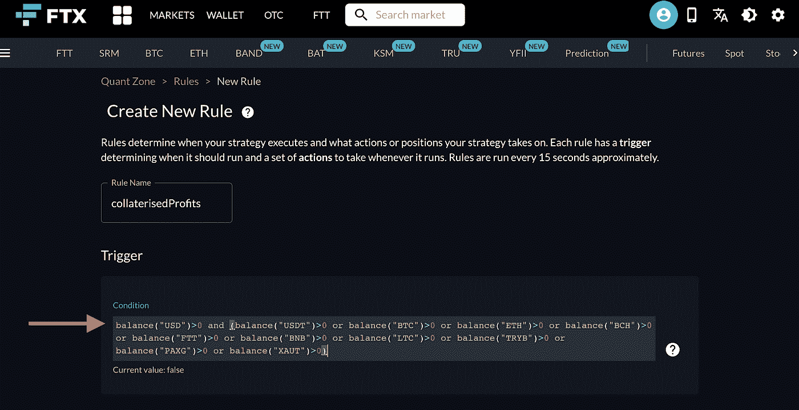

7.代码在条件中后，向下滚动到“操作”。

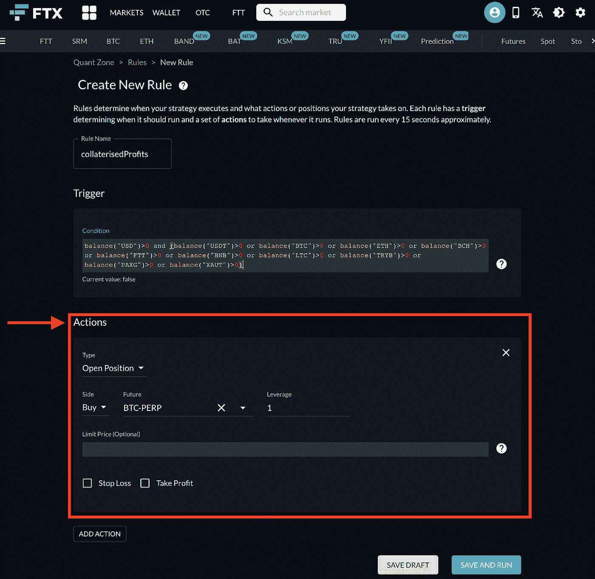

8.选择“类型”下的下拉菜单。继续并选择“下定制订单”,如下图所示。

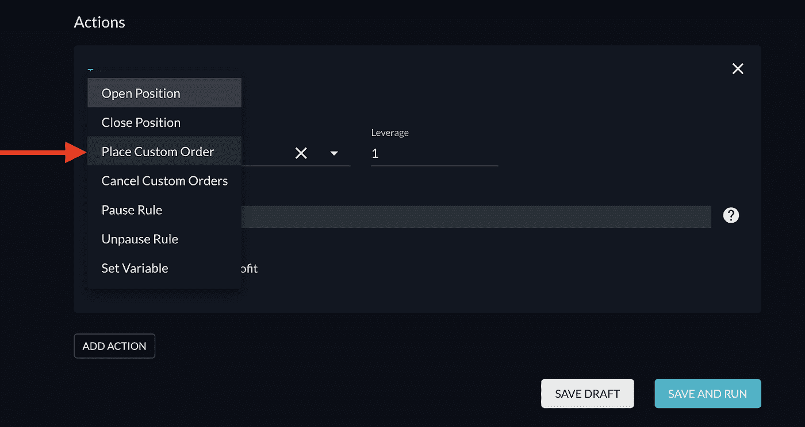

9.现在，确保按如下方式设置以下值:

*订单类型:【市场订单】*

*侧:【购买】*

*市场:“BTC/美元”*

应该是这样的。

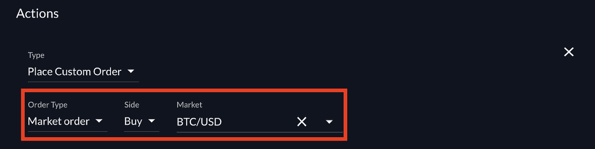

10.接下来，复制这行代码:

(余额(“美元”)/价格(“BTC/美元”))*余额(“BTC”)*价格(“BTC/美元”)/(余额(“USDT”)*价格(“USDT/美元”)+余额(“BTC”)*价格(“BTC/美元”)+余额(“ETH”)*价格(“ETH/美元”)+余额(“BCH”)*价格(“BCH/美元”)+余额(“FTT”)*价格(“FTT/美元”)+余额(“BNB”)+价格(“LTC”)+余额(“LTC/美元”)+价格(“TRYB”)+余额(“TRYB”)

11.将代码粘贴到“订单大小”下，如下所示。

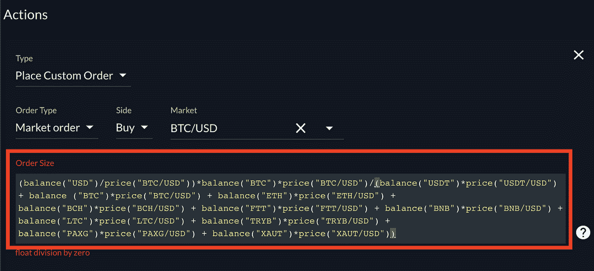

12.现在，确保“Actions”部分下的其余选项像这样填写。

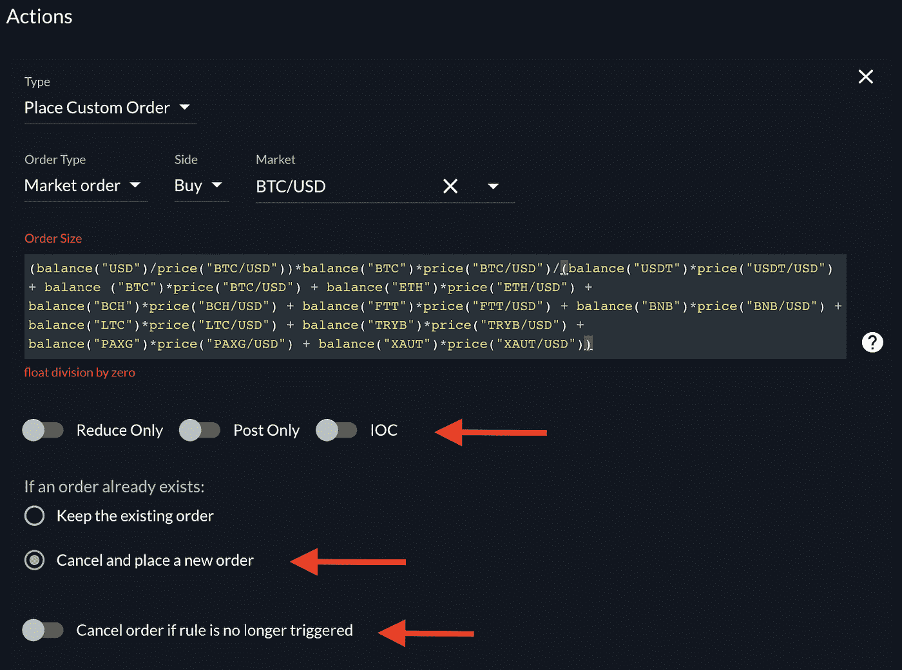

13.一旦一切正常，选择“保存并运行”。

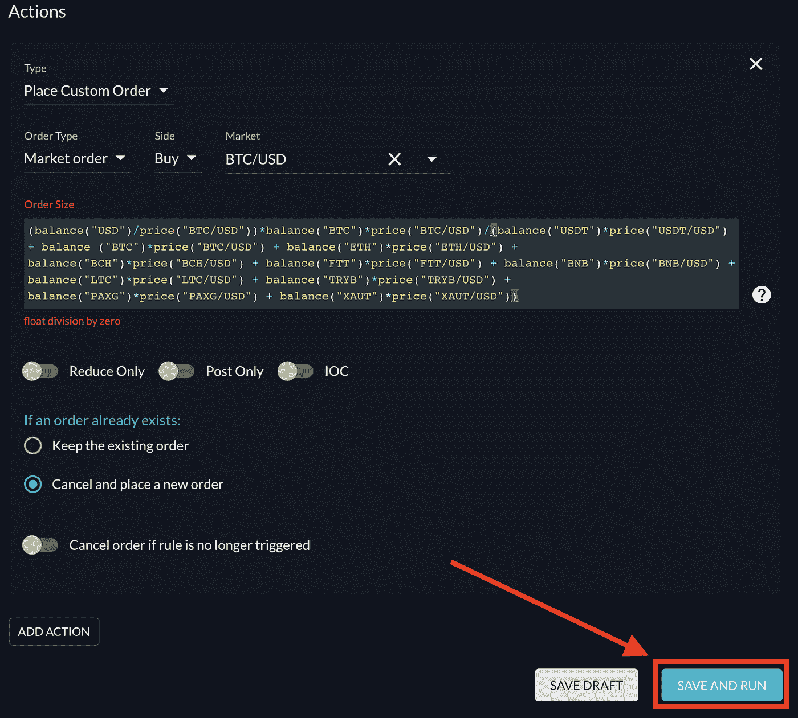

14.将出现一个弹出窗口，如果您同意这些条款，请继续并选择“我理解”。

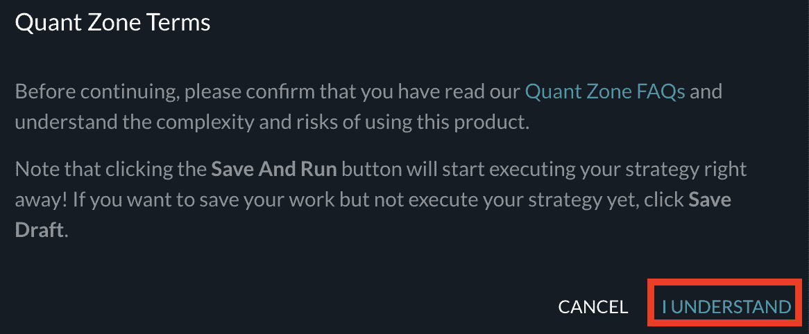

15.要确保您刚刚输入的规则已启用，请转到此链接:[https://ftx.com/quant-zone/rules](https://ftx.com/quant-zone/rules)，并确保您看到新规则已启用，如下所示。

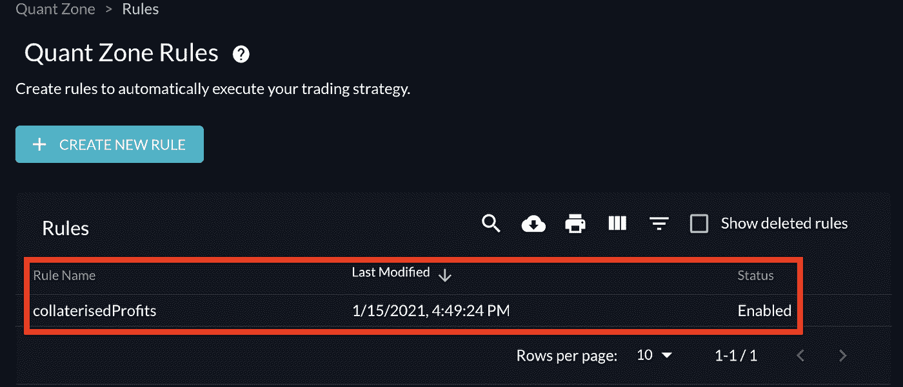

如果好看，恭喜你！你都准备好了。

你的利润将会被记入你在 BTC 的 FTX 账户。准备开始堆积 sat。

如果你想要这样的建议，或者想通过我们免费的时事通讯，Espresso，[了解我们的每日更新，请点击这里](http://eepurl.com/g8pW9f)。

下次见。

你的脉搏在加密，

b 莉莉

**贾维斯实验室**:我们提供可操作的链上数据(ChainPulse.ai 网站——即将推出)，软件解决方案，以及依赖于我们的自主人工智能/人工智能交易软件贾维斯人工智能的研究。我们的客户是对冲基金、家族理财室和零售客户。

如果您想了解更多关于 Jarvis Labs、Jarvis AI 或 ChainPulse.ai 的信息，请在我们的网页上给我们发消息，网址是:www . Jarvis-Labs . XYZ；或者发送电子邮件到 askus@jarvis-labs.xyz。

你也可以在 t.me/jarvis_labs,的 Telegram 上关注我们，在 Telegram @Ben_Lilly 上给我发消息，或者在 ben.lilly@jarvis-labs.xyz 上给我发电子邮件

**免责声明**:这是一篇关于对具有长期增长潜力的资产使用复利的教育文章。实际结果可能因 Jarvis 实验室而异。

访问专家视图— [**订阅 DDI 英特尔**](https://datadriveninvestor.com/ddi-intel)

> 加入 coin monks[Telegram group](https://t.me/joinchat/EPmjKpNYwRMsBI4p)学习加密交易和投资

## 另外，阅读

*   [学习以太坊和 Web3 开发](http://blog.coincodecap.com/go/learn)
*   最好的[密码交易机器人](/coinmonks/crypto-trading-bot-c2ffce8acb2a)
*   [3 commmas Review](/coinmonks/3commas-review-an-excellent-crypto-trading-bot-2020-1313a58bec92)|[Pionex Review](/coinmonks/pionex-review-exchange-with-crypto-trading-bot-1e459d0191ea)|[coin rule Review](https://blog.coincodecap.com/coinrule-review-a-perfect-trading-bot)
*   [AAX 交易所点评](/coinmonks/aax-exchange-review-2021-67c5ea09330c) | [德里比特点评](/coinmonks/deribit-review-options-fees-apis-and-testnet-2ca16c4bbdb2) | [FTX 加密交易所点评](/coinmonks/ftx-crypto-exchange-review-53664ac1198f)
*   [NGRAVE ZERO 审核](/coinmonks/ngrave-zero-review-c465cf8307fc)
*   [bit Exchange 审核](/coinmonks/bybit-exchange-review-dbd570019b71) | [Bityard 审核](https://blog.coincodecap.com/bityard-reivew)
*   [3Commas vs Cryptohopper](/coinmonks/3commas-vs-pionex-vs-cryptohopper-best-crypto-bot-6a98d2baa203)
*   最佳比特币[硬件钱包](/coinmonks/the-best-cryptocurrency-hardware-wallets-of-2020-e28b1c124069?source=friends_link&sk=324dd9ff8556ab578d71e7ad7658ad7c)
*   [加密副本交易平台](/coinmonks/top-10-crypto-copy-trading-platforms-for-beginners-d0c37c7d698c)
*   [分类账纳米 s vs x](https://blog.coincodecap.com/ledger-nano-s-vs-x)
*   [沃顿点评](https://blog.coincodecap.com/vauld-review) | [友德点评](/coinmonks/youhodler-4-easy-ways-to-make-money-98969b9689f2)
*   最佳[加密税务软件](/coinmonks/best-crypto-tax-tool-for-my-money-72d4b430816b) | [货币追踪点评](/coinmonks/cointracking-review-a-reliable-cryptocurrency-tax-software-5114e3eb5737)
*   最佳[加密贷款平台](/coinmonks/top-5-crypto-lending-platforms-in-2020-that-you-need-to-know-a1b675cec3fa)
*   [莱杰纳诺 S vs Trezor one vs Trezor T vs 莱杰纳诺 X](https://blog.coincodecap.com/ledger-nano-s-vs-trezor-one-ledger-nano-x-trezor-t)
*   [BlockFi vs 摄氏度](/coinmonks/blockfi-vs-celsius-vs-hodlnaut-8a1cc8c26630) vs 霍德诺
*   [Bitsgap 审查](/coinmonks/bitsgap-review-a-crypto-trading-bot-that-makes-easy-money-a5d88a336df2) | [四项审查](/coinmonks/quadency-review-a-crypto-trading-automation-platform-3068eaa374e1)
*   [埃利帕尔泰坦评论](/coinmonks/ellipal-titan-review-85e9071dd029) | [赛克斯斯通评论](https://blog.coincodecap.com/secux-stone-hardware-wallet-review)
*   [BlockFi 审查](/coinmonks/blockfi-review-53096053c097) |在您的加密中赚取高达 8.6%的利息
*   [DEX Explorer](https://explorer.bitquery.io/ethereum/dex) 和[区块链 API](https://explorer.bitquery.io/graphql)
*   [加密套利](/coinmonks/crypto-arbitrage-guide-how-to-make-money-as-a-beginner-62bfe5c868f6)指南:新手如何赚钱
*   最佳[加密制图工具](/coinmonks/what-are-the-best-charting-platforms-for-cryptocurrency-trading-85aade584d80)
*   了解比特币最好的[书籍有哪些？](/coinmonks/what-are-the-best-books-to-learn-bitcoin-409aeb9aff4b)

> [直接在您的收件箱中获得最佳软件交易](/coinmonks/newsletters/coinmonks)

[](https://medium.com/coinmonks/newsletters/coinmonks)