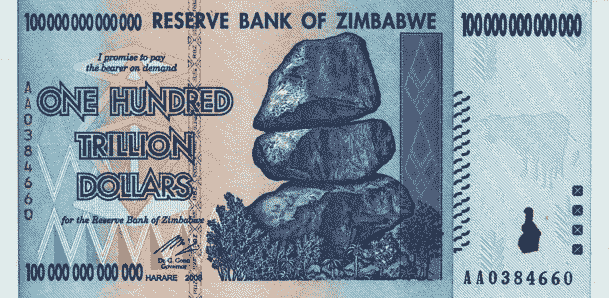
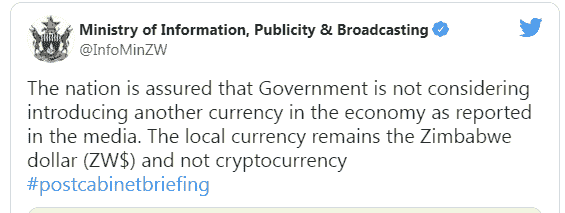
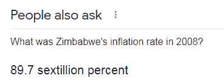
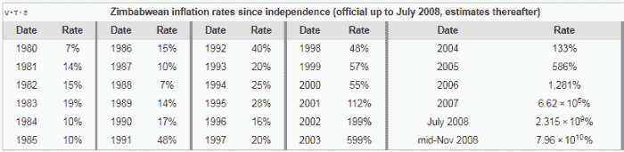
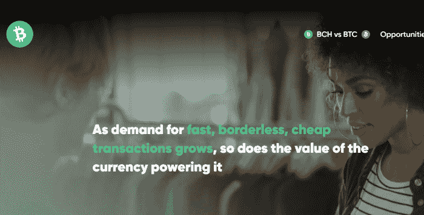

# 比特币现金如何帮助津巴布韦经济

> 原文：<https://medium.com/coinmonks/how-bitcoin-cash-can-help-the-economy-of-zimbabwe-da39b7e6d398?source=collection_archive---------5----------------------->

**Image Source:** [Wikimedia Commons](https://commons.wikimedia.org/wiki/File:Zimbabwe_100000000000000.png) (modified, cut), [Licence](https://creativecommons.org/licenses/by-sa/3.0/deed.en)

津巴布韦是一个处于非洲地缘战略位置十字路口的国家，该地区拥有丰富的资源，各种势力试图开采这些资源。

津巴布韦的经济遭受了多年的恶性通货膨胀，导致其经济的破坏。

委内瑞拉也是类似的情况，该国拥有丰富的矿产和石油资源。这些国家的地缘政治问题是相同的，十多年来它们都经历着同样的问题。

最近，我们在新闻中看到津巴布韦政府正在寻求加密领域，并在与私营部门的讨论中，积极研究接受加密货币的可能性。

不过，津巴布韦政府正式谴责了这种说法。

*Source:* [*Twitter*](https://twitter.com/InfoMinZW/status/1458087975787671559)

津巴布韦也计划创造一种 CBDC，一种由中央银行发行和控制的数字货币，它将代表津巴布韦元的数字形式。

当然，任何否认都不代表完全没有考虑。

通过这篇文章，我们正在研究比特币现金作为一种替代交易方式，特别是对于津巴布韦面临的问题。

有充分的理由可以大大改善这个满目疮痍的经济的财政状况，并为稳定和强劲的增长以及整体生活条件的改善创造条件。

# 灾难性的恶性通货膨胀

Wikipedia

这是我在谷歌上搜索 2008 年津巴布韦经济通胀水平的第一个结果。我不确定六次方这个数字在人类之前是否被使用过；我认为我们无法理解它的重要性。

我们也无法理解万亿或 89 万亿分之几的通货膨胀。显然，这意味着在那个时期，金钱在这个国家完全不值钱。

这也解释了津巴布韦中央银行在本世纪初推出的 100 万亿美元钞票。

津巴布韦的通货膨胀水平表解释了过度的管理不善、腐败和暴力的土地再分配策略，穆加贝政府强迫并摧毁了一个以前经济繁荣的国家的经济。([维基百科](https://en.wikipedia.org/wiki/Robert_Mugabe))。

Source: [Wikipedia](https://en.wikipedia.org/wiki/Template:ZWD_inflation), [Licence](https://en.wikipedia.org/wiki/Wikipedia:Text_of_Creative_Commons_Attribution-ShareAlike_3.0_Unported_License)

在 2008 年通货膨胀的高峰期，价格每天上涨 98%!由于这些是官方数字，可能钞票是没有价值的，因为黑市汇率会更真实。没有人想持有这样的法定货币。

津巴布韦最近的通货膨胀数据似乎给出了一个比我们过去在新闻中了解到的问题更低的通货膨胀水平，尽管如此，官方公布的数字仍然非常高。

> ***与上年相比的通货膨胀率***
> 
> *2021 年* ***99.25%***
> 
> *2020 年* ***557.21%***
> 
> *2019****255.29%***

*来源:*[*Statista*](https://www.statista.com/statistics/455290/inflation-rate-in-zimbabwe/)

尽管 2021 年通胀相对下降，但人们担心这种恶性循环会重演，并再次进入恶性通胀区。

# 为什么是比特币现金？

*Source:* [*WhyBitcoinCash*](https://whybitcoincash.com/)

比特币现金可能是唯一一种可以为这个国家的商业服务的加密货币，并为操纵国家货币和过度膨胀经济的腐败势力创造了一个屏障。

津巴布韦元本身是波动的，但只会下跌。

正如我们从 Statista 中读到的，津巴布韦人民试图持有像欧元和美元这样的外国法定纸币，但最容易买到的是南非兰特。然而，这种货币也面临问题，并不断对美元和欧元贬值。

欧元和美元无法满足他们力所不及的经济体的需求。有限的贸易无法创造足够的这两种最稳定的货币流入，政府无法在外汇市场交易津巴布韦元。

津巴布韦需要一种超越经济界限的货币。一种不受政府操纵和官员腐败影响的货币。

健全的货币是解决经济问题和政府财政问题的必要手段。

比特币现金是全世界的钱。它不必完全接管津巴布韦菲亚特，但可以并行使用，并以其有限的供应缓解通胀担忧。

正如我们所见，津巴布韦人民需要一种不会对美元和欧元贬值的货币。采用比特币现金将是答案。

它易于使用，可以为商业和国际贸易创造更好的条件。比特币现金规模达到数百万，后来达到数十亿用户。

比特币现金具有现金的所有积极特征，可以成为一种不可或缺的货币，至少可以与津巴布韦元并行，原因如下:

*   0-conf 交易速度极快。办理只需一秒钟。
*   每笔交易的费用不到一分钱。
*   易于使用和适应。下载一个比特币现金钱包，最好是 bitcoin.com，扫描二维码支付。用户友好和简单，就像一个无现金网络的现金交易。
*   不受通货膨胀和地缘政治风险的影响。没有什么能与比特币现金相提并论，它是一个普遍的分散网络，限量供应 2100 万枚比特币。
*   可以帮助对抗通货膨胀。商品价格可能会根据供求关系上涨到某一点，但有了比特币现金，就不会有恶性通货膨胀的担忧，因为货币供应将永远是固定的。
*   如果比特币在任何经济体中被大规模采用，其价格可能会上涨。反过来，这将降低以本币计价的进一步通胀，增加公众财富，并有助于增加全国范围内的支出和商业。
*   主要贸易伙伴可以接受它，因为它的价值相对稳定，即使是自其发布以来的加密货币。
*   它提供了比特币的所有关键方面(去中心化、无许可和安全网络)，并增加了可扩展性以适应数百万用户。
*   能够实现急需的稳定，为强劲的经济增长创造有利条件。随着比特币现金价格不断上涨，国家的财富也会随之增加。

津巴布韦今天的国内生产总值为 167 亿美元，人口 1480 万，这些数据代表了一个贫穷的国家。74%的人口每天生活费不到 5 美元，并且大多生活在农村地区。

如果货币稳定得到保证，津巴布韦可以开始重建其经济基础，增加基础设施，并吸引外国资本。津巴布韦可以在几年内实现这一目标，同时保持不会损害经济的相对较低的通胀水平，并消除对恶性通胀的担忧。

随着贫困水平的降低和促进工业化的基础设施的增长，该经济体有潜力实现数十年的增长和国内生产总值的增长。

# 最后

Water painting of a Ndebele kraal (Public Domain), *Source:* [*Wikimedia Commons*](https://en.wikipedia.org/wiki/File:Harris_-_Ndebelekraal.png)

这也是在比特币早期(直到 2015 年)还是一个 P2P 电子现金网络，并期待规模化和满足大规模采用的时候，经常与比特币讨论的情况。

比特币现金是比特币规模的升级，应该被视为津巴布韦、委内瑞拉、黎巴嫩和土耳其等超级通胀经济体的潜在替代或平行解决方案。

比特币现金本质上是自愿的，它不代表一个强有力的货币体系。在对公众进行教育并获得压倒性支持后，应与一个国家的人口一起考虑这一问题。由于它的自愿性质，个体商户和消费者可以在没有政府干预的情况下采用它。仅仅宣布允许比特币现金是不够的，因为公众在这个问题上没有受过教育。有必要采取措施，举办研讨会，仅用一个小时解释什么是比特币现金以及如何使用移动钱包。

比特币现金是一个共识驱动的网络，其共同目标是被采纳为全球货币。它也可以作为逃避各种毁灭性经济影响的一种方式。这将取决于津巴布韦人民，在接受了一定的加密货币教育后，承认其积极影响并将其作为一个货币网络。

比特币现金具备稳定经济所需的所有特征，但这不能通过武力或胁迫来实现。这个概念是关于摆脱法定货币的灾难，进入一个经济独立的新世界，这将减少贫困，增加国家的财富。

Follow me on: ● [ReadCash](https://read.cash/@Pantera) ● [NoiseCash](https://noise.cash/u/Pantera99) ● [Medium](/@panterabch) ● [Hive](https://hive.blog/@pantera1) ● [Steemit](https://steemit.com/@pantera1) ●[Vocal](https://vocal.media/authors/pantera) ● [Minds](https://www.minds.com/pantera99/) ● [Twitter](https://twitter.com/Panterabch) ● [LinkedIn](https://www.linkedin.com/in/panterabch/) ● [email](https://read.cash/@Pantera/localcryptos-p2p-exchange-is-now-offering-bitcoin-cash-trading-06637230#bad-link)

**备注:**

> 免责声明:本内容中发布的所有材料均用于娱乐和教育目的，并符合合理使用的准则。无意侵犯版权。如果你是或代表本文所用材料的版权所有者，并且对所述材料的使用有问题，请发送[电子邮件](https://read.cash/@Pantera/cryptouknowns-battlegrounds-the-crypto-battle-royal-part-i-0ca762da#bad-link)。

***支持内容创作者。***

如果你喜欢这个故事，就订阅吧！

*原发布于*[*https://read . cash*](https://read.cash/@Pantera/how-can-bitcoin-cash-help-the-economy-of-zimbabwe-f6d86e84)*。*

> 加入 Coinmonks [电报频道](https://t.me/coincodecap)和 [Youtube 频道](https://www.youtube.com/c/coinmonks/videos)了解加密交易和投资

## 也阅读

 [## 最佳加密交易所| 2021 年十大加密货币交易所

### 编辑描述

blog.coincodecap.com](https://blog.coincodecap.com/crypto-exchange)  [## 2021 年 10 大最佳加密贷款平台| CoinCodeCap

### 编辑描述

blog.coincodecap.com](https://blog.coincodecap.com/crypto-lending)  [## 2021 年最佳免费加密交易机器人

### 2021 年币安、比特币基地、库币和其他密码交易所的最佳密码交易机器人。四进制，位间隙…

medium.com](/coinmonks/crypto-trading-bot-c2ffce8acb2a)  [## 最佳 4 个加密交易信号电报通道

### 这是乏味的找到正确的加密交易信号提供商。因此，在本文中，我们将讨论最好的…

medium.com](/coinmonks/best-crypto-signals-telegram-5785cdbc4b2b)  [## BlockFi 评论 2021:利弊和利率| CoinCodeCap

### 编辑描述

blog.coincodecap.com](https://blog.coincodecap.com/blockfi-review)  [## 如何在印度购买比特币？2021 年购买比特币的 7 款最佳应用[手机版]

### 如何使用移动应用程序购买比特币印度

medium.com](/coinmonks/buy-bitcoin-in-india-feb50ddfef94)  [## 加密税务软件——五大最佳比特币税务计算器[2021]

### 不管你是刚接触加密还是已经在这个领域呆了一段时间，你都需要交税。

medium.com](/coinmonks/best-crypto-tax-tool-for-my-money-72d4b430816b)  [## 存储比特币的最佳加密硬件钱包[2021] | CoinCodeCap

### 编辑描述

blog.coincodecap.com](https://blog.coincodecap.com/best-hardware-wallet-bitcoin)  [## Pionex 评论 2021 |免费加密交易机器人和交换

### Pionex 是为交易自动化提供工具的后起之秀。Pionex 上提供了 9 个加密交易机器人…

medium.com](/coinmonks/pionex-review-exchange-with-crypto-trading-bot-1e459d0191ea)