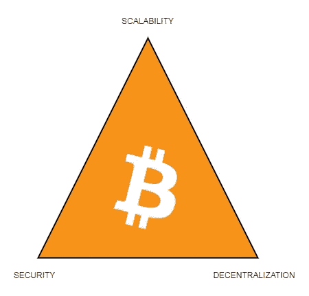

# 比特币如何解决区块链三难问题

> 原文：<https://medium.com/coinmonks/how-bitcoin-solves-the-blockchain-trilemma-54ffd84c42a8?source=collection_archive---------1----------------------->

## 2017 年，当比特币社区激活 SegWit，从而实现闪电网络等二级解决方案时，加密货币世界发生了变化。

为解决可扩展性问题而在比特币基础上创建的协议让加密货币回答了其中一个问题…