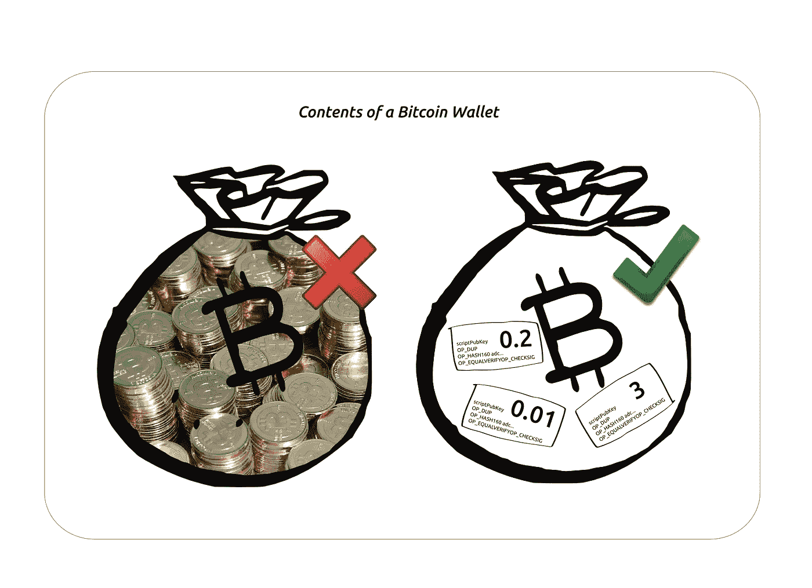
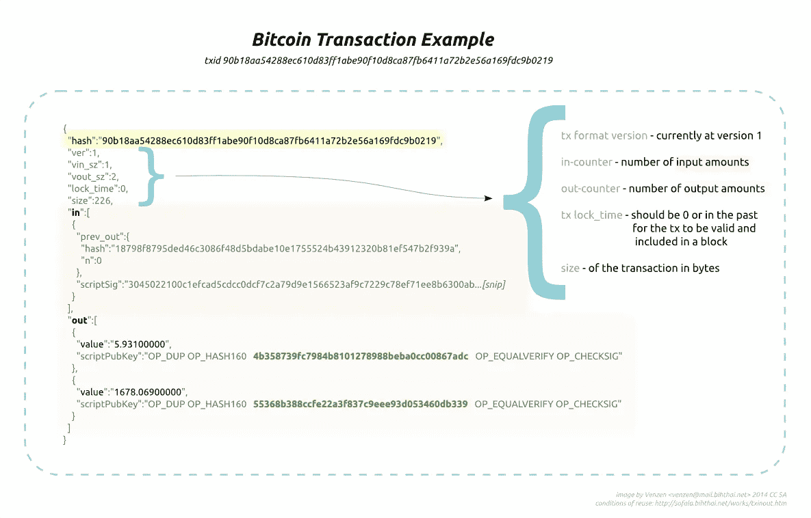
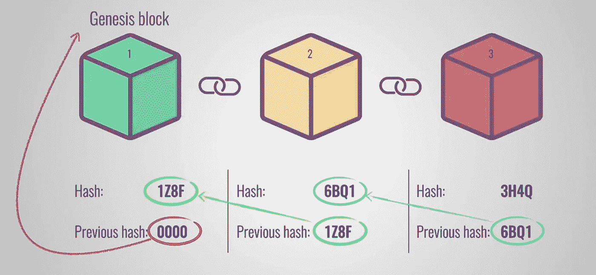

# 比特币如何工作:P2P 授权

> 原文：<https://medium.com/coinmonks/how-bitcoin-works-p2p-empowerment-40051d6df041?source=collection_archive---------1----------------------->

> 到目前为止，我们知道[区块链](/@dan.ryan.emmons/what-is-blockchain-3829efa1cfe7)本质上是一组按时间顺序排列的区块，其中包含共享记录簿上经过验证的交易，这些交易不能更改。那么比特币从何而来？我们应该关心区块链的原因之一是我们关心财产，支付是合法的。那么，我们如何跟踪财产，如数字货币，或区块链的“加密货币”？

**在比特币中，去中心化账本*中数据的价值就是*钱。
比特币是公共的、开放的、无边界的、抗审查的。**

比特币是一种变革性技术，它使个人能够通过点对点交易进行信息交易，并减少对大型银行等中介的使用。对等体之间的信任是通过加密和遵守一组明确定义的规则或协议的可靠计算机网络来实现的。

把比特币账户想象成一对(PrivateKey + Address)依赖于众所周知的安全加密技术。一个随机生成的**私钥**也被称为秘钥，这是你花比特币时使用的，**所以要保持那个极其安全的**——就像你能想象到的最重要的密码。从这里开始，私钥用于导出公钥，并进一步用于生成地址。那个**地址**就是你**想要接收比特币的时候和某人**分享的。秘钥和你的地址都是独一无二的长字符串，这是你的财产与其他人区分开来的原因。猜测别人的账户地址或私人密钥几乎是不可能的。事实上，可能的地址数量多得惊人，所以不要想着去找别人的地址。我们将在未来讨论有多少，但现在把你的私钥想象成地球上唯一的一粒沙子，然后每个地球是另一个地球上的另一粒沙子，等等。那是巨大的。

一个人控制的比特币或 BTC 的数量由分配给其地址的未用交易输出(UTXO)的数量表示。我们知道 address 拥有这些比特币的控制权，因为在未来，只有拥有与该地址相关的私钥的人才能签署发送到区块链的消息，以便使用它。

假设鲍勃总共有 8.5 个比特币。如果他需要向史蒂夫的地址支付 5 个比特币，他会构造一条消息，说:“用我的 8.5 比特币，向史蒂夫发送 5 个，但向我发回大约 3.4999。要验证此付款，请向验证此付款的矿商发送少量金额(0.0001BTC)“假设交易通过网络验证。鲍勃将会有将近 3.5 个未用完的比特币，而史蒂夫将会有 5 个比特币在他的“控制”之下，因为只有他有权使用与该地址相关联的私钥。为了简单起见，我还遗漏了一个细节。当您使用借记卡或信用卡购物时，VISA 或 Mastercard 等信用卡服务提供商将收取一定比例的购物价格，以便验证和处理交易。但是对于区块链&比特币交易，这是如何实现的呢？

记住——我们依靠 [**分散共识**](/@dan.ryan.emmons/blockchain-why-should-you-care-71a2f67b8be5) 来验证交易。当你向区块链“发送”交易时，你正在向网络广播你消费比特币的意图。作为交易验证工作的交换，你只需提供极少量的 BTC 作为交易费。当你花比特币时，你可能会使用像 Edge 这样的数字钱包——以前被称为 AirBitz，这是一个构建用你的秘密密钥签名的交易消息的应用程序。对于使用钱包应用的人来说，它看起来就像你在网上完成的任何其他形式的支付。唯一的区别是，你直接指定一个人的地址，而不是 VISA 或 MC，这使得这是一种点对点技术，避免了中间人。没有人会试图阻止你的合法交易。事实上恰恰相反。那些验证你交易的电脑？它们被称为完整节点，它们的功能相当于矿工。

Credit: Simply Explained — Blockchain

事务处理包括在块中。区块链将数据存储在一种结构中，该结构通过数字验证过程有效地为信息添加时间戳，并且对数据的更改存储在数据块中。通过链接到它之前的块的“散列”而“链接”在一起，因此是“块链”。您可以将散列视为数据的“数字指纹”。即使是微小的变化也会对指纹产生巨大的雪崩效应，使得伪造变化几乎不可能，但如果系统中有不良行为者，则很容易识别。在这种情况下，“坏演员”并不是指中央当局认为是罪犯的人；我们严格地指不符合分散共识协议的网络参与者。人们通过使用一个偏好“共识”——没有统治者的规则——的系统来获得权力。

现在，我们看到了这项技术的真正魅力。我们可以开展点对点业务，并且知道矿工们正在做“工作证明”,以验证区块链历史上记录的每一笔交易都是有效的。这里有一件事要深思到下次…比特币从何而来？如果你以前没有，那它是怎么存在的？目前，这里有一个提示:矿工因努力工作而获得回报，使用比特币的人通过区块链赋予自己权力而获得回报。这是值得庆幸的事情。

*丹·埃蒙斯是* [*埃蒙斯皮雷有限责任公司*](http://www.emmonspired.com/) *的所有者，一名* [*认证比特币专业人士*](http://cryptoconsortium.org/lookup/6f0d14) *，认证以太坊开发者，全栈开发者，加密货币项目顾问。他还是一个名为*[*# ByteSizeBlockchain*](https://www.youtube.com/watch?v=SVBZ7mdgGcA)*的 Youtube 频道和 iTunes 播客的创造者。*

> [直接在您的收件箱中获得最佳软件交易](https://coincodecap.com/?utm_source=coinmonks)

