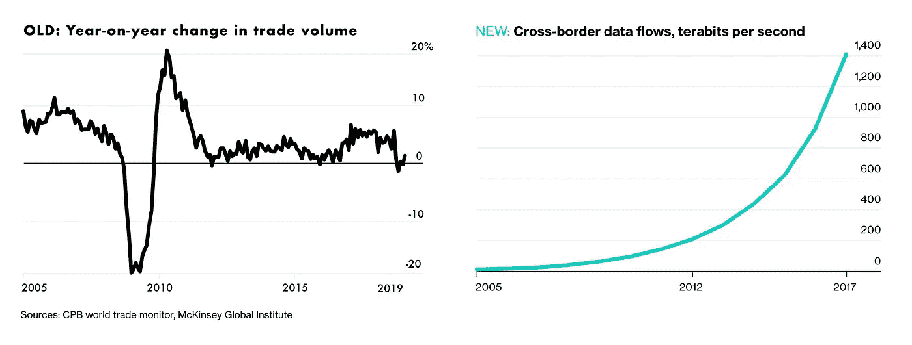
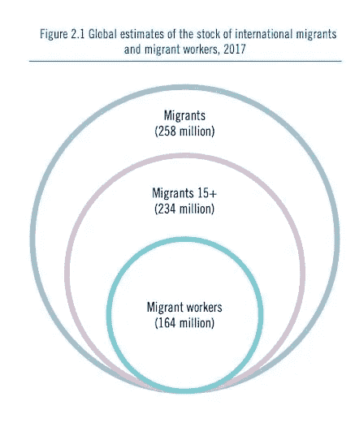
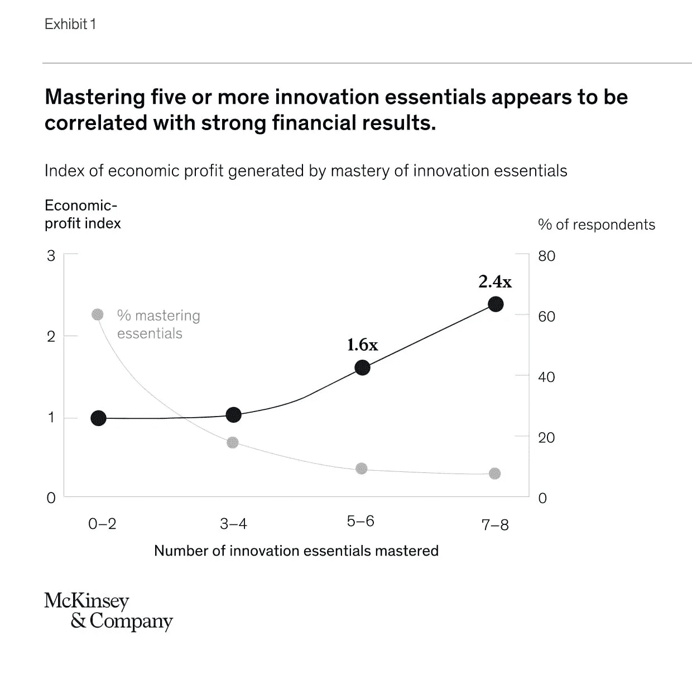

# 区块链审计如何帮助建立企业信心？

> 原文：<https://medium.com/coinmonks/how-blockchain-based-audits-help-to-build-confidence-enterprise-wide-4ad53b262ed6?source=collection_archive---------5----------------------->

## 利用关键企业数据的防篡改审计日志，最大限度地降低审计费用。

Illustration by Peter Tarka

# 复杂性如何侵蚀当今企业中的信任

今天，全球经济关系正在经历一个前所未有的时刻。创新步伐的加快、全球化的扩展、就业的细分以及劳动力的整体不稳定性，所有这些都使业务互动复杂化，并要求内部业务流程采用新的工作方式。让我们来看看这些基本转变是如何影响对组织治理的信心以及侵蚀对外部业务关系的信任的。

在过去的十年里，创新的步伐明显加快，公司很难根据需求调整内部运营。

> 根据 [2017 普华永道创新基准](https://www.pwc.com/us/en/advisory-services/business-innovation/assets/2017-innovation-benchmark-findings.pdf)，54%的组织对弥合其创新战略和整体业务战略之间的差距表现出较低的信心。这只能进一步表明，组织结构过于停滞，无法应对外部世界的速度和强度。在麻省理工学院斯隆管理评论和德勤进行的全球[经理和高管调查](https://sloanreview.mit.edu/projects/aligning-for-digital-future/)中，近 90%的高管预计他们的行业将在很大程度上或中等程度上被数字化趋势所颠覆，然而只有 44%的人表示他们的组织已经为即将到来的颠覆做好了充分的准备。

另一个重要因素是全球化和进出口业务的兴起。为了能够快速行动并处理来自海外合作伙伴子公司的不断增长的交易流和文档，公司别无选择，只能采用新的敏捷方法和工具。

[https://www.bloomberg.com/graphics/2019-globalization/](https://www.bloomberg.com/graphics/2019-globalization/)

## **就业的不稳定性**和劳动力的分化也在动摇过时的治理体系，这些体系不是为在这种复杂程度下运作而设计的。

> 劳工统计局 2017 年报告称，美国有 5500 万人是“零工”。这大约占美国劳动力的 34%，预计到 2020 年将增加到 43%。不仅如此，农民工的数量也在增加:根据该报告，2017 年全球约有[1.64 亿](https://www.ilo.org/global/about-the-ilo/newsroom/news/WCMS_652106/lang--en/index.htm)农民工。事实上，无法估计一个员工在公司待多久也无助于内部组织的稳定。

## 总的来说，这种不断增长的复杂性侵蚀了利益相关者之间的信任和整体商业信心，阻碍了有效的公司治理和向新市场的扩张。

结果，公司遭受管理不善的风险*、*业务损失和额外成本，所有这些本质上都是由于结构性低效和无法应对不断增长的数据量。为了在这种新的多面环境中保持竞争优势，组织需要熟练使用最先进的工具来优化和发展业务。

> 根据 Gartner 最新的年度[审计计划热点报告](https://www.gartner.com/en/audit-risk/insights/trending-topics/audit-hot-spots)，首席审计官越来越关心如何管理和保护数据。同时，超过一半的组织缺乏正式的数据治理框架和专用预算。

To stay ahead of the competitors, businesses need to embrace the latest tech.

## 为精益内部审计寻找合适的软件

[商业环境日益复杂](https://hbr.org/2019/02/the-state-of-globalization-in-2019-and-what-it-means-for-strategists)需要创新的技术轨道来应对新出现的运营风险，但经济高效的精益审计解决方案非常稀缺，雇佣四大仍然是大预算的特权。好消息是你不需要庞大的审计团队:有了合适的技术，及时可信的审计对每个人来说都是轻而易举的事情。用于独立但可信的运营交易数据审计的企业级平台正在悄然出现，使企业能够在不涉及昂贵的审计人员的情况下运行内部审计，同时将敏感数据保留在内部。

借助基于区块链协议构建的防篡改、无信任的持续评估运营数据框架，人工审计员将被淘汰，报告将根据输入系统的参数自动生成。

## 借助区块链齿轮系统，消除成本高昂的审计负担

有一些新兴的创业公司正在构建敏捷的技术基础设施，以降低与缓慢而昂贵的审计框架相关的成本和运营困难，他们押注于 DLT 验证数据来源和不变性的固有能力，即跟踪其来源和历史。从本质上说，这种防篡改审计跟踪的价值支柱归结为消除中间人因素，这种因素导致过时的审计系统效率低下，运营成本高，处理时间长。这意味着您可以 100%确定谁、在哪里、何时生成了一条数据，并跟踪它的进一步移动。

[Aramamino 的](https://finance.yahoo.com/news/blockchain-tool-promises-verifiable-audits-150024086.html?guccounter=1&guce_referrer=aHR0cHM6Ly93d3cuZ29vZ2xlLmNvbS8&guce_referrer_sig=AQAAAI9QRyZjqTIG77tQls-IehozmThzV-WGh0BbRioGwJr7YII40x1Ano-K2dVs9tx5Ga_wLrV1Ntj6s3YUkRKkI55lyHQG0O_zq_itU3HB4okrCWUejLgw5Vm_I3VO34COSWMGLvMXZ9l9dfxDjTRZ-FnAENpFjWFee0Rfqer73dL6) TrustExplorer 是一种审计协议，提供实时、分布式和最终审计，区块链总账作为捕捉所有数据交易的单点事实。

[Taraxa](https://twitter.com/taraxa_project) 利用 PoS 区块链分类账为独立、可信的运营交易数据审计提供单一平台。这将使企业能够在没有第三方注册会计师参与的情况下进行内部审计，同时将数据保存在自己的场所。

[Factom Harmony](https://www.factom.com/) 可以集成到现有解决方案中，以构建区块链支持的审计和合规工作流程。通过可移植的加密证明，用户可以为内部和外部审计提供可信的输入。Factom Harmony 之所以成为游戏规则改变者，是因为它减少了执行审计和满足合规性目标所需的时间和资源。

在后 COVID19 时代削减成本是艰难的选择，是每个人关注的焦点。区块链已被证明在构建关键运营数据的防篡改审计日志方面非常高效。现在是获得降低运营费用的好处的时候了。

> [直接在您的收件箱中获得最佳软件交易](https://coincodecap.com/?utm_source=coinmonks)

