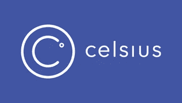

# 基于区块链的贷款如何将我们从数十亿带到数万亿

> 原文：<https://medium.com/coinmonks/how-blockchain-based-lending-could-take-us-from-billions-to-trillions-a1de3f948c88?source=collection_archive---------3----------------------->

什么是基于区块链的贷款，为什么我们需要它，新颖的新方法，以及未来的道路。

# 我们为什么需要贷款？

我最近深入研究了区块链的贷款。经过短短几周的研究，我意识到，我们把这件事做好，对数字资产的增长绝对至关重要。当我说“基于区块链的贷款”时，我主要指的是那些致力于解决方案的项目，这些方案允许数字资产持有人抵押他们的资产，并获得法定贷款作为回报。那么，这为什么如此重要呢？

几个月来，人们一直在谈论如何才能让大众接触到这一资产类别。我发现的主要障碍如下:

*   暂时弥补数字资产和支付日常开支之间的差距
*   动摇疯狂的波动(因为普通投资者无法忍受 40%的波动)
*   允许机构更容易地暴露，以验证资产类别作为一个整体

所有这些问题都可以通过一个高效的密码到菲亚特的借贷平台来解决。如果我急需一些美元，我可以抵押我的数字资产，而不需要卖掉它们。如果人们知道他们可以同时接触到这一资产类别，同时也能够在需要时立即获得现金，这将为全球许多人打破巨大的进入壁垒。

基于这一点，如果加密货币持有者不再需要出售他们的资产来获得法定货币，这*将大大降低价格波动。最后，许多散户投资者一直在等待大型机构的入场。然而，许多人一直犹豫要不要进入，因为他们唯一的选择是做多数字资产或在芝加哥商业交易所/CBOE 比特币期货市场交易。一个总部位于区块链的贷款平台允许无缝保证金交易，并允许这些机构比以往任何时候都更多地接触这一资产类别。*

在以下段落中，我将分析区块链贷款的现状，最近的项目如何从不同的角度解决问题，这些项目的内在风险，以及我们将何去何从。

# **我们在哪里**

区块链贷款在不到一年前启动，当时 [SALT](https://www.saltlending.com/) 项目在 2017 年 8 月为他们的 ICO 提供了资金。从那以后，我们看到借贷空间变得更加拥挤。SALT 之后不久， [Ripio Credit Network](https://ripiocredit.network/) 通过 ICO 筹集资金，主要目的是向新兴市场的借款人提供区块链贷款。这很快被 [ETHLend](https://ethlend.io/en/) 的团队跟进，他们在以太坊区块链引入了 P2P 加密货币贷款的想法。

不幸的是，在接下来的几个月里，贷款领域显然仍有许多障碍需要克服。SALT 很快列出了一个庞大的等待名单(时至今日仍有数月之久),因为用户们蜂拥而至，为他们的密码接受法定贷款。作为第一个进入贷款领域的项目，SALT 希望在发放贷款时做到非常彻底。为此，他们采用了非常手动的贷款申请流程。因此，这延长了贷款过程，借款人可以在申请阶段坐上几个月才被批准。

Ripio 也未能解决上述问题。正如我之前提到的，RCN 团队的主要目标是为新兴市场中无法以合理利率获得贷款的公民提供服务。此外，他们的贷款流程需要一系列步骤，包括寻找信用风险评估的“评分代理”和在违约情况下承保贷款的联合签名人。这导致了类似于盐的冗长的贷款过程。

与 SALT 和 Ripio 相比，ETHLend 的贷款流程相对更快。然而，他们贷款的加密到加密的性质并没有很好地解决这个资产类别的用户需要的问题。为了让用户从他们的以太网贷款中获得现金，他们需要出售借出的以太网，并手动将资金转移到他们的银行账户。此外，贷款必须以乙醚偿还。这将要求借款人在晚些时候回购乙醚，并将这些资金转移给贷款方。

# 新来的孩子

如你所见，在区块链借贷领域仍有许多障碍需要克服。为了让这成为用户的有用工具，贷款必须快速、无缝，并对消费者有持续的激励。幸运的是，最近出现了两个很有前途的项目，它们采用了与前面提到的不同的方法。在下面的段落中，我将简要解释每个平台如何工作，它们的区分因素，以及每个本机令牌的加密经济激励。

## 它们是如何工作的

我将从 **Celsius Network** 将加密抵押法定贷款带给大众的方法开始。Celsius Network 拥有一个双功能生态系统。第一种机制是专门为普通的 joe 用户设计的。用户可以选择将资金存入他们的 Celsius 钱包，以便获得固定贷款，或者只需将资金存入并锁定在指定时间的合同中，以便获得资产利息。

[Celsius Network](https://celsius.network/)

为了获得贷款，用户首先要指定他们想要的菲亚特数量。接下来，他们将所需数量的数字资产发送到他们的 celsius 钱包，作为贷款的抵押品。锁定担保品后，用户可以选择通过借记卡或直接银行转账接收资金。然后，用户通过之前商定的分期付款计划以菲亚特或 CEL token 的形式偿还贷款。如果你抵押的密码价值下降，Celsius 平台会提醒用户要么增加更多的密码，要么立即偿还贷款。如果用户没有采取行动，Celsius 平台将出售一些抵押加密来弥补差额。一旦贷款全部偿还，用户可以自由地从平台上撤回他们的密码。除了这一机制，用户还可以选择将资金锁定在摄氏度，而无需贷款。通过这样做，用户将获得锁定资金的利息(每年 5-9%)，因为他们被用于借钱给其他用户和下面讨论的交易功能。

Celsius 平台的第二个功能是面向机构和交易者的。交易员可以借用密码，直接通过 Celsius 进行保证金做空。一旦开始做空，该平台将从出借资产池中取出加密资金，并将其发送到交易所，在那里卖出，以开始做空。当短路关闭时，Celsius API 在交易所回购加密。如果价值高于购买价格，资金将从交易者的账户中扣除以弥补损失，反之亦然，如果价值低于购买价格。

[Nexo](https://nexo.io/)

**Nexo** 平台采用了一种类似于 Celsius 的方法，但是有一些变化。当借贷客户将他们的附属加密资产发送到 Nexo 平台上的相应钱包时，该过程开始。接下来，一个名为 Nexo Oracle 的自动算法系统会计算透支额度，并立即安排贷款。借款人可以立即提取透支贷款限额。然后，他们可以选择通过银行转账或使用 Nexo 信用卡接收资金，并将贷款限额作为他们的信用额度。

在未来的某个时刻，客户偿还贷款和利息。客户可以选择通过银行转账或加密货币支付。值得注意的是，由于 Nexo 的服务是透支而不是固定贷款，只要贷款的未偿余额在可用贷款限额内，就没有每月最低还款额的要求。最后，一旦贷款全部偿还，资金将被解锁，借款客户可以从 Nexo 平台提取资产。

# 区分因素

## 贷款类型

我认为每个平台都有几个重要的方面需要比较。正如我上面提到的，Nexo 的贷款类型是*透支*，而 Celsius Network 使用的是*固定贷款。*主要区别在于，透支是一种可变的贷款限额，借款人最多可以提取；类似于信用额度。简单地说，固定贷款就是一笔固定的金额，永远不变。(关于透支和固定贷款之间的区别的更详细的解释，请看这个[视频](https://www.youtube.com/watch?v=R5ZhsReqIoM))。

世界各地的人们出于多种不同的原因需要贷款。固定贷款和透支贷款各有利弊，用户决定使用哪种平台最终取决于他们个人的财务需求。

## 贷款特征

借款利率、最低贷款额和[贷款价值比率](https://en.wikipedia.org/wiki/Loan-to-value_ratio)是需要注意的其他方面。根据 Celsius 白皮书，他们声称借款利率永远不会高于 10%的年利率，最低贷款额为 100 美元，LTV 比率将介于担保资产的 30%至 50%之间。Nexo 目前在 live 平台上的借款利率为 16% APR，最低贷款金额尚不清楚，LTV 比率将在抵押资产的 50%左右徘徊。在这些领域，Celsius Network 的优势显而易见。低借款利率和最低贷款额理论上应该会吸引更多的用户。

## 秘密经济激励

最后，但肯定不是最不重要的，是每个本地令牌的加密经济激励。CEL 代币可用于支付贷款，以获得较低的利率。因此，随着越来越多的人使用 Celsius 平台，越来越多的人会购买 CEL token 来支付贷款。所以 CEL token 的价值应该是随着平台的用户量线性增长的。

此外，Celsius 平台上的资历将给予持有大量 CEL 令牌的用户。这个资历方面给予长期 CEL 令牌持有者更优惠的贷款利率。更简单地说，这相当于一种忠诚度计划，鼓励用户在 CEL 处于萌芽阶段时购买，并随着平台的发展而持有。额外的忠诚度持有者可能会对 CEL 令牌施加额外的价格上涨压力。值得一提的重要一点是，白皮书似乎暗示，大部分利息支付将来自保证金交易商支付的费用和佣金。如果保证金交易者的使用没有达到他们的预期，这可能会影响支付给用户的利息，从而影响用户坚持使用 Celsius 的积极性。

Nexo 令牌具有同样有趣的加密经济激励机制。首先，Nexo 可以作为用户贷款的抵押品。为了激励这种行为，Nexo 决定对那些决定使用 Nexo 作为抵押品的人给予较低的利率。与 Celsius 类似，Nexo token 也可以用作偿还现有贷款的付款。这些用户与那些张贴 Nexo token 作为抵押品的用户一样受到激励，因为用 Nexo token 偿还贷款也比用任何其他加密或法定货币偿还贷款便宜。

此外，Nexo token 持有者有权获得相当于 Nexo 贷款利息支付额 30%的股息。无论您是否是贷款平台的活跃用户，这些利息支付将在 Nexo token 持有者之间按比例分配。正如白皮书中所述，付款通过智能分红合同每月分配给所有 Nexo 令牌持有者。与 Celsius 一样，我们可以假设，随着越来越多的用户被该平台吸引，并向 Nexo 支付或抵押他们的贷款，Nexo token 的价格将会上涨。支付给 Nexo 代币持有者的股息也将是早期采用者长期持有 Nexo 的强大动力。随着 Nexo 平台在利息支付方面获得更多收入，这 30%的股息开始升值。因此，每枚 Nexo 代币的收入也会增加。

# **风险业务**

如果我不解决与 Celsius 和 Nexo 等大规模贷款业务相关的一些风险，那将是我的失职。通过我的研究，我已经确定了一个相当详尽的风险清单。然而，为了保持这篇文章的半简洁，我将只讨论我认为最紧迫的两个问题。

## 保管风险

首先，也是最紧迫的，是监管风险。每个项目的目标都是成为全球数百万人的首选贷款平台。这意味着扩大他们的运营规模，托管价值数万亿美元的资产。正如我们在过去一年里看到的无数次交易所黑客攻击，保管解决方案还没有完全达到必要的安全门槛。举个简单的例子来说明我们在保管解决方案方面的情况，Blocktower 的首席信息官 Ari Paul 将他的基金的大部分管理资本放在一个有气隙的硬件钱包中，放在一个银行保险箱中，放在一个防篡改的袋子中，袋子上覆盖着一种独特的闪光指甲油，以防止恶意方获得它时重新装袋的可能性。显然，需要在这一领域取得重大进展，以确保贷款项目的长期安全和增长。

## 平台风险

正如今天大多数基于以太坊的项目一样，存在平台风险。这给当前贷款平台带来的主要风险是，如果以太坊无法有效扩大规模，这将对能够发放的贷款数量产生不利影响。作为参考，去年仅在美国[每天发放 228，767 笔贷款](https://www.finder.com/personal-loans-statistics)。这相当于每秒钟大约 2.64 笔贷款，在区块链上是每秒钟 2.64 笔交易。仅在美国*发放的贷款*就将占以太坊当前最大 tp/s 交易量的 17.7%。然而，重要的是要记住，我们仍然处于智能合约平台能力的非常早期的阶段。如果另一个区块链，如 EOS，目前宣传最大 tp/s 为 1，000-6，000，将成为首选的智能合约平台，这将符合这些项目的最佳利益。

It’s an exciting road ahead

# 结束语

高效的区块链贷款服务的好处是显而易见的。在加密货币发展之前，世界各地的人们仍然需要纸币来满足日常需求。此外，如果我们能够为投资者提供保留其数字资产头寸的选项，同时使其具有流动性，那么它应该会显著抑制市场波动，并允许更多机构实体更安全地进入该领域。对那些了解我的人来说，我觉得我开始像一张破唱片。但重要的是要记住，我们正处于区块链应用的早期阶段。像上面提到的那些项目肯定需要一次又一次地重复他们的设计，直到他们做对为止。

我知道许多阅读此类帖子的人都在寻找有助于投资的信息。虽然我不能说上述平台中的哪一个是最值得投资的，但我可以提到一个我认为值得关注的领域。随着这些平台的发展，保持对活跃用户和社区增长的关注。正如[凯尔·萨马尼](/@kylesamani)在他最近的[博客文章](https://hackernoon.com/good-artists-copy-great-artists-steal-11460cc83549)中提到的:

> “合乎逻辑的结论是，长期持续成功的关键是走向市场的战略和执行，技术和产品几乎无关紧要。”

虽然他的帖子主要是指智能合约平台的开源性质，但这种思想仍然适用于基于这些区块链构建的应用程序。Nexo 和 Celsius 利用了以前借贷平台的缺点，建立了一个更完整的解决方案。所有这些项目都有前景，但最终将归结为哪种服务具有更好的客户获取策略和执行力。更多的用户意味着更多的利息支付。支付的利息越多，使用该平台的动力就越大。使用一个平台而不是另一个平台的更大动机迅速发展成为网络效应护城河。从而产生你的赢家。

— — — — — — — — — — — — — — — — — — — — — — — — — — — — — — —

***喜欢这个帖子吗？在 Twitter 上给我发个关注***[***@ bennybitcoins***](https://twitter.com/bennybitcoins)***让我们继续对话。***

感谢盖奇·瓦伦蒂诺和布莱恩·弗林 T20 的反馈

— — — — — — — — — — — — — — — — — — — — — — — — — — — — — — —

# 想了解更多这方面的知识吗？

*   查看 Nexo 和 Celsius 的白皮书
*   下个月在纽约参加我的世界区块链论坛
*   在 Medium 上跟上 Nexo 和 Celsius 的创始人 Alex Mashinsky
*   看看 [Unchained Capital](/@unchained) 的人是如何解决贷款问题的

**免责声明:本文内容仅用于教育目的，不应作为任何形式的投资建议**