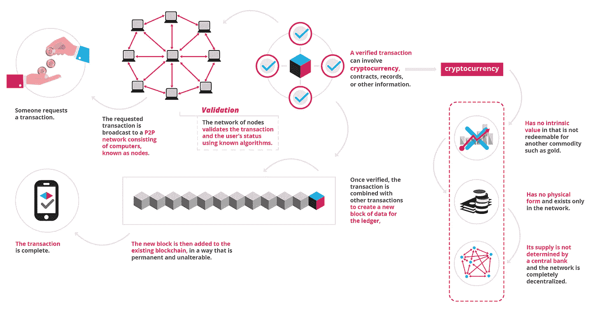
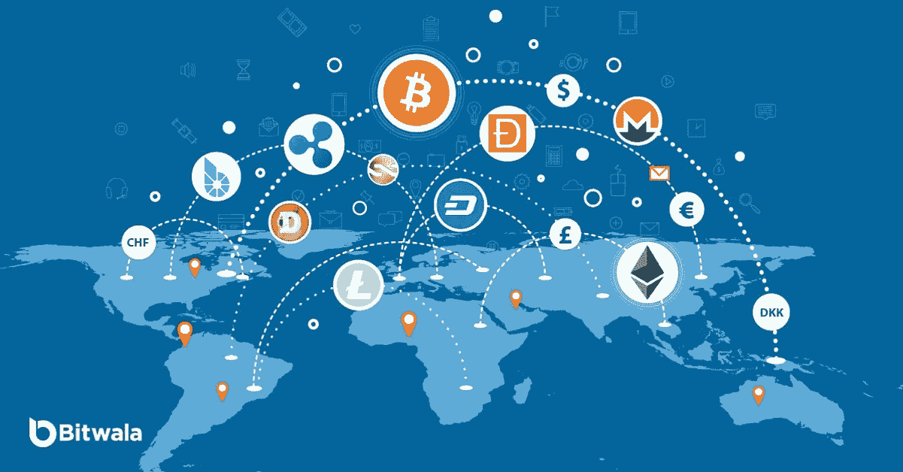
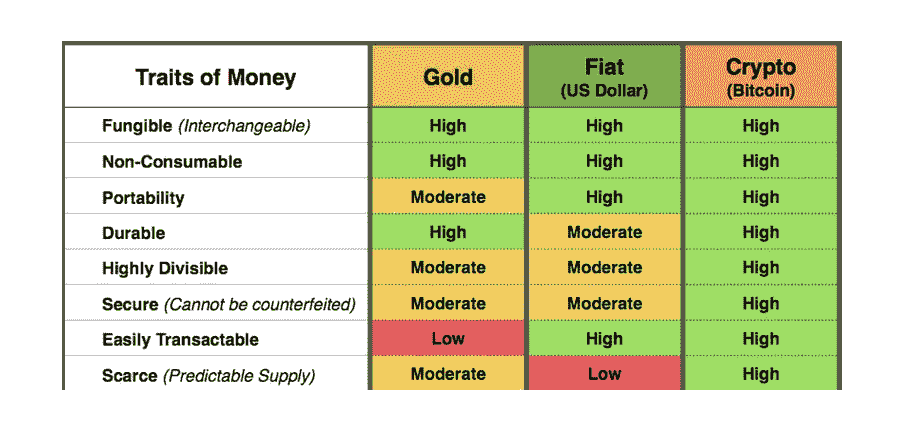
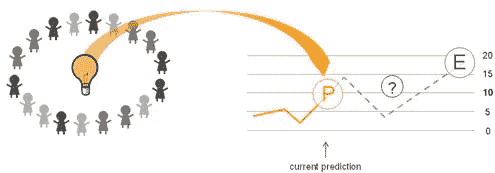
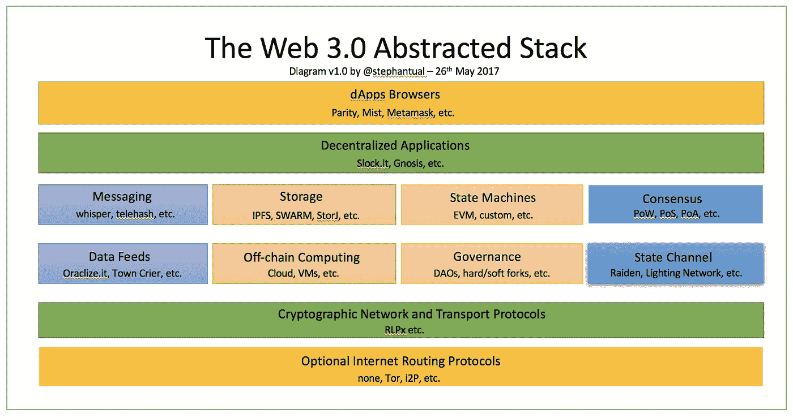

# 区块链如何改变世界！！(用例)-第 1 部分

> 原文：<https://medium.com/coinmonks/how-blockchain-can-transform-the-world-usecases-part-1-c91d0a2941b?source=collection_archive---------12----------------------->

比特币、以太坊、替代币、ICO、月亮、代币、矿工、国家监管等

太多的流行语。在过去的一年里，我们真的很开心，但我们仍然不明白从长远来看它们对我们有什么影响，以及它们如何能改变世界。

**定义:**

**区块链:(维基)**

区块链是由[中本聪](https://en.wikipedia.org/wiki/Satoshi_Nakamoto)在 2008 年发明的，作为比特币的公共交易账本。

这是一个不断增长的[记录](https://en.wikipedia.org/wiki/Record_(computer_science))列表，称为*块*，它们使用加密技术进行链接和保护。每个块通常包含前一个块的[密码散列](https://en.wikipedia.org/wiki/Cryptographic_hash_function)、时间戳[和交易数据。根据设计，区块链可以抵抗数据的修改](https://en.wikipedia.org/wiki/Trusted_timestamping)

# “区块链是信任机器”

比特币区块链的发明使其成为第一种无需可信机构或中央服务器就能解决双重花费问题的数字货币。

为了分散化和安全性，在所有节点上复制一系列数据块(不可变数据库)。

**区块链的种类:**

1.  无权限，公开(任何人都可以加入，账本数据公开)
    (比特币，以太坊)
2.  许可的、公共的(经过验证的节点可以加入。分类帐数据是公开的)
3.  许可，私有(已验证的节点可以加入。分类帐数据是私有的)
    (超级分类帐)

从技术上讲，区块链包括

a.密码链接的**块** b. **p2p 网络**协议- >用于节点间的通信
c. ***防篡改*** - >工作证明/利益证明
d. ***激励*** - >比特币、以太坊
e. ***共识*** 协议-【t55

**加密货币:**

1.  比特币->第一个和众所周知的/工作证明/对开发者不太友好
2.  以太坊->开发者友好/快速增长的生态系统/路径定义者/图灵完整语言/智能合约
3.  隐私币->屏蔽交易(zcash/monero/dash)
4.  稳定硬币->与美元挂钩，附带法定/加密抵押品(制造商 DAO，tether)
5.  IOTA —数据驱动的区块链(适用于 IOT)
6.  NEO->以太坊的中国柜台部分
7.  以太坊的竞争对手->zilliqa，cosmos，Algorand，Polkadot，EOS，stellar

**令牌:**

1.  公用事业代币—区块链固有的公用事业，代币价值随着需求而增加(假人、Sia、以太坊)
2.  [安全令牌](https://medium.com/coinmonks/security-token/home) —现实世界资产的令牌
3.  支付令牌—用于支付、转账(比特币、莱特币)

**令牌标准:**

ERC 20——以太坊[区块链](https://en.wikipedia.org/wiki/Blockchain)上用于实现令牌的智能合约的技术标准。
ERC 721——不可替代代币标准(类似于密码猫的收藏品)
ERC 998——可组合的不可替代代币标准(不动产代币)
ERC 1155——游戏代币标准

*ERC* 代表*以太坊征求意见*

> “互联网是信息的传递，区块链是价值的传递”

# **使用案例:**

1.  ***储值:***

从上面的图表中可以看出，由于其便携性(与黄金相比)，加密技术很有可能占领价值储存的大市场。它可能会像土地一样成为下一个**跨代资产。**

我的偏好:

***比特币*** —为什么？
a .安全——工作证明
b .无通货膨胀
c .公众接受

如果比特币无法满足每天所需的交易，那么比特币可能会被富人(高交易成本)和以太坊中上阶层(中等交易成本)使用

**2。储备货币:**
美元和 SDR 被认为是全球的储备货币。比特币/以太坊很有可能在未来取代它们，因为它们的普遍性和高市值。然而，价格波动应该是适度的，所有国家(主要是美国、欧盟、印度、中国)都应该点头同意这种情况发生。

**3。国际货币转账:(银行)**
目前，货币可以通过加密货币即时转账，而不是通过传统的设置等待很长时间

带有 rootstack /以太坊的比特币可以成为规模化国际货币转移的模式。

**4。理财产品:**

***a .募资*** — ICO 的/能与 VC 的
***b .借贷***——crypto 作抵押——(达摩协议)

最好的情况是→ *发达国家的人借钱给发展中国家的人*。

与发达国家相比，发展中国家的利率较高。然而，个人信誉分析对贷款至关重要。

> 信誉协议是关键

***c .衍生品— (dydx)***
***d .支付*** —应用内支付/隐私支付

应用内支付(游戏)，隐私支付将是最好的用例。

人们的日常支付不会成为区块链的杀手级应用。在发展中国家，如印度(UPI/BBPS/Paytm/tez)、中国(支付宝/微信)，支付更快、更容易、更安全、更舒适、更便宜。

***e .安全令牌***

他们可以向投资者提供一系列金融权利，如股权、股息、利润分享权、投票权、回购权等。这些通常代表对基础资产的权利，如房地产池、现金流或在另一只基金中的持股。代币在区块链驱动的交易所交易，权利写入智能合约。

***好处:***
1。全天候市场
2。部分所有权
3。快速结算。直接成本的减少
5。自动合规性
6。资产互操作性 7。增加流动性和市场深度。扩大安全合同的设计空间

在美国，以太坊不被认为是安全的。豪威测试可以指导我们决定代币是安全代币还是实用代币。

**5。分散银行。**

包括
a .资金的存储— (Eth)
b .资金的存取—(余额)
c .存取回收—分散回收！！
d .稳定账户——(庄家道)
e .计息账户——(达摩)
f .资金交换——(黄牛)
g .资金用途——？(钱包连接)

**要想成功**，这家银行应该在
1 上出类拔萃。治理
2。可用性
3。身份
4。速度
5。可恢复性
6。可靠性

这需要时间，但我们不是很远。

**可恢复性选项:**

a.生物特征数据-可以被改变
b .社会恢复-告诉朋友-信任问题
c. KYC 程序
d .瘫痪证明/时间锁定恢复/最后手段恢复

**6。收藏品**

众所周知，以太坊因为著名的 cryptokitties 游戏而变得拥挤。

CryptoKitties 是一款基于区块链的虚拟游戏，由 Axiom Zen 开发，允许玩家购买、收集、繁殖和出售各种类型的虚拟猫。

目前，著名的艺术品是人们梦寐以求的收藏品。然而，在未来，虚拟收藏品将是趋势。

例如:古董，稀有艺术实验室，达达等

**7。游戏**

游戏玩家是虚拟应用内代币的早期采用者。但是，这些令牌是不可互操作的。通过互操作性，游戏玩家可以用代币兑换法定货币/比特币，并且可以持续获利。(平行收入)

> 加密代币+ VR/AR 的游戏将成为杀手级应用

我个人认为，游戏+可扩展性解决方案将导致下一轮加密炒作周期。

**8。预测市场**

预测市场将成为新时代的脸书，whatsapp。人类喜欢预测，他们喜欢定期预测事情。

*用例:*
a .足球/板球比赛
b .《权力的游戏》下一个死的是谁！！女孩们请朋友预测她的约会行为。

如果你每一个正确的预测都能赚到钱，那会比 whatsapp 更让人上瘾

灵知，预兆

**9。约会**

Tinder 有助于识别有相似兴趣和漂亮约会对象的人。但是，人们在约会之前就把自己卖了，这可能是真的，也可能是假的。之后，没有关于个人兴趣/特质真实性的反馈。

在这里，声誉可能是关键。

人们可以根据一些参数给约会后的人打分，比如:a .幽默 b .骑士精神 c .浪漫 d .工作狂 e .过于严肃 f .交友圈材料等等

**10。招聘:**

在 linkedin 中，推荐/参考可能无法帮助我们识别一个人的内在本质。这只能让我们了解他/她。应该鼓励同事根据不同的参数(私下)对该人进行评价，如
a .团队合作
b .情绪/逻辑/压力过大
c .鼓舞人心
d .领导素质
e .聪明/勤奋

适量的激励有助于我们识别我们想要的人，并提高组织的生产力

11。分散应用(块堆栈)

a.分散身份

“我们设想这样一个世界，人们可以决定与谁分享他们的个人信息，以及分享哪些信息。

思域富有远见的区块链身份验证技术允许消费者实时授权使用他们的身份。

我们正在率先开发一个生态系统，旨在促进通过区块链按需、安全、低成本地获得身份验证服务。”—思域

例如:思域、uport、selfkey 等

b.分散存储— Storj、filecoin、sia、IPFS
c .分散计算—假人
d .分散通信— Whisper
c .分散 Ms-office — graphite (Blockstack)

12。保险:

随着一切都变得数字化，车辆数据、家庭自动化数据、工厂数据、健康数据有助于改变保险业的面貌。区块链通过存储数据库中存储的时间序列数据的哈希，作为信任机器发挥作用。

人们可以私下分享数据，并可以在保险费上获得折扣。

— — —
在下一部分中，将讨论其他重要的用例。

附言:我感谢区块链社区的知识分享。这篇文章的灵感来自区块链空间的许多优秀作家的内容。

我也很感激我的妻子帮助我如何在声誉系统中评价人类。