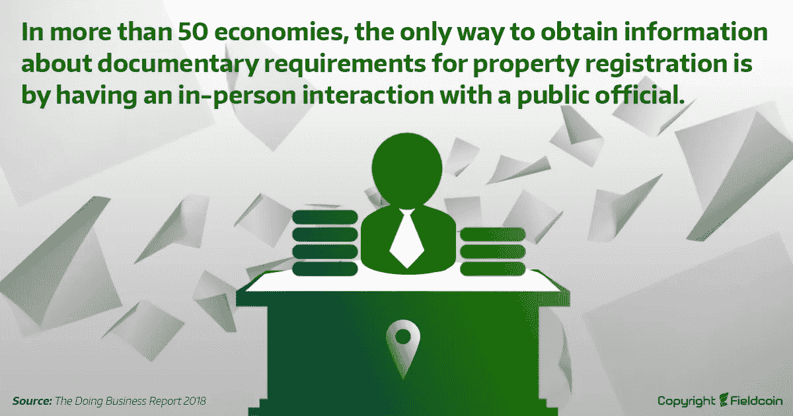
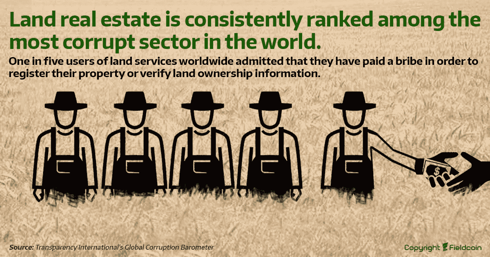
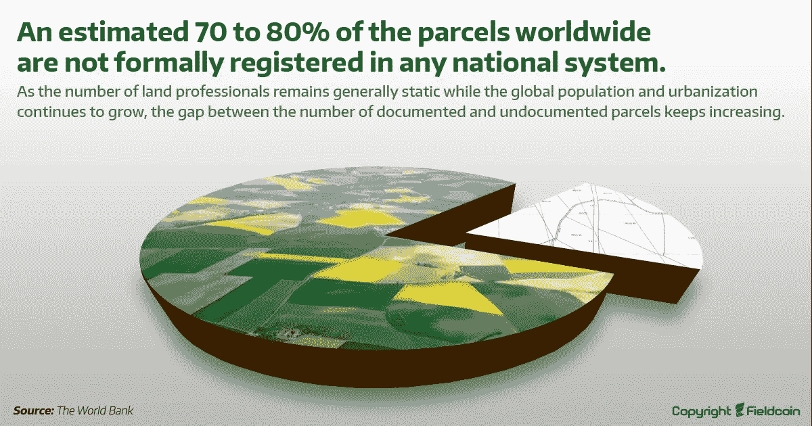
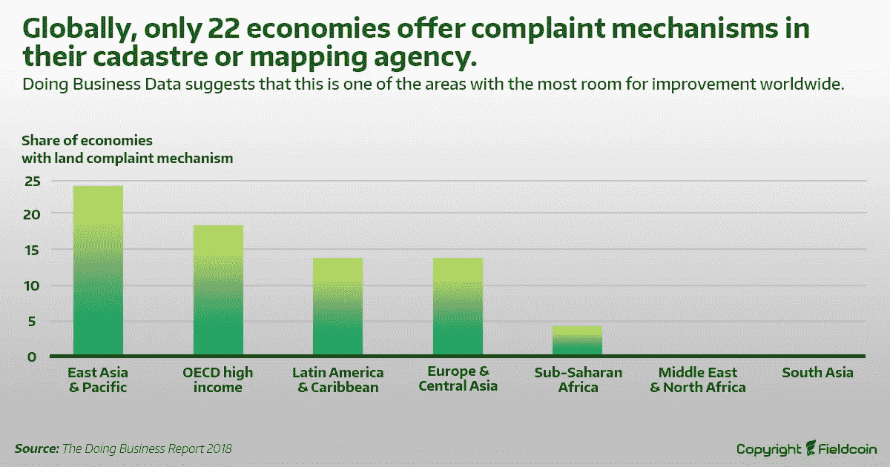

# 区块链如何拯救世界粮食短缺

> 原文：<https://medium.com/coinmonks/how-blockchain-could-save-the-world-from-food-shortage-11ef76663b59?source=collection_archive---------2----------------------->

## 货币危机，量化宽松，金融危机即将到来，低利率和股票市场的低回报……但是食品价格持续上涨。寻找安全的投资？你资产的下一个去处肯定是农业用地。然而，该部门缺乏流动性和技术创新实施。问题是什么，区块链技术将如何很快推动这一领域？

几年后，人均食物摄入量的增加和地球上人口的增长将导致高度的政治不稳定和叛乱，我们已经在非洲和南美国家看到了这种情况。世界上的人们开始挨饿只是时间问题，不仅仅是在不发达国家……矛盾的是，世界上大部分可耕地没有被开发。我们在一些地块上收集产量，用化学物质销毁，以提高产量，而其他地块则处于休耕状态。目前，短缺的主要原因不是气候变化或任何其他因素。我们有足够的耕地，因此有足够的食物养活这个星球上的每个人。真正的原因是没有土地登记。提高每个所有者的产权透明度和可见性将开启一个新时代，投资将涌向农业用地和新的农场开发。这将导致更多的生产和更好的食品质量。

我们都知道，区块链是最新的数字创新，它正在彻底改变许多商业领域，如果不是大多数的话…根据许多研究，农业和土地注册是区块链技术应用最有前途的主要领域，对于向更可持续和更健康的食品生产过渡至关重要。事实上，食品行业正面临着许多挑战，如人口增长和可耕地稀缺、气候变化、土壤贫瘠、粮食损失、农业生产力不平等和食源性疾病，如《T2》中由 Handelsblatt 研究所出版的《农业和食品的未来》小册子所示。因此，消费者对土壤和食品生产的更多信息和透明度的需求正在快速增长。

此外，土地登记系统不符合当今的需求，在世界上大多数国家已经过时，因此系统地影响交易和所有权核实的延误，有时还会导致土地被挪用。

区块链的使用简化和加快了土地交易和财产转让的处理时间，使任何人都可以自由地访问财产，而没有很高的行政边界。

此外，区块链的所有权信息确保了合法的财产所有者，消除了土地管理系统中的冲突、纠纷和腐败。事实上，正如【2018 年营商环境报告(登记财产章节)中所详述的，土地房地产一直被列为世界上最腐败的行业之一。

问题是农业生产需要稳定。虽然经常因为腐败的土地所有者而改变所有者，但是关于土地的所有信息都随着所有的数据收集工作而丢失。年复一年，农业土地所有者需要跟踪他们的生产，以做出最佳选择，从而获得尽可能高的效率。通过在地图上追踪区块链上的土地，我们可以使永久存储这些信息成为可能。

从全球来看，土地管理系统的不透明是全球 70%以上面临被征用威胁的土地所有者缺乏合法注册产权的原因。这导致世界大多数地区缺乏外国投资。

为了绕过这个问题，提高效率和透明度，并帮助恢复公众对政府国家机构的信任，加纳、佐治亚州和洪都拉斯等国家现在正朝着实施区块链土地登记册的方向发展，正如 2019 年经合组织巴黎会议的[数字转型:区块链和土地标题审查中所述。](http://www.oecd.org/corruption/integrity-forum/academic-papers/Georg%20Eder-%20Blockchain%20-%20Ghana_verified.pdf)

区块链应用通过创建一个与土地房地产相关的所有信息的统一系统并将其与全球经济连接起来，对于土地治理是可行的。根据[粮农组织出版物《电子农业在行动](http://www.fao.org/3/CA2906EN/ca2906en.pdf):农业区块链》,考虑到全球 40%的人口收入来自粮食供应，更高效和透明的食物链供应面临巨大挑战，然而超过 50%的作物价值在收获和销售之间损失。

同一份出版物的报告称，到 2050 年，小规模农民将不得不生产超过 60%的粮食来养活超过 90 亿人口，该出版物重点关注信息和通信技术(ICT)如何改变生活的影响，如区块链技术、物联网、大数据分析和信息系统以及人工智能等，旨在促进和支持可持续农业和农村发展。

在 Stanford Business 发布的一份名为[block chain for Social Impact 2019(农业和土地权利章节](https://www.gsb.stanford.edu/sites/gsb/files/publication-pdf/csi-report-2019-blockchain-social-impact.pdf))的报告中，将区块链整合到农业和土地权利领域的组织正在将这项技术主要用于供应链管理和记录验证。越来越多的项目和组织正在使用区块链和农业 4.0 技术，在供应链的关键利益相关者之间建立无处不在的信任，以提高食品生产和分销的透明度，正如[农业和食品供应链研究中区块链技术的兴起所示。](https://arxiv.org/pdf/1908.07391)

**下一步将是深入问题的根源:通过向所有人提供土地质量和所有权信息来解决可见性问题。这只能通过创建一个对每个人都容易使用的工具来实现。Fieldcoin 团队找到了解决方案，创建了一个与区块链关联的交互式地图，并为每个包裹显示 ERC721 令牌。这样，我们将确切地知道谁拥有哪块土地，而且我们还可以追踪我们消费了什么，我们吃的食物来自哪里。互动地图与以太坊区块链链接，任何人都可以访问，包含土地属性所需的不可变信息。**

> [直接在您的收件箱中获得最佳软件交易](https://coincodecap.com/?utm_source=coinmonks)

