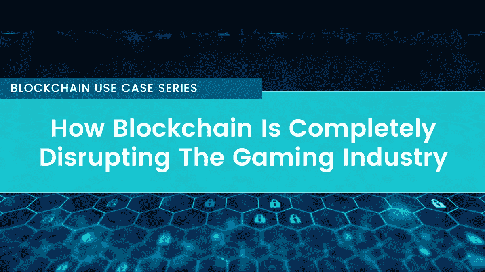

# 区块链如何彻底颠覆游戏行业

> 原文：<https://medium.com/coinmonks/how-blockchain-is-completely-disrupting-the-gaming-industry-af226f73ee9e?source=collection_archive---------3----------------------->

## 区块链用例系列(5 部分系列—第 3 部分)

世界正在逐渐解开使用区块链技术的新方法。虽然每次提到“区块链”这个词，大多数人都会很容易想到加密货币和金融，但这项技术还有更多。

农业、能源和艺术等行业正在将区块链融入他们的运营。另一个加入潮流的不知情的玩家是在线游戏。许多项目已经有所起色。游戏行业拥有大约 20 亿用户，预计到 2020 年，年收入将从 944 亿美元增长到 1280 亿美元。

Image: [Beata Dudová](https://www.pexels.com/@beatadudova)

现在，让我们深入探讨区块链将给游戏行业带来变革的 9 种方式:

## 1.更加激动人心和平行的游戏世界

玩在线游戏还有什么比不断进入平行游戏世界更令人兴奋的呢？区块链的分布式账本将使你，作为一个游戏玩家，可以在几个游戏中使用你的角色和物品。有可能，因为你所有的数据都会通过智能合约来验证。

也许你会问:它是如何工作的？区块链保护你的数据，并提供了一个更好的存储数据的选择，这些数据将以数字资产的形式在游戏中使用。此外，这项技术将使许多游戏公司携手创造平行的游戏世界成为可能。游戏公司将通过智能合同强化其条款和条件，从而提高所有关联游戏的忠诚度。

## 2.游戏项目的价值将会增加

游戏中最大的满足感来自于拥有几件游戏中的物品，尤其是那些很难碰到的物品。因此，玩家将花费数小时在这些物品上。区块链将增加这些虚拟物品价值的一些方式包括:

*   在游戏内外创造使用虚拟物品的新方法，这将增加这些物品的功能价值。
*   创建一个平台，让你，作为一个玩家，可以用菲亚特现金出售你的虚拟物品，这将增强它们的经济价值。
*   创建一个虚拟空间，促进虚拟物品的交易、赠送和共享，将增加它们的社会价值。

价值的增加将导致游戏物品的名称从虚拟物品变为数字资产。

## 3.安全可靠的存储

你也会很高兴地知道，将加密的区块链账本引入游戏行业将大大有助于保证你的游戏物品的安全存储。

只要你的数据在区块链里，你就可以告别任何机智的黑客访问它的梦想。黑客不仅要确保攻击的是正确的节点，而且攻击的时机也必须无懈可击。

还有难以破解的加密技术。这只是黑客必须同时找到并攻击的几个网络中心的第一步。因此，区块链可以永久确保虚拟物品的安全。

## 4.减少欺诈和收入损失

欺诈造成的收入损失是互联网上广为人知的恶习之一。游戏行业也未能幸免，每 7.5 个虚拟物品中就有一个遭遇欺诈。区块链技术将确保根除这一威胁，每年为游戏行业节省数十亿美元的收入损失。

## 5.节省支付处理费用

正如你已经知道的，游戏产业是巨大的。虽然可以通过法定货币支付游戏费用，但随之而来的是昂贵的费用。

区块链将允许你，作为一个用户，在不涉及信用卡或借记卡公司的情况下进行支付，无论金额有多小。由于它是分散的，这里实施的费用是微不足道的。

此外，这项技术以一种骗子无法在任何地方引诱你(作为一名游戏玩家)的方式加强了支付。换句话说，在区块链系统中，窃取信息甚至操纵市场几乎是不可能的。

## 6.受监管的游戏经济

受到严格监管的经济体或政府禁令的问题是，它会导致黑市，这对每个人都不利。游戏开发商不仅失去了控制交易参数的能力，因此丧失了潜在的收入，而且还让用户面临被骗的风险。

区块链不需要任何监管。区块链技术将使开发者能够为游戏生态系统中的交易项目收取持续的版税。作为开发人员或服务器所有者，您还可以决定是否允许无限制的物品交易或停止出售资产。

## 7.游戏中的微交易

简单、快速和负担得起的微支付将使开发者找到更好的方法来赚钱，并使用户能够证明购买物品的合理性。通过区块链在游戏中诱发的微融资特征包括；

*   为用户提供更便宜能量的游戏会促使更多的用户购买这些物品。
*   用户能够通过开始-停止和计算花费时间的订阅服务来限制他们在游戏平台上的支出。
*   设置自动选项游戏内交易可以让游戏以资产的形式自动转账。

其结果将是货币化目标的巨大转变，因为它将不再是为少数人服务，而是为大多数人服务。到 2021 年，预计博彩业收入将超过 1320 亿美元。

## 8.资产稀缺的证明

由于区块链是开源的，游戏开发者可以创建稀有的虚拟资产或定制某些资产，如盔甲、剑和其他游戏内化妆品，使它们更有价值。使用这种技术的一个很好的例子就是 Crypto Kitties 游戏。

Crypto Kitties 是一款简单的独立游戏，使用区块链来存储可爱的猫咪，作为用户，你可以获得并交易它们。在第一周，Crypto Kitties 取得了意想不到的成功，处理了数百万美元的交易，其中“Genesis Cat”是最畅销的猫，售价为 115，000 美元。有限供应的证据促使人们对这些虚拟物品产生惊人的需求。

## 9.使游戏产业民主化

最后但同样重要的是，投票功能在在线游戏社区和游戏服务器中非常流行。在排名上就派上用场了；游戏，团队和许多其他项目。当前腐败和操纵选票的威胁导致来自投票系统的不可靠反馈。

区块链技术可以作为一种去中心化的智能合同来应用，使投票系统难以篡改。区块链的公共性质使操纵投票变得相当困难，也是抵御腐败的完美屏障。游戏中的民主化投票可以创造另一个层次的游戏，这在以前被认为是不可能的任务。

## 一锤定音

如你所见，区块链的使用将对游戏世界的各个方面产生巨大影响。虚拟物品的符号化，改善赌博和支付，只是预期的许多好处的冰山一角。

随着区块链技术的发展，它将进一步变革游戏行业。也许你应该密切关注并享受这项技术带来的游戏创新。

区块链用例系列(5 部分系列—第 1 部分):[区块链如何变革金融](/coinmonks/how-blockchain-is-revolutionizing-finance-bdddd7770f8c)
区块链用例系列(5 部分系列—第 2 部分):[区块链如何改变赌博行业](/coinmonks/how-blockchain-is-changing-the-gambling-industry-3c59959b7cd1)

渴望了解更多关于 FundYourselfNow 的信息吗？在我们的 [*电报*](https://t.me/fundyourselfnow) *群上加入我们的众筹革命对话，或者在* [*推特上关注我们。*](https://twitter.com/fundyourselfnow)