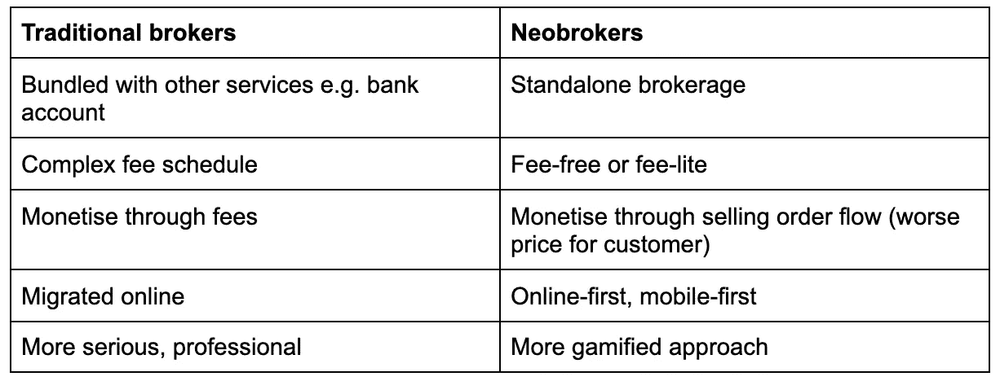
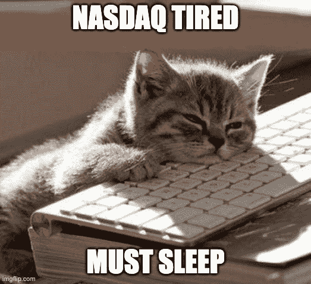
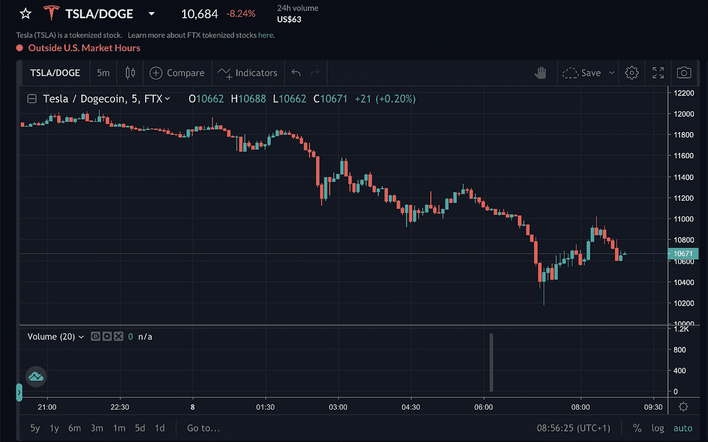
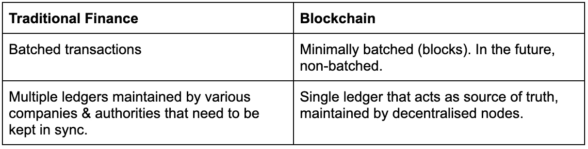

# 区块链将如何颠覆新经纪人市场

> 原文：<https://medium.com/coinmonks/how-blockchain-is-going-to-disrupt-the-neobroker-market-f4d048b649e4?source=collection_archive---------2----------------------->

## 新经纪人近来表现出色。

罗宾汉已经达到了十岁的状态，像 TradeRepublic 这样的欧洲玩家获得了大量的资金来实现他们的爆炸式增长。

这有什么好惊讶的？在利率为零的情况下，千禧一代是历史上最大规模财富转移的接受者。他们必须把钱投到某个地方，零费用、移动优先的经纪人体验肯定会胜过你父亲正在使用的传统经纪人。

如今，年轻人正涌向 neobrokers(包括我自己)开始投资股票和 ETF。

# 新经纪人只是扰乱了分销，而不是基础设施

新经纪人具有破坏性。不可否认。但是，当您查看中断的位置时，主要是分布层。

扰乱分发层固然很好，但充其量只是一个中间步骤。底层基础设施层有巨大的改进空间。

停下来思考一下下面这句话，就好像你是第一次听到这句话一样:**证券交易所晚上不营业。**

我会让你理解一下的。

一些表面上是我们资本主义、自由市场社会的基本支柱的东西，故意决定在某个小时后停止运转。怎么了？他们累了还是什么？周末也是禁区，对于一些[亚洲市场](https://www.jpx.co.jp/english/derivatives/rules/trading-hours/index.html)，他们甚至停下来吃午饭。

我们的金融世界已经过时了。它运行缓慢，效率低下，而且是在技术非常非常不同的时代建造的。

我们相信我们将会看到第二波颠覆:

# 当今的区块链和股票

现在，有两种主要的方法来获取像股票这样的链外资产，并在链上表现它们:

## 1.由资产支持的代币，如代币化股票

FTX 加密交易所与德国 CM-Equity 合作，提供股票的符号化版本。根据[帮助页面](https://help.ftx.com/hc/en-us/articles/360051229472-Tokenized-Stocks)，用户正在交易由股票支持的代币，并且“如果需要，可以用 CM-Equity 赎回基础股票”。

虽然这种方法已经成功地将股票“放到了区块链”，但是相对于相对较小的 CM- Equity，这种方法存在重大的交易对手风险。

*Trading Dogecoin against Tesla — a match made in heaven.*

## 2.合成资产

合成资产有点难以解释。这些资产模拟了基础资产，但不一定得到基础资产的支持。在传统金融中，我们已经通过组合不同的衍生品实现了这一点，例如，一只基金可能会买入一个看涨期权(买入权)和一个看跌期权(卖出权)，从而在不必持有或结算基础资产的情况下，对其进行敞口。从长远来看，衍生品市场规模为 1.2 万亿美元，全球股票市场规模为 73 万亿美元。

DeFi 中有一些项目可以创建股票、货币和商品的合成版本。这些通常包括锁定抵押品，并根据所述抵押品“铸造”合成资产。例如，通过业内领先的合成资产平台 [Synthetix](https://synthetix.io/) ，本地 SNX 令牌被锁定并用作抵押品。针对它创造了跟踪基础资产价格的合成令牌，例如 sUSD。如果价格上涨，锁定的抵押品确保你可以溢价出售。

分散的合成资产仍处于早期阶段，仍有挑战需要克服。例如，Synthetix 要求 600%的抵押率，这意味着锁定价值 1000 美元的 SNX 只能让你铸造价值 133 美元的合成特斯拉。

合成资产可以用来追踪任何东西的价格。看看三藩市的[便便标记](https://decrypt.co/11533/theres-now-a-literal-shitcoin-to-track-san-francisco-street-poop)，这是一个相当精彩的例子。

## 3.【未来】原生区块链证券

直到今天，我们需要将股票“黑”到区块链。毫无疑问，在未来，股票完全以数字形式存在是可能的。例如，德国去年颁布的[电子证券法](https://www.coindesk.com/germany-legalizes-electronic-securities-on-the-blockchain)就为此铺平了道路。

具体如何操作仍有争议，但肯定会有一定程度的集中，就像今天的证券市场一样。

这无疑是朝着正确方向迈出的一步。但我个人的信念是，证券将在区块链上生生不息。原因如下:

# 区块链与传统金融

证券市场是为电子存储和交易成本非常高的时代设计的。由于这个原因，事务以批处理、异步的方式完成。当我们对证券进行非物质化处理(不再需要证书)时，我们转向了基于分类账的系统，但这仍远非完美。

例如，在美国结算仍然需要两天或“T+2”。事实上，正是因为这个原因，罗宾汉需要[暂停 GameStop](https://www.bitwala.com/blog/what-happened-at-gamestop/) 等。一月交易；他们需要手头持有现金，以应对结算期间的交易对手违约风险，随着市场波动，这种风险上升得如此之快，他们资金不足，不得不暂停交易。

这很可能会让你问，当你在 RobinHood 上购买一只股票时会发生什么？你并不真正拥有它。你从你的经纪人那里得到一张借据，经纪人从托管人那里得到一张借据，托管人从中央机构那里得到一张借据(例如美国的 [DTCC](https://www.dtcc.com/) )。

想象一下保持所有这些分类账同步的成本，特别是当这些系统是在电子交易数量因成本原因而最小化的时代建立的时候。

人们开始理解为什么市场在周末关闭了。也有一些关于缺点的搞笑例子，比如当[多尔拥有太多股份的时候](https://www.bloomberg.com/opinion/articles/2017-02-17/dole-food-had-too-many-shares)。

证券基础设施实际上做的很多事情是跟踪所有的借据，并确保系统是一致的。区块链默认内置了这一点。

转向区块链将大大降低我们现有基础设施的复杂性和成本。这样做，将允许我们创建一个全球价值网络，就像互联网已经成为一个全球信息网络一样。

# 对我有什么好处？消费者的黑仔用例

除了上面提到的所有成本和速度效率，区块链支持的证券将为最终用户创造杀手级用例。

当你在区块链上有了代币，它就是可组合的标准化生态系统的一部分。你不局限于在一个应用或用例中使用它，例如在你购买它的交易所进行交易，而是可以在整个生态系统中使用它。

**1。轻松迁移到另一个平台**

如果你决定不喜欢你的经纪人，你可以很容易地换一个。只需拿着你的代币，把它们从 A 地送到 b 地。如今，把证券从一个账户转移到另一个账户是典型的卡夫卡式的事情。

**2。借出你的股票赚取回报**

如果你有一个“买入并持有”的策略，为什么不考虑把你的股票借出去以获得回报呢？

这听起来可能很新奇，但这已经在华尔街发生了——大多没有经过你的同意，只是对经纪人有利。散户投资者也应该可以。

**3。用你的股票抵押借款**

反之亦然。

如果你有一个月现金短缺，为什么不用你的投资组合来借款呢？比如，你可以用€10，000 英镑的投资组合借入€5，000 英镑。好处是你不会被迫卖出你的头寸。如果你做多资产或不想引发应税事件，这是很好的选择。

抵押借款将比信用借款更便宜，因为贷方的风险更低。

**4。全天候交易**

将来，我们的孩子会嘲笑我们没有质疑为什么市场在周末关闭，就像我们惊讶于我们的父母不得不通过信件交流一样。

**5。透明度**

因为区块链是公开的，所以更容易看出谁参与了交易或资产的保管。

这同样适用于结构性产品，比如 ETF。如果你投资的是不光彩的东西，那就容易得多了。

**6。更广泛的地域供应**

在欧洲，人们正努力创建开放银行，提供类似 PSD2 的服务。但对于证券来说，不存在这样的等价物。

事实上，交易真实股票(TradeRepublic)而不是差价合约(CFDs)的公司，需要在他们为客户服务的每个国家都有托管银行。这太复杂了。有了区块链上的数字资产，你可以避免这种情况，这意味着你最喜欢的应用程序也可以在你的国家为你服务。

**7。更便宜的费用/更少冲突的盈利策略**

新经纪人必须赚钱，但他们的目标是一个不想付费的客户。直到今天，像罗宾汉的[出售交易流](https://www.institutionalinvestor.com/article/b1m2p1cv68bx56/Twitter-Freaked-Out-Over-Robinhood-Selling-Its-Trade-Flow-But-the-App-and-Others-Have-Been-Doing-It-for-Years)这样有争议的商业行为已经解决了这个问题。

区块链可以显著降低成本。企业将不再进退两难。

# 区块链如何影响新经纪人

如果 neobrokers 在扰乱分销方面取得了成功，他们会在这个新的基础设施上做同样的事情吗？

不一定。

Neobrokers 拥有成功的商业模式，已经与传统合作伙伴在传统基础设施上运行。改变这一点是一项巨大的努力，不能保证他们愿意并且能够做到这一点。

最终，客户会被提供区块链功能的玩家所吸引，就像新经纪人从他们之前的传统经纪人那里抢走生意一样。

# 现在怎么办？

证券向区块链的转移不会在一夜之间发生。事实上，华尔街花了[六年默默无闻的努力](https://www.coindesk.com/what-really-happened-when-robinhood-suspended-gamestop-trading)才把结算时间从三天缩短到两天。

但美妙的是，我们不必等待华尔街。

由证券支持的合成资产和代币就是很好的例子。区块链和 DeFi 正在创建一个并行的金融系统，而不是建立在现有系统的基础上。我们不必等着看未来会是什么样子。加密货币和分散金融今天向我们展示。

最终，[区块链和 DeFi 将比传统金融创新得更快。这两个系统之间的差异将推动这一变化。](/@BenPeterJones/why-fintech-and-defi-need-each-other-9e6fbe58d0a4)

> 加入 Coinmonks [电报集团](https://t.me/joinchat/JaY3hVVw2WhiNmFl)，了解加密交易和投资

## 另外，阅读

*   最好的[加密交易机器人](/coinmonks/crypto-trading-bot-c2ffce8acb2a) | [网格交易机器人](https://blog.coincodecap.com/grid-trading)
*   [加密复制交易平台](/coinmonks/top-10-crypto-copy-trading-platforms-for-beginners-d0c37c7d698c) | [如何在 WazirX 上购买比特币](/coinmonks/buy-bitcoin-on-wazirx-2d12b7989af1)
*   [CoinLoan 审核](/coinmonks/coinloan-review-18128b9badc4)|[Crypto.com 审核](/coinmonks/crypto-com-review-f143dca1f74c) | [火币保证金交易](/coinmonks/huobi-margin-trading-b3b06cdc1519)
*   [尤霍德勒 vs 考尼洛 vs 霍德诺特](/coinmonks/youhodler-vs-coinloan-vs-hodlnaut-b1050acde55a) | [Cryptohopper vs 哈斯博特](https://blog.coincodecap.com/cryptohopper-vs-haasbot)
*   [杠杆代币](/coinmonks/leveraged-token-3f5257808b22) | [最佳密码交易所](/coinmonks/crypto-exchange-dd2f9d6f3769) | [Paxful 点评](/coinmonks/paxful-review-4daf2354ab70)
*   [加密套利](/coinmonks/crypto-arbitrage-guide-how-to-make-money-as-a-beginner-62bfe5c868f6)指南| [如何做空比特币](/coinmonks/how-to-short-bitcoin-568a2d0b4ae5) | [1xBit 回顾](https://blog.coincodecap.com/1xbit-review)
*   [如何在印度购买比特币？](/coinmonks/buy-bitcoin-in-india-feb50ddfef94) | [WazirX 评论](/coinmonks/wazirx-review-5c811b074f5b) | [BitMEX 评论](https://blog.coincodecap.com/bitmex-review)
*   [印度比特币交易所](/coinmonks/bitcoin-exchange-in-india-7f1fe79715c9) | [比特币储蓄账户](/coinmonks/bitcoin-savings-account-e65b13f92451)
*   [币安费](/coinmonks/binance-fees-8588ec17965) | [Botcrypto 评论](/coinmonks/botcrypto-review-2021-build-your-own-trading-bot-coincodecap-6b8332d736c7) | [Hotbit 评论](/coinmonks/hotbit-review-cd5bec41dafb) | [KuCoin 评论](https://blog.coincodecap.com/kucoin-review)
*   [我的密码副本交易经验](/coinmonks/my-experience-with-crypto-copy-trading-d6feb2ce3ac5) | [购买硬币评论](https://blog.coincodecap.com/buycoins-review)
*   [Bybit 融资融券交易](/coinmonks/bybit-margin-trading-e5071676244e) | [币安融资融券交易](/coinmonks/binance-margin-trading-c9eb5e9d2116) | [Overbit 审核](/coinmonks/overbit-review-9446ed4f2188)
*   [加密货币储蓄账户](/coinmonks/cryptocurrency-savings-accounts-be3bc0feffbf) | [YoBit 审查](/coinmonks/yobit-review-175464162c62) | [Bitbns 审查](/coinmonks/bitbns-review-38256a07e161)
*   [Botsfolio vs nap bots vs Mudrex](/coinmonks/botsfolio-vs-napbots-vs-mudrex-c81344970c02)|[gate . io 交流回顾](/coinmonks/gate-io-exchange-review-61bf87b7078f)
*   [最佳比特币保证金交易](/coinmonks/bitcoin-margin-trading-exchange-bcbfcbf7b8e3) | [萝莉点评](/coinmonks/lolli-review-e6ddc7895ad8) | [比特币保证金交易](https://blog.coincodecap.com/bityard-margin-trading)
*   [创造并出售你的第一个 NFT](https://blog.coincodecap.com/create-nft) | [本地比特币评论](/coinmonks/localbitcoins-review-6cc001c6ed56)
*   [加密保证金交易交易所](/coinmonks/crypto-margin-trading-exchanges-428b1f7ad108) | [赚取比特币](/coinmonks/earn-bitcoin-6e8bd3c592d9) | [Mudrex 投资](https://blog.coincodecap.com/mudrex-invest-review-the-best-way-to-invest-in-crypto)
*   [如何在印度购买以太坊？](https://blog.coincodecap.com/buy-ethereum-in-india) | [如何在币安购买比特币](https://blog.coincodecap.com/buy-bitcoin-binance)
*   [顶级付费加密货币和区块链课程](https://blog.coincodecap.com/blockchain-courses) | [币安评论](/coinmonks/binance-review-ee10d3bf3b6e)
*   [MXC 交易所评论](/coinmonks/mxc-exchange-review-3af0ec1cba8c) | [Pionex vs 币安](https://blog.coincodecap.com/pionex-vs-binance) | [Pionex 套利机器人](https://blog.coincodecap.com/pionex-arbitrage-bot)
*   [在美国如何使用 BitMEX？](https://blog.coincodecap.com/use-bitmex-in-usa) | [BitMEX 评论](https://blog.coincodecap.com/bitmex-review)