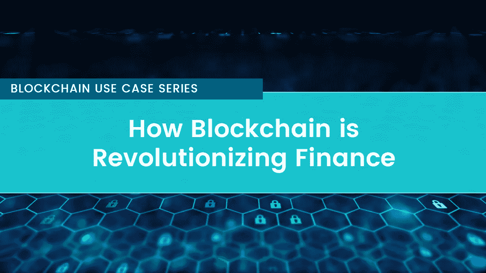

# 区块链如何变革金融

> 原文：<https://medium.com/coinmonks/how-blockchain-is-revolutionizing-finance-bdddd7770f8c?source=collection_archive---------6----------------------->

## 区块链用例系列(5 部分系列—第 1 部分)

自货币出现以来，锁链是金融领域最重要的创新之一，人们已经开始谈论它将如何改变世界。优步改变了私人交通部门，Airbnb 改变了旅游行业，区块链也将彻底改变金融行业。

这项新技术带来的一些好处包括:权力下放、可靠性、简化、透明、可追溯性、节约成本、减少出错空间、加快交易和提高数据质量。

在本帖中，我们将阐述区块链变革金融行业的具体方式。所以，让我们开始探索:

## **更安全——资金转移**

最近的报告显示，每年大约有 45%的金融机构(如 T4 的货币转账和证券交易所)遭受经济犯罪。你看，这些机构中的大多数都是在中央数据库上运行的中介。集中式数据库容易受到网络攻击，仅仅因为它有一个单点故障，一旦黑客入侵，他就可以完全访问你系统中的数据。

区块链(一种共享的数字账本，在没有中央账本的情况下，批准记录和电子验证计算机网络上的交易)，通过引入分散数据库，解决了易受攻击的中央数据库的问题。

## 索赔处理—保险

在金融领域，每一项行动都应该有一份明确界定权利和义务的合同。传统合同(写在纸上)的问题在于:它们的发行是耗时的，因为它们是手工完成的，并且容易被伪造和破坏。

比如在美国加州，处理一次保险理赔需要 85 天，接近整整三个月。分解它；保险公司有 15 天时间确认索赔，40 天时间接受或拒绝索赔，另外 30 天时间付款。

通过智能合同的区块链技术有助于解决与传统合同相关的问题:消除中介和自动化交易。这确保了交易成本低廉，协议执行快速可靠。

智能合同在执行保险政策时已经派上了用场。它承诺对每一项可能导致赔付的索赔进行透明和可追溯。因此，区块链将打破现有的孤岛，推动保险行业的风险建模，并通过抓住受保资产的来源和所有权，大大减少欺诈索赔。

## 合规性—了解您的客户

了解客户(KYC)是所有金融机构的一项基本合规要求。该条例旨在帮助最大限度地减少洗钱和恐怖活动等犯罪活动。同样重要的是，在需要不同团队执行这项任务的集中式模型中，KYC 过程可能会非常缓慢和昂贵。最新[调查](https://www.thomsonreuters.com/en/press-releases/2016/may/thomson-reuters-2016-know-your-customer-surveys.html)显示，金融机构每年在 KYC 和客户尽职调查上的支出从 6000 万美元到 5 亿美元不等。这可是一大笔钱。

区块链通过提供一个身份信息的数字来源减轻了工作量，并进一步允许在银行和其他外部机构之间独立顺利地共享文档。因此，这项技术将降低合规部门的管理成本，支持自动开户，同时仍然保持数据隐私。

## 移动价值—交易平台

全球支付市场非常庞大。2016 年，[全球支付收入](https://www.statista.com/statistics/724810/total-global-payments-revenues/)为 1.6 万亿美元，到 2021 年将飙升至 2.2 万亿美元。但是，大多数机构速度慢、成本高并且容易出错，这难道不会困扰你吗？由于区块链提高了速度，减少了摩擦，它将成为移动价值的共同标准——所有权、股票、货币和债券。澳大利亚证券交易所(ASE)和纳斯达克现在正逐步利用区块链解决方案来提高效率和降低运营成本。

## **支付**

区块链的使用可能会极大地改变支付流程。目前，支付处理系统充斥着许多中介。区块链消除了中介，没有第三方不仅节省了你的时间和金钱，还节省了你查阅法律文件的繁琐过程，以确保你没有被骗。

桑坦德银行等银行现在正在使用基于区块链的支付应用程序，使客户能够在一天中的任何时间向世界上的任何国家进行实时支付。实时支付有助于将运营成本、人为错误和欺诈降至最低。

## **资产管理**

在对账和匹配时，资产管理中的传统交易流程可能会很麻烦且存在风险。对于跨境交易和贷款等非标准投资产品，情况可能会变得更加复杂。交易生命周期中的所有各方(例如，托管人、中介、经纪交易商、清算和结算部门)都保留相同交易记录的副本，这导致效率低下。

区块链技术通过自动化整个贸易生命周期来精简和简化流程。在这种情况下，交易中的每一方都可以访问有关交易的数据，从而加快处理周期，节省大量基础设施成本，最大限度地减少对账，实现有效的数据管理和透明度。

## **筹集资金的新方法**

传统上，新企业在建立新企业的早期必须瞄准天使投资者以获得必要的资金。随着风险资本家的出现，融资模式发生了变化，然后通过证券交易所进行首次公开募股(IPO ),这仍然是自我建立的企业更有利的途径。几乎所有这些融资形式都充斥着许多中介，包括交易所运营商、投资银行家、律师、审计师和众筹平台。

区块链技术正在改变这一等式，它允许各种规模的企业通过在全球范围内发行股票，在点对点平台上筹集资金。这种新的融资机制已经改变了创业行业。2016 年，区块链公司能够从传统风险投资者那里筹集到约 4 亿美元，通过 ICOs(首次发行硬币)筹集到约 2 亿美元。

## **最终拍板**

该说的都说了，该做的都做了；毫无疑问，区块链技术带来了许多将改变金融业的机会。区块链正以指数方式打开全球市场，就像互联网彻底改变了信息获取方式一样。它的潜力没有障碍——消费者和企业家可以随时随地获得他们需要的任何服务或资产。如果你足够关心并认识到区块链技术可以为未来的金融科技带来什么，那么你的未来是光明的。

*渴望了解更多关于 FundYourselfNow 的信息吗？在我们的*[*Telegram*](https://t.me/fundyourselfnow)*群上加入我们的众筹革命对话，或者在* [*Twitter 上关注我们。*](https://twitter.com/fundyourselfnow)