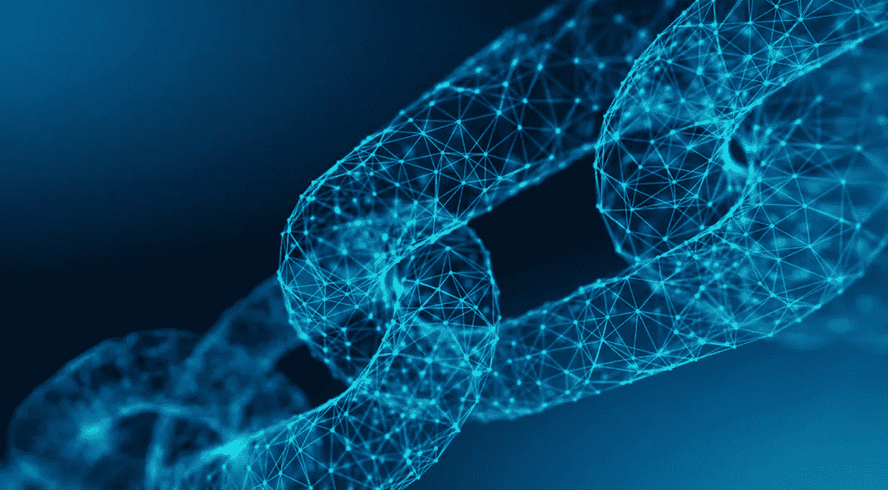

# 区块链如何诱惑供应链

> 原文：<https://medium.com/coinmonks/how-blockchain-seduced-the-supply-chain-5a4fb7b94ee1?source=collection_archive---------5----------------------->

正如我们在本系列的第一篇文章中提到的，在区块链技术问世近十年后，财富 500 强公司对其潜力产生了浓厚的兴趣。层应用正以惊人的速度发展。因此，企业热衷于尽可能地攫取专利。想想看，最贪婪的申请人不是别人，正是财富 500 强中排名第一的公司。

**行业:零售**

为什么？跟踪

沃尔玛目前拥有至少 4 项与区块链相关的已获批准或正在申请的专利。其目标之一是帮助快速准确地清除货架上召回的食品。[该公司最近宣布，其“绿叶蔬菜”供应商必须与 IBM 食品信托网络合作，以创建端到端的可追溯性。紧随其后的是源于亚利桑那州的大肠杆菌爆发。然而，顾客无法确定所购买的产品是在哪里生产的。](https://www.coindesk.com/walmart-will-start-tracking-groceries-on-blockchain-in-2019/)

分布式账本技术使这变得非常容易，它允许对单个商品进行标记，并从生产到店面进行跟踪。通过扫描标签，商店和顾客可以追溯任何产品的生产时间和地点，或者生产的工厂。由于该数据库的分布式、不可信任的性质，客户知道该信息没有以任何方式被篡改或伪造。

购买经过认证的有机和公平贸易产品的顾客会发现，在认证这些产品的原产地方面，他们有着一致的价值主张。

根据其另一份专利申请，为了改变人们出售不需要的商品的方式，沃尔玛还在开发一个位于区块链的市场。该公司声称，客户并不总是计划在一件物品的生命周期内使用它，通常“让他们自己去安排随后的转售。”作为回应，沃尔玛位于区块链的市场可以提供“额外的支持，以极大地方便和促进他们以后转售商品。”

更不用说，再见收据！

Meanwhile at CVS…

由于商品交易历史存储在沃尔玛的数据库中，该公司可以验证你要退货的商品是否是从该商店购买的。这减少了欺诈，消除了客户收据的不便。

另一项专利显示了沃尔玛在区块链建立配送和配送管理系统的计划。沃尔玛有兴趣使用分布式账本来跟踪仓库水平和无人驾驶飞机的自主移动。

## **行业:航空公司**

**为什么？假冒零件**

对于假冒零件是一个严重且潜在威胁生命的问题的行业来说，真实性保证非常有价值。这包括航空业。事实上，在过去的 10 年里，近 24 起飞机失事都与未经批准的零件故障有关。通过对购买的零件采用区块链记录系统，航空公司可以跟踪和验证所有飞机零件是否经过测试，符合安全和质量标准。

[根据埃森哲对 IBD 的采访，86%的航空业希望在未来三年内将区块链整合到他们的系统中**。**](https://www.investors.com/news/boeing-blockchain-artificial-intelligence-ai-drone-traffic/)**如果区块链能帮助根除目前执法方法漏洞中的危险部分，毫不夸张地说，这项技术将真正拯救生命。**

**旁注:波音公司也在寻求将区块链用于空中交通管制航线的分配。在不久的将来，联邦航空局使用区块链技术也就不足为奇了。**

## ****行业:时尚&珠宝****

****为什么？冲突&无奴隶制保障****

**DLT 还可以用来保证服装和珠宝的出处。这意味着顾客现在可以避免血汗工厂生产的商品或冲突宝石。领先品牌可以确保他们从道德生产商那里采购材料。**

**这一点尤其重要，因为千禧一代的消费者要求他们支持的品牌承担更多的社会责任。像巴塔哥尼亚这样将透明度和可持续性作为主要卖点的公司是区块链确保供应链跟踪的主要候选公司。**

**然而，这种现代化并不是没有代价的。大多数时尚公司认为这种循序渐进的跟踪系统是一个需要跨越的巨大障碍。它需要全球协作，将所有各方整合到同一个区块链系统中。**

**例如，[设计师 Martine Jarlgaard 在 2017 年展示有机英国羊驼服装时使用该技术进行了一次性实验。](https://www.businessoffashion.com/articles/opinion/op-ed-blockchains-could-upend-the-fashion-business)每件衣服都有一个可扫描的标签，揭示了每件衣服的历史，甚至是每件毛衣所剪羊驼的名字。**

**Make sure you shield your wallet password from wandering eyes.**

**然而目前，大多数珠宝和服装公司认为这是一种奢侈品。在当前条件下，跟踪所需的时间和精力非常昂贵，并显著增加了生产成本。**

## ****行业:制药****

****为什么？法规合规性****

**由于能够实时验证和记录交易，区块链也是满足制药行业供应链合规性要求的完美解决方案。区块链允许药品制造商从创建到患者分发跟踪每一粒药丸。这是 2013 年 11 月颁布的《药品供应链安全法》的关键要求。**

****辉瑞**和**基因泰克**已经在区块链完成了一个试点项目。由于区块链固有的效率和安全性，该计划可以使所有以前的供应链跟踪方法过时。理想情况下，这也可以让当局追踪任何非法销售的药物，对阿片类药物的可用性等问题进行急需的打击。**

**行业专家推测，区块链技术将在短期内支撑每一个供应链操作系统。原因非常清楚。**

**唯一的缺点是建立基础设施。幸运的是，[像 IBM 这样的公司已经在用他们的区块链即服务来简化供应链应用。](https://www.ibm.com/blockchain/industries/supply-chain)他们的 TradeLens 平台是一个大规模协作平台，每天提供来自全球超过一百万场活动的实时数据*。***

**随着区块链技术的成熟，应用变得更加强大，它将继续革新和优化我们周围的物理世界。**

> **[直接在您的收件箱中获得最佳软件交易](https://coincodecap.com/?utm_source=coinmonks)**

****