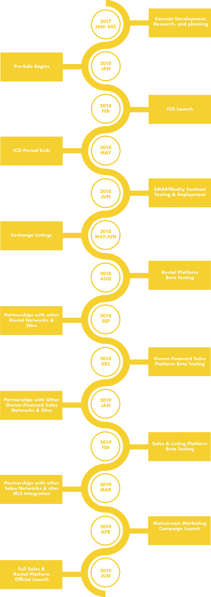

# 区块链初创公司 SMARTRealty 是如何颠覆房地产的？

> 原文：<https://medium.com/coinmonks/how-blockchain-startup-smartrealty-is-disrupting-real-estate-cb254190bdd3?source=collection_archive---------1----------------------->

**Click to Find blockchain Jobs**

`[Find blockchain jobs using Coinmonks jobs portal](https://coinmonks.com)`

`[***Get published on Coinmonks***](https://medium.com/coinmonks/contribute/home)`

今天我们采访了我们的 [coinmonks slack community](https://goo.gl/3Ex81z) 团队中来自 [SMARTRealty](https://smartrealty.io/?ref=coinmonks) 的[厄尼](https://www.linkedin.com/in/ernie-wong/)，SMARTRealty 正在解决房地产问题，并用智能合同取代复杂的实物合同系统。以下是那次采访的聊天记录。

> **我:什么是智能地产？**
> 
> **厄尼:**这不是一个简单的问题，SMARTRealty 是一个由三个主要元素组成的项目。我会详细说明…..
> 
> **智能不动产合同平台**——合同平台由模板系统组成，允许合同 ***创建者创建自己的智能不动产智能合同*** ，以满足其特定交易的需要，并符合其辖区的地方性法规。这使得租户、卖家或买家能够使用区块链技术巩固他们的协议。
> 
> **智能地产上市平台—** 智能地产上市平台将允许 T21 的业主将他们的房产上市出租或出售，并将这些上市信息发布到网络上许多其他热门的房产出售和出租网站。 这使得我们的智能合同平台和传统上市平台能够完全协同，而不需要传统参与者(银行、产权公司等)。)采用区块链技术成为这一“运动”的一部分。
> 
> **RLTY 令牌—** RLTY 令牌是与 SMARTRealty 智能合同一起使用的官方 SMARTRealty 令牌。支付可以使用任何主要货币(加密货币和法定货币)，但会自动转换为 RLTY 令牌，以便正确记录和跟踪支付，并遵守通过我们的模板系统和上市平台建立的智能合同条款。
> 
> **我:列出平台听起来像 Airbnb……它会这样运作吗？**
> 
> **厄尼:**差不多吧，只是会有出租、短期租赁(像 AirBnB)甚至买卖的列表平台。我喜欢把我们的系统描述为 Zillow 和 LegalZoom 的混合体，同时在它们之上集成了区块链技术。
> 
> **我:如果有人通过智能房地产平台交易，如何征税？**
> 
> **厄尼:**和往常一样，税收是用户需要解决的问题。我们并没有创造一些新时代的业务方式，甚至没有取代传统系统，相反，我们正在创建一个额外的层，在现有系统的基础上工作，为它们增加安全性、便利性和其他好处，而不是彻底破坏它们。
> 
> 我们相信，我们的智能合同系统将减少纠纷和房东-房客诉讼的需要(这种诉讼目前非常普遍)。然后，一旦我们作为这些系统之上的一层舒适地就位，然后，也只有到那时，我们才能推动破坏和取代它们，或者至少迫使传统玩家由于需求而采用区块链技术。
> 
> 太多的 ICO 项目和区块链项目都有一个计划，通过某种 ***【白日梦惊奇】*** 的方式来颠覆和取代当前的技术，但这往往不切实际。我们的观点是，通过利用一种实用的方法将我们的系统安装在遗留系统之上，并在这方面变得司空见惯，如果有意义的话，我们就可以更好地在以后强制中断
> 
> 我:你能通过一个例子给我们解释一下智能房地产是如何工作的吗？
> 
> **厄尼:**当然，所以我们的第一个平台将是租赁平台，所以我将与它合作，假设我是一名房东，我同意将我的一个单元租给你。通常我会给你一份租赁协议，你会在上面签字。
> 对于 SMARTRealty，这将是一个智能合同。差别不大，但足够不同，对吗？
> 
> 你审查条款，并通过小额签约交易的方式“同意”，就像任何其他智能合同一样。此外，你要向智能合同本身支付租金和押金。
> 
> 现在，各种条款可以根据具体需要进行调整，例如，也许你的押金是由合同本身托管的，但你的租金是按月支付给我的。
> 
> 此外，合同可以预先编程，以便在出现延迟付款或不付款的情况下向您发出通知。举例来说，如果你没有支付三月份的租金，你会自动收到一份“支付或退出通知”,然后，如果在通知期结束时没有支付，你会收到一份终止租赁通知。
> 
> 这与传统合同相同，但都是自动化的。或者，假设您支付整个租赁期的租金，例如一年
> 您是完美的租户，没有任何问题，然后在租赁期结束时，您决定搬到其他地方，您的保证金将退还给您，因为我没有要求任何损害赔偿，您在整个租赁期内都可以看到保证金，**根据我们所在的司法管辖区，您甚至可以从中获得利息，或者从您用来支付保证金的任何货币的价值中获得收益。**
> 
> **我:** **房东和租客意见不合的情况下会怎么样？**
> 
> Ernie: 这就是我们支付处理系统的魅力所在。您可以在您的管辖区使用任何法定货币(例如美元)或使用加密支付
> 所有付款都被转换为 RLTY token，记录在智能合同中，这创造了对 RLTY token 的持续需求
> 至于分歧，诉讼仍然是必要的，每个管辖区都有房东-房客法庭程序，但我们的智能合同系统将使证明您的事件和索赔变得更加容易，因为**旧的“我付给他，我保证！”面对公共账目，争论是不会有结果的。**
> 
> **我:我可以直接使用菲亚特购买智能不动产代币吗？**
> 
> **Ernie:** 现在不行。在上市平台发布时，你可以用菲亚特支付租金/购买费用，但我们不接受菲亚特将 RLTY 代币作为代币销售的一部分，但这只是因为美国的法规。没有支付处理器将允许与菲亚特的代币销售，但他们将允许与菲亚特的智能合同支付。
> 
> **我:你是在和一些房地产公司谈吗？你有早期采用者吗？**
> 
> 是的，目前有几家房地产公司正在和我们洽谈。甚至产权公司和抵押贷款机构也是如此。我们的销售平台将与 MLS integration(美国所有主要房地产上市服务使用的上市服务)一起推出，我们将有几家房地产公司、产权公司等在推出后使用我们的系统。
> 
> 我们已经接触了 500 多家房地产经纪公司，以及许多其他相关方。我们还邀请了马特·墨菲(Matt Murphy)等为《福布斯》(Forbes)和他们的房地产平台撰稿的人，以及许多希望为客户提供我们的平台和服务的不同代理商和经纪人。
> 
> **我:房产经纪如何在智能房产系统中工作？**
> 
> **Ernie:** 理想情况下，他们什么都不会改变——我们平台上的房源只会包含在他们的 MLS 房源列表中，提供给他们的买家。此外，我们会为他们的客户提供额外的安全和透明层。
> 
> **我:所以智能地产的核心是合同自动化？**
> 
> 恩尼:完全正确。最大的好处适用于最终用户，但关键是，随着时间的推移，在迫使房地产公司和产权公司，契约记录器等。要理解最终依赖我们的系统比传统系统更可靠、更高效，但我们相信首先为最终用户提供好处是最终让这些传统参与者采用新技术的关键，这一点大多数区块链科技公司似乎并不理解— **很难破坏传统系统，尤其是那些已经存在了 100 多年的系统，所以恐龙只会在他们认为必要且最终用户有要求的情况下做出让步。**
> 
> 我:跟我们说说你的团队吧？他们是谁？你的团队有多少成员？这项业务还会有很大的运营面吗？
> 
> **Ernie:** 我们目前有 9 名核心团队成员，以及约 15 名通过承包商等渠道加入的团队成员。我们仍在组建这支团队，但可以理解的是，我们会小心翼翼地选择合适的人选。事情的发展方面是巨大的-我们需要前端上市平台开发与后端，智能合同开发相结合。此外，我们还有 ICO 和营销团队，他们必须与上述所有人合作。
> 
> **Me:** **“将 fiat 支付转换为 RLTY，没有滑动和损失”这需要解释吗？**
> 
> **Ernie:** 因此，任何使用我们合同平台的人都必须能够使用美元、BTC、瑞士联邦理工学院或任何他们选择的方式来支付租金或采购。即使他们以传统货币支付，如美元，也必须转换成兰特才能被正确记录和跟踪。
> 
> 相反，房东或卖家需要能够(通常是自动地)收到他们自己选择的货币。这意味着我们不能允许大额支付来冲击市场。因此，虽然外汇市场最终将决定 RLTY tokens 的当前价值，但我们需要能够在没有重大滑动的情况下允许“现金流入”和“现金流出”，因此需要减少滑动的支付处理系统和流程。
> 
> **我:交易所何时会控制定价..不会影响平台吗？**
> 
> **Ernie:** 交易所将决定定价，因为这是自由市场的做法，但我们无法控制或影响这一点——因此，尽管这些交易将在很大程度上是即时的，但它们将与交易所市场不相上下。
> 因此，举例来说，一笔租赁交易的价格将会是美元对美元，没有太多的滑动，但同时创造了对代币本身的需求。
> 
> **我:举个例子……我在租房子的时候存了价值 1 万美元的代币..第二年，房地产代币涨了 10 倍..在这种情况下，我会得到价值 10，000 美元的不动产代币或我存放的全部不动产代币吗？**
> 
> Ernie: 例如，如果你说的是你的保证金，你会得到全额退款。RLTY 将成为终极教派。如果你喜欢用美元或 BTC 或其他货币来计价，那么你将会受到影响美元或英镑汇率的市场力量的影响。
> 
> 我:告诉我们你的路线图，你现在在哪里？你什么时候会处于全功能直播状态？
> 
> Ernie: 就我们的路线图而言，我们实际上超前了。我们的智能合约目前正在测试中，我们实际上有一个**现场演示列表平台** [**这里**](http://smartrealty.properties?ref=coinmonks) **。**
> 
> 需要澄清的是，这是一个演示网站，并不是一个真正的上市平台，但它比计划提前了 2.5 个月。
> 
> 我们的分配和路线图包括 **SMARTmortgage 系统，在该系统中，我们还将利用 crypto 来发放抵押贷款，这是一个完整的房地产贷款平台，到 2020 年将与我们的上市和合同平台协同工作。**
> 
> 有了智能抵押贷款系统和实体经济，我们必须确保我们有一个正常运行的经济系统，这意味着我们不能让市场控制 100%的代币。 **我们必须能够将法定支付转换为 RLTY，即使是在购买 500 万美元房地产的情况下，也不会出现滑动和损失。**

Smart realty roadmap

*我们感谢* [*厄尼*](https://www.linkedin.com/in/ernie-wong/) *抽出时间，现在他也是我们的社区成员。如果你有更多的问题，加入他们的电报组* [*这里*](https://t.me/joinchat/BaF91g_sD4e0Jrmv5Idisg) *。*

***查看我们最新采访，*** [**下一代监控系统使用区块链？。**](https://hackernoon.com/next-generation-surveillance-system-using-blockchain-be520137b3f1)

> 我们有一个活跃的社区，如果你想知道我们是如何建立的，请点击[这里](https://hackernoon.com/how-i-am-building-an-open-slack-community-to-help-myself-and-other-to-learn-about-crypto-971be905be0d)。
> 
> 订阅我们的时事通讯，在这里我们可以分享采访、交易想法、市场见解[点击](https://www.getrevue.co/profile/CoinMonks)。

***如果你是投资者、交易者、开发者或加密爱好者，或者对 heck crypto 如何工作有很多疑问，请加入我们的*** [***slack 社区***](https://goo.gl/3Ex81z) 。我们的 crypto 论坛 CoinMonks 也可以查看我们的网站，该网站根据开发进度对 Crypto 进行排名[**CoinCodeCap**](http://www.coincodecap.com)**。**

> [直接在您的收件箱中获得最佳软件交易](https://coincodecap.com/?utm_source=coinmonks)

# ❤️喜欢，分享，留下你的评论

如果你喜欢这篇文章，不要忘记喜欢，与你的朋友和同事分享，并在下面留下你对这篇文章的评论。跟着我是因为…

Follow me