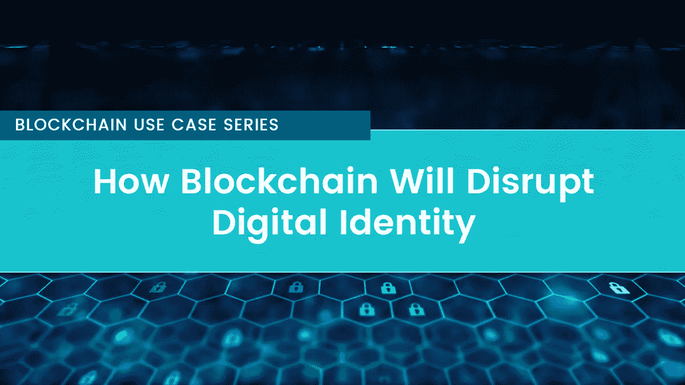

# 区块链将如何颠覆数字身份

> 原文：<https://medium.com/coinmonks/how-blockchain-will-disrupt-digital-identity-7857e69ebcf5?source=collection_archive---------2----------------------->

## 区块链用例系列(5 部分系列—第 4 部分)

数字身份是服务交付的重要组成部分。然而，在数字时代，依靠物理身份证件和传统方法不仅麻烦和乏味，而且费用昂贵。

此外，随着我们在网上花费越来越多的时间，欺诈者和黑客逐渐发现了访问敏感个人信息的新方法，并以合法用户及其在线服务提供商为代价利用这些信息谋取私利。

Image: [pixabay.com](https://pixabay.com/en/ipad-tablet-technology-touch-820272/)

这些挑战需要新的身份验证方法。让我们深入探讨区块链将如何颠覆这个行业:

## 1.自我主权本我

首先，大多数网站在你访问他们的服务之前都有登录和注册的选项。登录选项是为那些已经有一个帐户，注册选项是为那些想注册一个新帐户。注册选项使您能够创建一个唯一的身份(密码)，您可以使用它来浏览网站。

然而，事实是即使你拥有你的密码，你并不拥有你的身份。你的身份掌握在一个中心点的手中，这个中心点在任何时候都容易受到攻击。你可以在任何一天醒来，发现你的身份消失了！

区块链有一个吸引人的身份特征。它提供了一条只有你自己能掌控自己身份的途径。您可以随时更新它；您可以选择将其公开或保密。

您的身份随时可供您使用，未经您的同意，任何人都无法访问。最棒的是，当涉及到你的身份时，不会有第三方介入。这里有一个很好的例子。

[VALID](http://bit.ly/2L93ywj) 是一个旨在为用户提供自主数字身份的平台。它使您能够拥有和控制您的数据。您还拥有一个安全透明的市场，为您和数据消费者牵线搭桥。您的信息只能在手机的有效钱包中找到。由于没有单点故障，您可以确保数据的绝对安全。

## 2.减少身份盗窃

第三，身份盗窃是一种丑陋的经历。它会在几分钟内让你从一百降到零。然后你必须继续重置一切。打电话给你的信用卡公司，更换你所有的信用卡。对你一无所知的指控进行争辩。这不仅不公平，而且非常令人沮丧。

区块链驱动的解决方案是分散的，没有单点故障，这意味着黑客无法侵入系统并访问您的信息。Civic 是基于区块链的解决方案的一个很好的例子，旨在减少欺诈，保护用户免遭身份盗窃。

作为一名用户， [Civic](http://bit.ly/2m5XIRo) 将为你提供一个平台，在这里你所有的信息都是安全的。首先，它会验证你的信息的合法性。经过验证后，Civic 会捕获您信息的加密哈希，并传输到公共区块链，同时从他们的服务器上删除。因此，你的个人数据受到保护，以防任何恶意入侵他们的服务器——因为它从未存储在平台上，而是存储在你的设备上。

## 3.KYC 和数字身份

KYC 涉及银行验证和确认你的主要文件的过程，作为一种尽职调查的行为。这种方法的问题在于，对每家金融机构而言，尽职调查流程总是要从头开始。这个过程不仅耗时，而且麻烦。

区块链使金融机构能够访问客户的信息，而不必总是一次又一次地启动尽职调查的过程。

它还允许为客户创建数字身份。有了数字身份，金融机构将能够作为客户监控您的交易，访问您的相关信息，并减少误报。此外，发现欺诈交易的金融机构将能够通知全球其他金融机构，从而防止更多的欺诈活动。

## 4.购房者和数字身份

也许你可能听说过用个人信用评分来增强数字身份，以方便房产的买卖。这里讨论的要素包括:收入、还贷信息、社交媒体数据等等。

一份智能合同将在区块链上面向潜在金融家拍卖，该合同包含关于房产的完整细节以及有意愿的买家的数字身份。

买方可以自由地接受可能的最佳报价，而金融家则因接受风险而获得回报。在这里，只有评估用户信誉所必需的信息才会在要约被接受之前披露。

## 5.政府和数字身份

最后但并非最不重要的一点是，政府也在努力和承诺变得更加数字化，而这一承诺的核心是数字身份。安全的数字身份将大大促进政府服务的提供；不考虑用户的位置——这包括最初需要他们亲自到场的服务。

例如，政府将能够在他们的投票系统中加入数字身份，使诚实的选举变得容易。此外，获得政府办公室服务的过程将变得简单快捷。拥有数字身份可确保所需信息按时提交，服务按时提供。这不仅能为政府省钱，还能为市民提供更好的服务。

## 一锤定音

在一个日益数字化的世界里，数字身份是不可或缺的必需品。区块链为数字身份系统提供了保证信任和安全的技术。因此，它能够存储敏感的个人数据，并为促进资产转移提供了一个至关重要的环节。

然而，由于区块链是一种新技术，仍处于摇篮阶段，即使我们用当代技术取代身份管理的过时应用，也应该会遇到一些挑战。

区块链用例系列(5 部分系列—第 1 部分):[区块链如何革新金融](/coinmonks/how-blockchain-is-revolutionizing-finance-bdddd7770f8c)
区块链用例系列(5 部分系列—第 2 部分):[区块链如何改变赌博行业](/coinmonks/how-blockchain-is-changing-the-gambling-industry-3c59959b7cd1)
区块链用例系列(5 部分系列—第 3 部分):[区块链如何彻底颠覆赌博行业](/coinmonks/how-blockchain-is-completely-disrupting-the-gaming-industry-af226f73ee9e)

*渴望了解更多关于 FundYourselfNow 的信息吗？在我们的* [*电报*](https://t.me/fundyourselfnow) *群上加入我们的众筹革命对话，或者在* [*推特上关注我们。*](https://twitter.com/fundyourselfnow)