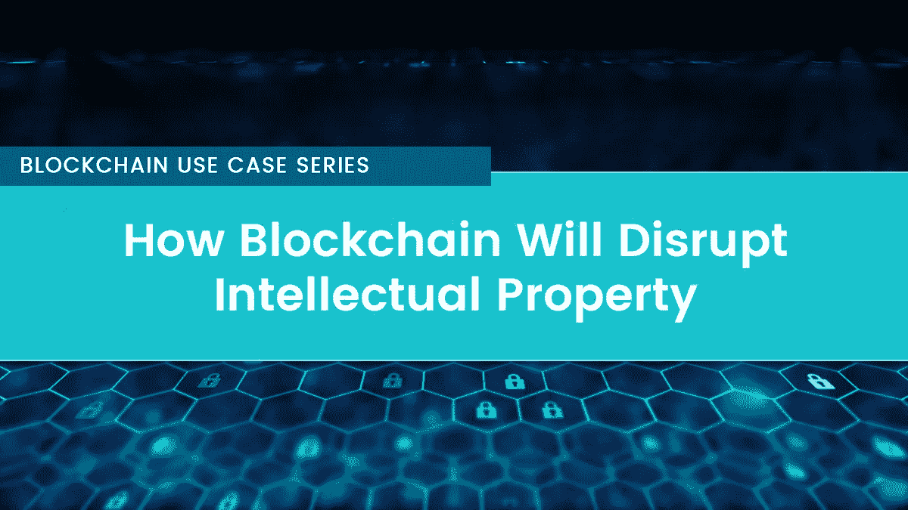

# 区块链将如何颠覆知识产权

> 原文：<https://medium.com/coinmonks/how-blockchain-will-disrupt-intellectual-property-dfde59588ba7?source=collection_archive---------8----------------------->

## 区块链用例系列(5 部分系列—第 5 部分)

区块链技术及其相关应用在过去几年中取得了巨大的增长。它已经从被忽视的水平发展成为创新领域的流行语:每天都有区块链使用的新案例出现。

作为创造者或消费者，法律是这些创新与你之间的门户。例如，如果一个创新者想从他/她的创新中获利，他/她将需要法律的帮助，特别是知识产权法。

Image: [rawpixel.com](https://www.pexels.com/@rawpixel)

所以，还有一个问题。区块链将如何颠覆知识产权(IP)行业？让我们深入研究和探索:

## 1.IP 注册服务

传统监管机构的问题在于，他们验证和批准发明的过程非常缓慢。人工审查阻碍了对市场创新的快速获取。此外，由于不同国家的法律不同，一项发明在一个国家可能需要几天才能验证，但在另一个国家可能需要几个月才能验证。

区块链的分布式账本将通过实现数据的去中心化存储，降低验证和审批时间率来解决这一问题；从而打开市场，快速获得创新。此外，消除对第三方的依赖将确保信息的完全安全，从而使记录更加可信。

## 2.遏制假冒

可悲的是，假冒企业从其他人的发明中获利颇丰。这让那些花了几个月甚至几年时间才想出如此好主意的人感到沮丧。尽管已经制定了打击这一威胁的法律，但进展甚微。但是创新者是否已经失去了所有的希望？

区块链技术承诺持有知识产权，这将允许出处认证。区块链的分布式账本将能够记录产品制造的地点、时间、制造过程和原材料来源的详细信息。旨在打击假货的项目的一个例子是 VeChain Thor。

作为用户，VeChain Thor 为您提供了一个平台，可以通过给每件产品贴上 RFID 标签来验证所有产品的真伪。它的分散性质使得它不可能访问信息和改变产品的标签。它还提供了一个渠道，供应链上的每个人都可以跟踪和验证产品，以确保它是真实的。

另一个旨在解决假货威胁的平台是[沃尔顿链](http://bit.ly/2L6m5JH)。通过使用扫描并存储在区块链平台上的 RFID 标签，Waltoinchain 将帮助监控和跟踪市场上所有带有 RFID 标签的商品。标签将区分假冒产品和真正的产品。

## 3.创造者身份的证据

传统模式的另一个问题是无法注册的知识产权。你看，如果它不能注册，在没有证据的情况下，在法庭上证明其侵权变得很困难。作为一名艺术家，当你在工作中付出努力和时间，却发现人们可以自由地使用它时，这是令人沮丧的。互联网使得下载任何艺术作品，从书籍到音乐，变得如此容易，但代价是创作者。

区块链将提供一个解决方案，能够将你的艺术品信息存储在其分布式账本中。通过创建作品上传时间和创作者详细信息的时间戳记录，区块链将拥有创作者的所有权证明。这项技术不仅能帮助艺术家从他们的作品中获益，还能降低市场上的盗版率。KODAKOne 就是致力于解决这种情况的平台的一个例子。

KODAKOne 是柯达公司旗下的一个位于区块链的平台。这是一个平台，将为摄影师提供一个途径，他们将能够许可和注册他们的作品。摄影师不仅会享受它为他们的工作提供的安全，还会享受它通过 KODAKCoin 提供的快速交易率。

## 4.智能合同

对于许多艺术家来说，中间人总是从他们的作品中拿走大部分份额，这是一种痛苦。仅仅作为外包平台，中介相信他们做了大部分工作，所以他们应该得到更多。因此，艺术家继续从他们的工作中赚取微薄的收入。

区块链平台上提供的智能合约消除了对中介的需求。作为一名艺术家，智能合同将为你提供一条直接与客户口述作品条款的途径。作为一名艺术家，你将能够通过智能合同管理你的销售。

一个很好的例子是 Agrello——一家位于爱沙尼亚的公司，正在为[的具有法律约束力的智能合同](http://bit.ly/2KVdQDk)创建一个应用程序。智能合同将在人工智能的帮助下产生，并在公共区块链中显示。

## 5.专注于知识产权的区块链项目

目前，世界各地有各种各样的商标注册机构。每个注册机构都有自己的注册簿，每次商标需要批准时，都必须查阅注册簿进行核实。这不仅费时，而且非常昂贵。

区块链将提供一种途径，通过其分布式账本连接世界各地的登记册。关于知识产权的信息将被记录在区块链数据库中，其中可能包括注册、出版、所有权和首次使用的日期。区块链将使这些信息在世界任何地方都可以随时获得，因此，降低了验证和批准率以及产生的成本。

致力于解决这一问题的公司的一个例子是 [IPChain](http://bit.ly/2KZBcYn) -一种基于区块链的技术，旨在提供知识产权保护。该公司提供了一种新的方式来保护你的作品的证据，它的易访问性确保你可以从世界任何地方证明侵权。

## 一锤定音

很明显，创意世界将从区块链技术中受益匪浅。区块链提供了一条减少所有权争议的途径。公共区块链账本上发布的信息将使证明作者身份成为一件快速而简单的事情。艺术家将从他们的作品中获取最大利益。最后但同样重要的是，区块链通过其分布式分类账为数据提供顶级的安全性，消除了单点漏洞的存在。

你对利用区块链执行知识产权有什么看法？你会考虑把它作为内容创作者的终身解决方案吗？

区块链用例系列(5 部分系列—第 1 部分):[区块链如何革新金融](/coinmonks/how-blockchain-is-revolutionizing-finance-bdddd7770f8c)
区块链用例系列(5 部分系列—第 2 部分):[区块链如何改变博彩行业](/coinmonks/how-blockchain-is-changing-the-gambling-industry-3c59959b7cd1)
区块链用例系列(5 部分系列—第 3 部分):[区块链如何彻底颠覆博彩行业](/coinmonks/how-blockchain-is-completely-disrupting-the-gaming-industry-af226f73ee9e)
区块链用例系列(5 部分系列—第 4 部分):[区块链将如何颠覆数字身份](/coinmonks/how-blockchain-will-disrupt-digital-identity-7857e69ebcf5)

*渴望了解更多关于 FundYourselfNow 的信息吗？在我们的* [*电报*](https://t.me/fundyourselfnow) *群上加入我们的众筹革命对话，或者在* [*推特上关注我们。*](https://twitter.com/fundyourselfnow)