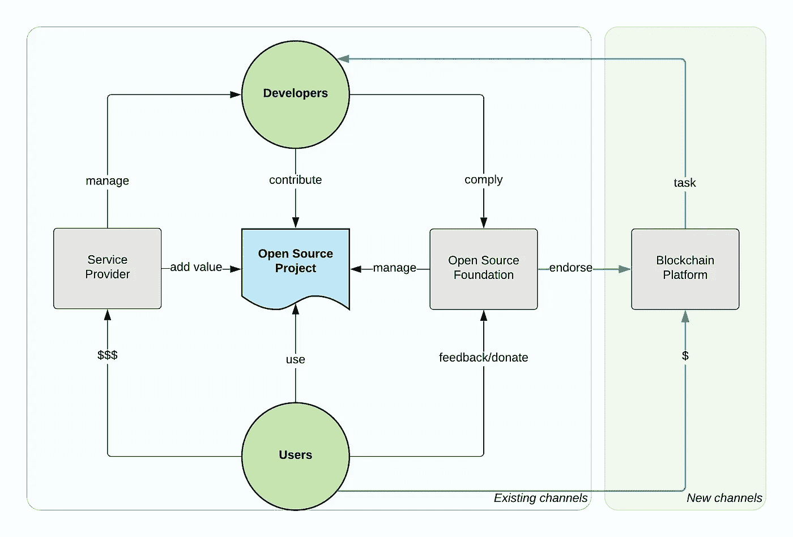

# 区块链将如何影响开源

> 原文：<https://medium.com/coinmonks/how-blockchain-will-influence-open-source-9153e438f04?source=collection_archive---------6----------------------->

## 由区块链技术支持的用户和开发者之间的交互可以创建自我维持的、分散的开源软件。

Image by :[The Met](https://www.metmuseum.org/art/collection/search/15391). Modified by Opensource.com. [CC BY-SA 4.0](https://creativecommons.org/licenses/by-sa/4.0/)

十年前，中本聪以比特币起家，如今已经有了很多追随者，并演变成了一场去中心化运动。对一些人来说，区块链技术是一种宗教，将会像互联网一样对人类产生影响。对于其他人来说，这是另一种炒作，是一种只适合庞氏骗局的技术。虽然区块链仍在发展，并试图找到自己的位置，但有一点是肯定的:这是一项颠覆性的技术，将从根本上改变某些行业。我敢打赌，开源将是其中之一。

# 开源模式

开源是一种协作软件开发和分发模式，它允许有共同兴趣的人聚集在一起，生产出任何个人都无法独自创造的东西。它允许创造大于其各部分总和的价值。它由分布式协作工具(IRC、电子邮件、git、wiki、问题跟踪器等)实现，由开源许可模型分发和保护，并通常由软件基金会(如 Apache 软件基金会(ASF)、云本地计算基金会(CNCF)等)管理。).

开源模式的一个有趣的方面是其核心缺乏财务激励。有些人认为开源工作应该保持与金钱无关，并保持一种自由和自愿的活动，只受内在激励因素的驱动(例如“共同的目的”和“为了更大的利益”)。还有一些人认为开源工作应该通过外在激励因素(比如财务激励)直接或间接得到回报。虽然开源项目只通过自愿贡献繁荣的想法是非常浪漫的，但实际上大多数开源贡献都是通过付费开发完成的。是的，我们有很多自愿捐款，但这是来自来来去去的捐助者的临时捐款，或者是在特别受欢迎的项目处于高峰期时提供的捐款。创建和维护对企业有用的开源项目，需要长时间的开发、文档化、测试和错误修复，即使软件不再光彩夺目。这是一项枯燥的活动，最好通过经济激励来激励。

# 商业开源

像 ASF 这样的软件基金会接受捐赠和其他收入来源，如赞助、会议费等。但这些资金主要用于运行基金会，以确保项目有法律保护，确保有足够的服务器来运行构建、问题跟踪器、邮件列表等。

以类似的方式，CNCF 有会员费(以及类似的其他收入流)用于运行基金会和为项目提供资源。如今，大多数软件不是在笔记本电脑上构建的，而是在云上的数百台机器上运行和测试，这需要资金。创建营销活动、品牌设计、分发贴纸等。所有这些都需要钱，一些基金会也可以提供帮助。其核心是，基金会实现了与用户、开发人员和控制机制进行交互的正确过程，以便为了公共利益将可用的财政资源分配给开源项目。

如果开源项目的用户可以捐钱，而且基金会可以公平分配，那么还缺少什么呢？

所缺少的是一个直接的、透明的、可信的、分散的、自动化的双向链接，用于开源生产者和开源消费者之间的价值转移。目前，链接是:

*   **单向**:一个开发者(顺便说一句，我说的是一个开发者，但是把它想象成任何一个参与软件的生产、维护和发布的角色)可以使用他们的大脑汁，投入时间做贡献，并与所有开源用户分享价值。但是没有反向链接。
*   或者**间接**:如果有影响特定用户/公司的 bug，选项有:

*让内部开发人员修复 bug 并提出请求。这是很理想的，但是并不总是有可能雇佣到对日常使用的数百个开源项目了如指掌的内部开发人员。

*雇佣一名专注于特定开源项目的自由职业者，并支付服务费。理想情况下，自由职业者也是开源项目的提交者，可以直接快速地修改项目代码。否则，该修复可能永远不会出现在项目中。

*或者联系提供开源项目服务的公司。这些公司通常雇佣开源提交者来影响和赢得社区的信任，并提供产品、专业知识和专业服务等。

最后一个是成功的[模式](/open-consensus/3-oss-business-model-progressions-dafd5837f2d)，用于支持许多开源项目。无论是通过服务(培训、咨询、研讨会)、支持、打包、开放核心、SaaS，都有公司雇佣数百名员工全职从事开源工作。这些年来，有很多公司成功地建立了一个成功的开源商业模式，而且这个名单还在稳步增长。

支持开源项目的公司在生态系统中扮演着非常重要的角色。他们是开源项目和用户之间的催化剂。增加真正价值的不仅仅是漂亮地包装软件，而是做得更多。他们可以识别用户需求、技术趋势，并创建完整的开源项目堆栈甚至生态系统来满足这些需求。他们可以接受一个无聊的项目，并支持它多年。如果堆栈中缺少一块，他们可以从头开始一个开源项目，并围绕它建立一个社区。他们可以收购一家闭源软件公司，然后将项目开源。这里我有点忘乎所以，但是，是的，我在谈论我的雇主 [Red Hat](http://jobs.redhat.com/) 和我们做的其他事情。

总而言之，在商业开源模式下，项目由极少数个人或公司正式或非正式地管理和控制，他们将项目货币化，并通过确保项目成功来回馈生态系统。对于开源开发者、管理公司和最终用户来说，这是一个三赢的局面。另一种选择是不活跃的项目和昂贵的闭源软件。

# 自我维持的开放源码

为了使一个项目成为一个有声望的基金会的一部分，它必须符合某些标准。例如，在 ASF 和 CNCF 分别有孵化和毕业过程，除了所有的技术和正式的需求，一个项目必须有足够数量的活跃的提交者和用户。这是形成一个可持续的开源项目的本质。在 Github 上拥有源代码并不等同于拥有一个活跃的开源项目。后者需要编写代码的提交者和使用代码的用户，这两个群体通过交换价值和形成一个所有人都受益的生态系统来不断加强彼此。一些项目生态系统可能很小并且寿命很短，一些可能由多个项目和竞争的服务提供商组成，具有持续多年的非常复杂的交互。但是，只要存在价值交换，并且每个人都从中受益，项目就会得到发展、维护和持续。

如果你在 ASF [阁楼](https://attic.apache.org/)打劫，你会发现已经到达生命尽头的项目。通常，当一个项目在技术上不再适合其目的时，这就是该项目的自然结束。同样，在 ASF [孵化器](http://incubator.apache.org/)里，你可以找到数十个从未毕业却退休的项目。通常，这些项目不能构建足够大的社区，因为它们非常专业或者有更好的替代方案。

但是也有这样的情况，具有高潜力和卓越技术的项目不能自我维持，因为它们不能形成或维持一个用于价值交换的功能生态系统。开源模型和基础并没有提供一个框架和机制来帮助开发者从他们的工作中获得报酬，或者让用户听到他们的请求。双方都没有一个共同的价值承诺框架。因此，一些项目只能在商业开源的环境中生存，在这种环境中，公司充当开发者和用户之间的中介和增值者。这带来了另一个约束，以及服务提供商公司维持一些开源项目的必要性。理想情况下，用户应该能够表达他们对项目的兴趣，开发人员应该能够以透明和可测量的方式展示他们对项目的承诺，并形成一个具有共同兴趣和价值交换意图的社区。

现在，让我们想象有一个模型、机制和工具可以让开源用户和开发者之间直接互动。不仅仅是通过拉请求、邮件列表上的问题、GitHub stars、笔记本电脑上的贴纸来贡献代码，还有其他方式允许用户通过更丰富、自控和透明的方式来影响项目的命运。

这可以包括对以下行动的激励措施:

*   直接资助开源项目(而不是通过软件基金会)
*   通过投票(由代币持有者)影响项目的方向
*   用户需求驱动的功能请求
*   准时拉式请求合并
*   捕虫奖金
*   更好的测试覆盖激励
*   最新的文档奖励
*   长期支持保证
*   及时的安全修复
*   专家援助、支持和服务
*   项目的宣传和推广预算
*   常规无聊活动的预算
*   快速电子邮件和聊天帮助
*   全面了解整个项目的调查结果等。

如果你还没有猜到，我正在谈论使用区块链和智能合同，这将允许用户和开发者之间的这种互动。智能合同将赋予代币持有者影响项目的权力。

*The usage of blockchain in the open source ecosystem.*

开源生态系统中的现有渠道为用户提供了通过对服务提供商的财务承诺或通过基金会的其他有限手段来影响项目的方法。但是，将基于区块链的技术加入开源生态系统可以为用户和开发者之间的互动开辟新的渠道。我不是说这将取代商业开源模型。大多数使用开源软件的公司做得更多，并且不能被智能合同取代。但是智能合同可以为启动新的开源项目提供一种新的方式。这是一种新的方式，可以给那些难以维持的商品项目带来第二次生命。一种激励开发人员应用无聊的拉式请求、编写文档、通过测试等的新方法。用户和开源开发者之间的直接价值交换渠道。它可以为开源项目增加新的渠道，即使在公司支持不可行的情况下，也能长期发展和自我维持。自我维持的开源项目的一个新的补充模型。双赢。

# 令牌化开源

已经有许多旨在标记开源的计划。有些只关注开源模型，有些是通用的，但也适用于开源开发。

以下是我迄今为止建立的一个列表:

*   [Gitcoin](https://gitcoin.co/) —成长开源，这个领域最有前途的之一。
*   [Oscoin](http://oscoin.io/) —开源的加密货币
*   [开放集体](https://opencollective.com/opensource) —支持开源项目的平台。
*   [资助自己](https://www.fundyourselfnow.com/page/about) — Kickstarter 和 ICOs 做项目。
*   [Kauri](https://kauri.io/) —支持开源项目文档。
*   [Liberapay](https://liberapay.com/) —经常性捐款平台。
*   [FundRequest](https://fundrequest.io/) —开源协作的分散市场。
*   [灿亚](https://canya.io/)——最近收购了[bounty source](https://www.bountysource.com/)——全球最大的开源 P2P 赏金平台。
*   OpenGift —开源货币化的新模式。
*   Hacken——黑客的白帽子令牌。
*   [兼职者](https://www.coinlancer.io/) —分散的就业市场。
*   [CodeFund](https://codefund.io/) —开源广告平台。
*   [IssueHunt](https://issuehunt.io/) —开源维护者和贡献者的资助平台。
*   [0x 1 hive](https://blog.district0x.io/district-proposal-spotlight-1hive-283957f57967)区——众筹与策展平台。
*   [0x 修复区](https://github.com/district0x/district-proposals/issues/177) — github bug 奖金。

上面的列表是多种多样的，并且增长迅速。这些项目中的一些将会消失，一些将会转向，但是一些将会成为未来的 SourceForge、ASF 和 Github。不一定要取代这些平台，而是用令牌模型来补充它们，创建更丰富的开源生态系统。因此，每个项目都可以选择它的分发模型(许可证)、治理模型(基础)和激励模型(令牌)。在所有情况下，这将为开源世界注入新鲜血液。

# 未来是开放和分散的

*   软件正在吞噬世界。
*   每个公司都是软件公司。
*   开源是创新发生的地方。

鉴于此，很明显，开源太大而不能倒，太重要而不能被少数人控制或听天由命。开源是一个对所有人都有价值的共享资源系统，更重要的是，它必须这样管理。地球上的每家公司都想在开源世界拥有股份和发言权，这只是时间问题。不幸的是，我还没有工具和习惯去做这件事。这样的工具将允许任何人展示他们对软件项目的欣赏或无知。它将在生产者和消费者之间、开发者和用户之间建立一个直接而快速的反馈回路。它将促进创新，由用户需求驱动的创新，并通过令牌指标表达出来。

*本帖原载于*[*Opensource.com*](https://opensource.com/article/18/8/open-source-tokenomics)*下*[*CC BY-SA 4.0*](https://creativecommons.org/licenses/by-sa/4.0/)*。*