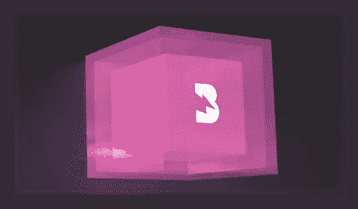
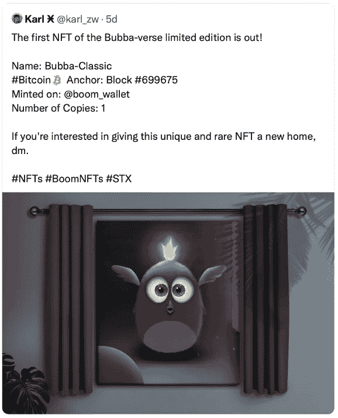
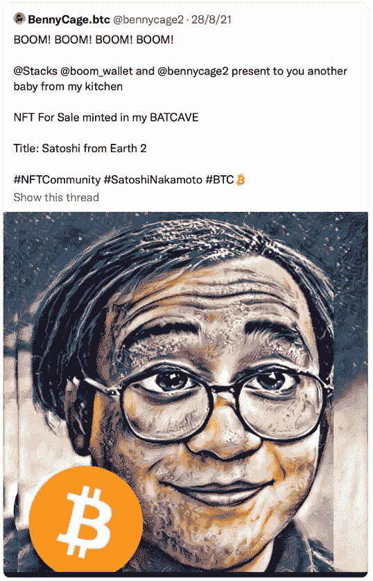

# Boom Wallet 如何改变我们与 NFT 的互动方式

> 原文：<https://medium.com/coinmonks/how-boom-wallet-is-changing-the-way-we-interact-with-nfts-88804e92d9fb?source=collection_archive---------12----------------------->

随着不同的国家、行业和社区出于各种原因采用比特币，比特币正逐渐占据中心舞台。对一些人来说，这是为了对冲通胀，对另一些人来说，这是为了利用比特币的底层技术来建立更具弹性的基础设施和抗审查的应用程序。比特币网络的设计考虑到了安全性和持久性，以充当数字世界(又名元宇宙)。这对计算机科学家、企业家和开发者来说是一个很有吸引力的提议，他们可以利用比特币的特性来创造更大的东西。

我们仍处于区块链技术的初级阶段，更好地利用区块链技术的基础设施仍在建设中，同样，NFT 的新用例也有待发现。

自 2021 年初以来，不可替代代币(NFT)一直是人们谈论的话题，特别是在 Beeple 以 6900 万美元的价格出售了他的 NFT 艺术品之后，人们开始想知道，NFT 在比特币网络上也是安全的吗？NFTs 的历史可以追溯到 2012 年的比特币区块链上([彩色比特币](https://yoniassia.com/coloredbitcoin/?ref=hackernoon.com))。然而，按照设计，比特币的脚本语言从来不是为了其网络中的这些功能，因为在设计比特币时，安全性是最重要的。有了斯塔克斯·区块链和 clarity 编程语言，复杂的应用程序可以通过比特币网络来构建和保护。stacks 区块链上的"[define-non-republible-token](https://docs.blockstack.org/references/language-functions?ref=hackernoon.com#define-non-fungible-token)"函数用于定义一个新的不可替换的令牌类，以便在 clarity smart contract 中使用，而 [SIP-009](https://github.com/stacksgov/sips/blob/friedger-main/sips/sip-009/sip-009-nft-standard.md?ref=hackernoon.com) 旨在提供一个灵活且易于实现的标准，供 Stacks 区块链上的开发人员在创建他们自己的 NFT 时使用。

> 订阅 [**Coinmonks Youtube 频道**](https://www.youtube.com/c/coinmonks/videos) 获取每日加密新闻。

[Boom](https://boom.money/) wallet 通过[栈](https://www.stacks.co/)区块链，为用户与比特币网络上安全的应用程序和 NFT 进行交互提供了一个无缝网关。Stacks 是第 1 层区块链，它位于比特币网络上，使比特币可编程，实现了继承比特币所有功能的去中心化应用和智能合约。

Boom Wallet 的创造者 [RunRiot](https://riot.ai/) 的团队正在推出令人兴奋的 NFT 新用例，并构建了一个独特的平台，允许用户管理他们的堆栈资产。诸如铸造定制 NFT 的能力、获得生成 NFT 的收益以及供创作者和 NFT 爱好者互动的 NFT 市场等功能，所有这些都具有比特币网络的安全性。作为 3 月 21 日 Boom wallet 的早期用户，它已经成为我管理我的堆栈资产、铸造和收集 NFT、接收 meme 令牌( [$MNO](https://twitter.com/wrappednothing?s=21) )和购买 boomboxes 的首选应用程序。我对 Boom Wallet 在未来几个月和几年的发展感到兴奋，因为该团队将继续通过创新的新功能来激发用户的兴趣。以下是我认为有用的 3 个关键特性:

## **关键特性**

**音箱**——可能是 NFTs 领域的第一款。[音箱](https://boom.money/boomboxes)是限量版的收藏品，可以作为从[堆叠](https://www.stacks.co/stacking)堆叠代币产生的收益的自动索赔凭证。这使得机顶盒的所有者能够在收益支付之前将他们的收益型 NFT 转让给其他人，然后机顶盒的新所有者将有权获得支付。这是用例中的一个革命性突破，因为未来这些机制可以应用于几乎所有其他收益率资产，并为市场带来更大的流动性和效率。例如，出租物业地契可以作为有收益的 NFT 或具有基于订阅的收入模式的公司发行，并通过根据客户的订阅合同发行定期现金支付的 NFT 来进一步货币化其未来现金流。

1st edition Boombox

**NFTs 铸造** — Boom wallet 让创作者非常方便地铸造定制的 NFTs，展示他们的作品，并将其出售给感兴趣的收藏家，在区块链书库的低交易费环境中，并在比特币网络上保护您的 NFTs。这为那些希望进入加密领域但缺乏技术诀窍的创作者带来了大量机会，借助 Boom 直观的用户界面，铸造 NFT 就像在社交媒体上分享照片一样简单。与此同时，通过 Boom，NFT 创作者可以接触到新的受众群体，并且不受地理和/或技术限制。以下是创作者如何使用 Boom Wallet 将他们的作品融入 NFT 系列的一些例子:

[@karl_zw](https://twitter.com/karl_zw/status/1437771263343276036?s=21)

[@bennycage2](https://twitter.com/bennycage2/status/1431294151904137234?s=21)

**Marketplaces(即将推出)** —从上面展示的艺术作品和社区内更多的作品中，Boom 使创作者能够通过数字艺术和 NFT 技术以不同的方式展示他们的创造力和才华。随着 Boom Wallet 即将推出 NFT 市场，创作者、收藏家和爱好者可以通过市场进行互动，并通过在市场上购买/出售来表达他们对艺术品的看法/欣赏。这提供了一个充满活力的环境，使创作者能够继续从事他们的工作，并能够在他们的作品投放市场时获得即时反馈。

Boom 在一个独特的市场领域运营，横跨区块链技术、艺术、分散金融和软件开发。boombox 的推出将 stacks 本机收益生成功能包装到 NFT 中，为市场参与者带来了巨大的机遇。除了其 NFT 铸造功能，我很高兴看到还有哪些其他资产类别可以作为非金融资产发行并在其市场上交易。我们可能会看到有租金收益的产权契约在市场上出售，甚至知识产权、版税和许可证也在市场上出售。音乐家们正在接受区块链技术，公司正在区块链上引入微支付，购买并持有产生版税的 NFT，实时向你支付版税的想法不再是一个遥不可及的幻想。以上只是我感兴趣的一些领域，并看到了 Boom 的潜在协同价值，但当你将尖端技术交到有创造力的个人手中时，可能性是无限的。要了解 Boom 正在做什么和他们即将发布的更多信息，请前往他们的[网站](https://boom.money/)和 [discord](https://discord.gg/3YxYk7sBxK) 频道与团队联系！

> 加入 Coinmonks [电报频道](https://t.me/coincodecap)和 [Youtube 频道](https://www.youtube.com/c/coinmonks/videos)了解加密交易和投资

## 另外，阅读

*   [加密货币储蓄账户](/coinmonks/cryptocurrency-savings-accounts-be3bc0feffbf) | [加密交易机器人](https://blog.coincodecap.com/best-crypto-trading-bots)
*   [BigONE 交易所评论](/coinmonks/bigone-exchange-review-64705d85a1d4) | [CEX。IO 审查](https://blog.coincodecap.com/cex-io-review) | [交换区审查](/coinmonks/swapzone-review-crypto-exchange-data-aggregator-e0ad78e55ed7)
*   [最佳比特币保证金交易](/coinmonks/bitcoin-margin-trading-exchange-bcbfcbf7b8e3) | [比特币保证金交易](https://blog.coincodecap.com/bityard-margin-trading)
*   [加密保证金交易交易所](/coinmonks/crypto-margin-trading-exchanges-428b1f7ad108) | [赚取比特币](/coinmonks/earn-bitcoin-6e8bd3c592d9)
*   [WazirX vs CoinDCX vs bit bns](/coinmonks/wazirx-vs-coindcx-vs-bitbns-149f4f19a2f1)|[block fi vs coin loan vs Nexo](/coinmonks/blockfi-vs-coinloan-vs-nexo-cb624635230d)
*   [BlockFi 信用卡](https://blog.coincodecap.com/blockfi-credit-card) | [如何在币安购买比特币](https://blog.coincodecap.com/buy-bitcoin-binance)
*   [火币交易机器人](https://blog.coincodecap.com/huobi-trading-bot) | [如何购买 ADA](https://blog.coincodecap.com/buy-ada-cardano) | [Geco。一次审查](https://blog.coincodecap.com/geco-one-review)
*   [加密副本交易平台](/coinmonks/top-10-crypto-copy-trading-platforms-for-beginners-d0c37c7d698c) | [五大 BlockFi 替代方案](https://blog.coincodecap.com/blockfi-alternatives)
*   [CoinLoan 点评](https://blog.coincodecap.com/coinloan-review)|【Crypto.com】点评 | [火币保证金交易](/coinmonks/huobi-margin-trading-b3b06cdc1519)
*   [Bybit vs 币安](https://blog.coincodecap.com/bybit-binance-moonxbt)|[stealth x 回顾](/coinmonks/stealthex-review-396c67309988) | [Probit 回顾](https://blog.coincodecap.com/probit-review)
*   [顶级付费加密货币和区块链课程](https://blog.coincodecap.com/blockchain-courses)
*   [在美国如何使用 BitMEX？](https://blog.coincodecap.com/use-bitmex-in-usa) | [BitMEX 评论](https://blog.coincodecap.com/bitmex-review)