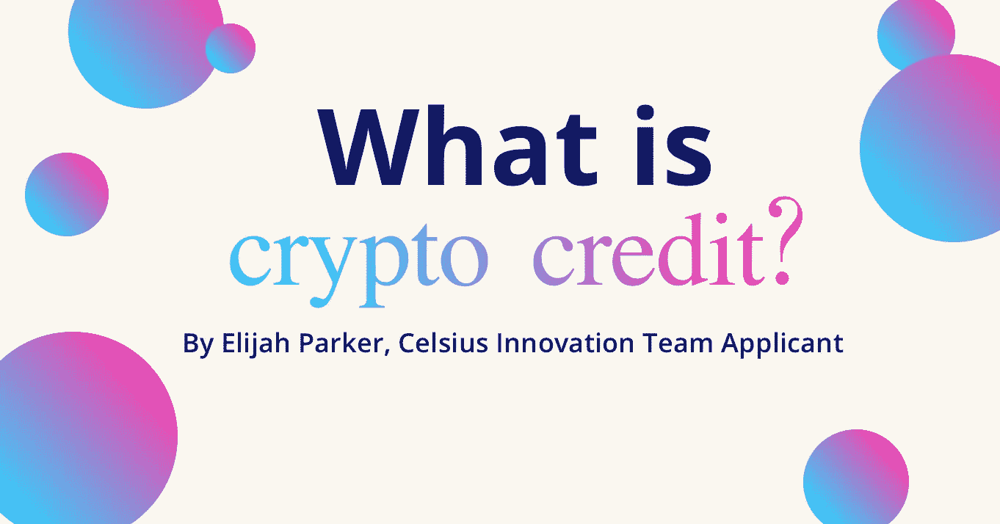
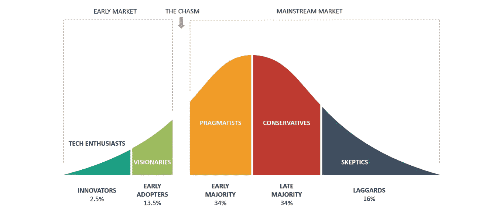
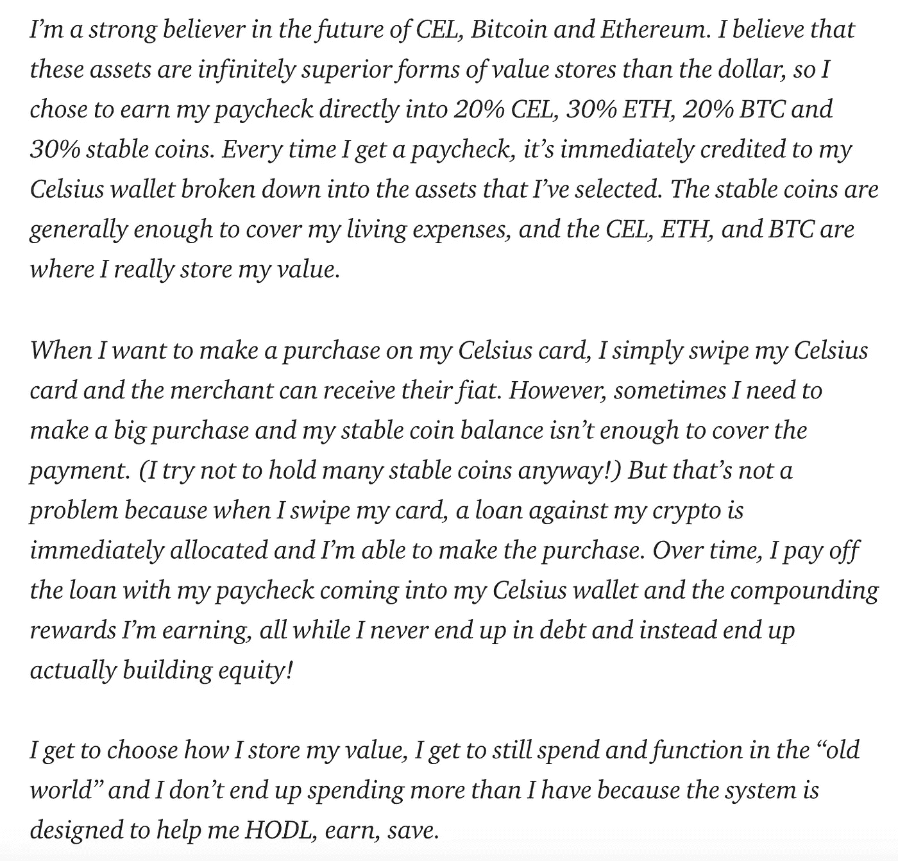
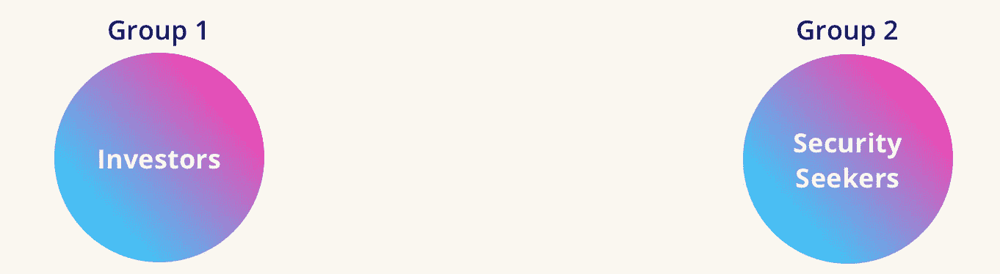
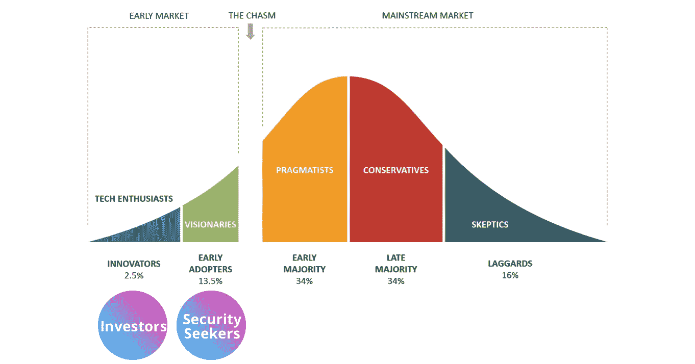
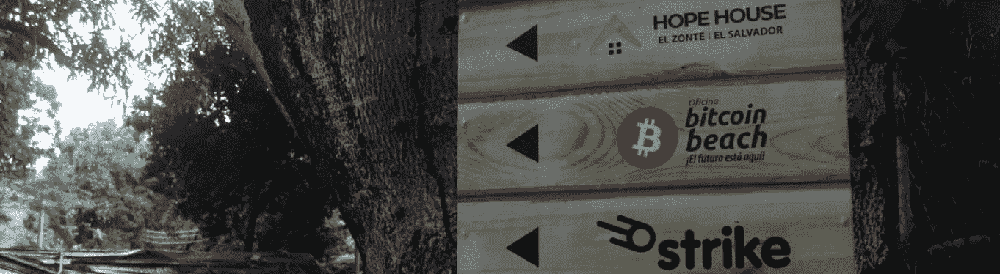
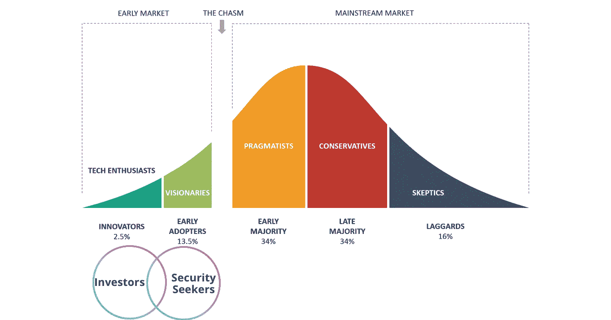
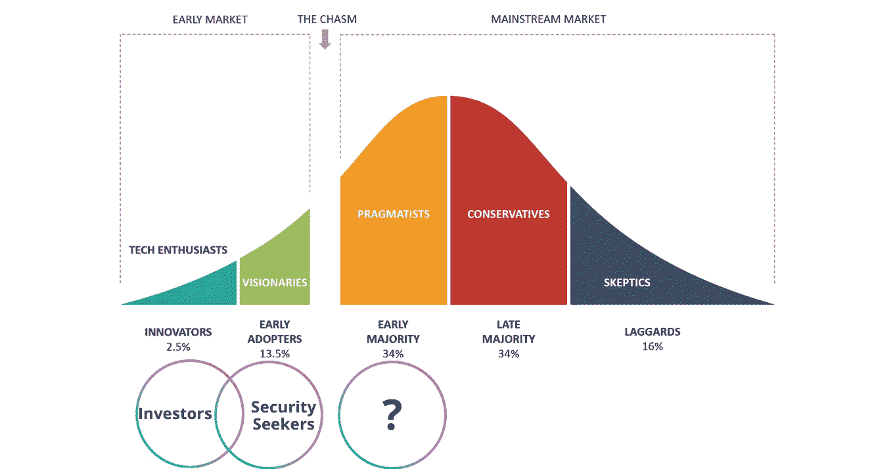

# 采用加密:通过提供用户在日常生活中可以清楚看到的价值来建立信任

> 原文：<https://medium.com/coinmonks/how-can-crypto-change-credit-and-create-it-for-underserved-populations-69474b5f7fd3?source=collection_archive---------6----------------------->

加密货币不仅仅是一种投资。这是每个人如何控制自己财务状况的一场革命。要开始真正理解密码，尤其是比特币，能为世界做些什么，需要花很多时间研究和琢磨。但是大家在使用之前了解银行支付轨是怎么工作的吗？当借记卡被设计成允许我们不携带现金并受到各种安全功能的保护时，在短暂的不信任之后，人们感到更安全，也更容易。人们在不理解它们的情况下采用它们，因为人们信任提供它们的实体。抢劫案减少了。

当数字支付和贝宝一起出现时，人们害怕把他们的财务信息放到网站上。然而，现在我们把所有的信息都给了任何可信的网站，却不知道我们到底受到了怎样的保护；我们只是认为我们是安全的，因为集体信任和很少(或被遗忘)的负面新闻。加密掌握着自由和主权安全的下一步。这一次，我们受到了保护，不仅免受街头小偷和网络骗子的侵害，还免受政府法规和组织决策的影响。我们正在进入大规模采用，随着理解的增加和负面报道的减少(并被遗忘)，信任正在稳步建立。最受信任的家喻户晓的名字，如比特币基地，正因为集体信任而被越来越多地使用。

A look at the stages of technology adoption. With American regulators getting louder, institutions launching bitcoin funds right and left and smaller sovereign nations accepting it into their laws and governments in various ways, I believe we either have just crossed or are [Crossing The Chasm](https://www.amazon.com/Crossing-Chasm-Marketing-High-Tech-Mainstream/dp/0060517123).

# 通过提供价值建立信任

瓦西姆·沙博特是 [Celsius Network](https://celsiusnetwork.app.link/164013856d) 创新团队的成员，他在今年早些时候写了一篇关于传统菲亚特支付轨道和加密系统之间的[互操作性的文章。在这本书里，他描绘了一个未来的版本，在这个版本里，金钱和密码之间有着高度的互操作性。他写了一篇叙述，讲述他将如何利用 Celsius 着手构建的可互操作服务进行财务运营:](https://blog.celsius.network/a-glimpse-from-the-future-of-finance-insights-into-interoperability-4a0a6e436da6)

退一步说，这是一个非常鼓舞人心的金融未来版本。然而，我想加入人道主义的一个方面，这是由于关注点隐含地指向具有特权收入水平的用户而从这个叙述中缺失的。

我想提供一些细节，这些细节对于帮助处于不同财务状况的人加深理解非常重要，这样他们就能在叙述中看到自己的价值。

在过去的十年中，加密社区开发了许多技术创新，并向已经信任加密的客户*交付了许多不同的价值。现在，我们正处于技术采用生命周期的关键点，在这一点上，最重要的是利用人种学的人类学观察策略、面向设计的研究来为加密功能和价值主张的设计提供信息。通过基于同理心而非技术创新来构建产品供应战略，人们将逐渐理解，除了经常被怀疑的数字上升现象的“响度”，crypto 还能在他们的生活中做些什么。目前，尽管可用性和流程还没有达到标准，但 crypto 的整体价值中有很大一部分是作为对未来的赌注而存在的。*

*加密带来了创新的价值形式——金融服务包容性、民主化的经济“所有权”和平等的激励分配给地球上任何地方使用智能手机或计算机的每个人。然而，如果我们关注客户今天使用 crypto 的动机，大致有两类人。*

# ***以追求投资回报为主，**和**以追求安全保障为主。***

*但是， ***每个组的值是绑在臀部*** 的，他们内部的人往往会组成一个 ven 图。每个人都理解对方使用加密的原因。*

**

*“投资者”已经看到了什么是可能的，什么是即将到来的。他们似乎构成了技术采用生命周期中“远见者”的很大一部分。第二组通过价值观找到了信任。他们构成了“远见者”的第二部分，并正在为“实用主义者”的采用造势，这有两个主要原因。*

1.  *由于它提供的价值，他们甚至在 UX 挑战赛中也在使用它。*
2.  *1 为真的事实说明了 crypto 在全球经济中越来越务实的立足点的强大“为什么”,从而促使更多务实的“投资者”和“安全寻求者”进入该空间。*

*真正评估我们在技术采用生命周期中的位置有点令人困惑，因为区块链数据有点难以跟踪，因为用户在多个交易所和钱包中有多个加密地址。但是，为了尝试理解它，以便我们可以确定我们可能处于采用周期的哪个阶段，估计有 14%的美国人(4320-4660 万)拥有 crypto。然而，全球人口中只有 1.4%(1.1 亿用户)的和 3.9%(3.042 亿用户)的[拥有 crypto。由于 crypto 的目标是成为全球经济基础设施，这意味着我们仍处于技术采用生命周期的第一阶段。这意味着主要投资而不交易的美国人肯定属于投资创新者类别，而我们刚刚开始扩展到以那些主要寻求安全和保障的人为代表的有远见的早期采纳者。](https://triple-a.io/crypto-ownership/)*

# *“安全探索者”的密码*

*在易受腐败影响的国家，人们正在使用比特币和其他密码，因为它们不能像其他实物形式的价值一样被没收。*

**

*加密也不是政府心血来潮将法定货币的供应量提高 15-50%以上，这在非洲和中南美洲很常见。另一个例子是在古巴发生的比特币革命，“自 2020 年底以来，古巴人已经失去了 2/3 的购买力”[Alex Gladstein](这不是他们历史上唯一激烈和令人沮丧的货币事件)，因此他们在咖啡馆里与人会面，将古巴比索兑换成比特币，因为古巴人无法接收美元，也无法使用美国的金融应用程序——这是一个很好的例子，说明人们愿意经历困难来获得和使用加密，因为这种困难比他们已经面临的金融困难要好。你可以在人权基金会首席社会官亚历克斯·格拉德斯坦的文章[中了解更多关于古巴比特币革命](https://bitcoinmagazine.com/culture/cubas-bitcoin-revolution)的内容，在这篇文章中，他与一名医务工作者进行了交谈，这名医务工作者说“我知道我可以成为自己的银行”。*

**

*Crypto 在如此多不同的生活环境中为如此多的人服务。沙博特阐述了提供给第一组“投资者”的价值。让我解释一下它对第二组中的人，即“寻求安全感的人”来说是多么有价值。*

*在存在腐败、暴力、盗窃和/或众多制裁的国家，将你的经济价值存放在一个安全的地方通常不是一个好的选择。如果你以物理形式持有它；法定货币、贵金属或珠宝都可能被盗，这在非洲并不罕见。如果你把它存在银行，银行可能会关门，拒绝给你钱，就像刚刚在阿富汗发生的那样。如果你持有法定货币，无论是实物货币还是银行存款，它都可能贬值和膨胀，正如在阿根廷看到的那样，由于货币供应增加，通货膨胀率超过 50%。古巴专制的金融体制过于复杂，甚至无法用一段话来解释。在所有这些情况下，人们寻求密码是因为这些形式的压迫，尽管得到它还不容易。*

*在腐败的国家，人们求助于比特币，因为它在你的手机上受到各种安全措施的保护，从技术上讲，无法受到政府或央行政策变化的影响。然而，把一个人的平面图转换成密码还是有困难的。这就是沙博特的创新再次辉煌的地方。这些国家的人可能不得不在咖啡馆与某人见面，通过西联汇款向另一个国家的某人转账，这样他们就会向他们发送密码，使用比特币 ATM 机，*

**

*建立一个 VPN，以及其他迂回的方式让他们的钱进入加密。方法，其中许多都有足够的空间被抓住，敲竹杠，盗窃等。在这个过程中。对于这些人来说，能够让他们的工资支票立即分配到他们选择的加密分配将意味着几个小时，许多令人头痛的事情，并且不必承担潜在的资金损失。Celsius 只在欧洲和美国运营，但作为一个概念，他们可以通过 Shabout 的创新为发展中国家提供的价值显而易见。*

*像 [Sovryn](https://www.sovryn.app/) 这样的去中心化平台，为任何拥有可以连接到 Sovryn 的浏览器钱包的人服务，是去中心化和无实体的，以比特币作为本地资产提供所有 DeFi 的东西，可以很好地研究像 Shabout 提出的“连续信用发行系统”这样的东西如何在去中心化环境中实现，以便无法访问美国和欧洲金融应用程序的发展中国家的用户仍然可以获得这种革命性的价值。*

# *“安全寻求者”的变化理论*

*对于处于较低经济阶层的人来说，他们的薪水与每月支出的比率可能更像是 90%的支出，而不是 30%的支出，这对于客户来说可能是有利的，让他们的电话上弹出警告，告诉他们他们即将透支，并要求他们接受交易，而不是自动向他们发放贷款。基于用户的风险承受能力，这可能取决于他们对比特币的信任程度，他们可能希望以几种不同的方式处理这笔交易。*

***对于规避风险的人来说**也许与其用你下一份薪水的稳定硬币分配来偿还债务，一些每月 90%的薪水支出的人可能会想降低他们的分配到 crypto，并专注于偿还债务。也许警报可以告诉他们需要多长时间来偿还这笔贷款。如果他们选择保持分配不变，图形可以显示他们持有的 X%的上升空间，以抵消利息，直到他们用每月稳定硬币分配的 X%偿还。*

***对于风险较高的人**(或在看到这样的图形后厌恶风险的人)——他们真正相信比特币，或明白我们正处于牛市之中——可能希望有目的地以他们的抵押品为抵押进行债务操作，购买更多的比特币或密码，并承担更多的债务，因为比特币的升值将远远超过他们的利息。我在下面更详细地描述了这样一个场景。*

*考虑到加密市场向上或向下的动态以及这如何影响人们的财务状况和相关行为，从[纳撒尼尔·惠特莫尔对比特币海滩](https://youtu.be/OXAwtwNJip4)主任迈克·皮特森的采访中可以了解到“变革理论”类型的见解，比特币海滩是一家位于萨尔瓦多的非营利组织，通过[罢工钱包](https://invite.strike.me/YQMGQR)向当地人支付比特币社区工作。*

**

*在这段对话中，比特币海滩工资表上的人思考财务的方式完全改变了。他们通过比特币了解宏观经济，并看到了将资金配置为储蓄和长期持有的动机。经济困难的人不需要被溺爱或控制，他们只需要像比特币和密码这样的强大工具，让他们能够在生活中玩一场“更大的游戏”。比特币海滩可以说是催生了萨尔瓦多将比特币作为法定货币的组织。*

**

*Adding the ven diagram makes this a more realistic overlay of what is actually happening.*

# *加密适用于所有人*

*然后是下一步的采纳者；早期的大多数。概括地说，这些人可能不在安全是一个大问题的经济现实中，没有任何或很多可消耗的收入。他们也可以通过各种方式从 crypto 中受益，并可以从 Shabout 的工资单和连续抵押信贷发行解决方案中受益，但没有经历足够的痛苦，也没有看到足够的收益空间，因此无法采用它们。中下阶层的美国人是一个很好的例子，因为，再概括一下，历史上美国人对美元的强势感到相当安全。*

*沙博特解释了一个学到的投资者真理，“你的价值储存不一定是你的交易媒介”，这是一个非常重要的陈述。这可能是早期大多数人能够很好理解的——这两个想法如何相互关联，它们可以提供的好处以及加密如何成为有益的金融操作的新形式的接入点。Shabout 还列出了如何从加密顺利转换为现金的 3 个问题。“减少债务和促进储蓄”这个重要的考虑因素正是我假设的早期大多数人想要的，但感觉他们不能拥有的。*

**

# *促进储蓄和减少债务:加密金融与法定金融*

*大多数储蓄给我们很少甚至没有利息收益，大多数债务工具都支付很高的利息。能够在一个地方产生收益并以你已经拥有的价值进行借贷是一件大事。因为你是以自己的抵押价值借款，所以与信用卡相比，利率非常低。摄氏 1-9 度，信用卡 15-25 度。“但是我的旅行里程呢？”好吧，如果你的抵押资产价值以平均每年 200%的速度升值，就像比特币一样，那么从长远来看，每花 1 美元，收益就超过 1.5 英里。飞往墨西哥大约需要 40，000 英里(400 美元)。以每消费 1 美元产生 1.5 英里的速度计算，这意味着信用卡消费 26，667 美元才能产生价值 400 美元的旅行里程。他们给我们签约奖金，然后榨取我们的利润。*

**

*"[根据 Experian 的数据，2019 年第二季度美国平均信用卡余额达到 6194 美元](https://www.fool.com/the-ascent/research/credit-card-debt-statistics/)。"由于美国[的平均工资约为 26 美元/小时](https://www.ssa.gov/oact/cola/AWI.html)，这相当于税前 4160 美元/月。你可以看到美国人负债累累，而且利率很高。*

*按照非常保守的 15%的信用利率，信用债务为 6，194 美元的客户每月支付 77.43 美元(每年 929.16 美元)。如果利率达到 25%,你每月要支付 129.04 美元(每年 1548.48 美元)。如果你在 Celsius 平台上以 8.95%的最高利率借入 6194 美元的自有比特币价值(这意味着你借入了总价值的 50%)，你每月将支付 46.20 美元的利息。大大低于信用卡利息，你可以保持你的资产迅速升值。当你每月支付 46.20 美元，一年就是 554.36 美元时，根据每年 200%的平均增值，你在比特币中储存的 12，388 美元将在一年内变成 37，164 美元。554.40 美元的利息听起来有那么糟糕吗？你刚刚在你的比特币上赚了 24，776 美元，而不是花 26，667 美元获得 400 美元的奖励里程，并在此过程中支付比这多得多的利息。*

# *变化理论与密码重组*

*我假设，借你没有的钱，利息只是无形地增加到你的债务余额中，比你用你真正关心的投资如你珍贵的比特币借款更容易失去踪迹。我认为人们会对自己发行的信用卡更加负责。测试这一假设的用户研究策略可能看起来像是对以两种方式借款的人进行情境调查，并观察每种情况如何发展。或者手动创建一个原型环境，其中您尚未构建所有的基础架构，但您为 10 个客户提供了测试这一新模型、完成所有利息请求和付款提醒等的机会。并与信用卡指标进行比较，看看它的表现如何。我认为在这一特定领域的研究和测试将会产生一种洞察力，表明人们保护他们的投资胜过保护他们的债务。*

*我喜欢 Shabout 讨论的自动借款的元素，因为目前 Celsius 只提供批量贷款，而不是在持续基础上促进的信贷式贷款。这对我们普通大众来说是一场 100%的革命。直到现在，只有精英才能像这样做金融杂技。这最终会改变我们的思维模式，目前类似于“我用信用卡支付大部分额外费用，然后我用大部分薪水尽可能多地偿还我的信用债务。我不擅长跟踪我在多张卡上的支出，所以有时我会超支，我的未清余额会越积越多。不过没关系，我最终还是会还的。”现在将会是，“我尽可能多地将钱存入密码(储蓄)，然后如果需要的话，它根据我的密码发行信用，并且我使用我的薪水支票的一大部分来偿还我的密码支票的信用。我确保我没有发放太多的信用卡。我确保我能偿还它，所以我不会丢失我的密码。我 100%确定我没有立刻抵押我所有的密码，因为如果需要的话，我可以在它升值后卖掉一些来偿还我的债务。”这是相同的等式，除了，如果你保护你的投资，从而成为一个负责任的借款人，你有潜力在这个过程中积累财富。如果你能设法不为你的密码负债，那就更好了，摄氏温度会给你利息。*

# *摄氏 UX 战略外卖*

*为了真正为这种信贷方式的抵押贷款业务的客户创造最佳体验，偿还协议的细节至关重要。如果客户错过一次付款，密码就被拿走，这感觉就像一家贪婪的银行。为了建立与加密理念一致的真正信任，政策必须优先考虑客户保管他们的加密。例如，如果你错过了付款，他们会给你一个警告，那就是一击。你有两次机会，除了利息，没有任何惩罚。如果你在借回 0 美元之前被三振出局，你的利率会略微上升，可能是 0.5%。*

*获得信贷和债务为创业和长期投资提供了全新的可能性。许多国家，例如第二组中的加密用户，很少或根本没有机会获得信贷或债务。*

**

*虽然 Celsius 目前只服务于欧洲和美国，但它们至少是一个可能的光辉榜样。*

*当然，还有一个大问题，“加密市场的波动性如何？”这阻碍了市场的采用。这是真的，有很多复杂性需要考虑。说“比特币每年升值 200%并不完全准确，因为这是一个平均值。有 2-3 年低估的熊市，接着是 1-2 年高估的牛市。但每次我们进入熊市时，它都不会像前一个周期的底部那么低，总体趋势是上升的。沙博特在他的创新中隐藏了另一个微妙的天才之处——**人们将他们的密码条目与他们的工资单联系起来，会以一种很好的方式将它们投入市场。通过采用 DCA 策略，统计数据肯定对您有利。***

*我认为，所有交易所在注册时都应该对这些基本概念进行入门介绍。当有人扩展到使用越来越多的加密服务时，可以提供进一步的解释。我正在描绘一个在我们看到的大约 4 年周期内影响市场的基本要素的快速综合，以及比特币减半时间表的布局，该时间表可能有 2-3 分钟长。每一个允许你购买、出售或持有 crypto 的公司或应用程序都应该有一个简单的版本，这样即使是新手也可以在任何给定的时间有一些参考点。*

*总的来说，Celsius 在为客户提供易用性、公平的上行分配、健康的教育途径以及继续从根本上创新用户体验以改善客户生活方面做得最好。很想知道他们接下来会去哪里。*

# **关于伊利亚·帕克**

**Elijah Parker 是一名产品策略师、经理和设计师，从事 B2B、B2C 和 B2B2C 数字、物理产品和空间、制造和公司流程以及社交项目。他的企业家精神和同时在头脑中容纳大量相互竞争的信息的能力，以及基于用户同理心做出考虑所有利益相关者的决策的能力，使他成为产品团队中优秀的催化剂、战略家和实施者。他的作品具有广度，因为他在设计思维、策略和人类学观察方面的深度适用于广泛的背景。他现在已经找到了一个他希望继续深入发展的环境，帮助分散金融结构，并为此积极寻找工作机会。他的作品集和简历可以在* [*这里*](https://drive.google.com/drive/folders/1XmXf6ZnrAhar2dLr_igOAfHE_oclo2_1?usp=sharing) *找到。**

> *加入 Coinmonks [电报频道](https://t.me/coincodecap)和 [Youtube 频道](https://www.youtube.com/channel/UCbyDhTbOiKh2iUMKBi4-4Zg)了解加密交易和投资*

## *也阅读*

* [## 最佳加密交易所| 2021 年十大加密货币交易所

### ICON _ PLACEHOLDEREstimated 预计阅读时间:28 分钟加密货币交易所的加密交易需要知识…

blog.coincodecap.com](https://blog.coincodecap.com/crypto-exchange)  [## 2021 年 9 大最佳加密贷款平台| CoinCodeCap

### 当谈到加密货币贷款时，大量因素等同于良好的收入状况。此外，借款的一部分…

blog.coincodecap.com](https://blog.coincodecap.com/crypto-lending)  [## 2021 年最佳加密交易机器人(免费和付费)

### 2021 年币安、比特币基地、库币和其他密码交易所的最佳密码交易机器人。四进制，位间隙…

medium.com](/coinmonks/crypto-trading-bot-c2ffce8acb2a)  [## 最佳 4 个加密交易信号电报通道

### 这是乏味的找到正确的加密交易信号提供商。因此，在本文中，我们将讨论最好的…

medium.com](/coinmonks/best-crypto-signals-telegram-5785cdbc4b2b)  [## BlockFi 评论 2021:利弊和利率| CoinCodeCap

### 今天，我们提出了一个全面的 BlockFi 评论，这是一个成立于 2017 年的加密贷款平台，拥有其…

blog.coincodecap.com](https://blog.coincodecap.com/blockfi-review)  [## 如何在印度购买比特币？2021 年购买比特币的 7 款最佳应用[手机版]

### 如何使用移动应用程序购买比特币印度

medium.com](/coinmonks/buy-bitcoin-in-india-feb50ddfef94)  [## 加密税务软件——五大最佳比特币税务计算器[2021]

### 不管你是刚接触加密还是已经在这个领域呆了一段时间，你都需要交税。

medium.com](/coinmonks/best-crypto-tax-tool-for-my-money-72d4b430816b)  [## 存储比特币的最佳加密硬件钱包[2021] | CoinCodeCap

### 保管您的数字资产很容易，但找到正确的存储方式却是一项繁琐的任务。在线钱包有一个风险…

blog.coincodecap.com](https://blog.coincodecap.com/best-hardware-wallet-bitcoin)*