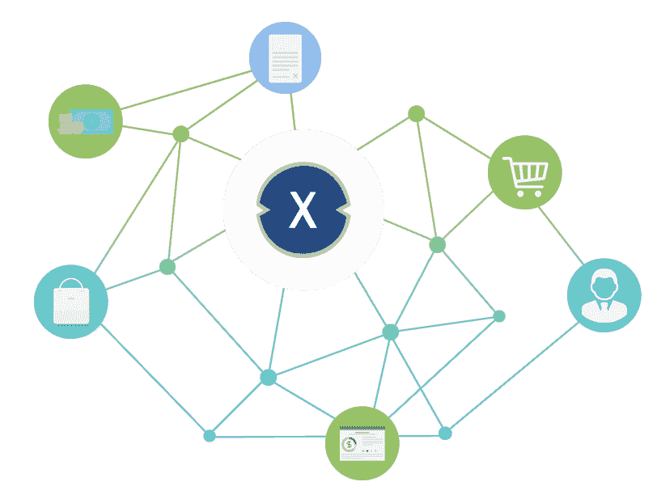
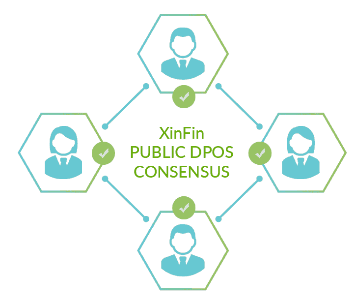

# 开发者如何在为开源项目 XDC 做贡献的同时在 Gitcoin 上赚钱

> 原文：<https://medium.com/coinmonks/how-can-developers-earn-on-gitcoin-while-contributing-to-xdc-an-open-source-project-991b09aeaaca?source=collection_archive---------5----------------------->

## 区块链生态系统的到来为开源开发者带来了新的赚钱机会。他们可以在 Gitcoin 上搜索活动奖金。

XinFin XDC Network

热情慷慨的开发人员熬夜免费开发软件的日子已经一去不复返了。今天，任何致力于开源软件(OSS)开发的人都希望通过多种方式将他们的工作货币化——对额外服务的付费支持、双重许可、付费认证等等。

基于区块链的生态系统和加密货币的出现为开放源码软件开发者增加了新的赚钱机会。Gitcoin 是一个平台，开发者可以通过使用 Python、Rust、Ruby、JavaScript、Solidity、HTML、CSS 等技术开发 OSS 来获得报酬。Gitcoin 成立于 2017 年，是一个引入开源软件工作支付的平台。

一个可以帮助开发商获得奖金的著名的区块链项目是新金融 XDC 网络。Gitcoin 通过将 XDC 混合区块链集成到平台来支持开源的 XinFin XDC 网络。开发者在 XDC 获得报酬，这是新芬 XDC 区块链的本地加密货币。该网络几乎没有可在 Gitcoin 中搜索的活跃奖金。

凭借丰富的文档和 GitHub 资源，XinFin XDC 网络已经朝着创建一个对开发者友好的区块链迈出了一大步。

既然你已经意识到 XDC 区块链为开发者提供的货币化选择，深入了解是什么让 XDC 成为开发者投入时间的完美前景将是一个好主意。

## **是什么让 XDC 脱颖而出**

XinFin XDC 表示无限交换，是一个混合的 EVM 兼容区块链平台，连接全球的社区和企业。XDC 是首款区块链网络，它将公共区块链的强大和透明性与专用网络的安全性和速度融为一体。

新丰 XDC 是一个许可的区块链，政府和私人组织可以使用它来更新他们的技术堆栈和提高工作流程的效率。作为第三代区块链，XDC 成功地解决了困扰早期区块链系统的挑战，如低吞吐量、开发人员体验差和高费用。

这种超高效的协议使个人或企业能够参与全球贸易市场，结算在不到 2 秒钟内完成，交易费用几乎为零。

## **XDC 网络使用案例**

该协议促进了多种类型的真实世界的合同和交易。一方面，该协议可以作为国内或跨境批准支付的消息传递和确认层，另一方面，它也可以作为由批准的金融机构支持的支付和结算层，这些金融机构拥有安全和经审计的智能合同以及[物联网集成](https://www.gartner.com/en/information-technology/glossary/iot-integration#:~:text=IoT%20integration%20means%20making%20the,to%2Dend%20IoT%20business%20solutions.)。

央行向金融市场注入流动性，使其渗透到中小微企业，这是一种常态。XDC 将吸收这些流动性，并通过发起人将其分配给草根阶层。发票、信用证和应收账款等金融工具的支付义务预计将很快出现在网络上。

目前，XDC 已被用于汇款和点对点交易平台、数字资产关联身份、区块链驱动的保险、端到端土地登记记录管理等等，凸显了该网络的多功能性。

**混合动力车如何工作**

XDC 网络结合了以太坊和 IBM 法定平台的精选组件，以解决普遍的全球金融系统中的低效率问题。它有一个由所有成员共享的公共状态。此外，网络上的企业也可以托管私有子网。换句话说，企业既有公有状态，也有自己独特的私有状态。公共状态用于在网络上安全透明地共享基本数据，而私有状态则保护敏感数据或财务数据不受外界影响。

XDC 的混合架构使其能够支持能够执行几乎任何任务的公共、私有和联盟链。

## **节能共识机制**

XDC 通过一种被称为“XDC 授权利益相关证明(XDPoS)”的共识机制实现了能源效率和分散决策。由攻击者委托的验证者组成的[分散网络](https://jods.mitpress.mit.edu/pub/7vxemtm3/release/2)安全地完成交易并阻止欺诈活动。XDPoS 在将交易提交给区块链之前使用双重验证过程来重新检查交易，从而有效地解决了“无利害关系”问题，这是一种当利益相关者没有任何损失时，可能会开始签署每一个交易的情况，无论它是意外分叉还是恶意尝试撤销交易。这样的场景对于系统的轻信是致命的。

截至 2021 年 5 月，XDC 有超过 100 个机构和个人运行验证器节点。

## **分权最大化**

与其他几个需要专门软件的区块链平台不同，XDC 只需要消费级硬件就能运行 masternode。这使得任何人都可以更容易地运行一个节点，并优化去中心化。在允许公共主节点持有者参与共识之前，他们需要使用自 KYC 特征完成身份验证。

## **简史和 2021 年路线图**

通过 2018 年 3 月的首次硬币发行(ICO)获得 1500 万美元的资金支持，XDC 是第一个使用股权证明(PoS)共识的智能合约区块链之一。2019 年 6 月，XDC 公众网(mainnet)上线。到 2021 年 5 月，XDC 加强了其合作伙伴和产品生态系统。XinFin 上推出的几款旗舰产品包括

trade finex——向投资者分配交易资产的 P2P 平台

MyContract —一个分散的 oracle 网络

block degree——一个教育技术平台

全球——稳定包括 SGDg、EURg 和 HKDg

在 2021 年的几个月里，XDC 计划与数字资产托管机构建立关系，将多签名功能引入平台，并将 R3 Cordite 集成到生态系统中。

## **开发者如何协助**

为了使混合区块链与遗留金融系统兼容，XDC 使用了金融消息标准 ISO20022。这使得政府和企业都能够通过挂钩该协议的智能合同功能，将他们的集中式系统转变为更可靠的分散式系统。由于 XDC 与 EVM 兼容，开发者可以[跳上 Gitcoin](https://gitcoin.co/xinfinorg) 在协议上轻松部署他们的以太坊智能合约[在 XDC](https://gitcoin.co/issue/XinFinOrg/Open-Hackathon/101/100025591) 获得奖金，这是 XDC 区块链的本地加密货币。

> 加入 [Coinmonks 电报频道](https://t.me/coincodecap)，了解加密交易和投资

 [## 加密交易机器人——2021 年最佳免费加密交易机器人

### 2021 年币安、比特币基地、库币和其他密码交易所的最佳密码交易机器人。四进制，位间隙…

medium.com](/coinmonks/crypto-trading-bot-c2ffce8acb2a)  [## 最佳 6 个加密交易信号电报通道

### 这是乏味的找到正确的加密交易信号提供商。因此，在本文中，我们将讨论最好的…

medium.com](/coinmonks/best-crypto-signals-telegram-5785cdbc4b2b)  [## BlockFi 评论 2021:利弊和利率

### 今天，我们提出了一个全面的 BlockFi 评论，这是一个成立于 2017 年的加密贷款平台，拥有其…

blog.coincodecap.com](https://blog.coincodecap.com/blockfi-review)  [## 加密税务软件——五大最佳比特币税务计算器[2021]

### 不管你是刚接触加密还是已经在这个领域呆了一段时间，你都需要交税。

medium.com](/coinmonks/best-crypto-tax-tool-for-my-money-72d4b430816b)  [## Pionex 评论 2021 |免费加密交易机器人和交易所

### Pionex 是为交易自动化提供工具的后起之秀。Pionex 上提供了 9 个加密交易机器人…

medium.com](/coinmonks/pionex-review-exchange-with-crypto-trading-bot-1e459d0191ea) 

## 另外，阅读

*   [什么是融资融券交易](https://blog.coincodecap.com/margin-trading) | [美元成本平均法](https://blog.coincodecap.com/dca)
*   [BigONE 交易所点评](/coinmonks/bigone-exchange-review-64705d85a1d4) | [电网交易 Bot](https://blog.coincodecap.com/grid-trading)
*   [3 商业评论](/coinmonks/3commas-review-an-excellent-crypto-trading-bot-2020-1313a58bec92) | [Pionex 评论](/coinmonks/pionex-review-exchange-with-crypto-trading-bot-1e459d0191ea) | [Coinrule 评论](/coinmonks/coinrule-review-2021-a-beginner-friendly-crypto-trading-bot-daf0504848ba)
*   [莱杰 vs n rave](/coinmonks/ledger-vs-ngrave-zero-7e40f0c1d694)|[莱杰 nano s vs x](/coinmonks/ledger-nano-s-vs-x-battery-hardware-price-storage-59a6663fe3b0) | [币安评论](/coinmonks/binance-review-ee10d3bf3b6e)
*   [Bybit 交易所评论](/coinmonks/bybit-exchange-review-dbd570019b71) | [Bityard 评论](/coinmonks/bityard-review-7d104239be35) | [CoinSpot 评论](https://blog.coincodecap.com/coinspot-review)
*   [3 commas vs crypto hopper](/coinmonks/3commas-vs-pionex-vs-cryptohopper-best-crypto-bot-6a98d2baa203)|[赚取秘密利息](/coinmonks/earn-crypto-interest-b10b810fdda3)
*   最好的比特币[硬件钱包](/coinmonks/the-best-cryptocurrency-hardware-wallets-of-2020-e28b1c124069?source=friends_link&sk=324dd9ff8556ab578d71e7ad7658ad7c) | [BitBox02 回顾](/coinmonks/bitbox02-review-your-swiss-bitcoin-hardware-wallet-c36c88fff29)
*   [BlockFi vs 摄氏度](/coinmonks/blockfi-vs-celsius-vs-hodlnaut-8a1cc8c26630) | [Hodlnaut 审核](/coinmonks/hodlnaut-review-best-way-to-hodl-is-to-earn-interest-on-your-bitcoin-6658a8c19edf) | [KuCoin 审核](https://blog.coincodecap.com/kucoin-review)
*   [Bitsgap 评审](/coinmonks/bitsgap-review-a-crypto-trading-bot-that-makes-easy-money-a5d88a336df2) | [Quadency 评审](/coinmonks/quadency-review-a-crypto-trading-automation-platform-3068eaa374e1) | [Bitbns 评审](/coinmonks/bitbns-review-38256a07e161)
*   [加密复制交易平台](/coinmonks/top-10-crypto-copy-trading-platforms-for-beginners-d0c37c7d698c) | [Coinmama 审核](/coinmonks/coinmama-review-ace5641bde6e)
*   [印度的加密交易所](/coinmonks/bitcoin-exchange-in-india-7f1fe79715c9) | [比特币储蓄账户](/coinmonks/bitcoin-savings-account-e65b13f92451)
*   [CoinDCX 评论](/coinmonks/coindcx-review-8444db3621a2) | [加密保证金交易交易所](https://blog.coincodecap.com/crypto-margin-trading-exchanges)
*   [CoinLoan 评论](/coinmonks/coinloan-review-18128b9badc4) | [YouHodler 评论](/coinmonks/youhodler-4-easy-ways-to-make-money-98969b9689f2) | [BlockFi 评论](/coinmonks/blockfi-review-53096053c097)
*   [CoinFLEX 评论](https://blog.coincodecap.com/coinflex-review) | [AEX 交易所评论](https://blog.coincodecap.com/aex-exchange-review) | [UPbit 评论](https://blog.coincodecap.com/upbit-review)
*   [AscendEx 保证金交易](https://blog.coincodecap.com/ascendex-margin-trading) | [Bitfinex 赌注](https://blog.coincodecap.com/bitfinex-staking) | [bitFlyer 审核](https://blog.coincodecap.com/bitflyer-review)
*   [AscendEx Staking](https://blog.coincodecap.com/ascendex-staking)|[Bot Ocean Review](https://blog.coincodecap.com/bot-ocean-review)|[最佳比特币钱包](https://blog.coincodecap.com/bitcoin-wallets-india)
*   [霍比评论](https://blog.coincodecap.com/huobi-review) | [OKEx 保证金交易](https://blog.coincodecap.com/okex-margin-trading) | [期货交易](https://blog.coincodecap.com/futures-trading)
*   [麻雀交换评论](https://blog.coincodecap.com/sparrow-exchange-review) | [纳什交换评论](https://blog.coincodecap.com/nash-exchange-review)
*   最好的[加密税务软件](/coinmonks/best-crypto-tax-tool-for-my-money-72d4b430816b) | [CoinTracking 评论](/coinmonks/cointracking-review-a-reliable-cryptocurrency-tax-software-5114e3eb5737)
*   [Stackedinvest 评论](https://blog.coincodecap.com/stackedinvest-review) | [北海巨妖评论](/coinmonks/kraken-review-6165fc1056ac) | [期货交易机器人](/coinmonks/futures-trading-bots-5a282ccee3f5)
*   最佳[加密借贷平台](/coinmonks/top-5-crypto-lending-platforms-in-2020-that-you-need-to-know-a1b675cec3fa) | [杠杆代币](/coinmonks/leveraged-token-3f5257808b22)
*   最佳[加密制图工具](/coinmonks/what-are-the-best-charting-platforms-for-cryptocurrency-trading-85aade584d80) | [最佳加密交易所](/coinmonks/crypto-exchange-dd2f9d6f3769)
*   [比特币基地僵尸程序](/coinmonks/coinbase-bots-ac6359e897f3) | [AscendEX 审查](/coinmonks/ascendex-review-53e829cf75fa) | [OKEx 交易僵尸程序](/coinmonks/okex-trading-bots-234920f61e60)
*   [如何在印度购买比特币？](/coinmonks/buy-bitcoin-in-india-feb50ddfef94) | [瓦济克斯评论](/coinmonks/wazirx-review-5c811b074f5b) | [俱吠罗评论](/coinmonks/coinswitch-kuber-review-1a8dc5c7a739)
*   [CryptoHopper 替代品](/coinmonks/cryptohopper-alternatives-d67287b16d27) | [HitBTC 评论](/coinmonks/hitbtc-review-c5143c5d53c2) | [Kucoin 交易机器人](/coinmonks/kucoin-trading-bot-automate-your-trades-8cf0ca2138e0)
*   [WazirX vs coin dcx vs bit bns](/coinmonks/wazirx-vs-coindcx-vs-bitbns-149f4f19a2f1)|[block fi vs coin loan vs Nexo](/coinmonks/blockfi-vs-coinloan-vs-nexo-cb624635230d)