# 如何在不多花钱的情况下买到更多的 DPI？[高风险]

> 原文：<https://medium.com/coinmonks/how-can-i-buy-more-dpi-without-using-more-money-high-risk-d9ca6000a05c?source=collection_archive---------6----------------------->

这篇文章解释了如何在你已经拥有的基础上获得更多的 DPI(Defi 脉冲指数),而不需要额外的资本。简单来说…

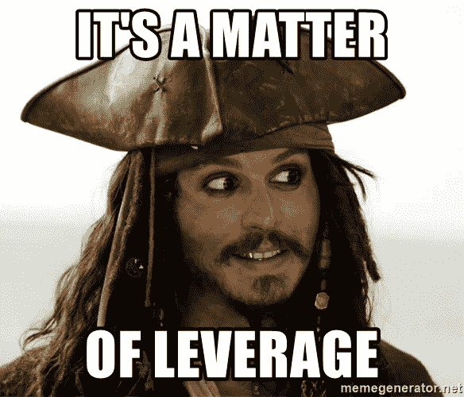

这种技术被称为**杠杆多头头寸**，我们将通过所有的步骤和风险来理解它是如何工作的。

但是在我们开始之前，超级**重要**注意:

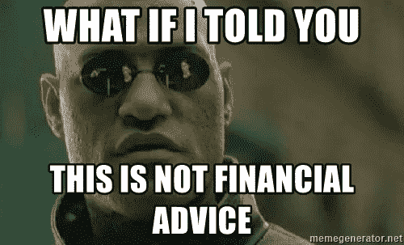

请将此视为分散杠杆如何工作的指南，而不是财务建议！您可以将相同的指令应用于许多不同的令牌，我不知道 DPI 令牌的价值在未来会上升还是下降。

首先，用几个定义来解释一些概念和术语:

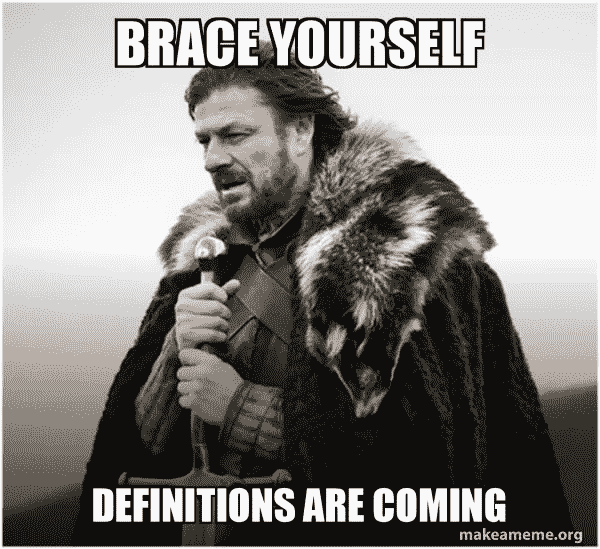

**什么是新闻部？** Defi Pulse Index(DPI)是一篮子令牌(一个指数)，其中包含了最好的分散式金融(Defi)令牌。这个想法是，通过购买 DPI，用户可以接触到一系列分散的金融项目，而无需为每个项目支付汽油费。目前你可以在 Sushiswap、Uniswap 或者直接在 TokenSets 上购买。

今天，我们假设您已经购买了一些 DPI，并希望在不需要额外资本的情况下增加您的持有量。

什么是杠杆多头头寸？

杠杆多头头寸是一种利用借来的钱来增加投资的潜在回报的策略……风险增加。

**我为什么需要借钱？因为有了新借来的钱，你可以购买更多的 DPI，并预期其价值会上升。**

**怎么才能借到钱？** 使用 Defi 平台之一！为了借钱，你需要提供抵押品，保证如果你无法偿还债务，借钱给你的平台不会遭受损失。在我们的案例中，抵押品将是 DPI 本身。

就是这样！

# 那么…它是如何工作的呢？

过程很简单:

> 购买 DPI →用作抵押→再借一枚硬币(stablecoin 推荐)→兑换成 DPI

*   选择您的首选平台(将探索最佳平台)，允许您使用 DPI 作为宣传材料)
*   存款 DPI as 允许其用作抵押品
*   选择你想借的硬币。
*   把借来的稳定币换成 DPI 瞧！你的 DPI 比以前高了。

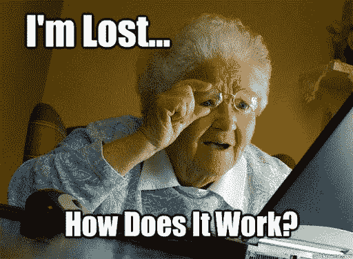

好了，不用担心，让我们在一个平台上一步一步来:

[**Aave**](https://aave.com/)——最安全、最主流的借贷平台之一

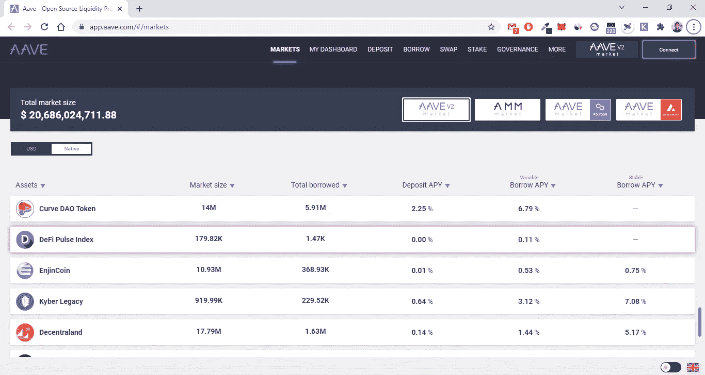

第一步:连接钱包(右上角按钮)。存款 DPI。

请注意，当您存入代币时，您将获得以 APY 形式表示的小额利息。

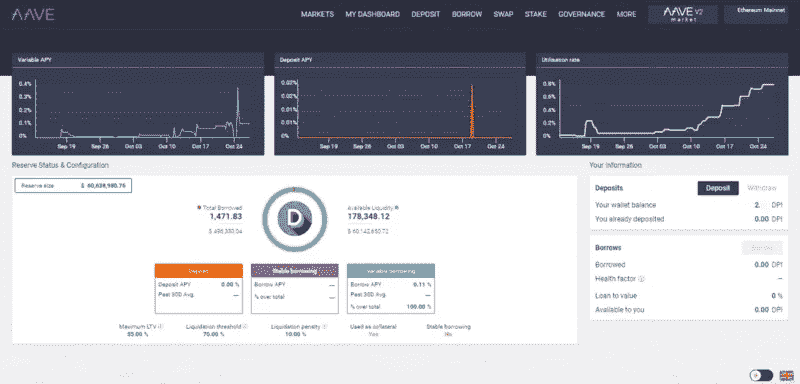

Deposit DPI (2)

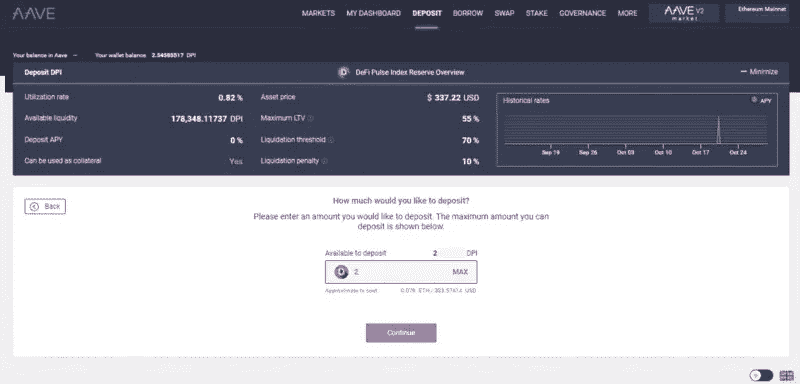

Continue…

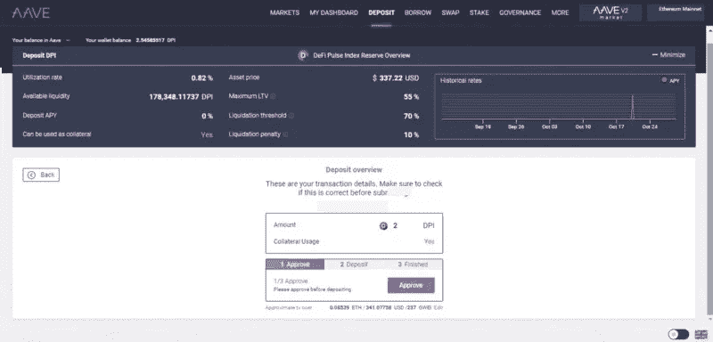

Approve and Deposit… Follow the steps on the page

然后，转到[借用](https://app.aave.com/#/borrow)部分，选择您想要借用的令牌(例如:USDC)。对于 Aave，这是一个可变的年利率(APY ),你要为你的贷款支付，所以要经常监控这个数字。

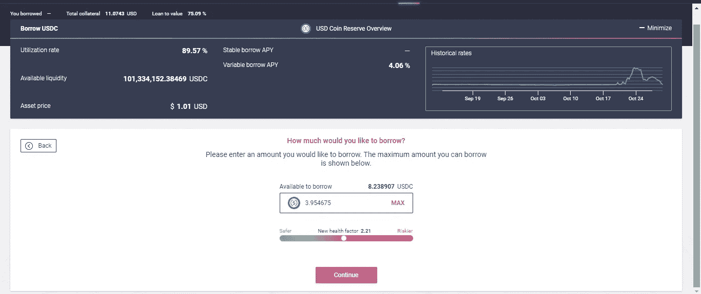

# 重要！

**什么是健康因素？**

“健康系数代表你的贷款的安全性，来自抵押品与借款金额的比例。**保持在 1** 以上，避免平仓。”—文档

如果你低于这个比率，你的抵押品将被认为不足以保证你的贷款，你将失去它！

健康系数取决于两个参数(抱歉，更多定义):

**贷款价值比:给定你已存入的抵押品，你能借多少**。对于 Aave 上的 DPI，是 55%。你存 1000 美元，你可以借不超过 550 美元。

**清算阈值:**限额“在该限额下，借款头寸将被视为抵押不足，并根据每个抵押品进行清算。”例如，Aave 上的 DPI 的清算阈值为 70%:这意味着当债务价值达到抵押品价值的 70%时，贷款将被清算。

让我们假设你借了 550 美元(债务价值):如果你用作抵押品的 DPI 的价值从 1000 美元下降到 785.72 美元，你的部分抵押品将被出售。液化的风险！

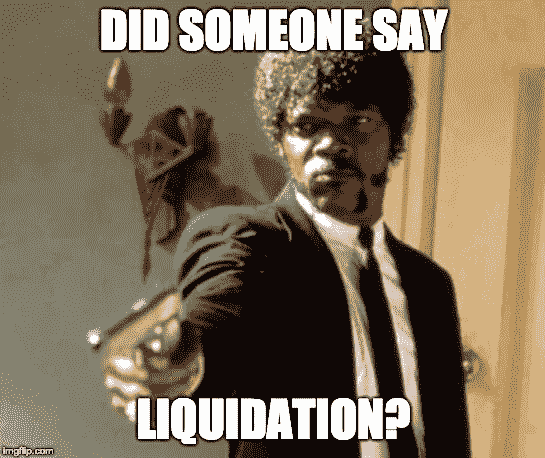

> 考虑到每一个代币引起的波动，总是借，并且借的数量要让你感到舒服。借得太多，很可能会被清算！

**后台发生什么事**
如果你的抵押品价值下降太多，清盘人会卖掉一部分(50%左右)来偿还你的贷款，恢复你的健康因子。对于这项服务，清算人从你的抵押品中收取费用(称为“清算费”或“罚款”)。不好了。

## 最后一档

上 uni WAP/Sushi/1 inch，把借来的令牌转换成 DPI。

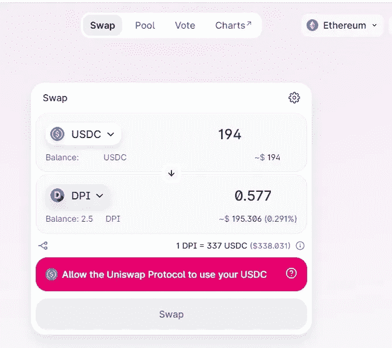

**现在您有 DPI 存储作为抵押品，并且您的钱包中有更多 DPI！所有这些都不需要花费更多的美元(除了汽油费)。**

# 其他平台

除了 Aave，目前还有其他平台允许您使用 DPI 作为抵押品:

*   奶油财经:[https://app.cream.finance/](https://app.cream.finance/)
*   Rari 资本:[https://app.rari.capital/fuse/pool/19](https://app.rari.capital/fuse/pool/19)

以下是他们三人的对比:

# **接下来会发生什么？2 个场景。**

举例。假设你刚刚买了 1000 美元的 DPI。你决定利用它，所以用你在 USDC 借的 500 美元，再把它们兑换成 DPI。

## **最佳情况**

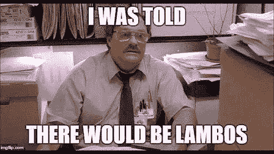

DPI 的价值增加(从每令牌 350 美元增加到 700 美元)。你可以决定增加杠杆(因为你的抵押品价值更高，所以借更多的 USDC)，或者兑现利润。
在这种情况下，你可以卖掉钱包里现在价值 1000 美元的 DPI，偿还你 500 美元的债务，释放你的抵押品。所以你有你的 2000 美元的 DPI 和 500 美元了！

## 最坏情况

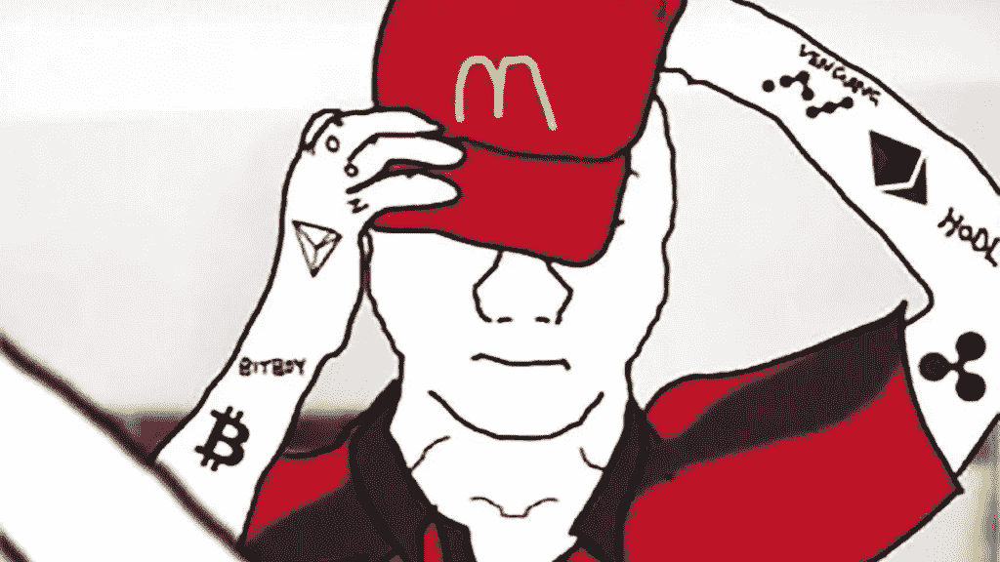

DPI 值下降，你的贷款在你反应过来之前就被清算了。
你还可以把 DPI 放在钱包里(价值不到 500 美元)，但不幸的是，你的部分或全部抵押品都丢失了。
听起来很明显，但是……尽量避免这种情况！

## **风险**

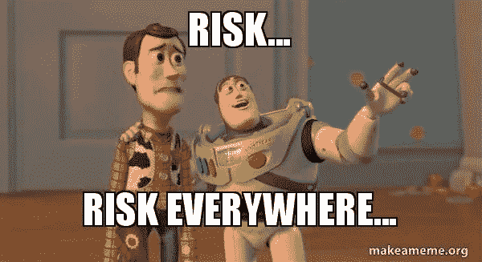

*   最大的风险是刚刚解释的清算风险
*   智能合约风险:虽然这些平台经过了审核和实战测试，但它们永远不会被认为是 100%安全的。
*   放贷时流动性低:由于你是在平台上存 DPI，你的抵押物可以被其他人借走。如果借款 DPI 的需求很高，你可能必须等到人们结清债务后才能取回 DPI——你可以查看每个平台上的**可用流动性**统计中还有多少流动性。记住:你的抵押品永远不会丢失，但它可能会被锁定一段时间。
*   借款时的低流动性:低流动性意味着…你的债务利息高，被清算的机会更大。

典型的建议是只投资你能承受的损失。

## **帮助您监控的工具**

使用工具来帮助你监控贷款的健康状况。我的最爱:

*   [**Zapper**](https://zapper.fi/dashboard) :一个全面的仪表盘，显示你的贷款状态和利息
*   [**康诺。财务**](https://www.cono.finance/) :自动偿还你部分贷款的 Aave 工具，避免清算([解释](https://thedefiant.io/gelato-finance-liquidation-tool/))。
*   在 Aave 上追踪你的健康因素并获得通知
*   自动管理你的贷款，避免清算

指南结束。希望这有用。

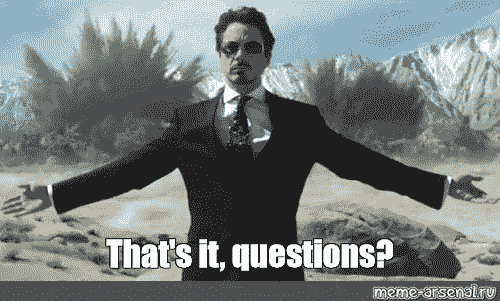

> 加入 Coinmonks [电报频道](https://t.me/coincodecap)和 [Youtube 频道](https://www.youtube.com/c/coinmonks/videos)了解加密交易和投资

## 另外，阅读

*   [如何在 WazirX 上购买柴犬(SHIB)币？](https://blog.coincodecap.com/buy-shiba-wazirx)
*   [霍比审核](https://blog.coincodecap.com/huobi-review) | [OKEx 保证金交易](https://blog.coincodecap.com/okex-margin-trading) | [期货交易](https://blog.coincodecap.com/futures-trading)
*   [Godex.io 审核](/coinmonks/godex-io-review-7366086519fb) | [邀请审核](/coinmonks/invity-review-70f3030c0502) | [BitForex 审核](https://blog.coincodecap.com/bitforex-review)
*   [Crypto.com 费用](/coinmonks/binance-fees-8588ec17965) | [僵尸加密审查](/coinmonks/botcrypto-review-2021-build-your-own-trading-bot-coincodecap-6b8332d736c7) | [替代品](https://blog.coincodecap.com/crypto-com-alternatives)
*   [有哪些交易信号？](https://blog.coincodecap.com/trading-signal) | [Bitstamp vs 比特币基地](https://blog.coincodecap.com/bitstamp-coinbase) | [买索拉纳](https://blog.coincodecap.com/buy-solana)
*   [ProfitFarmers 回顾](https://blog.coincodecap.com/profitfarmers-review) | [如何使用 Cornix Trading Bot](https://blog.coincodecap.com/cornix-trading-bot)
*   [MXC 交易所评论](/coinmonks/mxc-exchange-review-3af0ec1cba8c) | [Pionex vs 币安](https://blog.coincodecap.com/pionex-vs-binance) | [Pionex 套利机器人](https://blog.coincodecap.com/pionex-arbitrage-bot)
*   [我的密码交易经验](/coinmonks/my-experience-with-crypto-copy-trading-d6feb2ce3ac5) | [比特币基地评论](/coinmonks/coinbase-review-6ef4e0f56064)
*   [CoinFLEX 评论](https://blog.coincodecap.com/coinflex-review) | [AEX 交易所评论](https://blog.coincodecap.com/aex-exchange-review) | [UPbit 评论](https://blog.coincodecap.com/upbit-review)
*   [AscendEx 保证金交易](https://blog.coincodecap.com/ascendex-margin-trading) | [Bitfinex 赌注](https://blog.coincodecap.com/bitfinex-staking) | [bitFlyer 评论](https://blog.coincodecap.com/bitflyer-review)
*   [Bybit vs 币安](https://blog.coincodecap.com/bybit-binance-moonxbt)|[stealth x 回顾](/coinmonks/stealthex-review-396c67309988) | [Probit 回顾](https://blog.coincodecap.com/probit-review)
*   [顶级付费加密货币和区块链课程](https://blog.coincodecap.com/blockchain-courses)
*   [在美国如何使用 BitMEX？](https://blog.coincodecap.com/use-bitmex-in-usa) | [BitMEX 评论](https://blog.coincodecap.com/bitmex-review)
*   [最佳期货交易信号](https://blog.coincodecap.com/futures-trading-signals) | [流动性交易所评论](https://blog.coincodecap.com/liquid-exchange-review)
*   [南非的加密交易所](https://blog.coincodecap.com/crypto-exchanges-in-south-africa) | [BitMEX 加密信号](https://blog.coincodecap.com/bitmex-crypto-signals)
*   [MoonXBT 副本交易](https://blog.coincodecap.com/moonxbt-copy-trading) | [阿联酋的加密钱包](https://blog.coincodecap.com/crypto-wallets-in-uae)
*   [雷米塔诺审查](https://blog.coincodecap.com/remitano-review)|[1 英寸协议指南](https://blog.coincodecap.com/1inch)
*   [MoonXBT vs Bybit vs 币安](https://blog.coincodecap.com/bybit-binance-moonxbt) | [Arbitrum:第二层解决方案](https://blog.coincodecap.com/arbitrum)
*   [买 PancakeSwap(蛋糕)](https://blog.coincodecap.com/buy-pancakeswap)|[matrix export Review](https://blog.coincodecap.com/matrixport-review)
*   [最佳免费加密信号](https://blog.coincodecap.com/free-crypto-signals) | [YoBit 评论](/coinmonks/yobit-review-175464162c62) | [Bitbns 评论](/coinmonks/bitbns-review-38256a07e161)
*   [OKEx 回顾](/coinmonks/okex-review-6b369304110f) | [Kucoin 交易机器人](/coinmonks/kucoin-trading-bot-automate-your-trades-8cf0ca2138e0) | [期货交易机器人](/coinmonks/futures-trading-bots-5a282ccee3f5)
*   [AscendEx Staking](https://blog.coincodecap.com/ascendex-staking)|[Bot Ocean Review](https://blog.coincodecap.com/bot-ocean-review)|[最佳比特币钱包](https://blog.coincodecap.com/bitcoin-wallets-india)
*   [霍比评论](https://blog.coincodecap.com/huobi-review) | [OKEx 保证金交易](https://blog.coincodecap.com/okex-margin-trading) | [期货交易](https://blog.coincodecap.com/futures-trading)