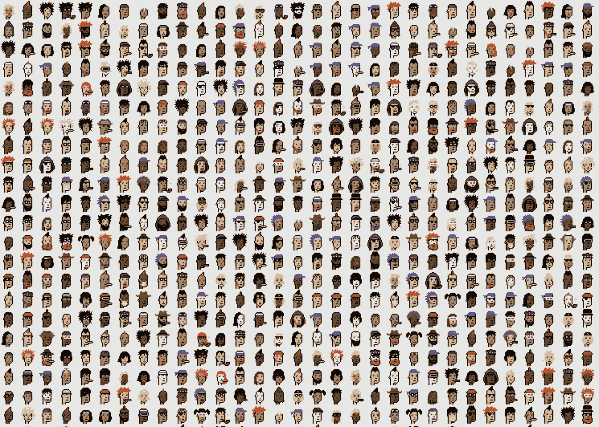

# 最有价值的 NFT 项目怎么会有如此巨大的设计缺陷？

> 原文：<https://medium.com/coinmonks/how-can-the-most-valuable-nft-project-have-such-a-massive-design-flaw-1140a9128ba?source=collection_archive---------2----------------------->

## 深入探究 CryptoPunks 所有权模型；以及为什么我拥有一台尽管有最大缺点

CryptoPunk 435, the cheapest CP listed for sale at the time of writing. Valued at $39k.

> CryptoPunks 是所有 NFT 艺术项目的始祖。

除了是以太坊 ERC-721 令牌标准(定义了 NFT 的基础)的灵感之外，它的市值不言自明。整个收藏价值超过 4 亿美元，这是根据收藏中最便宜的密码朋克的当前价值估算的。

CryptoPunks 由[幼虫实验室](https://www.larvalabs.com/)于 2017 年 6 月推出，由 1 万张独特的 8 位风格、低分辨率的所谓 Punks 图像组成，所有这些图像拼接在一起形成了一个 *100x100* 的网格。

Extract of the composite [100x100 image](https://www.larvalabs.com/public/images/cryptopunks/punks.png) of all CryptoPunks.

> 有 5 种朋克类型:外星人，猿，僵尸，女性，或男性。

此外，每个 CryptoPunk (CP)都有与之相关联的元数据，表明它拥有哪些属性。每个朋克的属性数从 0 到 7 不等。这些属性包括辫子、礼帽、项链、头饰、帽衫等。作为一个好奇的事实，只有 8 个 CP 有 0 个属性，只有一个 CP 的属性数最多:7。

The eight CPs with zero attributes

一些属性被认为是“隐藏的”,因为在隐朋克的形象中，另一个属性可以覆盖一个属性。

The only CryptoPunk with 7 attributes. The last bid amount for this CP (#8348) was for over $1 million.

由于该项目是 ERC-721 标准的前身，幼虫实验室在智能合同中从头开始在以太坊区块链上编码一个分散的市场。合同非常简单——它允许提供一个待售的密码朋克，购买一个待售的密码朋克，转移所有权，出价，接受出价。

最初，CPs 是免费发放给在空投过程中认领的人。此后，需要使用智能合约方法来购买、销售或转让 CP。

# 所有权模型是如何工作的？

这就是有趣的地方。任何一个理性的人都会认为，一个市值高达 4 亿美元、单个 CPs 的交易价值高达数十万美元的项目，在所有权方面会有一个坚如磐石的基础。我在这里争辩说，所有权模型的设计是天真的，这个缺陷应该作为一个例子，说明在未来的 NFT 艺术项目中不应该做什么。

## 那么，问题是什么呢？

幼虫实验室通过散列主图像并将散列包括在合同的初始状态中(即，通过将合同变量设置为等于图像散列)，将 10，000 个 CryptoPunks 图像耦合到市场智能合同。契约有一个数组，将朋克索引映射到以太坊地址，从而建立哪个地址拥有哪个朋克索引。问题是没有明确的方法来识别哪个朋克索引映射到合成图像中的哪个朋克。

## 看看智能合同和区块链状态可以证明什么？

散列图像并将结果插入契约的初始状态意味着 crypto 朋克主图像并且只有该图像被绑定到契约。此外，可以建立特定以太坊地址拥有特定朋克索引。所有权之所以成立，是因为合同只允许出售或转让由映射到朋克索引的地址发起的朋克索引。

## 什么不能被证明？

不幸的是，仅仅通过查看智能合约和区块链状态，无法证明特定的朋克索引映射到复合 crypto 朋克图像中的特定 CP。

## 那么，人们如何“知道”他们正在购买什么样的密码朋克呢？

其实他们真的没有。当你购买一个 CP 时，你实际上是在购买一个朋克指数，并且信任一个集中的网站([幼虫实验室密码朋克网站](https://www.larvalabs.com/cryptopunks))来为你找出映射，并向你显示哪个密码朋克图像对应于你正在购买、出售、转让或已经拥有的朋克指数。

现在，要明确的是，设计师们并没有炮制一个随机的映射——他们实际上给了映射函数一个合理的形式——遵循西方惯例(从左到右，从上到下):朋克指数 0 对应于合成图像左上角的 CP；朋克指数 1 对应 CP 0 右边的 CP；如此类推，直到到达 CP 99。那么，CP 100 对应的是 CP 0 下的 CP；101 在 100 的右边，以此类推。

## 那么，如果映射有意义，问题是什么？

冷酷-倒霉的事实是，幼虫实验室拥有随意改变朋克指数→ CP 映射的权力，因为他们控制了他们网站上唯一的地图。换句话说，从技术上来说，你可能今天拥有最高价值的 CP，明天醒来拥有更便宜的 CP，因为幼虫实验室决定将映射顺序颠倒过来(例如):从上到下，从左到右。

## 这种可怕的情景有可能发生吗？

大概不会。破坏他们现在忠实的市场不符合幼虫实验室的最佳利益。但这不是重点——在以太坊区块链上转移到去中心化、不可信的所有权模型的重点恰恰是，你甚至不需要担心这种事情会发生——它们甚至不应该是可能的。事实是，CryptoPunks 项目的设计确实考虑到了模糊性，需要信任，并且依赖于一个集中的网站(相对于合法的 DApp)。

# 有什么明智的解决办法吗？

明智的解决方案是让 CryptoPunk 智能合约提供一个函数，该函数将 punk 索引作为输入，并输出一个与经过哈希处理的单个 crypto punk 相等的图像哈希。然后，这种映射将被刻在区块链的石头上。顺便说一下，存储 10，000 个链上散列的成本相对于该项目的市值来说可以忽略不计。

## 现在做这个是不是太晚了？

是，也不是。目前的合同是不可改变的。必须发布提供上述功能的新合同。当前所有权状态必须作为初始状态的一部分转移到新合同中。从那时起，机构群体必须就新合同达成共识。

# 最后，我为什么要拥有一个密码朋克？

因为我认为这个项目具有足够的历史意义，尽管它有缺点，但它值得尊重，也确实有价值。警告:我确实有一个最便宜的密码朋克，以防所有权映射在一夜之间改变；)

> 加入 Coinmonks [Telegram group](https://t.me/joinchat/EPmjKpNYwRMsBI4p) 并了解加密交易和投资

## 另外，阅读

*   最好的[密码交易机器人](/coinmonks/crypto-trading-bot-c2ffce8acb2a) | [网格交易](https://blog.coincodecap.com/grid-trading)
*   [3 商业评论](/coinmonks/3commas-review-an-excellent-crypto-trading-bot-2020-1313a58bec92) | [Pionex 评论](/coinmonks/pionex-review-exchange-with-crypto-trading-bot-1e459d0191ea) | [Coinrule 评论](/coinmonks/coinrule-review-2021-a-beginner-friendly-crypto-trading-bot-daf0504848ba)
*   [AAX 交易所评论](/coinmonks/aax-exchange-review-2021-67c5ea09330c) | [德里比特评论](/coinmonks/deribit-review-options-fees-apis-and-testnet-2ca16c4bbdb2) | [FTX 交易所评论](/coinmonks/ftx-crypto-exchange-review-53664ac1198f)
*   [n ave 零点回顾](/coinmonks/ngrave-zero-review-c465cf8307fc) | [Phemex 回顾](/coinmonks/phemex-review-4cfba0b49e28) | [PrimeXBT 回顾](/coinmonks/primexbt-review-88e0815be858)
*   [Bybit Exchange 审查](/coinmonks/bybit-exchange-review-dbd570019b71) | [Bityard 审查](/coinmonks/bityard-review-7d104239be35) | [CoinSpot 审查](https://blog.coincodecap.com/coinspot-review)
*   [3 commas vs crypto hopper](/coinmonks/3commas-vs-pionex-vs-cryptohopper-best-crypto-bot-6a98d2baa203)|[赚取加密利息](/coinmonks/earn-crypto-interest-b10b810fdda3)
*   最好的比特币[硬件钱包](/coinmonks/the-best-cryptocurrency-hardware-wallets-of-2020-e28b1c124069?source=friends_link&sk=324dd9ff8556ab578d71e7ad7658ad7c) | [BitBox02 回顾](/coinmonks/bitbox02-review-your-swiss-bitcoin-hardware-wallet-c36c88fff29)
*   [莱杰 vs n rave](/coinmonks/ledger-vs-ngrave-zero-7e40f0c1d694)|[莱杰 nano s vs x](/coinmonks/ledger-nano-s-vs-x-battery-hardware-price-storage-59a6663fe3b0)
*   [加密复制交易平台](/coinmonks/top-10-crypto-copy-trading-platforms-for-beginners-d0c37c7d698c)
*   [Vauld Review](/coinmonks/vauld-review-2021-lend-trade-and-buy-bitcoin-in-india-e37a96374961)|[you hodler Review](/coinmonks/youhodler-4-easy-ways-to-make-money-98969b9689f2)|[BlockFi Review](/coinmonks/blockfi-review-53096053c097)
*   最好的[加密税务软件](/coinmonks/best-crypto-tax-tool-for-my-money-72d4b430816b) | [CoinTracking 评论](/coinmonks/cointracking-review-a-reliable-cryptocurrency-tax-software-5114e3eb5737)
*   最佳[加密借贷平台](/coinmonks/top-5-crypto-lending-platforms-in-2020-that-you-need-to-know-a1b675cec3fa) | [杠杆代币](/coinmonks/leveraged-token-3f5257808b22)
*   [block fi vs Celsius](/coinmonks/blockfi-vs-celsius-vs-hodlnaut-8a1cc8c26630)|[Hodlnaut Review](/coinmonks/hodlnaut-review-best-way-to-hodl-is-to-earn-interest-on-your-bitcoin-6658a8c19edf)
*   [Bitsgap 审查](/coinmonks/bitsgap-review-a-crypto-trading-bot-that-makes-easy-money-a5d88a336df2) | [Quadency 审查](/coinmonks/quadency-review-a-crypto-trading-automation-platform-3068eaa374e1) | [Bitbns 审查](/coinmonks/bitbns-review-38256a07e161)
*   [埃利帕尔泰坦评论](/coinmonks/ellipal-titan-review-85e9071dd029) | [赛克斯斯通评论](/coinmonks/secux-stone-hardware-wallet-review-15-discount-coupon-2020-7577032faa6e)
*   [本地比特币评论](/coinmonks/localbitcoins-review-6cc001c6ed56)
*   最佳[区块链分析](https://bitquery.io/blog/best-blockchain-analysis-tools-and-software)工具| [赚比特币](/coinmonks/earn-bitcoin-6e8bd3c592d9)
*   [加密套利](/coinmonks/crypto-arbitrage-guide-how-to-make-money-as-a-beginner-62bfe5c868f6)指南| [如何做空比特币](/coinmonks/how-to-short-bitcoin-568a2d0b4ae5)
*   最佳[加密制图工具](/coinmonks/what-are-the-best-charting-platforms-for-cryptocurrency-trading-85aade584d80) | [最佳加密交易所](/coinmonks/crypto-exchange-dd2f9d6f3769)
*   [如何在印度购买比特币？](/coinmonks/buy-bitcoin-in-india-feb50ddfef94) | [WazirX 评论](/coinmonks/wazirx-review-5c811b074f5b)
*   [印度比特币交易所](/coinmonks/bitcoin-exchange-in-india-7f1fe79715c9) | [比特币储蓄账户](/coinmonks/bitcoin-savings-account-e65b13f92451)
*   [CoinDCX 审查](/coinmonks/coindcx-review-8444db3621a2)

> [直接在您的收件箱中获得最佳软件交易](/coinmonks/newsletters/coinmonks)

