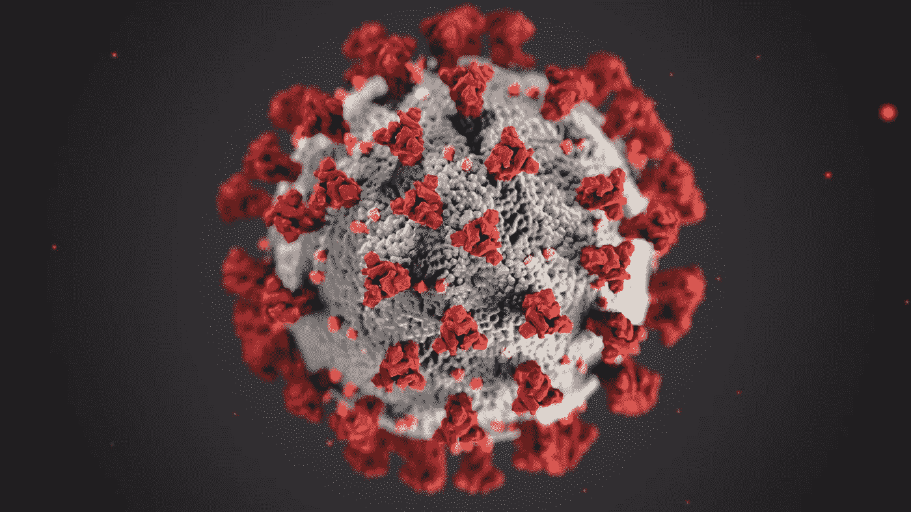

# 新冠肺炎如何加速了加密货币的激增，现在开始是否为时已晚？

> 原文：<https://medium.com/coinmonks/how-covid-19-accelerated-the-surge-of-cryptocurrency-and-is-it-too-late-to-get-started-fa6ed31a6cf2?source=collection_archive---------6----------------------->

在这一年，随着金融危机的到来，货币估值在全球范围内大幅下降，加密货币行业则出现了前所未有的牛市。

在 2020 年的最后一天，比特币的价值超过了 29000 美元，在结束的一年里翻了两番。

如果你一直在阅读 2021 年的新闻，你肯定会注意到比特币价值上升的新闻标题。据 [Coindesk](https://www.coindesk.com/price/bitcoin) 报道，比特币的价值超过 57，000 美元，并有望继续上涨。

疫情暴露了传统金融体系的弱点。现有金融体系的缺陷从一开始就存在，但新冠肺炎展示了它的真实面目。

因此，比特币和其他加密货币应运而生。根据现有的新冠肺炎法规，加密货币正在慢慢成为未来可接受的交易形式。

## **法定货币的损失——加密的收益**

新冠肺炎的几次裁员和减薪几乎影响了全世界的每个行业，因此给法定货币印刷、借贷和支出以稳定经济带来了巨大压力。

大规模印刷法定货币对于保持医疗行业的运行和经济稳定至关重要，导致了大规模的货币通胀。

在这样一个困难时期，投资者通常选择投资于更安全的避险资产，投资工具往往与整体市场无关，比如黄金。

但由于加密货币也表现出与黄金相同的市场行为，投资者对加密技术充满信心。并非所有的货币都是如此，但对于某些特定的货币来说却是如此——固定的供给和分散化使其在全球 GDP 崩溃的情况下不受通货膨胀的影响。

## **比特币的崛起**

最初的加密货币比特币是在中本聪的区块链技术[白皮书](https://bitcoin.org/bitcoin.pdf)之后出现的，在疫情年期间大幅上涨，超过了 2018 年 18640 美元的历史最高水平。

如今，比特币的价值已经超过了 5 万美元大关，这对整个加密货币行业来说是一次巨大的飙升。但这不仅仅是单一货币的一次胜利。回到 2020 年 6 月，的总市值上限为 2600 亿美元。

2021 年 1 月的一周内，加密货币市场超过了 1 万亿美元，这对许多早期采用加密技术的人来说是梦想成真。

随着比特币继续受到欢迎，由于新冠肺炎和美元疲软，一些金融机构已经转向加密货币投资。

[摩根大通](https://www.coindesk.com/jpmorgan-analysts-bitcoin-institutional-buyers)报告称，越来越多的机构比以往任何时候都更多地购买加密货币。最近，[宣布](https://www.cnbc.com/2021/02/08/tesla-buys-1point5-billion-in-bitcoin.html)购买了 15 亿美元的比特币，并宣布计划接受比特币作为他们未来产品的付款，埃隆·马斯克的特斯拉就是其中之一。

价格波动是一个问题，但专家表示，在有利于人民币的条件下，价格波动将继续上升。

领先的商业分析公司 MicroStrategy 将比特币作为其主要储备资产。截至 2020 年 12 月，该公司通过收购[价值 6.5 亿美元的比特币](https://decrypt.co/52163/microstrategy-completes-650-million-bitcoin-buy)达到了一年一个比特币的上限，并且截至今天，该公司计划每秒收购价值 2000 美元的比特币[。](https://coinquora.com/microstrategy-is-planning-to-buy-2000-bitcoin-per-second/)

## **全球认可**

有史以来第一笔比特币交易可以追溯到 2010 年，当时佛罗里达州的一个人向一名英国公民支付了 10，000 比特币，以换取两个棒约翰披萨。

从那以后，比特币成为了全球广泛接受的支付方式。主要零售商和全球企业已经开始购买比特币进行交易。

科技巨头微软已经开始接受购买 Xbox 的付款，而家得宝、星巴克和全食超市都促进了顾客接受比特币进行交易。

支付平台也已介入加密货币的标准化。

在 2020 年最后一个季度， [PayPal](https://newsroom.paypal-corp.com/2020-10-21-PayPal-Launches-New-Service-Enabling-Users-to-Buy-Hold-and-Sell-Cryptocurrency) 宣布，该平台将允许其用户从自己的账户中购买和存储加密货币。

此次更新面向所有美国用户，该功能将于未来在选定的国际市场推出。

PayPal 用户最初可以获得互动和存储比特币、莱特币和以太坊的机会。

贝宝宣布这一消息的同时，比特币也在这段时间达到了历史最高水平，超过了 2 万美元大关。

然而，PayPal 并不是第一个接受 crypto 的。

Visa 和 MasterCard 在相当长的时间里都支持加密货币，而 Visa 也宣布了一种借记卡，为客户提供比特币专属奖励。

支付平台为加密货币的主流适应做出了巨大贡献。

## **下一件大事！**

随着比特币的飙升，受欢迎程度也转向了其他具有重大价值的硬币，并且是早期的。

Dogecoin 的普及就是这样一个例子。Dogecoin 最初是杰克逊·帕尔默开的一个玩笑，于 2013 年推出。它基于比特币的代码库，对比特币的一些关键功能进行了调整。

人们已经忘记了加密货币，直到特斯拉首席执行官埃隆·马斯克(Elon Musk)在[发了一条关于它的推特](https://twitter.com/elonmusk/status/1363601164344823810?s=20)，现在这种硬币在 2 月 8 日飙升至创纪录的 0.083745 美元，目前为 0.0561 美元。

由于马斯克的推文和他关于 Dogecoin 的教学视频，以及 Snoop Dogg 的[背书](https://twitter.com/snoopdogg/status/1358141965930426368)，这种货币已经成为加密投资者的热门选择。

2021 年 1 月，印有普及的柴犬迷因形象的硬币飙升了 600%以上，专家预测，到 2021 年底，这种货币最高可达 0.0821 美元。

像 [Polkadot (DOT)](https://www.coinbase.com/price/polkadot-new) 、 [Chainlink (LINK)](https://www.coinbase.com/price/chainlink) 、 [Cardano (ADA)](https://www.coinbase.com/price/cardano) 等币都是 2021 年增长潜力巨大的货币。

## 未来看起来很光明

尽管未来监管和国家数字资产的影响仍有待观察，但新冠肺炎危机已经证明了一件事。加密货币不会消失，事实上，它有望成为比以往任何时候都更加重要的全球经济的一部分。

这在很大程度上要归功于 BTC 在市场动荡期间表现出的非凡弹性，以及区块链在金融创新方面日益增强的效用。面对全球疫情的现实，风险无处不在，并且可能在未来再次发生，人们看到了将时间和精力投入到业务和金融数字化的选择。

## 我错过机会了吗？

因此，如果你仍然想知道现在投资加密是否为时已晚，答案是否定的。事实上，我们仍处于采用曲线的早期阶段，大约只有 2%的人采用。我们仍然是这个数字金融新世界的创新者。

如果你缩小范围，看看比特币随着时间的增长，它每年增长 200%。因此，忽略短期波动，而是计划购买并在未来 5 至 10 年内持有它们，以体验改变生活的财富。

## **想要开始您的加密货币投资之旅，但不知道从哪里开始？**

在进入加密市场大约 4 年并使用了多个加密交易所后，比特币基地和币安是最可靠的，也是最适合初学者的。

点击链接[这里](https://coinbase-consumer.sjv.io/KeKYeA)注册一个[比特币基地](https://coinbase-consumer.sjv.io/KeKYeA)账户，这是世界上最受欢迎和用户友好的密码交易所，适合任何初学者。唯一的缺点是比特币基地的交易费用会比币安略高，但是如果你想要的是方便，比特币基地的费用是非常值得的。总体最好。

或者

点击链接[此处](https://www.binance.com/en/register?ref=DM67S0F5)注册一个[币安](https://www.binance.com/en/register?ref=DM67S0F5)账户，购买你的第一个比特币、以太坊或任何其他加密货币，因为它们提供了最大的加密令牌选择，并且价格最低。币安稍微先进一些，但是如果你对交易感兴趣的话，它会适合你。最适合其他货币的低利率。

> 加入 coin monks[Telegram group](https://t.me/joinchat/EPmjKpNYwRMsBI4p)学习加密交易和投资

## 另外，阅读

*   什么是[闪贷](https://blog.coincodecap.com/what-are-flash-loans-on-ethereum)？
*   最好的[密码交易机器人](/coinmonks/crypto-trading-bot-c2ffce8acb2a) | [网格交易](https://blog.coincodecap.com/grid-trading)
*   [3 商业评论](/coinmonks/3commas-review-an-excellent-crypto-trading-bot-2020-1313a58bec92) | [Pionex 评论](/coinmonks/pionex-review-exchange-with-crypto-trading-bot-1e459d0191ea) | [Coinrule 评论](https://blog.coincodecap.com/coinrule-review-a-perfect-trading-bot)
*   [AAX 交易所评论](/coinmonks/aax-exchange-review-2021-67c5ea09330c) | [德里比特评论](/coinmonks/deribit-review-options-fees-apis-and-testnet-2ca16c4bbdb2) | [FTX 交易所评论](/coinmonks/ftx-crypto-exchange-review-53664ac1198f)
*   [n 零复习](/coinmonks/ngrave-zero-review-c465cf8307fc) | [Phemex 复习](/coinmonks/phemex-review-4cfba0b49e28) | [PrimeXBT 复习](/coinmonks/primexbt-review-88e0815be858)
*   [Bybit Exchange 审查](/coinmonks/bybit-exchange-review-dbd570019b71) | [Bityard 审查](https://blog.coincodecap.com/bityard-reivew) | [CoinSpot 审查](https://blog.coincodecap.com/coinspot-review)
*   [3 commas vs crypto hopper](/coinmonks/3commas-vs-pionex-vs-cryptohopper-best-crypto-bot-6a98d2baa203)|[赚取加密利息](/coinmonks/earn-crypto-interest-b10b810fdda3)
*   最好的比特币[硬件钱包](/coinmonks/the-best-cryptocurrency-hardware-wallets-of-2020-e28b1c124069?source=friends_link&sk=324dd9ff8556ab578d71e7ad7658ad7c) | [BitBox02 回顾](/coinmonks/bitbox02-review-your-swiss-bitcoin-hardware-wallet-c36c88fff29)
*   [莱杰 vs n rave](https://blog.coincodecap.com/ngrave-vs-ledger)|[莱杰 nano s vs x](https://blog.coincodecap.com/ledger-nano-s-vs-x)
*   [密码拷贝交易平台](/coinmonks/top-10-crypto-copy-trading-platforms-for-beginners-d0c37c7d698c) | [比特码拷贝交易](https://blog.coincodecap.com/bityard-copy-trading)
*   [Vauld 审查](https://blog.coincodecap.com/vauld-review) | [YouHodler 审查](/coinmonks/youhodler-4-easy-ways-to-make-money-98969b9689f2) | [BlockFi 审查](/coinmonks/blockfi-review-53096053c097)
*   最好的[加密税务软件](/coinmonks/best-crypto-tax-tool-for-my-money-72d4b430816b) | [硬币追踪评论](/coinmonks/cointracking-review-a-reliable-cryptocurrency-tax-software-5114e3eb5737)
*   最佳[加密借贷平台](/coinmonks/top-5-crypto-lending-platforms-in-2020-that-you-need-to-know-a1b675cec3fa) | [杠杆令牌](/coinmonks/leveraged-token-3f5257808b22)
*   [莱杰纳米 S vs 特雷佐 one vs 特雷佐 T vs 莱杰纳米 X](https://blog.coincodecap.com/ledger-nano-s-vs-trezor-one-ledger-nano-x-trezor-t)
*   [block fi vs Celsius](/coinmonks/blockfi-vs-celsius-vs-hodlnaut-8a1cc8c26630)|[Hodlnaut 回顾](https://blog.coincodecap.com/hodlnaut-review)
*   [Bitsgap 审查](https://blog.coincodecap.com/bitsgap-review) | [Quadency 审查](/coinmonks/quadency-review-a-crypto-trading-automation-platform-3068eaa374e1) | [Bitbns 审查](https://blog.coincodecap.com/bitbns-review)
*   [埃利帕尔泰坦评论](/coinmonks/ellipal-titan-review-85e9071dd029) | [赛克斯斯通评论](https://blog.coincodecap.com/secux-stone-hardware-wallet-review)
*   [DEX Explorer](https://explorer.bitquery.io/ethereum/dex)|[w](https://explorer.bitquery.io/graphql)|[local bitcoins 评论](https://blog.coincodecap.com/localbitcoins-review)
*   最佳[区块链分析](https://bitquery.io/blog/best-blockchain-analysis-tools-and-software)工具| [赚比特币](https://blog.coincodecap.com/earn-bitcoin)
*   [加密套利](/coinmonks/crypto-arbitrage-guide-how-to-make-money-as-a-beginner-62bfe5c868f6)指南:新手如何赚钱
*   最佳[加密制图工具](/coinmonks/what-are-the-best-charting-platforms-for-cryptocurrency-trading-85aade584d80) | [最佳加密交易所](/coinmonks/crypto-exchange-dd2f9d6f3769)
*   [如何在印度购买比特币](https://blog.coincodecap.com/buy-bitcoin-app-india)？
*   [印度比特币交易所](/coinmonks/bitcoin-exchange-in-india-7f1fe79715c9) | [比特币储蓄账户](https://blog.coincodecap.com/bitcoin-savings-account)
*   了解比特币的[最佳书籍有哪些？](/coinmonks/what-are-the-best-books-to-learn-bitcoin-409aeb9aff4b)

> [在您的收件箱中直接获得最佳软件交易](/coinmonks/newsletters/coinmonks)

