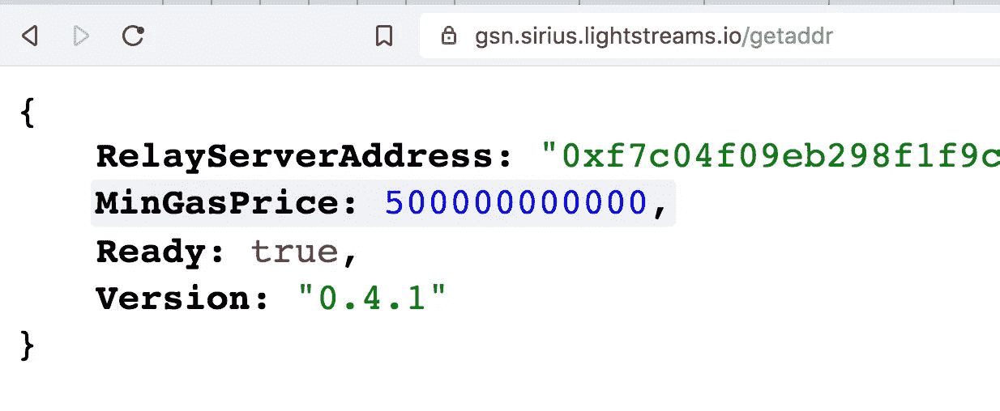
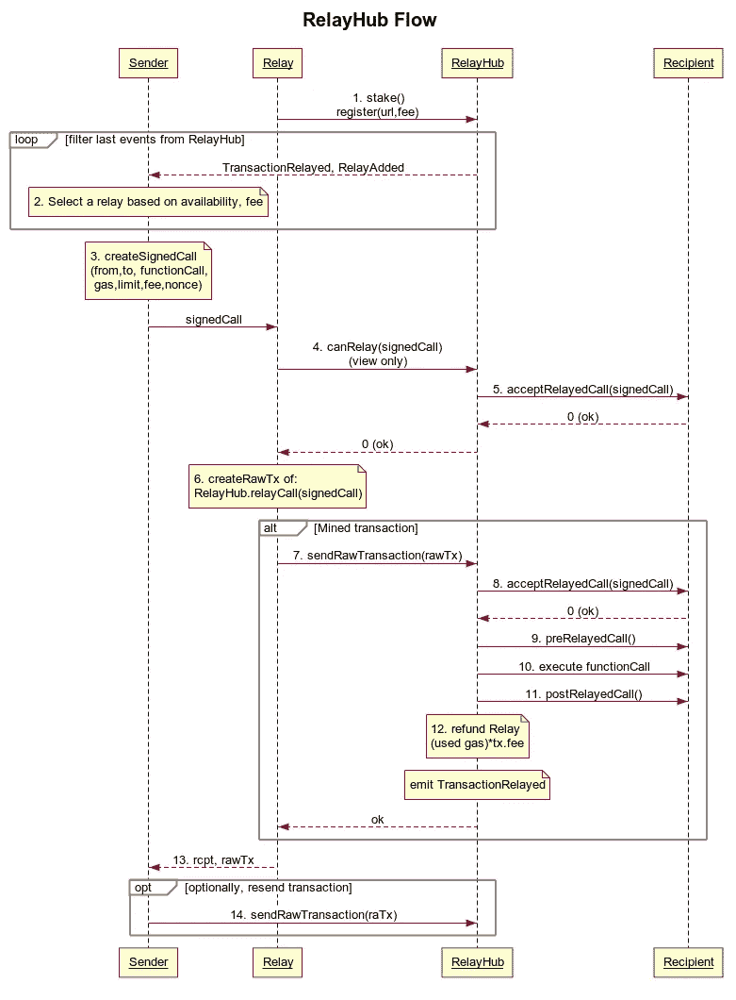
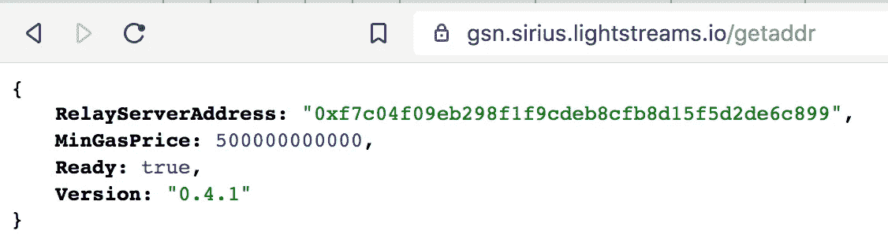
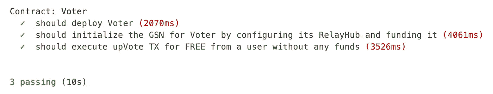

# DApp 用户如何通过 ZERO ETH 与您的智能合约互动

> 原文：<https://medium.com/coinmonks/how-dapp-users-can-interact-with-your-smart-contracts-with-zero-eth-d0b664b355ce?source=collection_archive---------0----------------------->

## 如果你希望主流采用，你的区块链用户不应该为你的基础设施买单。



Lightstreams RelayServer on Sirius Test Network

这个问题众所周知。为了执行转移交易或与特定的应用程序智能合约进行交互，您需要支付以太网中的基础设施成本(gas)。没有用户，尤其是区块链生态系统的新用户，会愿意这样做。FREEMIUM 模式在目前的 Web2 栈中如此广泛的实现是有原因的。买之前先尝一尝。

在本文中，您将了解如何通过 5 个步骤在您的 DApp 中实现一个名为 GSN 的**新以太坊概念来代表您的用户支付交易。**

# 加油站网络

GSN 是一个由网络安全公司 [TabooKey](https://www.tabookey.com/) 设计和开发的概念。TabooKey 在 2018 年 12 月提交了一份官方 [EIP-1613](https://github.com/ethereum/EIPs/blob/master/EIPS/eip-1613.md) 设计草案。



src: [https://github.com/ethereum/EIPs/blob/master/EIPS/eip-1613.md](https://github.com/ethereum/EIPs/blob/master/EIPS/eip-1613.md)

复杂？

别担心。这个概念后来被已建立的以太坊审计公司 [OpenZeppelin](https://openzeppelin.com/) (OZ)采用并增强，他们开发了一套友好的 JS 助手工具来简化 GSN 的使用。

## 步骤 0:选择你的以太坊兼容的区块链网络

我将在 [Lightstream 的 PoA 以太坊兼容区块链](https://github.com/lightstreams-network/lightchain)上演示使用方法。

为什么？

*   解决天然气问题只是解决方案的一部分。主流应用需要快速响应。遗憾的是，以太坊的 15s 积木不能保证 TX 不会被还原，这对于任何面对交互式 DApp 的用户来说都是不够的。Lightstreams 在 3s 块中提供即时终结。
*   已经部署的 RelayHub 和活动的 [RelayServer](https://gsn.sirius.lightstreams.io/getaddr) 意味着您不必担心之前可视化的复杂 GSN 图的一半，并且**可以专注于您的应用业务案例**。



Pre-deployed Lightstream’s RelayServer

## 步骤 1:使用您现有的智能合同

例如，假设你有一个简单的`Voter.sol`智能合同，你的用户可以投票赞成或投票反对某个任意值。

```
contract Voter {
    uint256 public count;

    event Voted(uint256 newCount, address account);

    function upVote() public {
        address lastVoter = _msgSender();
        count++;

        emit Voted(count, lastVoter);
    }

    function downVote() public {
        address lastVoter = _msgSender();
        count--;

        emit Voted(count, lastVoter);
    }
}
```

## 第二步:继承气体自由的特点

继承 [GSN.sol](https://raw.githubusercontent.com/lightstreams-network/lightstreams-js-sdk/master/contracts/utils/GSN.sol) 将你的传统 SC 转换成 GSN 兼容的。`GSN.sol`正在延长官方 [OpenZeppelin，TabooKey 合同](https://github.com/OpenZeppelin/openzeppelin-contracts/blob/master/contracts/GSN/GSNRecipient.sol)。

```
npm i --save lightstreams-js-sdk
import "@lightstreams-js-sdk/contracts/utils/GSN.sol";

contract Voter is GSN {
```

## 步骤 3:在全局 RelayHub 中注册 Voter.sol SC

部署`Voter.sol`并调用`initialize`方法。作为`RELAY_HUB`参数，指定“[0x ECF 278654 f 73000 F9 CB 3b 05858158 AC 49 c 29 ed 68](https://explorer.sirius.lightstreams.io/addr/0xecf278654f73000f9cb3b05858158ac49c29ed68)”。

这是部署在 Lightstream 的 **Sirius** 测试网络上的官方 RelayHub。

```
voter.initialize(RELAY_HUB)
```

## 步骤 4:为用户交易付费

用户交易将是免费的，但投票应用程序仍需为此付费。这是通过在 RelayHub 中预先资助您希望无气体的 SC 来实现的。

安装 OZ GSN 助手:

```
"@openzeppelin/gsn-helpers": "0.1.9",
```

导入`fundRecipient`方法:

```
const { fundRecipient } = require('@openzeppelin/gsn-helpers');
```

为`Voter.sol`提供您愿意为用户交易支付的尽可能多的天然气费用:

```
await fundRecipient(web3, {
  recipient: voter.address,
  relayHubAddress: RELAY_HUB,
  amount: web3.utils.toWei("10", "ether"),
  from: YOUR_PHT_ACCOUNT
});
```

## 第五步:让用户执行免费交易

为了做到这一点，您将需要一个用 HTTP 中继功能修饰的特殊 Web3 lib。为什么？因为用户的无汽油交易现在将被提交到前面提到的 **HTTP 中继服务器**[https://gsn.sirius.lightstreams.io/getaddr](https://gsn.sirius.lightstreams.io/getaddr)并且在它们被广播到区块链之前被修饰。

需要 Lightstream 调整后的 OZ 网络库:

```
const { fromConnection } = require('@lightstreams-js-sdk/node_modules/openzeppelin/network');
```

创建一个新的 GSN powered Web3 对象:

```
gsnCtx = await fromConnection(
  web3.eth.currentProvider.host, {
    gsn: {
      dev: false,
      signKey: emptyAcc.privateKey
    }
});web3 = gsnCtx.lib;
```

> 执行无气 TX！

```
const voterGSN = await new gsnCtx.lib.eth.Contract(voter.abi, voter.address);

const tx = await **voterGSN.methods.upVote**().send({
  from: **emptyAcc.address**,
  gasPrice: gasPrice,
  gasLimit: "1000000",
});
```



PS: Notice the fast ~3s block time

完整源代码请点击[此处](https://raw.githubusercontent.com/lightstreams-network/lightstreams-js-sdk/master/test/04_gsn_voter.js):

我还有几个问题，可以问谁，在哪里问？

首先感谢大家的关注！请在下面留言或在 LinkedIn 上给我发消息，我会很乐意支持你的 GSN 整合。

# 结论

如果将正确的技术结合在一起，区块链的主流采用指日可待。

请访问 Lightstreams 文档，立即开始开发主流、响应迅速的应用程序。

[https://docs . light streams . network](https://docs.lightstreams.network/)

***PS:*** *特别感谢 OpenZeppelin 团队(Andrew、Nicolas、Igor 和 Marti)在 GSN 整合中对我们的支持！*

> [直接在您的收件箱中获得最佳软件交易](https://coincodecap.com/?utm_source=coinmonks)

[](https://coincodecap.com/?utm_source=coinmonks)