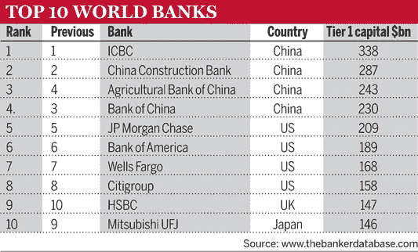
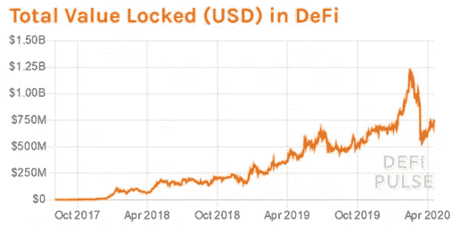

# Defi 如何加速全球经济复苏

> 原文：<https://medium.com/coinmonks/how-defi-can-accelerate-global-economic-recovery-8fbfaa698fb5?source=collection_archive---------4----------------------->

2008 年的全球金融危机是银行过度冒险的结果。政府被迫救助银行，以防止进一步的后果并实现稳定。这场危机暴露了传统金融体系的缺陷，并确定了改进该体系的必要性。

## 伟大的重置

2008 年全球金融危机后，主要经济体的政府和央行做出了决议。他们决定再也不让银行系统威胁经济和社会福祉。

今天，他们还没有完全履行这个承诺。他们现在需要冒着破坏从新冠肺炎灾难性经济影响中恢复过来的持久和可持续的风险。一些国家对公共部门如何退后一步让金融业有更多发挥作用的空间感到困惑，它们已经开始竞争成为更大的全球银行中心。然而，他们这样做并没有考虑到他们实体经济的规模。

继疫情之后，世界经济论坛(WEF)提出了一个名为“大重置”的计划它旨在彻底改变全球经济。这个想法是，社会需要对疫情造成的经济问题作出反应，并预见到与气候变化有关的进一步挑战。根据世界经济论坛，这是一个复苏的机会。

## 为什么 Defi？

分散金融(Defi)是一个分散应用(Daaps)的生态系统，提供建立在没有中央政府授权的分布式网络上的金融服务。它们以分散自治组织为基础，这些组织大多由社区领导。也就是说，没有个人管理组织，而是由社区成员管理。

银行在当前的金融格局中扮演着重要的角色。银行是金融业的主要参与者。它们促进支付，接受存款，向个人和企业提供信贷。截至 2019 年[前十大银行的总资本为 2 万亿美元](https://www.thebanker.com/Top-1000-World-Banks/Top-1000-World-Banks-2019-The-Banker-International-Press-Release-for-immediate-release/)。

[Capitalization of top 10 Banks](https://www.thebanker.com/Top-1000-World-Banks/Top-1000-World-Banks-2019-The-Banker-International-Press-Release-for-immediate-release/)

Defi 旨在通过区块链技术构建一个更具功能性的金融环境。银行系统的三个主要方面将受益于区块链技术的采用。它们是支付和结算系统、可访问性和透明度。尽管如此，加密货币在从疫情的影响中复苏的过程中发挥着作用。目前，分散式金融平台的数量使其用户更容易获得金融服务，效率也更高。这些平台的去中心化、透明度、开放性和速度可以在润滑全球经济方面发挥重要作用。

[Total Value locked in Defi](https://cimg.co/w/articles-attachments/3/5e9/a85849777f.png)

## 经济影响

在早期的创新中，容易且廉价的活动引发了一轮生产过剩和消费过度。果然，华尔街的信贷和杠杆工厂用几乎没有安全保障的新金融产品充斥了房地产市场和其他领域。为了确保快速批准，贷款人最初放宽了标准，提供不需要借款人信用证明的抵押贷款。

当政府和央行注意到这一点时，采取行动已经太晚了。随后的金融内爆几乎引发了一场全球大萧条，迫使那些负责政策制定的人去拯救那些因其鲁莽行为而造成问题的 doe。决策者引入了几项措施来降低银行的风险。他们增加了资本缓冲，改善了监管，并取缔了某些活动。

## 互联网优先，全球优先

冠状病毒疫情的部分次要影响是，人们越来越习惯于在网上进行交易，而不是亲自去银行和其他金融机构。许多人发现，无需亲临现场就能更方便地访问重要的金融基础设施。

除此之外，金融机构和企业正在寻求降低成本，因为他们已经受到了疫情的金融打击。为了节省成本，他们期待数字平台提供更高的效率。这是采用的巨大推动力。

已经有迹象表明，金融机构有兴趣利用区块链技术来改善他们的业务。来自 [business insider 杂志](https://www.businessinsider.com/blockchain-banking-report?r=US&IR=T)12 月的一项研究显示，66%和 56%的金融机构将支付和证券结算视为区块链技术的两个主要用例。

一项类似的开发服务表明，越来越多的企业和自由职业者希望获得实时支付和金融服务。换句话说，对基于加密货币的金融产品所能提供的服务的需求已经越来越大。鉴于世界大部分地区已经经历了经济衰退，未来几个月需求可能会增加。同样，人们对现有金融体系中的挑战越来越不能容忍。

## 采用的驱动因素

短期来看，基于加密的金融平台和产品不太可能对全球经济有太大帮助。然而，从长期来看，金融业可能会进行改革。在央行数字货币和监管方面，很多活动已经在进行中。

例如，中国正在发行其中央银行数字货币(CBDC)，即数字元。欧元区国家正在追随这一趋势。

## 采用的障碍

专家认为，缺乏监管是大多数有组织机构避免参与加密货币的原因之一。一旦有了足够的监管，我们很可能会看到更多的企业组织采用。

就其本质而言，加密货币不受任何国家边界或政府内部特定机构的约束。这种性质对习惯于处理资产明确定义的政策制定者构成了挑战。因此，它们是与加密货币监管相关的未决问题。

此外，加密货币的分类也存在一定程度的混乱。例如，商品期货交易委员会(CFTC)将比特币视为商品，而美国国税局(IRS)将其视为财产。

加密货币的独特特征和全球便携性给监管机构带来了另一个瓶颈。在交易所交易的代币大致有两种类型——公用代币和安全代币。

实用令牌有一个潜在的目的。它们用于奖励行为，并作为对贡献和支持组织的冠军的激励。另一方面，安全令牌代表组织中的权益或股份。他们也可以用来为分权组织的决策投票。

## 你知道吗？

Club Swan-It’s your money, your lifestyle.

使用天鹅俱乐部会员提升您的生活方式。有了 Club Swan，您可以轻松地无缝地从 Crypto 迁移到 Fiat。天鹅俱乐部账户有多种货币，在全球超过 38 个国家接受。更多信息，请点击此链接:[https://clubswan.com/](https://clubswan.com/)

在瑞士金融和技术协会**的帮助下，你可以免费了解区块链和人工智能等新的数字技术。**从 AI 到区块链，从 Challenger Banks 到 DeFi，我们将为您带来 Fintech 的持续学习，一年 365 天。[https://launch think . cfte . education？kid=1KGDSY](https://launchthink.cfte.education?kid=1KGDSY)

**披露—包括附属链接**

> 加入 [Coinmonks 电报频道](https://t.me/coincodecap)，了解加密交易和投资

## 另外，阅读

*   [网格交易机器人](https://blog.coincodecap.com/grid-trading) | [加密交易机器人](/coinmonks/cryptohopper-review-a388ff5bae88) | [加密交易机器人](https://blog.coincodecap.com/best-crypto-trading-bots)
*   [加密复制交易平台](/coinmonks/top-10-crypto-copy-trading-platforms-for-beginners-d0c37c7d698c) | [如何在 WazirX 上购买比特币](/coinmonks/buy-bitcoin-on-wazirx-2d12b7989af1)
*   [CoinLoan 点评【Crypto.com】|](/coinmonks/coinloan-review-18128b9badc4)[coin loan 点评](/coinmonks/crypto-com-review-f143dca1f74c) | [火币保证金交易](/coinmonks/huobi-margin-trading-b3b06cdc1519)
*   [尤霍德勒 vs 考尼洛 vs 霍德诺特](/coinmonks/youhodler-vs-coinloan-vs-hodlnaut-b1050acde55a) | [Cryptohopper vs 哈斯博特](https://blog.coincodecap.com/cryptohopper-vs-haasbot)
*   [顶级付费加密货币和区块链课程](https://blog.coincodecap.com/blockchain-courses) | [币安评论](/coinmonks/binance-review-ee10d3bf3b6e)
*   [MXC 交易所评论](/coinmonks/mxc-exchange-review-3af0ec1cba8c) | [Pionex vs 币安](https://blog.coincodecap.com/pionex-vs-binance) | [Pionex 套利机器人](https://blog.coincodecap.com/pionex-arbitrage-bot)
*   [如何在印度购买比特币？](/coinmonks/buy-bitcoin-in-india-feb50ddfef94) | [WazirX 评论](/coinmonks/wazirx-review-5c811b074f5b) | [BitMEX 评论](https://blog.coincodecap.com/bitmex-review)
*   [印度的加密交易所](/coinmonks/bitcoin-exchange-in-india-7f1fe79715c9) | [比特币储蓄账户](/coinmonks/bitcoin-savings-account-e65b13f92451) | [HitBTC 评论](/coinmonks/hitbtc-review-c5143c5d53c2)
*   [币安收费](/coinmonks/binance-fees-8588ec17965) | [Botcrypto 审查](/coinmonks/botcrypto-review-2021-build-your-own-trading-bot-coincodecap-6b8332d736c7) | [Hotbit 审查](/coinmonks/hotbit-review-cd5bec41dafb) | [KuCoin 审查](https://blog.coincodecap.com/kucoin-review)
*   [我的加密副本交易经历](/coinmonks/my-experience-with-crypto-copy-trading-d6feb2ce3ac5) | [AAX 交易所评论](/coinmonks/aax-exchange-review-2021-67c5ea09330c)
*   [Bybit 融资融券交易](/coinmonks/bybit-margin-trading-e5071676244e) | [币安融资融券交易](/coinmonks/binance-margin-trading-c9eb5e9d2116) | [Overbit 审核](/coinmonks/overbit-review-9446ed4f2188)
*   [加密货币储蓄账户](/coinmonks/cryptocurrency-savings-accounts-be3bc0feffbf) | [YoBit 审核](/coinmonks/yobit-review-175464162c62) | [Bitbns 审核](/coinmonks/bitbns-review-38256a07e161)
*   [Botsfolio vs nap bots vs Mudrex](/coinmonks/botsfolio-vs-napbots-vs-mudrex-c81344970c02)|[gate . io 交流回顾](/coinmonks/gate-io-exchange-review-61bf87b7078f)
*   [Godex.io 评审](/coinmonks/godex-io-review-7366086519fb) | [邀请评审](/coinmonks/invity-review-70f3030c0502) | [BitForex 评审](/coinmonks/bitforex-review-c4bb28d9e271) | [北海巨妖评审](/coinmonks/kraken-review-6165fc1056ac)
*   [最佳比特币保证金交易](/coinmonks/bitcoin-margin-trading-exchange-bcbfcbf7b8e3) | [萝莉点评](/coinmonks/lolli-review-e6ddc7895ad8) | [比特币保证金交易](https://blog.coincodecap.com/bityard-margin-trading)
*   [创造并出售你的第一个 NFT](https://blog.coincodecap.com/create-nft) | [本地比特币评论](/coinmonks/localbitcoins-review-6cc001c6ed56) | [专业评论](/coinmonks/prokey-review-26611173c13c)
*   [加密保证金交易交易所](/coinmonks/crypto-margin-trading-exchanges-428b1f7ad108) | [赚取比特币](/coinmonks/earn-bitcoin-6e8bd3c592d9) | [Mudrex 投资](https://blog.coincodecap.com/mudrex-invest-review-the-best-way-to-invest-in-crypto)
*   [WazirX vs coin dcx vs bit bns](/coinmonks/wazirx-vs-coindcx-vs-bitbns-149f4f19a2f1)|[block fi vs coin loan vs Nexo](/coinmonks/blockfi-vs-coinloan-vs-nexo-cb624635230d)
*   [杠杆代币](/coinmonks/leveraged-token-3f5257808b22) | [最佳密码交易所](/coinmonks/crypto-exchange-dd2f9d6f3769) | [Paxful 点评](/coinmonks/paxful-review-4daf2354ab70)
*   [加密套利](/coinmonks/crypto-arbitrage-guide-how-to-make-money-as-a-beginner-62bfe5c868f6)指南| [如何做空比特币](/coinmonks/how-to-short-bitcoin-568a2d0b4ae5) | [1xBit 回顾](https://blog.coincodecap.com/1xbit-review)
*   [如何在印度购买以太坊？](https://blog.coincodecap.com/buy-ethereum-in-india) | [如何在币安购买比特币](https://blog.coincodecap.com/buy-bitcoin-binance)
*   [在美国如何使用 BitMEX？](https://blog.coincodecap.com/use-bitmex-in-usa) | [BitMEX 评论](https://blog.coincodecap.com/bitmex-review) | [期货交易机器人](/coinmonks/futures-trading-bots-5a282ccee3f5)
*   [最佳加密交易信号电报](/coinmonks/best-crypto-signals-telegram-5785cdbc4b2b) | [MoonXBT 评论](/coinmonks/moonxbt-review-6e4ab26d037) | [OKEx 评论](/coinmonks/okex-review-6b369304110f)