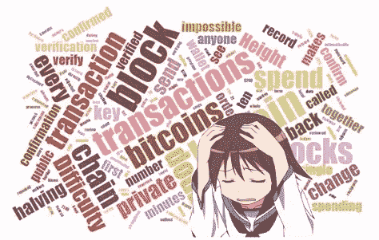
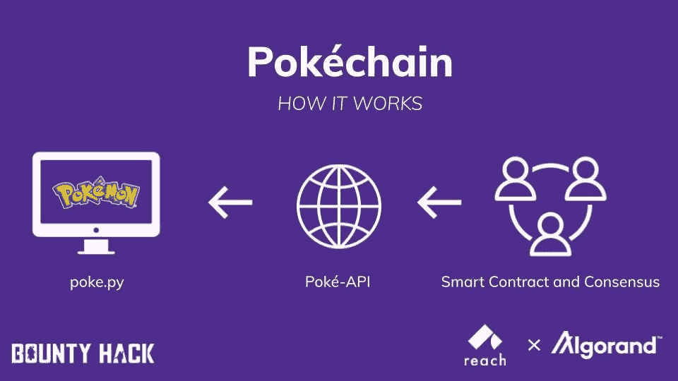
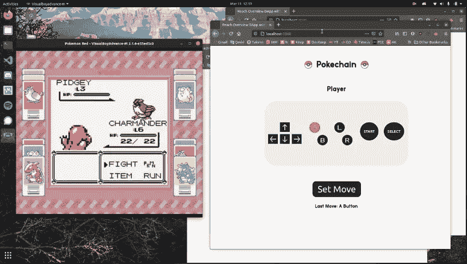
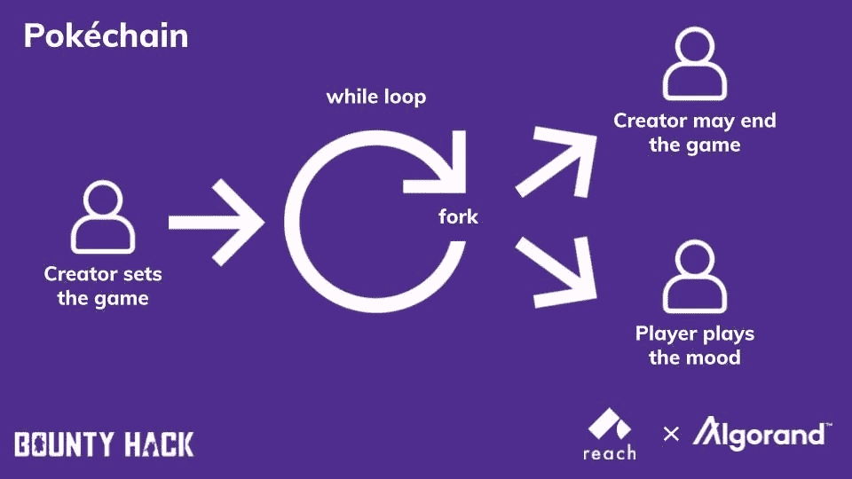
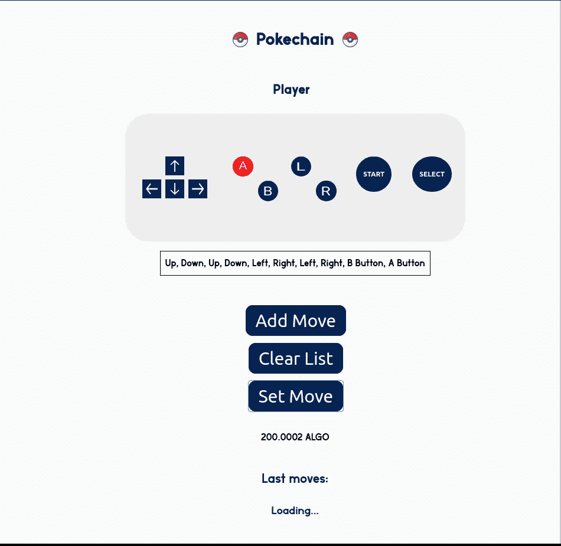

# 我是如何在 Reach 中编写第一个 dApp 的？

> 原文：<https://medium.com/coinmonks/how-did-i-write-my-first-dapp-in-reach-9aa235ab4c90?source=collection_archive---------5----------------------->

我对区块链感兴趣已经有三个月了。起初，它就像一个潘多拉的盒子；dApps，hashes，merkle trees，DAOs 和许多其他的词被抛来抛去。作为一名移动应用开发者，这让我很沮丧。与我投入的时间相比，我取得的进展非常不令人满意。

然后我了解了区块链的开发平台 [Reach](https://reach.sh/) ，它声称是“在区块链上构建的最快、最安全、最简单的方式”。尽管我最初持怀疑态度，但我还是决定试一试。当我完成教程时(两天后我写了第一份区块链申请)，我明白了:就是这样。我终于可以把我的想法变成实用的 dApps 了。

Reach 在 2 月份宣布了一项“赏金黑客”活动，以促进在[algrand](https://www.algorand.com/)网络上的应用程序开发，加强其基础设施，并为 Reach 引入更多的程序员。

下面我要谈论的应用是我提交给 Reach Bounty Hack 的，这是一个黑客马拉松活动，主要目标是鼓励新开发人员编写自己的 Reach 应用程序。

当我第一次听说它时，我刚刚完成教程，不知道如何自己从头开始构建一个完整的应用程序。尽管我没有信心能完成它，我还是决定试一试。

我蹲下身子，钻研文档和教程；一直以来，用无休止的问题骚扰 Reach 的开发团队(*非常感谢 Jay、Chris 和 Dan 的耐心！*)。社区中开始出现导师。不久之后，我*成为了一个鼓励和支持不断有新人在 Reach 中编写程序的人。五周后，我的杰作完成了:第一代口袋妖怪游戏的分散版本，名为*中的“口袋链”，玩家通过交易锁定他们的行动。它运行在 Game Boy 高级模拟器 *…* 和 Algorand 上。**

**

*A screenshot from my game*

# ***工作原理***

*Pokéchain 是一款基于阿尔格兰德的区块链游戏，玩家将他们的移动提交到区块链。一致确认后出招。玩家为他们的移动支付价格，该价格被收集到一个池中，在该池中，该价格可以被转移到该会话的创建者，或者按照各种规则在玩家之间分配。*

> *你可能会问，“为什么是阿尔格兰德”。*
> 
> *如果你熟悉以太坊的发展，答案是显而易见的:与以太坊提供的相比，Algorand 更快，更便宜。以太坊上一个简单游戏的汽油费和交易费大约是 90 美元。在阿尔格兰德，这些费用降低到两美元以下。*

**

# *大惊喜*

*回想开发过程，我惊讶地发现开发中最容易的部分是区块链部分。由于 Reach 对底层可靠性和 TEAL 代码的抽象，在复杂的开发者环境中通常需要数百行代码才能编写的游戏，在 Reach 中只需要 80 行代码就可以完成。*

*就编程语言而言，Reach 相对简单。它在语法和语义上类似于 JavaScript 应用程序是用 JavaScript 语法指定的。在许多场景中，设计逻辑 Reach 适用于契约参与者，使得编码过程像为舞台编写脚本一样简单。*

**

*我在构建前端时遇到了一些问题，因为这是我第一次为 React & Node.js 编写项目。我真的很难处理状态管理，因为 Dapp 的本质很难与 React 应用程序结合。这就是我的队友纳米克(sn#3348)完成离合器辅助的地方。他帮我设计页面风格，管理应用程序的状态。*

*尽管我们在接近尾声时遇到了一些困难，但我现在更习惯于在 dAapp 中编写 React 代码和管理状态。Reach 已经支持任何前端*库*。据我从开发团队那里听到的消息，Reach 将很快支持所有前端*语言*(带有即将到来的 RPC 服务器特性)。作为一名 Flutter 开发者，我很高兴看到 Reach 的发展方向。*

*也有用 Python 写的代码，当输入被给出时玩口袋妖怪游戏。这些步骤只是与请求库相结合的基本 PyAutoGUI 功能。我的机器人来自经典的“Twitch Plays Pokemon”项目，这也是“Algorand Plays Pokemon”的起点(我在 Bounty Hack 中被分配的项目)。*

*在《T4》仅仅两周的开发之后，我正在看我的游戏的工作版本。像这样的时刻提醒我，作为一名开发人员，感觉有多棒。看到我的想法在如此短的时间内实现，我可以肯定地说，Reach 使区块链开发尽可能容易。由于代码库的简单性，在我目前所构建的基础上进行改进是相当容易的。*

**

*The latest version of the game where you can input multiple moves at once*

*我真的很感谢 Reach 为我提供了一个平台，让我可以快速简单地将我的想法转化为功能良好的区块链应用。我还想感谢其他赏金黑客参与者为我们的 dApp 投票。我们并没有真的期望在社区中的其他朋友所做的伟大项目中获胜。我无法表达我有多高兴能参与其中。*

*如果你不确定在 Reach 中编写你的区块链应用程序，我唯一的建议是至少[尝试一下](https://docs.reach.sh/tut.html)。我相信你会发现比我在这篇短文中所能解释的更多的东西。*

*如果你想看我的游戏，你可以查看我解释它的视频。*

*你也可以在 Github 的这里看到项目[的源代码。](https://github.com/Zetsuboii/pokechain/tree/multipleMoves)*

*感谢您的阅读，祝您愉快！*