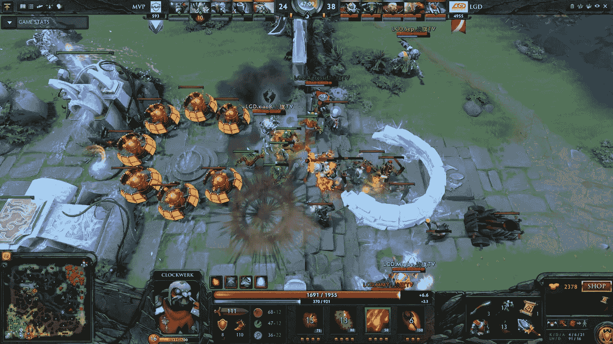
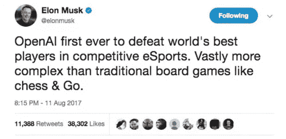

# OpenAI 的 Bot 是如何打败 Dota2 半职业的队伍的？

> 原文：<https://medium.com/coinmonks/how-did-openais-bot-defeat-the-team-of-dota2-semi-pros-969e609522f4?source=collection_archive---------4----------------------->

游戏已经成为一种广泛采用的衡量人工智能进步的方式。自从 1997 年“深蓝”赢了加里·卡斯帕罗夫的一盘棋后，人工智能有了许多显著的进步。在大多数衡量人类智力的游戏中，机器都超过了最优秀的人类，包括国际象棋、拼字游戏、奥赛罗，甚至是危险边缘游戏！

几年前，我们目睹了谷歌的 AphaGo 在与围棋世界冠军的比赛中获胜(围棋是一种有 2500 年历史的游戏，比象棋复杂得多，需要一点智慧和策略，而不是尝试所有可能的动作组合)，显示了人工智能令人印象深刻的进步，特别是在过去几年中。虽然令人印象深刻，但如果我们谈论的是智力，这是否是衡量智力的方法，这仍然是个问题。

# 是时候让 AI 成为最好的 Dota2 团队了

现在是 2018 年，我们正在见证又一个人类冠军被一个 AI 智能体打败，这次是在 Dota2。几个月前，由埃隆·马斯克、雷德·霍夫曼和彼得·泰尔支持的总部位于旧金山的非营利人工智能研究公司 OpenAI 宣布，他们计划在他们玩 Dota2 的人工智能代理和 Dota2 的前职业选手团队之间举行一场官方 Dota2 比赛。不是国际象棋，不是奥赛罗或围棋，而是世界上最受欢迎的网络策略游戏之一:Valve 的 [Dota 2](https://venturebeat.com/2017/08/12/team-liquid-wins-dota-2-championships-takes-home-10-8-million/) 。它立即引起了关注:无论是 AI 社区还是 Dota 游戏玩家社区。

但是，对于 OpenAI 的 Dota 玩家来说，这并不是它将要玩的第一个游戏。以前，在它的第一代中，它只限于 1 对 1 的匹配(这应该不太复杂)，但它在 5 对 5 之前已经测试了很多次。今年 6 月，OpenAI 的 Dota 玩家在 6 月份成功击败了五支业余玩家队伍(在 5 对 5 的设置中)，其中包括一支由 Valve 员工组成的队伍。在这次成功之后，击败职业队的挑战就开始了。

为了使游戏易于人工智能管理，游戏中引入了一些(低影响)的限制，例如可供选择的英雄池更窄，以及无敌的物品递送员。据说这些对 OpenAI Five 的成功没有太大影响。

**8 月 5 日，OpenAI Five(人工智能代理玩家的称呼)在三局两胜系列赛中击败了前职业选手团队，比预期的要容易得多！**它在没有一个塔被对手摧毁的情况下赢了第一局，确实了不起。此外，由于良好的团队合作，它在决策和战略决策中表现出了智慧。

# 他们是怎么做到的？

OpenAI Five 实际上是**一组分配给每个英雄的五个单层、1024 单位长的短期记忆(LSTM)递归神经网络**(在 5 对 5 设置中)。事实上，它不是一个多模块的超级复杂系统，而只是一组简单的递归神经网络，这使得它更加令人印象深刻。

*“人们过去认为利用今天的深度学习是不可能实现这种事情的”*，正如 OpenAI 的联合创始人之一兼首席执行官 Greg Brockman 所说。五个连网络都不互通的简单设定，打败了一队人类高手。即使英雄们(事实上，网络)不交流，仍然有明显的团队化学反应。实际上，团队合作被设计为由一个超参数控制，该参数可以设置为 0 到 1，并增加了一个权重，即与整个团队的平均奖励相比，每个英雄应该关心自己的个人奖励。通过这种方式，OpenAI Five 能够提出自己的策略。

Elon Musk on Twitter about OpenAI’s win against human pros

所有的网络每四帧得到一个关于比赛状态的输入。事实上，每个输入都是 20，000 个浮点数，这些浮点数编码了重要的信息，如可见单元的位置和健康状况，使它能够访问人类团队可能拥有的相同知识。平均而言，反应时间比人快，OpenAI 的代理人稍占优势。

用 OpenAI 的近似策略优化和自我游戏来训练网络。他们每天“玩”180 年的游戏——80%与自己对抗，20%与过去的自己对抗。为了让这一切成为可能，OpenAI 在谷歌的云平台上使用了 256 个英伟达特斯拉 P100 显卡和 128，000 个处理器内核。

OpenAI 宣布，他们正在进一步改进 OpenAI Five，它将参加“*国际*”比赛，这是最大的国际 Dota2 锦标赛，参赛队伍可以赢得数百万美元的奖金。OpenAI Five 将有机会成为著名的 Dota2 冠军，并再次展示我们有多么先进的人工智能。

*最初发表于*[*neuro hive . io*](https://neurohive.io/en/news/how-did-openai-s-bot-defeat-the-team-of-dota2-semi-pros/)*。*

> [直接在您的收件箱中获得最佳软件交易](https://coincodecap.com/?utm_source=coinmonks)

