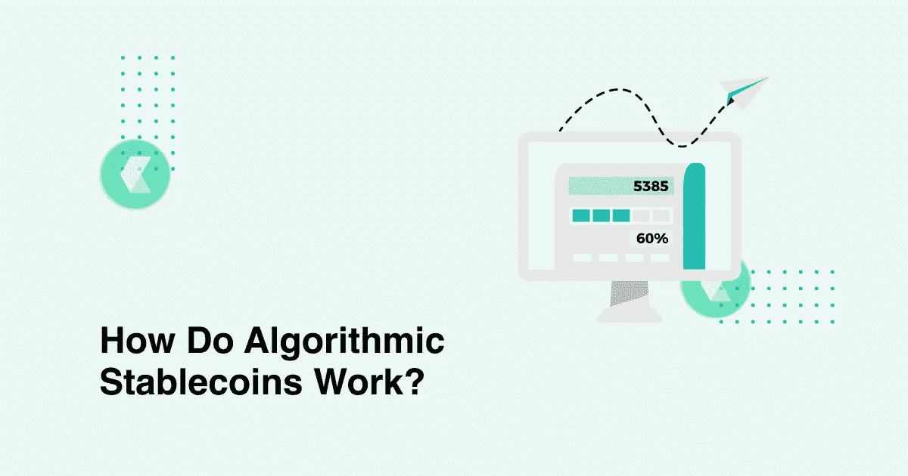
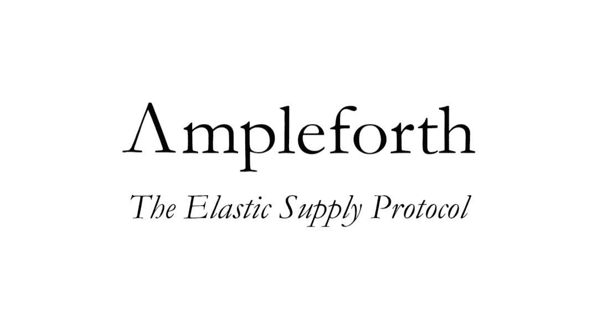
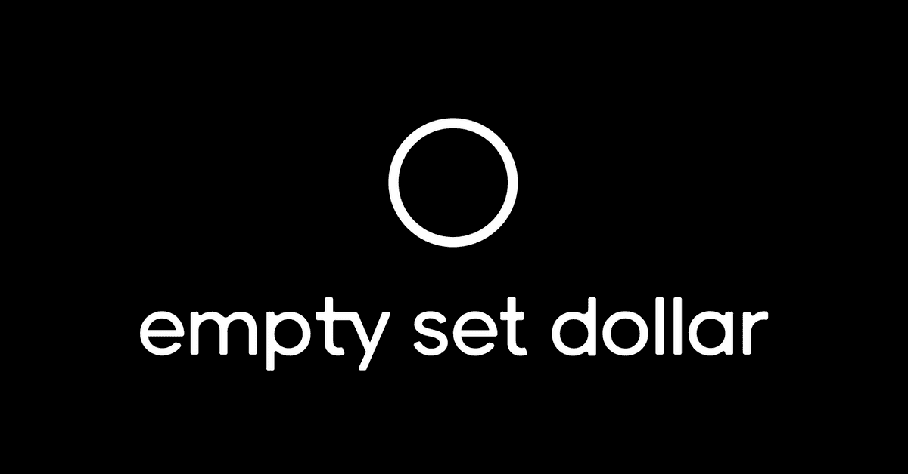
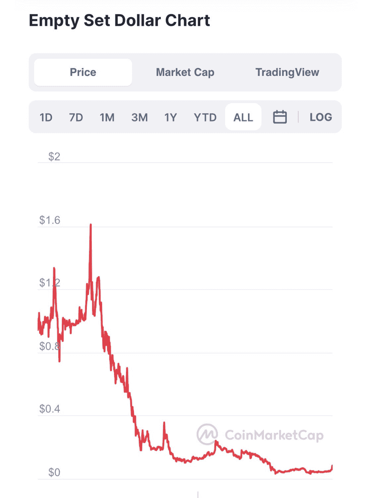

# 算法 Stablecoins 是如何工作的，为什么它很重要？

> 原文：<https://medium.com/coinmonks/how-do-algorithmic-stablecoins-work-and-why-does-it-matter-24e036d6a631?source=collection_archive---------4----------------------->

How Do Algorithmic Stablecoins Work

如果所有这些稳定的货币都与同一个美元挂钩，它们怎么会不同呢？如果你问过自己这个问题，这篇文章是给你的。

这就是为什么它很重要:不同的稳定资本在提供一些独特功能的同时，也带来了某些类型的风险。尽管 Tether 是市值排名前三的加密货币，受到数百万人的信任，但它一直被指责管理不透明。相比之下，一个不太主流的 Celo 协议提供几乎即时的交易，费用为 0.01 美元。

在本文中，我们将快速了解 stablecoins 如何随着时间的推移而发展，并更精确地考虑新一代算法 stablecoins。您将看到 Claim 的 stablecoin 是如何在此基础上构建的，以及如何利用它。

# 稳定玉米的进化

平背马驹。非常明显的解决方案首先实现了:“好吧，我们需要一种总是花费 1 美元的加密货币——让我们用真正的美元来支持它”。这就是 USDC USDT 的崛起。然而，他们的集中经常被滥用——审计不定期，不够彻底；一些钱包自愿被列入黑名单[。](https://support.usdc.circle.com/hc/en-us/articles/360016060352-Can-a-customer-send-USDC-tokens-to-any-address-Can-addresses-be-blacklisted-)

**密码支持。建立一个不可靠的稳定的货币的意图导致了戴的出现。当用户将他们的资金存入创客智能合约时，这些资金被用作储备抵押品，戴被铸造。为了避免抵押品价格暴跌，DAI 需要超额抵押:抵押品比 DAI 供应量大几倍。**

**算法。**这种类型的稳定信贷既分散又不可信，而且不需要巨额抵押品。它在市场上保护自己的联系汇率，自动调节供给。当稳定的硬币价格高于挂钩价格时，协议会发行更多的代币，当价格过低时，协议会将其买断。

许多算法稳定的货币被创造出来，成为防止通货膨胀的货币，可以作为 DeFi 部门的稳定抵押品。然而，在 Ampleforth (AMPL)、Basis Cash (BAC)和 Empty Set Dollar (ESD)中，现在只有前者在运行。一种不同的重点 Celo Dollar (cUSD)适用于超快速和廉价的交易，而 stablecoin(也称为 cUSD)则代表了新诞生的基于信用的 stable coin。让我们仔细看看这些令牌及其用例。

# Ampleforth —无通货膨胀、无相关性

Ampleforth 于 2018 年推出，是第一代算法 stablecoin。它的使命不仅仅是“尽可能接近 1 美元”——ample forth 的目的是成为一种不受通胀影响的资产，以及与比特币等主要加密资产的相关性。目的是无论市场上发生什么，都要保持其购买力。

Ampleforth 可用于使加密组合多样化，作为 DeFi 中的储备抵押品，并最终作为“可适应冲击的央行货币的替代品”。

安普尔福思是这样工作的。当该协议发现 AMPL 价格超过 1.06 美元时，它会启动一个正的重新定基——流通中的代币数量会增加。如果价格低于 0.96 美元，一些 AMPL 代币会以负基准进行烧制。

有趣的是，所有 AMPL 代币持有者并不真正拥有固定数量的代币——他们拥有 Ampleforth 的固定份额。当发生令牌烧毁时，用户会看到他们钱包中的令牌数量减少，但它们的价值保持不变。

# ESD，空套美元—被过度激励？

空集美元是 2020 年推出的第二代算法 stablecoin。虽然不太成功:

与 Ampleforth 一样，ESD 正在努力成为 DeFi 的储备抵押品货币。在他们雄心勃勃的计划中，这个匿名团队打算除掉:

*   系绳的集中化，
*   戴被过度抵押的需要，
*   安普尔福思的“死亡螺旋”还记得 AMPL 减少代币数量，但价值保持不变的事情吗？ESD 建议，当一些用户看到他们“丢失”了令牌时，他们会在没有任何理解的情况下恐慌地出售剩余的令牌，并建议每个人都这样做。这加剧了供给收缩，并使代币失衡。

为了克服这一点，可持续发展教育使重定基数成为自愿的。如果你只是需要 ESD 作为稳定币，仅此而已，你就不必参与 rebases。但是，如果您想参与协议，您可以在 DAO 中锁定他们的令牌，然后在正 rebase 的情况下获得更多令牌(当价格高于 1 美元时，我们需要通过增加供应来稀释它)。如果代币低于 1 美元，该协议将获得您的 ESD，并将其烧毁以换取优惠券。你可以在一个积极的基础上用这些优惠券进一步赎回新发行的 ESD，协议的债务越大，你得到的就越多。

这是一个很有前途的概念，但只是在理论上。实际上，这种货币变得非常不稳定，并与联系汇率制脱钩。这个例子告诉我们:不是所有的稳定币模型都有效。首先需要对它们进行测试。

# celo——主流采用的稳定核心

Celo 协议以最低的准入门槛设计加密金融服务。他们创建了一个移动优先的基础设施，允许在几秒钟内将他们的稳定货币 Celo USD (cUSD)发送到世界上的任何地方，费用约为 0.01 美元。

cUSD 的储备抵押品存储在 [Celo 储备](https://celoreserve.org/)中，包括本地令牌 Celo、比特币和以太坊。通过扩大和收缩供给，稳定的硬币保持在 1 美元。

对于这种 stablecoin，有一个可靠的用例:Celo 网络中的公钥与一个电话号码相连，你可以向甚至还没有加入该网络的人汇款。与区块链同步需要最少的数据，这使得它非常快。

Celo 正是曾经被 Tether 宣称的 crypto 和 fiat 之间的桥梁。它速度快，超便宜，而且对密码新手来说很容易使用。

# 债权融资——利用抵押品的新方式

Claim 的稳定币不是算法币，而是基于信用的稳定币。在我们的平台上，用户存入 DAI，然后我们铸造 cUSD(不要与 Celo USD 混淆！)并将其投入到由主张 DAO(earning 等)验证的 DeFi 协议中。收入在社区——声明治理令牌持有者之间分配。用户可以以 1:1 的比例赎回池中的任何稳定币资产。

债权的独特之处在于，我们用沉淀的资产作为资产预期收益形成的信用杠杆。也就是说，稳定的货币不仅由现有的储备来平衡，而且资产的预期未来回报也将被用作可信的抵押品。这些资产的 ROI 将作为索赔信用系统的支持值。我们相信这是一个非常有前途的机制，一旦经过全面测试并产生可靠的结果，我们会让你知道。

# 技工是王道

稳定硬币不仅仅是争取价值 1 美元的代币。他们如何实现这一点的机制至关重要，特别是在算法稳定的情况下——因为它直接影响用户做什么以及他们最终会收到什么。在选择与哪些 stablecoins 互动时，请记住这一点，我们希望您的体验将真正稳定。

## 另外，阅读

 [## Stablecoins -简单概述

### 稳定货币是加密货币，其价值与稳定(波动性较小)的金融资产挂钩，如美元…

blog.coincodecap.com](https://blog.coincodecap.com/stablecoins-a-simple-overview)