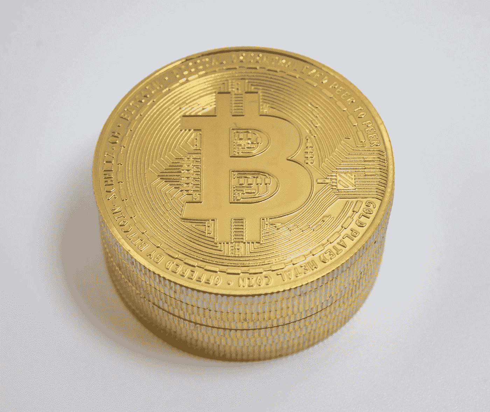

# 我如何识别比特币热潮？

> 原文：<https://medium.com/coinmonks/how-do-i-recognize-a-bitcoin-boom-81a156562971?source=collection_archive---------3----------------------->

## 尽早为课程爆发做好准备

Photo by [Jürg Kradolfer](https://unsplash.com/@bitcoin_schweiz?utm_source=medium&utm_medium=referral) on [Unsplash](https://unsplash.com?utm_source=medium&utm_medium=referral)

[比特币](https://blog.coincodecap.com/a-candid-explanation-of-bitcoin) (BTC)是迄今为止最流行、最受欢迎的加密货币。长期以来，它一直是领先的数字货币，是股市杂志和行业期刊报道中不可或缺的一部分。这主要是由于 2017 年和 2018 年的巨大加密炒作。中本聪发行的加密货币实现了价格…