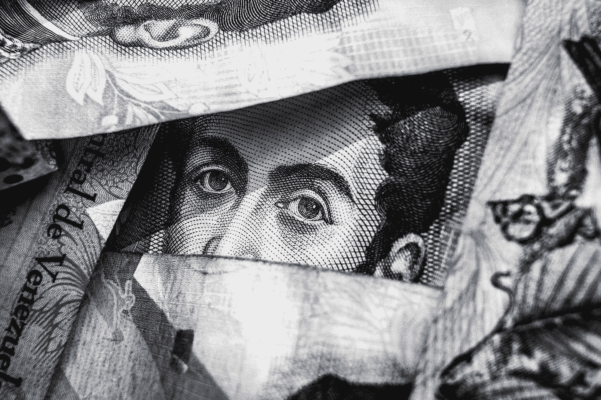
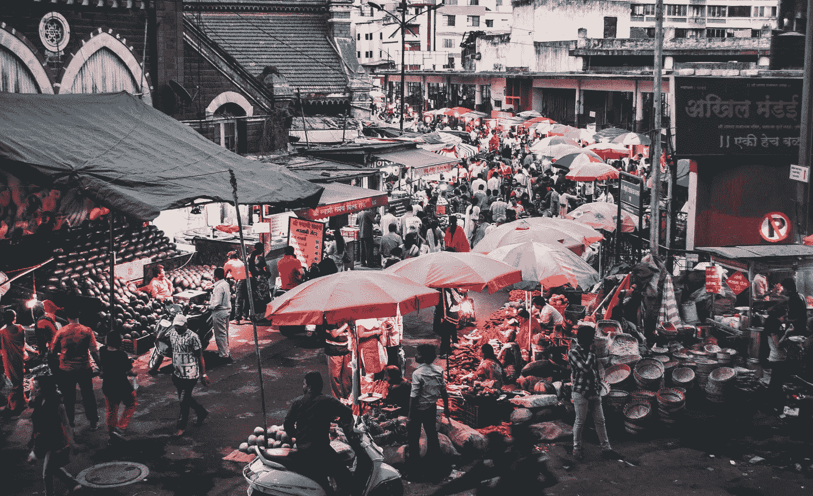

# 我们如何为区块链技术设计更好的 UX？

> 原文：<https://medium.com/coinmonks/how-do-we-design-a-better-ux-for-blockchain-technology-eb4050fe743e?source=collection_archive---------2----------------------->

Photo by [rawpixel](https://unsplash.com/photos/hESpmVOv1DU?utm_source=unsplash&utm_medium=referral&utm_content=creditCopyText) on [Unsplash](https://unsplash.com/?utm_source=unsplash&utm_medium=referral&utm_content=creditCopyText)

嗯，这个问题类似于为万维网(www)技术生产最好的 UX 的技巧——让它成长，看看它能在哪个行业哪个范围内被使用。然后是深入设计的时候了。

Photo by [Freddie Collins](https://unsplash.com/photos/uXWPg9uMwt8?utm_source=unsplash&utm_medium=referral&utm_content=creditCopyText) on [Unsplash](https://unsplash.com/?utm_source=unsplash&utm_medium=referral&utm_content=creditCopyText)

# 我是怎么被区块链热困住的？

早在 2017 年初，我的团队收到了一份客户简报，内容是为一家总部位于欧洲的区块链公司在亚洲制定品牌命名战略。我很幸运地负责这项战略，这是我第一次对加密货币有所了解，以及它将如何重塑全球金融格局，并重新定义目前由美元主导的菲亚特世界。我在这个领域参与得越多，就有越多有趣的见解涌现出来。

# 一个更好的 UX 来自一个清晰的 TA

寻求更好的用户体验？我通常会先定义目标受众(TA)，并为他们设计具体的体验:

Photo by [Chris Liverani](https://unsplash.com/photos/NDfqqq_7QWM?utm_source=unsplash&utm_medium=referral&utm_content=creditCopyText) on [Unsplash](https://unsplash.com/?utm_source=unsplash&utm_medium=referral&utm_content=creditCopyText)

## 1.金融和技术专业人士

根据剑桥替代金融中心(CCAF)2017 年的一份 [***报告***](http://www.cam.ac.uk/research/news/study-highlights-growing-significance-of-cryptocurrencies) 显示，全球只有 0.05%的人口拥有加密货币，这意味着大多数公众可能还没有准备好接受这项技术。

然而，对于自 2013 年以来已经加入这一游戏的 0.05%的创新者来说，我们可以通过将现有的金融产品线，如定期存款、基金或股票纳入一个账户，并按地区发展经验，来开发一个良好的 UX。本地化在这里扮演着重要的角色。在这种情况下，如何通过提炼用户已经习惯的体验，降低用户的学习曲线，把他们的心智/币勾起来，才是当务之急。

Photo by [Muhammad Raufan Yusup](https://unsplash.com/photos/rYRE6ju-2K8?utm_source=unsplash&utm_medium=referral&utm_content=creditCopyText) on [Unsplash](https://unsplash.com/?utm_source=unsplash&utm_medium=referral&utm_content=creditCopyText)

## 2.数字游民，他们的工作与金融或投资无关

在我们开始为这个 TA 提出任何区块链相关产品的 UX 概念之前，技术的领域需要扩展到一个更加面向消费者的行业，而不仅仅局限于金融商品。

对于数字游民来说，熟悉新奇的数字体验并不具有挑战性，但他们需要从他们感到舒适的地方开始。我们不能要求他们立即投入投资世界。他们可能还没有购买过任何股票。

Photo by [Ethan Hu](https://unsplash.com/photos/Ghsv7mOFcsk?utm_source=unsplash&utm_medium=referral&utm_content=creditCopyText) on [Unsplash](https://unsplash.com/search/photos/cafe-people?utm_source=unsplash&utm_medium=referral&utm_content=creditCopyText)

## 3.“加密货币到底是什么”这类人

我们可以为数字游牧民或金融/技术专家设计易于使用的区块链产品，他们至少能够以游牧民的方式进行数字生活或展示投资记录。

但是对于那些对各种投资活动毫无兴趣的人，让我们现在就忘记 UX 吧！

将技术带入一个更面向客户的商业世界，比如快速消费品或旅游行业，先从普通大众更熟悉的领域入手。

Photo by [Alexandre Godreau](https://unsplash.com/photos/7YlHU_ZPS34?utm_source=unsplash&utm_medium=referral&utm_content=creditCopyText) on [Unsplash](https://unsplash.com/?utm_source=unsplash&utm_medium=referral&utm_content=creditCopyText)

# 结束语

我们不需要知道如何构建一个网站，但我们可以毫不费力地在 Youtube 上欣赏我们最喜欢的视频——我们知道这是一个很好的用户体验。

同样的想法也适用于为众多的任务授权设计一个更加用户友好的加密/区块链产品。

当全球大多数人口还没有准备好的时候，我们最好鼓励当前的区块链技术超越密码，进入消费者更熟悉的领域，如零售、旅游和娱乐。然后，是时候为他们设计一个耐人寻味的体验了！

Photo by [Atharva Tulsi](https://unsplash.com/photos/gcU6y0qhEio?utm_source=unsplash&utm_medium=referral&utm_content=creditCopyText) on [Unsplash](https://unsplash.com/search/photos/south-east-asia-market?utm_source=unsplash&utm_medium=referral&utm_content=creditCopyText)

# 第三世界国家的下一个狂热？

第三世界国家可能是区块链或加密相关金融技术发展的最有利的地方，因为其金融体系不成熟，法律约束较少。

对于具有组织化金融结构的发展中国家或发达国家来说，新业务，如游戏、AR/VR 或 AI，可能为卓越的区块链 UX 提供良好的增长机会。