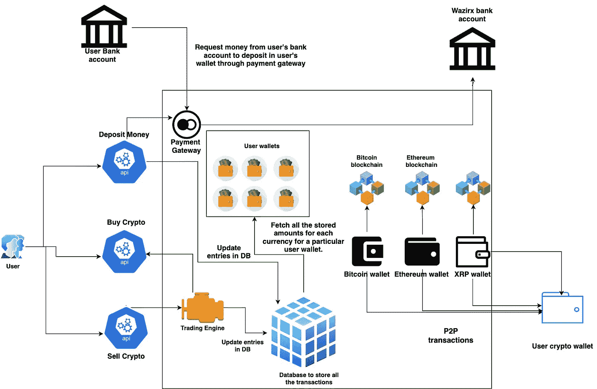

# 集中式加密交换实际上是如何工作的？

> 原文：<https://medium.com/coinmonks/how-does-a-centralised-crypto-exchange-actually-work-84a574fe0a1?source=collection_archive---------0----------------------->

## 交易实际上是如何发生的？

这个问题困扰我很多天了。搜索互联网，试图找出一个中央加密交换实际上是如何工作的。有许多文章在表面上处理集中式和分散式加密货币之间的差异。在我们按下买入/卖出按钮后，没有人会深入解释交易是如何发生的。

我想到的一些主要问题是:

1.  交易所如何支持不同区块链上的不同硬币？他们是否为每个区块链上的每个人都保留了钱包(就像一个钱包里有 XRP、以太、比特币)？
2.  交易发生在哪两个钱包之间？它是否发生在两个人之间，一个人试图出售，另一个人试图购买/或加密货币维持一个大的池，并从该池中增加和减少？
3.  我们的钱包是热钱包(联网)还是冷钱包(不联网)？
4.  我们的交易是只发生在交易所的人之间还是发生在区块链的任何人之间？
5.  他们是如何把一个密码转移到另一个密码的，比如他们是如何转换 BTC-ETH 等的？
6.  为什么所有货币的汇率在所有交易所都几乎一样？

我搜索了谷歌/看到了许多 youtube 视频，但我不明白这一切是如何发生的。因此，在这篇文章中，我讨论了我的想法和我从朋友那里得到的所有知识。我认为，我们认为它的工作方式与实际工作方式非常接近。

在开始讨论加密货币交易所如何工作之前，让我们先来看看什么是加密货币？我将尽可能简单地解释它。

所以加密货币只不过是一种去中心化的货币。我们日常交易使用的货币是中央货币。它们由每个国家的政府控制和管理。另一方面，加密货币不受任何人的监管。只是法典规定的。是的，你没看错，代码就是法律。因此，任何两个人之间的交易都不是由任何人来中介的，而是由银行以某个特定国家的货币进行交易。银行维护每个人账户交易的分类账。你可以进入你的账户，查看你完成的所有交易。在加密货币中，这个分类账是分布式的。它不是由一个人来维护，而是由系统中的每个人来维护，这个人叫做——**区块链。**所有交易都在分布式分类账中维护。每个人都可以接触到它。所以任何人都可以看到所有的交易，没有人可以篡改。这为去中心化的交易提供了最高级别的安全性，没有人能够篡改它——没有任何政府，没有任何银行，也不可能出现人为错误。这全是代码，是的，它可以被黑客攻击，但银行服务器也可以，它们比分散化的区块链脆弱得多。

现在回到今天的主题，集中交易。他们在区块链交易中扮演什么角色？他们是分散式交易所交易的中介。但是他们如何调解区块链上的交易，因为没有人能修改它。我的好奇心就是从那里开始的，并使我产生了以上所有的问题。集中式交易所使人们可以方便地兑换加密货币，并将他们的实际货币(美元/印度卢比/欧元)转换为加密货币。如果没有集中的交易所，人们将不得不使用分散的交易所，这是在集中交易所之后很久才出现的，并且有其自身的相关问题。这就像是鸡和蛋的问题。你只是在一个去中心化的平台上交易加密货币，但是如果你没有加密货币，你怎么交易。

集中式交易所充当加密货币的银行。他们处理交易的分散部分，并像银行一样维护订单簿。因此，如果发生交易，你实际上不是在区块链上交易，而是在一个集中的交易所交易，这个交易所只是维护这些交易的记录。

下图显示了集中交易如何工作的基本设计。

为了简单起见，我们只讨论 3 个函数:

1.  将钱存入交易所的钱包。
2.  从交易所购买加密货币。
3.  在交易所出售加密货币。

让我们一步一步地解决每个问题。

1.  **存款:**使用这个 API，用户可以将法定货币——美元/欧元/印度卢比存入交易所的钱包。这可以通过公司使用的支付网关来完成。这笔钱再转入公司的钱包。在 db 中生成用户存款的条目，该条目用于反映用户钱包中的钱数。
2.  **购买加密货币:**使用这个 API，用户可以购买交易所支持的任何加密货币。当用户点击购买时，区块链上实际上没有发生任何交易。相反，交易使用匹配/交易引擎来匹配买方和卖方，然后相应地更新 db 中卖方和买方的条目。交易所对每笔交易收取费用，你可以说是维护每笔交易的费用。
3.  **出售加密:**使用这个 API，用户可以出售交易所支持的任何加密货币。类似地，购买加密货币，同时出售也会发生同样的事情。交易所只是找到一个匹配的买家，他准备以与这个人卖出时相同或更高的价格买入。因此，正如我们所见，区块链上实际上什么也没有发生。它只是一个保存记录和匹配订单的公司。你在钱包里看到的只是一个数据库条目。大多数集中式交换机不共享用户钱包的私钥。原因很简单，因为他们没有任何用户钱包。对于每种加密货币，他们都有特定的兑换钱包，当有人想将他们的加密货币转移到实际的钱包时，他们会使用这种钱包，他们自己拥有钱包的私钥，而不是任何兑换。

交易所拥有的加密货币钱包用于这些目的，并且还用于维持交易所中加密货币的价格尽可能接近所有其他交易所。这是必需的，因为有许多不同的交换机，每个交换机上有不同数量的用户。由于一个交易所的人可能准备以比任何其他交易所更低/更高的价格出售/购买密码，所以价格可能会有所不同。这是借助[套利](https://www.businesslive.co.za/bd/companies/financial-services/2021-05-19-native-how-arbitrage-is-taking-the-crypto-industry-by-storm/#:~:text=Arbitrage%20trading%20means%20profiting%20from,be%20more%20or%20less%20pricey.)完成的。

现在回到我们上面讨论的每个问题:

1.  交易所如何支持不同区块链上的不同硬币？他们是否为每个区块链上的每个人都保留了钱包(就像一个钱包里有 XRP、以太、比特币)？— ***不，他们没有，他们只是为每种加密货币准备了几个钱包，用于 P2P 转账/维持价格。***
2.  交易发生在哪两个钱包之间？它是否发生在两个人之间，一个人试图出售，另一个人试图购买/或加密货币维持一个大的池，并从该池中增加和减少？— ***交易发生在试图在交易所买卖的两个人之间，其结果仅仅是资金转移的数据库条目。***
3.  我们的钱包是热钱包(联网)还是冷钱包(不联网)？— ***我们没有任何钱包，交易所有一些钱包作为热钱包，一些作为冷钱包。这个要看兑换*还是**
4.  我们的交易是只发生在交易所的人之间还是发生在区块链的任何人之间？——***它们只发生在交换的两个人之间*** *。*
5.  他们是如何把一个密码转移到另一个密码的，比如他们是如何转换 BTC-ETH 等的？— ***他们只是创建一个数据库条目，实际上并没有进行任何转换***
6.  为什么所有货币的汇率在所有交易所都几乎一样？— ***这是借助套利完成的。***

我希望这回答了你的许多问题，并帮助你理解集中交易是如何运作的。如果没有，这篇文章一定会引起更多关于集中/分散交换的问题和好奇。作为一名软件工程师，我将会写更多的文章，从软件的角度来看事情实际上是如何工作的。

下次见！！！！！！

> 加入 [Coinmonks 电报频道](https://t.me/coincodecap)，了解加密交易和投资

## 另外，阅读

 [## 最佳加密交易所| 2021 年十大加密货币交易所

### 加密货币交易所的加密交易需要了解市场，这可以帮助你获得利润…

blog.coincodecap.com](https://blog.coincodecap.com/crypto-exchange)  [## 2021 年 9 大最佳加密借贷平台

### 当谈到加密货币贷款时，大量因素等同于良好的收入状况。此外，借款的一部分…

blog.coincodecap.com](https://blog.coincodecap.com/crypto-lending)  [## 2021 年最佳加密交易机器人(免费和付费)

### 2021 年币安、比特币基地、库币和其他密码交易所的最佳密码交易机器人。四进制，位间隙…

medium.com](/coinmonks/crypto-trading-bot-c2ffce8acb2a)  [## 最佳 6 个加密交易信号电报通道

### 这是乏味的找到正确的加密交易信号提供商。因此，在本文中，我们将讨论最好的…

medium.com](/coinmonks/best-crypto-signals-telegram-5785cdbc4b2b)  [## BlockFi 评论 2021:利弊和利率

### 今天，我们提出了一个全面的 BlockFi 评论，这是一个成立于 2017 年的加密贷款平台，拥有其…

blog.coincodecap.com](https://blog.coincodecap.com/blockfi-review)  [## 如何在印度购买比特币？2021 年购买比特币的 7 款最佳应用[手机版]

### 如何使用移动应用程序购买比特币印度

medium.com](/coinmonks/buy-bitcoin-in-india-feb50ddfef94)  [## 加密税务软件——五大最佳比特币税务计算器[2021]

### 不管你是刚接触加密还是已经在这个领域呆了一段时间，你都需要交税。

medium.com](/coinmonks/best-crypto-tax-tool-for-my-money-72d4b430816b)  [## Pionex 评论 2021 |免费加密交易机器人和交换

### Pionex 是为交易自动化提供工具的后起之秀。Pionex 上提供了 9 个加密交易机器人…

medium.com](/coinmonks/pionex-review-exchange-with-crypto-trading-bot-1e459d0191ea)  [## 存储比特币的最佳加密硬件钱包[2021]

### 保管您的数字资产很容易，但找到正确的存储方式却是一项繁琐的任务。在线钱包有一个风险…

blog.coincodecap.com](https://blog.coincodecap.com/best-hardware-wallet-bitcoin)