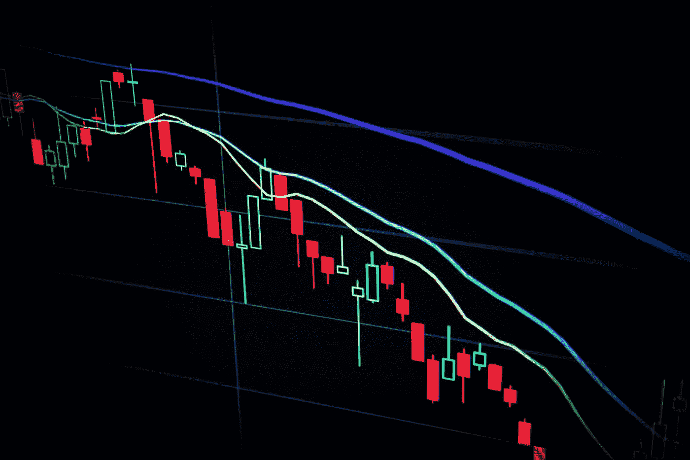

# 加密如何有价值？

> 原文：<https://medium.com/coinmonks/how-does-crypto-have-value-aa8f76cc1d1a?source=collection_archive---------8----------------------->

## (加密货币概述:第三部分)

你经常会听到加密怀疑论者说“加密货币没有内在价值”之类的话。这到底是什么意思？除此之外，硬币怎么会有价值呢？这篇文章探讨了加密货币如何具有价值，以及为什么人们仍然选择投资这样一种抽象的商品。