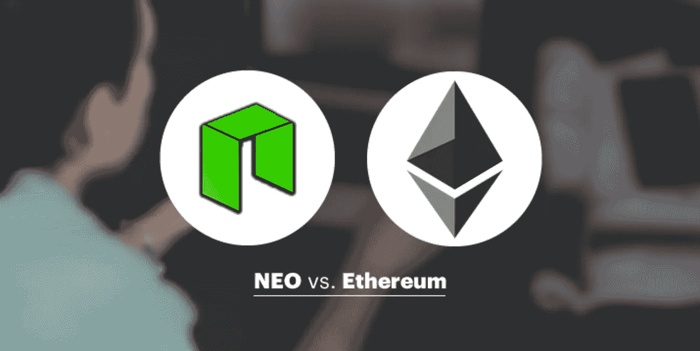
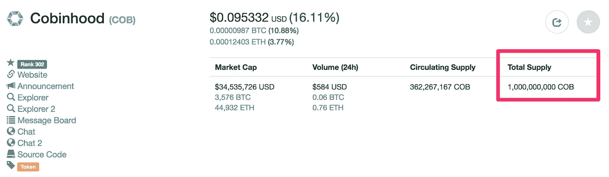

# ICO 是如何工作的(程序员解释)

> 原文：<https://medium.com/coinmonks/how-does-ico-work-under-the-hood-programmer-explain-f27beec46b27?source=collection_archive---------8----------------------->

Smart Contract For Fun Rasing

`**ICO**`简称`**Initial Coin Offering**` **。ICO** 是指某人将他们的加密货币(通常是以太坊或 NEO)赠送给特定的项目，作为回报，你将从项目中获得保证`future`商品或服务的`token`。

> 什么是`**ERC20**`、`**NEP5**`？

首先，一旦你给出了你的 ETH 或者 NEO，你怎么知道你是否能得到`token`？

以太坊和 NEO 是一个可以为任何东西编写智能合同的平台。用例之一是`fund raising`。它让世界各地的人们可以投资任何你喜欢的项目，而不用担心界限。

无论是`**ERC20**`还是`**NEP5**` **，**都只是对**的一个规范，说明了一个智能契约应该是怎样的，其中的方法可以被** `**fun raising.**`调用

`[**ERC20 specification**](https://github.com/ethereum/EIPs/blob/master/EIPS/eip-20.md)`

`[**NEP5 specification**](https://github.com/neo-project/proposals/blob/master/nep-5.mediawiki)`

例如，它需要一个名为`totalSupply`的方法，以便在市场上获得这个令牌的全部供应。如果你想了解更多关于智能合约的知识，可以去`[**COB smart contract**](https://etherscan.io/token/0xb2f7eb1f2c37645be61d73953035360e768d81e6#readContract)` 亲自试用。

Token (COB) total supply

> 总的来说，`**NEP5**`和`**ERC20**` 都是聪明的契约，都有方法来筹集资金。

**Click to read more neo development stories**