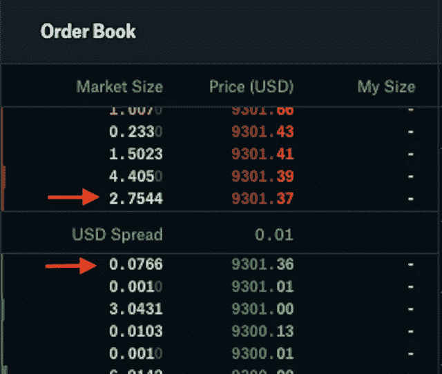
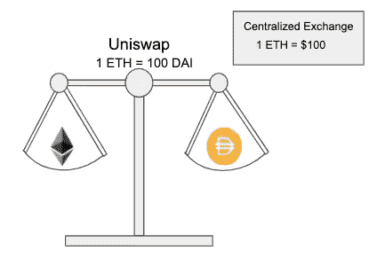

# Uniswap 是如何工作的？

> 原文：<https://medium.com/coinmonks/how-does-uniswap-work-75765c4640e0?source=collection_archive---------1----------------------->

Uniswap is an Ethereum based exchange that allows anyone to swap ERC20 tokens. Traditionally, token swaps require buyers and sellers to create liquidity. Uniswap creates markets automatically.

取代 ICO 时代的密码行业最流行的趋势之一是 DeFi——分散金融的项目和协议。DeFi 的基础——一个去中心化的交换、投资和借贷机会，在实践中自由，在结构上绝对民主，完全控制资金，资金不是委托给特定的个人，而是委托给智能合约和算法。

DeFi token yern . finance(YFI)在短短一个月内就从 34 美元涨价到 38 869 美元。Chainlink 在两个月内从 4.12 美元飙升至 19.8 美元的峰值。这些硬币有什么共同之处？他们都在分散平台 Uniswap 上交易。

有趣的是，Vitalik Buterin 关于分散交易所(DEX)的想法促进了 Uniswap 的发展，这将涉及自动化做市商。实际上，协议开发者自己，Hayden Adams，起初只是尝试在 Solidity 上练习开发，后来这个爱好给他带来了几笔资助和以太坊基金会的 100，00 0 美元。

现在这个项目已经远远超出了娱乐的范畴，成为了整个 DeFi 行业最重要的组成部分之一。

# 德克斯人气飙升

分散融资协议的趋势使用户重新使用分散交易所。周五晚上，Dune Analytics 的统计数据显示，DEX 平台的交易量继续增长，七天增长了 178%。上周，分散平台的全球交易量超过 71 亿美元，过去 24 小时内超过 9.68 亿美元。

Uniswap 协议是当今使用最广泛的 DEX 交易平台。Uniswap 以 71.9%的 DEX 交易总量让大多数竞争对手黯然失色。由于这个平台是迄今为止流动性最强的一个，所以我们正在讨论它。

# 德克斯和 CEX 的区别是什么？

事实上，Uniswap 是一个以太坊交易所，使用智能合约和流动性池建立，与传统的集中式交易所(CEX)如币安的订单相反。使用任何以太坊钱包，用户只需连接到 Uniswap 应用程序，就可以毫不费力地兑换 ERC20 令牌，而无需先将它们发送到交换平台帐户。

此前，DEX 平台存在流动性问题，但 Uniswap 流动性池模式改变了游戏规则。该应用程序不仅允许用户兑换硬币，而且他们还可以创建任何类型的 ERC20 池或为现有池提供流动性并赚钱。Uniswap 允许任何人在任何地方交换硬币，无需授权或身份验证过程。

# ERC20 令牌和 Uniswap

基于以太坊的 ERC20 令牌是最受欢迎和可互换的令牌，也就是说这个标准的相同令牌之间没有区别。

ERC20 可被视为各种用途的最简单记账单位，包括货币、积分、信贷、附息债券等等。它们支持几乎无限的分割，并且可以以碎片的形式发送。由于这种类型的令牌非常受欢迎，因此开发一种简单的方法在它们之间进行交换非常重要。

# Uniswap 中的智能合同

通过一套智能合约，Uniswap 实现了 ERC20 令牌交换机制的标准化。任何人都可以创建一个连接到这些合同的界面，并立即与使用 Uniswap 的每个人交换令牌。

Uniswap 有两种不同类型的合同。第一种被称为交换合同。交换契约包含一个特定令牌和以太坊池，用户可以使用它们进行交换。第二种类型的契约是 Factory，负责创建新的交换契约，并将 ERC20 令牌的地址绑定到其个人交换契约。

在 Uniswap 中列出新的交易工具是免费的。任何人都可以调用工厂契约中的函数来注册新令牌。下图显示了将阿呆添加到 Uniswap 的示例。有人先用 DAI 契约地址调用了一个工厂契约中的 createExchange 函数。然后，工厂检查注册中心，查看该令牌的交换合同是否是以前创建的。如果情况不是这样，工厂创建一个交换契约，并将其地址写入注册表。

流动性池

Uniswap 不使用订单簿来估算资产价值。在传统的加密交易所，如比特币基地专业交易所，价格是基于供求关系，最高价格是有人愿意购买的价格，最低价格是有人愿意出售的价格。在下图中，我们看到比特币基地专业版的最高 BTC 出价是 9301.36 美元，最低出价是 9301.37 美元。

相反，Uniswap 使用交换合同将 ETH 和特定令牌集中到一个池中。当用 ETH 交换令牌时，ETH 被发送到合同池，令牌被返回给用户。因此，交易者不必等待交易对手进行交易，也不必担心指定价格。由于任何人都可以列出一个令牌，并且用户不需要考虑将令牌匹配到任何人，因此我们很容易避免提供初始流动性的问题。

交易后返回的金额基于自动做市商公式。下面的图表有助于说明这个公式是如何工作的。本质上，返回给您的金额取决于池中 ETH 与 token 的比例。无论金额多少，用户都保证会完成交易，因为你向池的一侧添加的资产越多，他就越会沿着曲线将你移动到另一个资产。这意味着相对于资金池的出价越大，你得到的出价就越小。

但如果用户只发送一种加密货币，正确的代币价格是如何维持的？答案是，资金池通过在资金池之间进行仲裁的交易员，维持与外部市场的价格平衡。想象一下，DAI: ETH 资金池被表示为权重，当它们平衡时，资金池相对于集中交易所的市场价格被适当地估价。假设 ETH 在集中交易所的当前美元价格为 150 美元，Uniswap DAI: ETH 池中的比率为 1 ETH 返回 150 DAI。因此，我们是平衡的，因为资金池对应于集中交易所的当前市场价格。

现在，让我们假设市场上有一个运动，将中央交易所的 ETH 价格推至 100 美元。由于价格变动，我们现在可以看到我们相对于市场价格失去了平衡，因为现在人们可以使用 Uniswap 以 150 DAI 的价格交易 1 ETH，而集中交易所的市场价格是每 1 ETH 100 美元。

作为回应，有人现在可以将 ETH 放入池中，提取 DAI，然后在集中交易所出售 DAI 以换取 ETH，然后重复交易。他们可以这样做，直到池对齐并反映当前的市场价格。

因此，第三方仲裁在维护 Uniswap 池中正确的令牌传输比率方面发挥着重要作用。

# Uniswap 的利弊

该交易所有几个主要优势:

*   不需要 KYC。Uniswap 用户不需要证明自己的身份。无论平台上的交易量或活跃度有多大，都不会需要出示你的 ID。该系统基于智能合同运行，没有任何监督机构；
*   没有注册。你不需要创建一个帐户，也不需要使用你的电子邮件和密码，因为 Uniswap 上根本就没有帐户或个人帐户。您只需输入元掩码钱包中的密码；
*   几乎即时执行互换。Uniswap 用户不像在集中交易所那样等待订单执行。相反，他们交换代币，过程的速度取决于费用的多少；
*   各种代币。正如我们已经提到的，您可以在 Uniswap 上列出任何令牌。通常，硬币在那里出现的时间明显早于主要交易所，这是一个获利的机会；
*   简单的界面。它非常容易理解，只需点击几下就能完成交易。如果你已经有 MetaMask 或者其他在线钱包的使用经验，那么 Uniswap 肯定不会有问题。

但是 Uniswap 还远非完美——它也有缺点:

*   互换有时会过于昂贵。代币交换过程通过智能合同工作，这比通常的转移花费更多的汽油。因此，如果您现在必须为一项普通的 ETH 交易支付 1-2 美元，那么在 Uniswap 的情况下，您应该为一项操作支付 4-5 美元或更多。如果以太坊网原来很忙，准备送几十块钱；
*   投资需要一个严肃的策略。鉴于掉期交易的高佣金，你必须仔细考虑你计划投资的代币和基金；
*   骗子。免费列表被骗子积极滥用，他们创造具有类似股票行情的硬币，并希望粗心的用户购买无用的叉子而不是原来的叉子；
*   这个平台不适合大宗交易。购买金额越大，在上面累积的所谓溢价就越多。

Uniswap 是加密货币交易所发展的新一步。该平台以分散的方式运行，同时完美地执行其任务。在 8 月 DeFi sphere 人气飙升的背景下，其用户群与上月相比增长了至少两倍，该指标显然没有停止的计划。

交易所完美地履行了自己的职责，运作正常。是的，它严重消耗以太坊网络的资源，但这些都是当前市场形势下的成本。因此，Uniswap 的使用值得称赞和推荐。要在 Uniswap 上做更多好交易，您需要更多以太坊。你能在哪里得到它？在 Ethex.bet，我们的公平加密乐透，奖励每一个能猜出下一个以太坊块 hash 的符号的人！

## 另外，阅读

*   最好的[密码交易机器人](/coinmonks/crypto-trading-bot-c2ffce8acb2a)
*   [密码本交易平台](/coinmonks/top-10-crypto-copy-trading-platforms-for-beginners-d0c37c7d698c)
*   最好的[加密税务软件](/coinmonks/best-crypto-tax-tool-for-my-money-72d4b430816b)
*   [最佳加密交易平台](/coinmonks/the-best-crypto-trading-platforms-in-2020-the-definitive-guide-updated-c72f8b874555)
*   最佳[加密贷款平台](/coinmonks/top-5-crypto-lending-platforms-in-2020-that-you-need-to-know-a1b675cec3fa)
*   [最佳区块链分析工具](https://bitquery.io/blog/best-blockchain-analysis-tools-and-software)
*   [加密套利](/coinmonks/crypto-arbitrage-guide-how-to-make-money-as-a-beginner-62bfe5c868f6)指南:新手如何赚钱
*   最佳[加密制图工具](/coinmonks/what-are-the-best-charting-platforms-for-cryptocurrency-trading-85aade584d80)
*   [莱杰 vs 特雷佐](/coinmonks/ledger-vs-trezor-best-hardware-wallet-to-secure-cryptocurrency-22c7a3fd391e)
*   了解比特币的[最佳书籍有哪些？](/coinmonks/what-are-the-best-books-to-learn-bitcoin-409aeb9aff4b)
*   [3 商业评论](/coinmonks/3commas-review-an-excellent-crypto-trading-bot-2020-1313a58bec92)
*   [AAX 交易所审核](/coinmonks/aax-exchange-review-2021-67c5ea09330c) |推荐代码、交易费用、利弊
*   [Deribit 审查](/coinmonks/deribit-review-options-fees-apis-and-testnet-2ca16c4bbdb2) |选项、费用、API 和 Testnet
*   [FTX 密码交易所评论](/coinmonks/ftx-crypto-exchange-review-53664ac1198f)
*   [n 零审核](/coinmonks/ngrave-zero-review-c465cf8307fc)
*   [Bybit 交换审查](/coinmonks/bybit-exchange-review-dbd570019b71)
*   [3Commas vs Cryptohopper](/coinmonks/cryptohopper-vs-3commas-vs-shrimpy-a2c16095b8fe)
*   最好的比特币[硬件钱包](/coinmonks/the-best-cryptocurrency-hardware-wallets-of-2020-e28b1c124069?source=friends_link&sk=324dd9ff8556ab578d71e7ad7658ad7c)
*   最佳 [monero 钱包](https://blog.coincodecap.com/best-monero-wallets)
*   [莱杰纳米 s vs x](https://blog.coincodecap.com/ledger-nano-s-vs-x)
*   [bits gap vs 3 commas vs quad ency](https://blog.coincodecap.com/bitsgap-3commas-quadency)
*   [莱杰纳米 S vs 特雷佐 one vs 特雷佐 T vs 莱杰纳米 X](https://blog.coincodecap.com/ledger-nano-s-vs-trezor-one-ledger-nano-x-trezor-t)
*   [block fi vs Celsius](/coinmonks/blockfi-vs-celsius-vs-hodlnaut-8a1cc8c26630)vs Hodlnaut
*   Bitsgap 评论——一个轻松赚钱的加密交易机器人
*   为专业人士设计的加密交易机器人
*   [PrimeXBT 审查](/coinmonks/primexbt-review-88e0815be858) |杠杆交易、费用和交易
*   [埃利帕尔泰坦评论](/coinmonks/ellipal-titan-review-85e9071dd029)
*   [赛克斯·斯通评论](https://blog.coincodecap.com/secux-stone-hardware-wallet-review)
*   [BlockFi 审查](/coinmonks/blockfi-review-53096053c097) |赚取高达 8.6%的加密利息