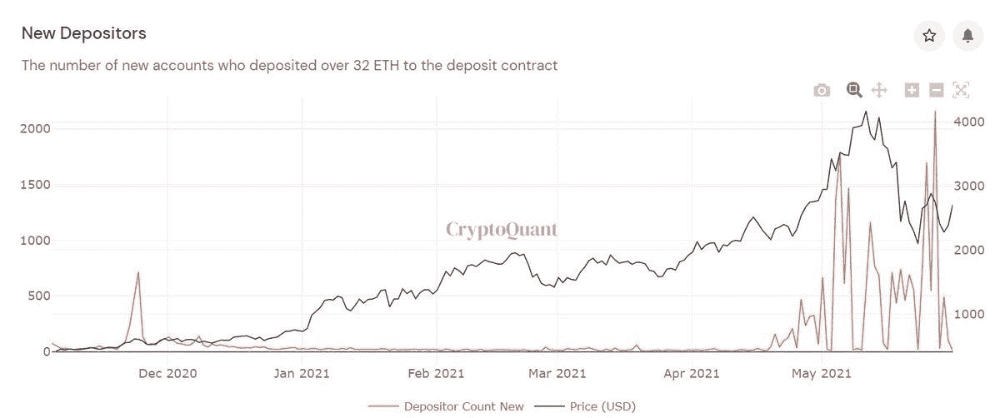

# ETH 2.0 如何解决长期的集中化争论

> 原文：<https://medium.com/coinmonks/how-eth-2-0-could-resolve-the-long-running-centralization-debate-c416b394e54c?source=collection_archive---------3----------------------->

# 介绍

ETH 集中化的辩论长期以来一直被一些消息灵通的比特币投资者用作反对采用的理由，如普雷斯顿·皮什(Preston Pysh)和林恩·奥尔登(Lyn Alden)。这个主题相对复杂，有几个细微差别，但是我们可以达成一致的一点是，分散化是任何试图将区块链/智能合同技术大规模采用的第 1 层协议的关键支柱。

在这份报告中，我们将争论分解成可量化的部分，并分析 ETH 2.0 可能对这场争论产生的影响。围绕这场争论的许多文献都是在对 ETH 2.0 赌注池进行任何有意义的赌注之前撰写的。我们认为，这一新数据可能是投资者采用 ETH 的转折点，这些投资者此前将集中化辩论作为怀疑的理由。

# 总结集中化的争论

与流行的观点相反，(去)集中化可以跨多个轴来定义。Vitalik Buterin 测量跨架构、政治和逻辑轴的(去)集中化。

虽然政治上和逻辑上的去中心化本身是有价值的，但是集中化的争论主要集中在架构轴上。毕竟，这是*轴，如果有足够的中心化，在这个轴上的局部妥协可能会导致整个网络瘫痪。*

***我们建议将建筑轴线划分为以下区域:***

*I)共识/矿工(去)集中化*

*ii)节点/存储(去)集中化*

*iii)财富(去)集中*

*让我们详细看一下其中的每一项:*

***i)共识/矿工(去)集权***

*这个论点是 ETH 1.0 特有的，如果验证器选择串通，那么少量挖掘器的 hashrate 输出的高度集中会损害网络。*

*根据这一标准，ETH 的表现和 BTC 差不多，没有一家(或两家)矿商生产超过 50%的 hashrate。这一点很重要，因为两方以上的恶意串通很难实施，因为即使一方背离，其成本也太高。*

**

*随着 ETH 转向 2.0 下的 PoS 机制，我们预计共识将随着更多参与者变得更加分散，因为成为验证者的障碍降低了。我们已经开始看到这种情况发生。过去 7 天，ETH 1.0 有 63 个活跃的 ETH 池/矿工；在 ETH 2.0 下，约 2.7 万个独特的钱包已经投入使用*

***ii)节点/存储(去)集中化***

*这确实是争论的关键。在 ETH 1.0 下，共识和存储是分开的。运行专用硬件来解决 Ethash 功能的矿工达成共识。由于这只对少数人可行，另一个组必须运行和操作节点。节点的目的是存储和转发区块链的交易历史，并验证由矿工添加的交易。*

*大体上有三种类型的节点:归档节点、完整节点和轻型节点。每个存储的区块链数据量递减。我们真的很关心完整的节点，因为它们携带足够的数据以分散的方式保护网络，但不是太多，以至于很少有人可以运行它。在 ETH 1.0 下，每个 Dapp 开发人员都需要运行一个节点，这样系统最终会随着时间的推移变得足够分布式。*

*然而，运行一个节点是一项单调乏味的任务，节点运行者与挖掘者不同，不会因为运行一个节点而得到补偿。因此，许多 Dapp 开发人员选择向 Infura 等基础设施即服务(IaaS)提供商收取费用来运行他们的节点。这就是我们遇到三重问题的地方。*

*-更少的独立节点意味着更少的备份/安全性*

*-节点高度集中于少数大型提供商，这将 keyman 风险引入系统(当 Infura 在 2020 年 11 月宕机约 5 小时时，这一点已部分实现)*

*–众所周知，Infura 和其他公司使用大型集中式云提供商，如 AWS，这又引入了第三方风险*

*作为以太坊网络的支持者和 ETH 的大持有人，我们认为这种对 ETH 1.0 的批评并非不公平。目前仅有约 3.8k 以太网节点(相比之下，BTC 的以太网节点约为 11k)*

**

*此外，到目前为止，许多这样的节点仍然集中在大型云提供商那里。*

**

*以太坊社区的其他成员在今年早些时候 Lyn Alden 提出这一批评时，试图对此做出回应。以下是他们的回应。*

**

*作为以太坊社区的成员，尽管我们很欣赏无银行服务，但我们认为这种回应还有很多不足之处。很大程度上，我们想象，因为 ETH 1.0 的批判并不是不公平的。*

*然而，事情变得有趣了。随着以太坊向 ETH 2.0 的巨大转变，很多架构都在发生变化。这是由两个关键因素导致的:*

1.  *运行节点的简易性:*

*以太坊正确地指出，在 ETH 1.0 下，运行一个节点所需的硬件要求有些苛刻，并决定将其作为 ETH 2.0 架构背后的关键原则之一。*

**

*下面是 ETH 1.0 和 2.0 的硬件要求对比。*

**

*2.运行节点的激励:*

*在 ETH 1.0 下，大多数节点都是由 Dapp 开发者或者代表 Dapp 开发者运行的。这是因为，由于硬件限制，验证器/挖掘器的数量不足以满足节点要求。*

*在 ETH 2.0 下，任何拥有 32 个 ETH 的人都可以将其 ETH 作为验证器/节点。由于验证器也将充当节点，激励将被适当地调整，更重要的是，将有足够的验证器来使节点分布足够大和分散。*

*我们已经可以从已经注册的独立钱包的数量上看到这一点。到目前为止，大约有 27K 个单独的验证器。这大约是 ETH 1.0 节点数量的 9 倍，是当前 BTC 节点数量的 3 倍。(注意:每个单独的 ETH 2.0 验证器可以运行多个节点，每个节点 32 个 ETH)*

**

*进一步验证去中心化的一个重要数据，特别是缺乏对大型云提供商的依赖，将是每个节点背后的 ISP(表明云与自主)。类似于[https://ethernodes.org](https://t.co/vsomTlGvkU?amp=1)为 ETH 1.0 所做的。我们确实希望这些数字不会像当前的 ETH 1.0 那样偏向云提供商，因为更多的节点将是自愿的(利益相关者)，而不是强制的(Dapp 开发者)。节点数量如此之多的事实首先是一个积极的迹象。*

*另外，以太坊社区也在致力于其他解决方案(弱无状态/状态过期),以便随着区块链变大，运行节点变得更容易。更多细节可以在这里找到:【https://t.co/W8nuMBHVrF?amp=1 *

***三)财富(去)集中化***

*这种观点认为，大型 ETH 持有者可以通过在 ETH 2.0 下下注来控制共识。然而，鉴于前 10 大钱包目前控制着不到 20%的供应，这种情况不太可能出现。与如此众多的行为者勾结不太可能成功。*

**

*沿着这些思路的另一个论点是，大型赌注池可能占据市场的很大份额，并可能垄断共识。虽然这也可以通过激励结构来避免(池领导者也必须持有自己的 ETH)，但数据显示，大多数当前节点存在于交易所持有池之外。*

**

*要解决的最后一个争论是某些客户端软件在运行节点中的主导地位。在 ETH 1.0 上，Geth 是大约 80%节点的客户端。如果这种情况在 ETH 2.0 中持续下去，一个客户端的错误更新或恶意软件可能会拖垮整个生态系统。*

**

*以太坊似乎在推动在几个客户端之间更均匀地分配。随着大约 27k 个独立验证器(其中有多个节点)上线，与今天在线的大约 3k 个节点相比，前景可能会迅速改变。这方面的数据尚未发布，但我们将在数据可用时关注这一指标。*

# *结论*

*总的来说，以太坊是一个雄心勃勃的项目，旨在利用区块链理工大学的全部潜力。这绝不是它的最终状态，就像任何好的技术一样，它处于不断迭代的过程中。如果区块链技术要发挥其全部潜力，很可能是通过联邦理工学院。我们认为，这些挑战只是实现这一宏伟目标道路上的一个小插曲，像这样的公开对话有助于加强社区和协议。*

*ETH 2.0 的进步是惊人的，大约 500 万 ETH(在撰写本文时大约 130 亿美元)已经投入使用，我们相信这些集中化的争论最终平息只是时间问题。*

**

## *另外，阅读*

*   *[加密保证金交易交易所](/coinmonks/crypto-margin-trading-exchanges-428b1f7ad108) | [赚取比特币](/coinmonks/earn-bitcoin-6e8bd3c592d9) | [Mudrex 投资](https://blog.coincodecap.com/mudrex-invest-review-the-best-way-to-invest-in-crypto)*
*   *[BlockFi 信用卡](https://blog.coincodecap.com/blockfi-credit-card) | [如何在币安购买比特币](https://blog.coincodecap.com/buy-bitcoin-binance) | [网格交易机器人](https://blog.coincodecap.com/grid-trading)*
*   *[加密副本交易平台](/coinmonks/top-10-crypto-copy-trading-platforms-for-beginners-d0c37c7d698c) | [五大 BlockFi 替代方案](https://blog.coincodecap.com/blockfi-alternatives)*