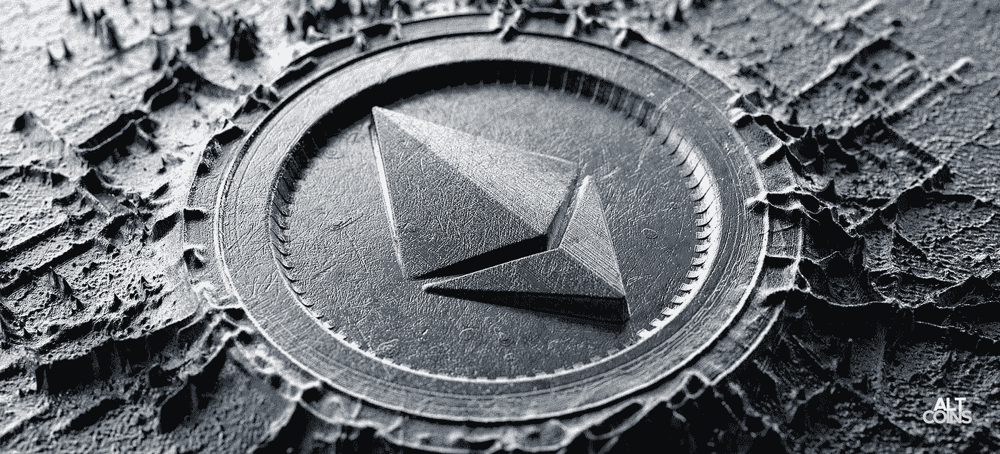
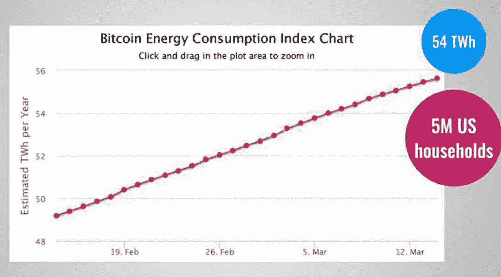
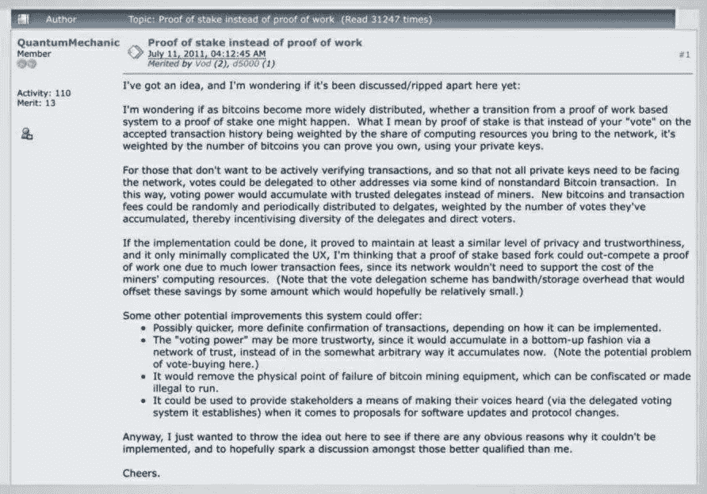
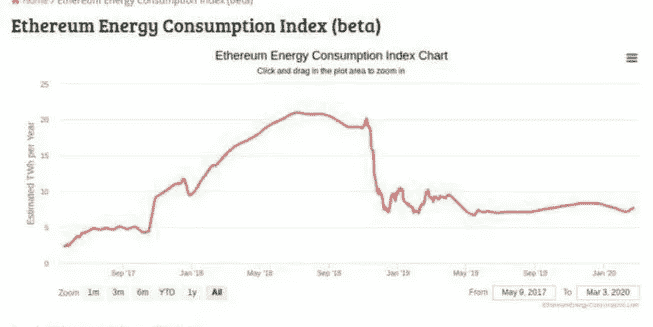

# 以太坊的股权证明如何拯救了区块链的意识形态？

> 原文：<https://medium.com/coinmonks/how-ethereums-proof-of-stake-saved-the-very-ideology-of-blockchain-961b3f9acea8?source=collection_archive---------2----------------------->

谁也不能否认这样一个事实:对已有方法论的任何形式的改变都是人类难以接受的。这就是为什么总有大多数人全心全意地充当*抵抗变革的力量。*

现在考虑区块链，*这种单枪匹马挑战互联网上整个根深蒂固的安全和透明机制的技术，确实面临类似的阻力*。然而，自从区块链出现以来，经过巨大的争论，一些超级大国如中国、美国、日本逐渐意识到它的真正潜力。

但很快区块链开始困扰世界上的大多数人，并再次成为一项有争议的技术，对许多人来说似乎不可靠。嗯，说实话，这种对区块链未来的担忧的主要原因之一是深植于 ***工作证明的共识算法。***

# ***工作证明的丑恶嘴脸***

自从进化以来，Proof of Work 确实证明了它作为像 ***DDoS*** 这样的网络攻击的有效解毒剂的价值。毫无疑问，它似乎是一个可靠的共识机制，用于验证网络中每一笔交易的合法性。因此，防止了多年来一直未能解决的*重复支出的重大问题。*

*对工作证明的可怕担忧在很长一段时间后出现，它们令人担忧，以至于使整个区块链技术受到质疑。*

## ****PoW 到底是如何毁掉区块链的名声的？****

*N ***永无止境的用电欲望:****

*简单来说，比特币的证明工作基本上是通过让所有节点解决一个海量复杂的密码难题来达成共识，这个难题由 ***矿工*** 解决，第一个解决的人获得奖励。*

*现在，首先开采区块的巨大竞争使得矿工们建造了巨大的采矿场，这些采矿场拥有大量的计算资源，能够进行难以置信的复杂计算。结果，整个过程最终消耗了大量的电力。*

> *事实上，根据数字经济学家的[比特币能源消耗指数，](https://digiconomist.net/bitcoin-energy-consumption)仅比特币矿工消耗的能源就从 2019 年 12 月的 54 TWh 跃升至 2020 年 2 月的 77 TWh。*

**

*对这些数据的有效分析非常清楚地表明，比特币矿工使用的能源量实际上足以为美国 500 万到 700 万个家庭供电。事实上，这个数量几乎相当于新西兰和匈牙利等国家的总能耗。*

*T**hread To 分权:***

*说实话，区块链使其独一无二的一个最美丽的部分是它确保互联网上 ***去中心化*** 的能力。好吧，工作证明是一个可能的威胁，这里的方法。*

*所以我们这么理解吧，PoW 算法基本上是奖励哈希率高的人。*换句话说，那些确实拥有更好更快的硬件来首先计算密码问题的人。因此，你的处理能力越强，你的散列率就越高，你就越有可能挖掘下一个区块并获得奖励。**

*现在最丑的部分来了。为了增加他们获得更多奖励的机会，矿工们现在开始组建*矿池，在那里他们首先结合自己的哈希能力来加快计算速度，然后在他们之间分享由此获得的奖励。**

**虽然这可能看起来无害，但它通过使网络上的一些节点比其余节点更强大，迅速将区块链向集中化而不是去中心化转变。也因此，拆解区块链唯一的美。**

# **进入*利害关系证明***

**不言而喻，如果工作证明坚持作为唯一的共识机制，区块链将很快进入一个严厉的批评区，退出将会非常麻烦。**

**幸运的是，在 2011 年 7 月 11 日， *QuantumMechanic，一位 Bitcointalk 论坛用户提出了一个新的命题，名为* ***利害关系证明，震惊了世界。这个命题非常简单，但却足以以令人难以置信的效率消除工作证明的缺点。*****

****

***利益证明*更简单地说，认为这种互相竞争来验证交易的想法是浪费。 哦是的！很直接，对吧？**

**因此，它没有组织竞争，而是简单地使用选举过程，最终随机选择一个节点来验证下一个块。**

> **注意，股权凭证上没有叫**的矿工。事实上，他们有**验证者**，他们不开采，但**铸造或伪造新的区块。******

**此外，随机选择*验证器*并不像看起来那样随机。验证器的选择是基于它们之前所做的工作，即由 CPU 或 GPU 验证的哈希数。不仅如此，有更多硬币进入网络的节点确实有更高的概率被选为*验证者，*从而完全消除竞争过程。**

# **利害关系的证明——区块链思想的救星**

**仔细观察无疑会让我们认识到，利害关系证明确实是拯救区块链意识形态的机制。**

**没有 **集权(消除 51%攻击威胁)****

**正如已经讨论过的，工作证明不负责任地让每个人验证区块，最终导致矿工逐渐开始整合他们的资源并形成采矿池，从而增加他们开采更多区块并获得更多奖励的机会。**

**因为这些池很快开始控制网络的很大一部分，从而集中了挖掘过程，这挑战了区块链的去中心化思想。**

**另一方面，股权证明并不允许每个人开采区块，只选择那些有足够经验和存款的人。因此，绝对没有机会让验证者联手，形成一个池，但**没有中心化。**而且由于没有中心化，51%的攻击威胁也更大程度的最小化。**

**R导出功耗**

**这种共识机制的功耗证明是非常低的。因此，证明利害关系是一个有效的答案，大量的能源消耗证明工作。**

*****工作证明使用 77 TWh 的电力，而股权证明目前仅使用 7.7 TWh。*****

****

**Digiconomist’s Ethereum Energy Consumption Index**

**否 **欺诈交易****

****

**由于 PoS 随机选择验证器，一个真正令人担忧的困境可能会出现在您的大脑中。**

> **我们怎么能相信这些验证者呢？**

> **嗯，区块链非常明确地相信互联网是一个不可信的社区。利害关系的证明尊重这种意识形态。**

**PoS 会很好地保护您的交易，并为试图进行欺诈交易的验证者提供一个非常严格的政策。**

**万一验证者试图验证一个虚假交易，该算法会确保他们损失很大一部分股份。简单来说，我们可以信任验证者，因为如果他们批准欺诈交易，他们损失的钱会比他们从欺诈中获得的多。说实话，没有人会同意这么糟糕的交易。**

> **[在您的收件箱中直接获得最佳软件交易](https://coincodecap.com/?utm_source=coinmonks)**

********