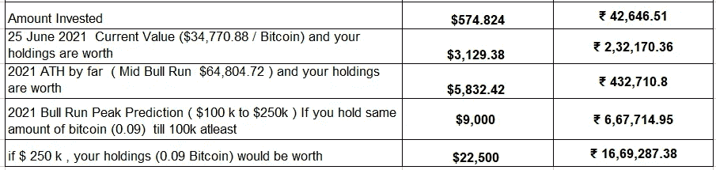
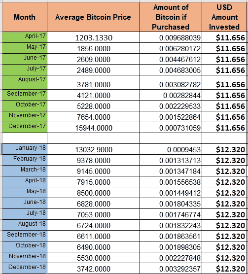
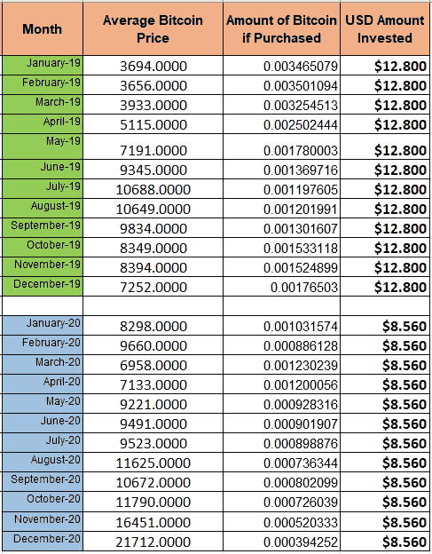
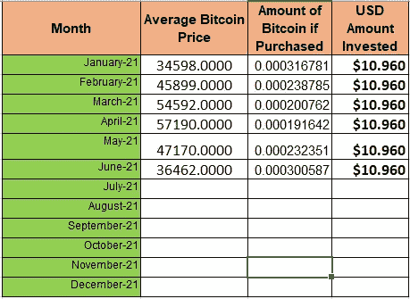

# 每个印度人在 4 年内损失了 4 到 16 万卢比(约 15，000 美元)

> 原文：<https://medium.com/coinmonks/how-every-indian-missed-out-4-to-16-lakh-rupees-5680abe0598d?source=collection_archive---------7----------------------->

这篇文章不是拍拍你的背，给你投资的信心。阅读时感觉腹股沟疼痛。这应该从内部撕裂你，开始质疑你自己的存在，应该点燃一些火花，超越你被周围环境喂养的东西去思考。

你一定听说过“巨大的风险带来巨大的回报”，而忽略或没有听说过“巨大的耐心和一致性带来巨大的回报”。

你们人类，生来自由，却被别人的思想所束缚。你至少现在应该意识到。

## **简介**

一个场景，“*如果一个人全年投资他们月平均收入的 8%，为期 4 年，会怎么样？”*

比特币，一种资产，不要看比特币就抓狂。你的大脑被训练成能看到共同基金，却看不到比特币。

## **你怎么会错过 40 万到 160 万卢比？**

如果你在过去 4 年**中每月**投资*比特币*8 至 12 美元**，你现在将拥有 **0.092925247 比特币。****

****四舍五入至 0.09，计算持仓价值****

****

**就是这样。你已经错过了。印度已经错过了。错过了成为超级大国的大好机会。错过了消除贫困的机会。错过了维护和改善印度公民生活的黄金机会。**

**下一轮牛市将在 2024 年。你还有机会。**

**下面是我所有的分析和计算来支持我的陈述。**

## ****国民收入****

**在一个财政年度内，该国生产的所有商品和服务的总价值**

**国民收入的增长=国家进步的增长**

## ****国民人均收入****

**国民收入/总人口=国民人均收入**

**人均收入意味着每个人的收入。这是平均值。**

**考虑到—**

1.  **2017-2018 财年(2017 年 4 月 1 日至 2018 年 3 月 31 日) (牛市中期至熊市周期开始)**
2.  **2018 -2019 财年(2018 年 4 月 1 日至 2019 年 3 月 31 日) (熊周期)**
3.  **2019- 2020 财年(2019 年 4 月 1 日至 2020 年 3 月 31 日)(积累周期)**
4.  **2020-2021 财年(2020 年 4 月 1 日至 2021 年 3 月 31 日)(2020 年 3 月至 2021 年 1 2 月牛市开始)**
5.  **2021–2022 财年(2021 年 4 月 1 日至 2022 年 3 月 31 日)(2021 年 1 月至 2021 年 1 2 月牛市狂潮)**
6.  **预计本轮牛市将于 2021 年 12 月结束**

## ****印度人均收入****

1.  **2017-2018 财年(印度人均收入为 **₹1,13,500** )**
2.  **2018 -2019 财年(印度人均收入为 **₹1,26,406****
3.  **2019- 2020 财年([印度](https://en.wikipedia.org/wiki/India)人均收入预计为 **₹1,35,050****
4.  **2020-2021 财政年度( **₹95,000** )**
5.  **2021-2022 财政年度(*预计为* **₹1,26,406** )**

****$价格(美元对印度卢比的平均汇率)****

**2017 年 **$1** = **₹** 65.0966**

**2018 年 **$1** = **₹** 68.4113**

**2019 年 **$1** = **₹** 70.4059**

**2020 年 **$1** = **₹** 74.1322**

**2021 年 **$1** = **₹** 73.2999**

## ****场景****

**如果一个人全年投资他们月平均收入的 8%会怎么样？**

## ****计算****

1.  **2017-2018 财年(印度人均收入为 **₹1,13,500** )**

**也就是说**₹**113500/12 个月=**₹**9458.33 =**$**145.7**

****145.7 美元的 8% = 11.656 美元****

***解释:2017 年印度人均收入为* ***₹1,13,500 人均*** *意为* ***₹9,458.33 人均*** *。给了我们****145.7 美元；*****

**2.2018 -2019 财年(印度人均收入为 **₹1,26,406** )**

**也就是说 **₹1,26,406** / 12 个月= **₹** 10，534 = **$ 154****

****154 美元的 8% = 12.32 美元****

**3.2019 -2020 财年(印度人均收入为 **₹1,35,050** )**

**这意味着 **₹1,35,050** / 12 个月= **₹** 11，254 = **$ 160****

****160 美元的 8% = 12.8 美元****

**4.2020 -2021 财政年度(印度人均收入为 **₹95,000****

**也就是说 **₹95,000** / 12 个月=**₹7916.6**=**$ 107****

****107 美元的 8% = 8.56 美元****

**5.2021 -2022 财政年度(印度人均收入预计为 **₹1,26,406** )**

**也就是说 **₹1,26,406** / 12 个月=**₹10,034**=**$ 137****

****137 美元的 8% = 10.96 美元****

************

*****作者* : Eth！c@l 又名库马尔****

*****邮箱*:**[**IfWorldGoneCrypto@gmail.com**](mailto:IfWorldGoneCrypto@gmail.com)**

*****电报*:https://t.me/IfWorldGoneCrypto****

*****同行评审*:臭 Linky****

****PS** :这既不是付费文章，也不是理财建议。记录下来的是我自己的研究发现，这是出于对这个隐秘领域的热情**

**如果你想表达一些爱，请捐赠并帮助我们继续做我们正在做的事情**

****ERC 20:0x 867 ca 4 af 0 EB 86d 48014 D8 ce 344d 096 c 01348 a163****

****来源****

**比特币月明智价格数据:www。CBBI 信息**

**[https://en.wikipedia.org/wiki/Economy_of_India](https://en.wikipedia.org/wiki/Economy_of_India)**

**[https://www . statista . com/statistics/935754/India-人均收入值/#:~:text = Per % 20 capital % 20 income % 20 cross % 20 India，income % 20 account % 20 to % 20 the % 20 source](https://www.statista.com/statistics/935754/india-per-capita-income-value/#:~:text=Per%20capita%20income%20across%20India,income%20according%20to%20the%20source)。**

**[https://www . exchange rates . org . uk/USD-INR-spot-exchange-rates-history-2017 . html](https://www.exchangerates.org.uk/USD-INR-spot-exchange-rates-history-2017.html)**

**[https://www . exchange rates . org . uk/USD-INR-spot-exchange-rates-history-2018 . html](https://www.exchangerates.org.uk/USD-INR-spot-exchange-rates-history-2017.html)**

**[https://www . exchange rates . org . uk/USD-INR-spot-exchange-rates-history-2019 . html](https://www.exchangerates.org.uk/USD-INR-spot-exchange-rates-history-2017.html)**

**[https://www . exchange rates . org . uk/USD-INR-spot-exchange-rates-history-2020 . html](https://www.exchangerates.org.uk/USD-INR-spot-exchange-rates-history-2017.html)**

**[https://www . exchange rates . org . uk/USD-INR-spot-exchange-rates-history-2021 . html](https://www.exchangerates.org.uk/USD-INR-spot-exchange-rates-history-2017.html)**