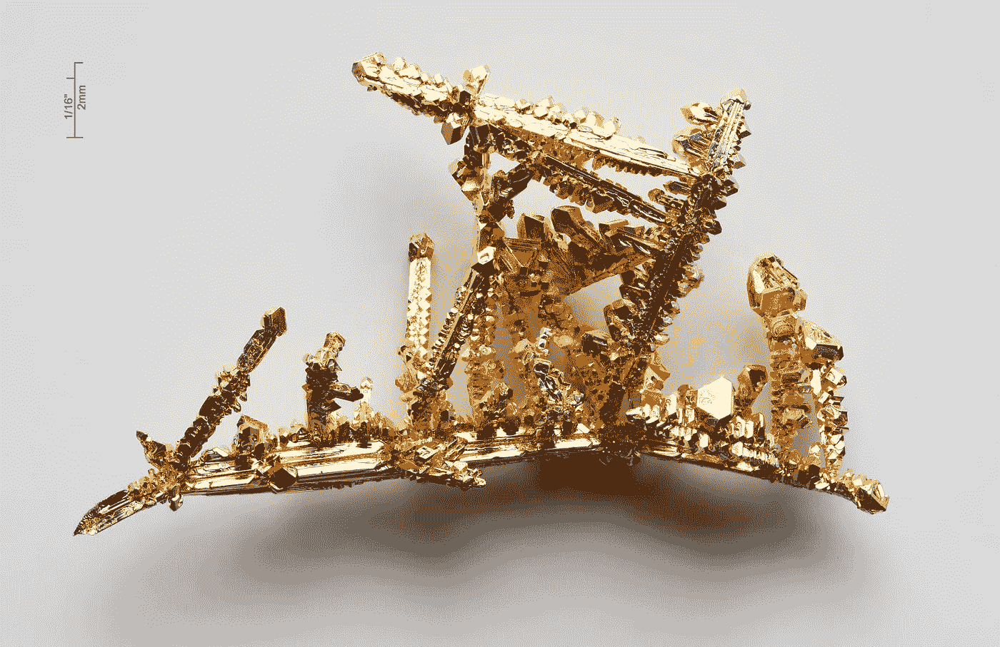

# 黄金如何成为货币，比特币如何成为货币

> 原文：<https://medium.com/coinmonks/how-gold-became-money-and-how-bitcoin-can-become-money-18069cf6368?source=collection_archive---------0----------------------->

Gold Crystals (Source: [Wikipedia](https://en.wikipedia.org/wiki/Gold))

自古以来，黄金就是一种有价值的商品。当黄金出现在有文字记载的历史中时，它已经是一种有价值的商品了。社会把它当作货币使用。我们不知道它是如何变成钱的。有假设[1]。

*   稀缺:它的供应比其他化学元素更有限。你不能轻易提取它。随着时间的推移，采矿过程变得更加密集。
*   美丽:黄金是美丽的。它很柔软，容易成型。它是很好的珠宝。
*   独特的原子结构:黄金具有独特的化学结构。它不会生锈，也不会与其他化学元素发生反应。

这些假设是合理的。他们为黄金作为货币提出了很好的理由。但是人类对黄金的痴迷很奇怪。它渗透了整个社会。更仔细的研究表明这些假设是有缺陷的。

*   稀有的:还有许多其他稀有化学元素。白银稀缺。
*   美丽:黄金是黄色的。虽然我们认为它是美丽的，但黄金可能影响了我们对它的美丽的看法。它的颜色在某些应用中是不理想的。比如我们喜欢银器胜过喜欢金银器。
*   独特的原子结构:在几千年前黄金成为货币之前，我们没有工具和知识来检查黄金的化学性质。

这些假设似乎是事后的想法。我们试图把一些想法拼凑起来，帮助我们解释为什么黄金会变成货币。还有更离奇的理论。我们生来就喜欢黄金。众神制造黄金来诱惑人类。黄金来自外太空。

在这篇文章中，我想用不同的观点来讨论黄金的上涨。我认为黄金作为货币上涨与冶金术的兴起有关。金属技术的创新浪潮摧毁并创造了帝国。黄金是无价之宝，因为它是冶金的中心。

# 黄金的崛起

人类与之互动的第一种金属似乎是黄金。在旧石器时代晚期，大约公元前 40，000 年，在今天的西班牙发现了少量的天然黄金。旧石器时代被称为旧石器时代。黄金是使人类远离石器的金属。这是一个重要的发展。在旧石器时代之后，我们经历了旧石器时代晚期、中石器时代和新石器时代(石器时代末期)、铜石器时代(铜时代)、青铜时代和铁器时代。人类历史随后的发展以冶金学的进步为标志。

早期的冶金学家通过与黄金的互动开始了他们的学习。然后他们学会了如何操作其他金属。黄金非常稀有，对冶金学家来说很有价值。没有足够的黄金来大规模生产黄金工具。很少见，有光泽。它变成了一种装饰性的金属，是威望和权力的象征。黄金通常被视为珠宝。但它确实展示了金属技术的进步。当冶金学家创造他们的工具或武器时，他们会用黄金来装饰物品。冶金学家是帮助统治精英摧毁和创造帝国的工程师。

越南民间传说讲述了一个关于国王安东旺的故事。他在铁器时代统治着古代越南人民。这个故事说，安东旺拥有一把神奇的弩。有了这个武器，他能够抵抗中国人的入侵。历史上还提到了他的武器工程师曹洛[6]。当他的敌人偷走了他的魔法弩时，安东旺最终被打败了。他的王国分崩离析，并在接下来的 10 个世纪里受到中国人的统治。小偷是他的中国女婿。神奇的弩可能是一个隐喻。可能是金属技术给了越王优越的武器。

金属发展是人类历史上的一个重要推动力。黄金是这一发展的核心。冶金工程师和统治精英痴迷于黄金。正常人跟着。黄金成为最有价值的货币形式。

# 比特币和黄金

快进到 21 世纪，黄金正在慢慢消失。法定货币过去是由黄金支持的。但是金本位已经多次打击了世界经济。在上世纪 30 年代的大萧条期间，黄金刚性将衰退蔓延到了许多国家。1971 年，面对黄金储备短缺，美国终止了美元与黄金的可兑换性。这一事件结束了黄金对货币政策的影响。

加密文献将比特币称为数字黄金，一种新兴的黄金替代品。比特币设计模仿黄金特征。它限量发行 2100 万枚硬币。这些硬币是通过消耗电能的采矿过程制造的。在某些方面，比特币比黄金更好。它不需要物理存储。我们几乎可以瞬间转移比特币。在其他方面，比特币比黄金更糟糕。比特币不是实物。除了持有，我们不能用比特币做任何事情。我们依靠经济意识形态来证明比特币在市场中的作用。

我们已经经历了金本位制。经济学家和政治家并不急于回归黄金支持的货币。在数字时代，我们可以创建可靠的法定货币银行网络。央行行长发现数字货币比黄金支持的系统更容易管理。比特币支持者推销比特币标准。它是数字原生的，应该比黄金标准更好。为了支持比特币，人们淡化了黄金。黄金只是一种有光泽的稀有金属，人们用来装饰。

但比特币仍在寻找它的用例。我们知道黄金是货币。其突出的应用之一是珠宝。我们的结论是，珠宝是推动黄金需求的二级市场。从这个结论来看，加密构建者认为比特币可能存在类似的二级市场。我们对黄金历史的无知造成了一个缺口。我们还没有找到丢失的拼图。

# 搜索比特币冶金

我们找错了地方。珠宝只是黄金上涨的表面。这是冶金学的一个小应用。推动黄金需求的不是二级市场。黄金成为货币是因为它是冶金的重要组成部分。这是金属革命的象征。

从这个洞见出发，我们应该思考一下比特币的冶金学等价性。比特币也有类似的特质。是技术。围绕比特币有一个硬件和软件的生态系统。如果比特币像黄金一样，它将是推动下一次技术革命的资金。比特币技术生态系统的进步可能会产生比特币的新用例。“区块链，不是比特币”项目没有产生新的用例。他们可能走得太远了，与比特币产生了隔阂。成功的应用可能直接在比特币上没有太大的关系。但也许，他们将需要像其他金属与黄金相互作用一样与比特币相互作用。

黄金和冶金学用了 30，000 年才使人类摆脱了石器。我们在比特币方面仍处于起步阶段。

**参考文献**

[1]我们为什么看重黄金？https://www.bbc.com/news/magazine-25255957

【2】黄金来自外太空吗？【https://www.bbc.com/news/magazine-22904141 

[3]黄金史[https://onlygold.com/facts-statistics/history-of-gold/](https://onlygold.com/facts-statistics/history-of-gold/)

[4]冶金史[https://en.wikipedia.org/wiki/Metallurgy#History](https://en.wikipedia.org/wiki/Metallurgy#History)

[5]An Duong Vuong[https://en . Wikipedia . org/wiki/An _ D % C6 % B0 % C6 % A1ng _ V % C6 % B0 % C6 % A1ng](https://en.wikipedia.org/wiki/An_D%C6%B0%C6%A1ng_V%C6%B0%C6%A1ng)

[6]曹洛[https://en.wikipedia.org/wiki/Cao_L%E1%BB%97](https://en.wikipedia.org/wiki/Cao_L%E1%BB%97)

*原载于 2019 年 11 月 29 日*[*https://bitflate.org*](https://bitflate.org/post/2019/11/29/how-gold-became-money.html)*。*

> [在您的收件箱中直接获得最佳软件交易](https://coincodecap.com/?utm_source=coinmonks)

