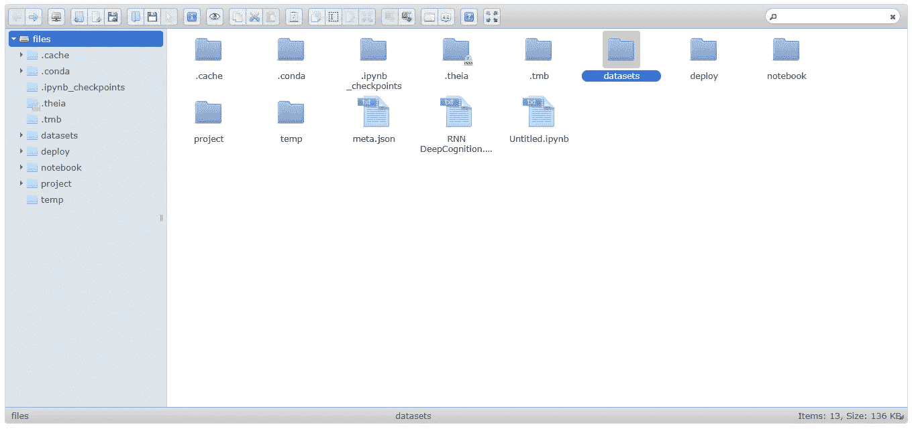
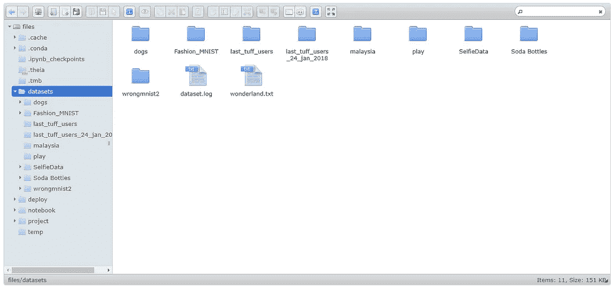
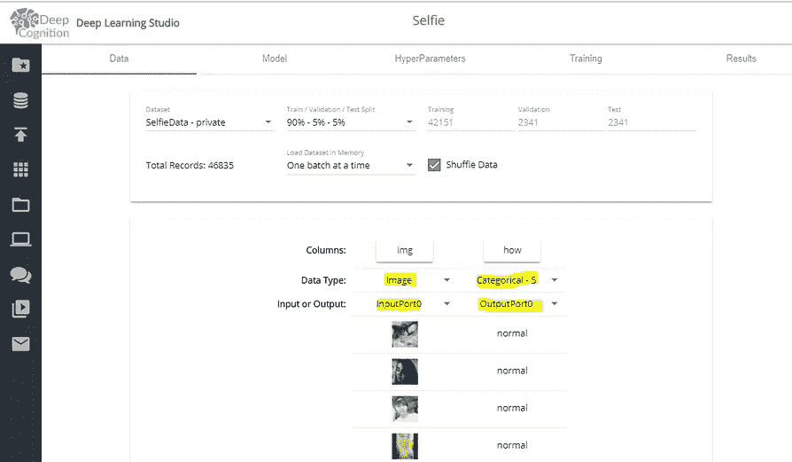
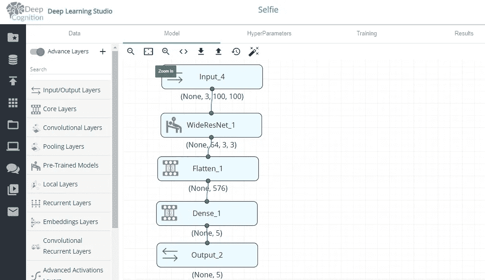
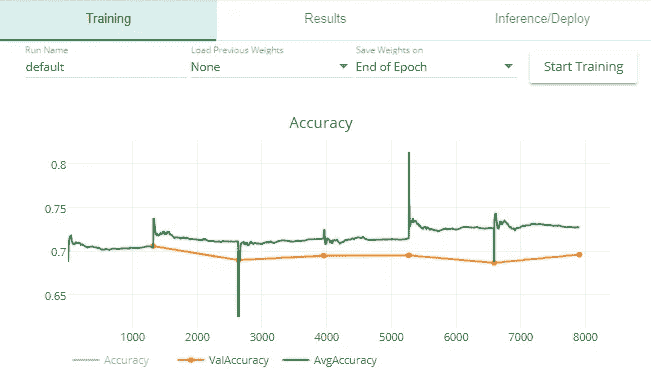
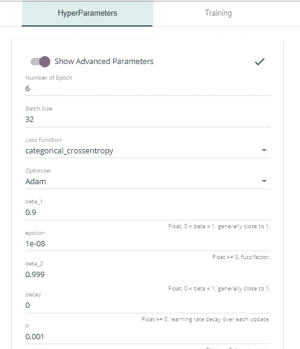
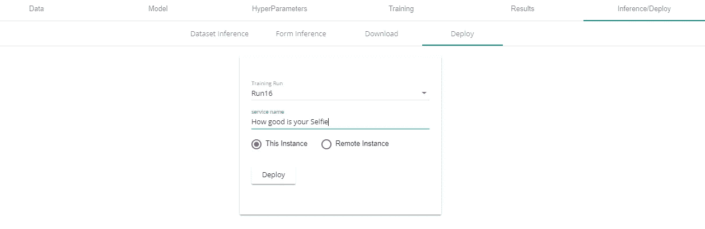
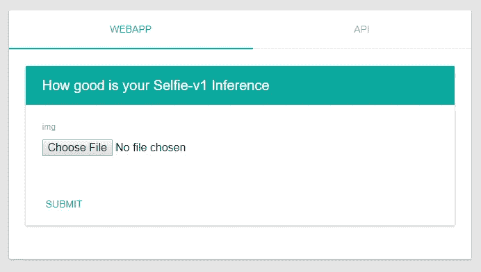
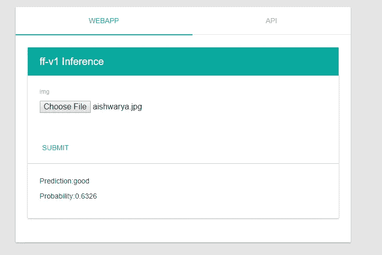

# “你的”自拍有多好？

> 原文：<https://medium.com/coinmonks/how-good-is-your-selfie-26c173d84552?source=collection_archive---------9----------------------->

## **看看你的自拍有多好** [**这里**](http://dlsdemo.ddns.net:9901/models/Selfie_Demo/v1/app.html\) **！**

[**http://dlsdemo.ddns.net:9901/models/Selfie_Demo/v1/app.html**](http://dlsdemo.ddns.net:9901/models/Selfie_Demo/v1/app.html)

在本文中，我们将看到如何创建一个模型(包括它的 API)来将自拍分类为'**丑**'、**差**'、**正常**'、**好**和'**优秀**'。

> **数据集描述**

我从 http://crcv.ucf.edu/data/Selfie/下载了数据集，并根据模型的需要进行了修改。可以**直接从我的**[**github repo**](https://goo.gl/Q7KCYp)下载修改后的数据集。

修改后的数据集包含了来自世界各地的 46000 多张不同的自拍照，分别被标注为“丑陋”、“糟糕”、“正常”、“良好”、“优秀”。标签是根据自拍在上传平台上收到的赞/评论来完成的。

一些自拍:

everyone looks good 😍 😁

**注意:我们不会编写一行代码！😈**

我们将使用 Deepcognition.ai 的深度学习工作室来创建和开发我们的模型和 API。

如果你不熟悉 Deep Learning Studio，可以看看我关于它的文章。

 [## 鸢尾属分类|DeepCognition| Azure ML studio

### 界:植物界分支:被子植物目:天冬目:鸢尾科亚科:环烯醚萜族:环烯醚萜属:鸢尾

towardsdatascience.com](https://towardsdatascience.com/iris-genus-classification-deepcognition-azure-ml-studio-4b930f54435a) 

让我们开始吧。

> **1。将数据集上传到深度学习工作室**

数据集大于 1GB，因此您需要将数据直接从 PC 复制到工作空间，如下所示:

Copy the data(zip file) inside Datasets folder(drag and drop)

Left:Create folder ‘SefieData’ and extract the zip file in this folder, Right: choose the dataset in the Data section

提取“SelfieData”中的数据可能需要一段时间，请耐心等待。

> **模型架构**

Model Architecture

我们将使用预先训练的 WideResNet 作为模型架构。深度学习工作室让我们很容易做到这一点。只需将“WideResNet”从预先训练好的模型(左侧窗格)中拖放出来，我们就完成了！点击 WideResNet 层，设置可训练为 25。这意味着我们只想训练 WideResNet 的前 25%的层。

> **训练模型:**

Press **start training** and it’s done

我们仅仅通过使用预先训练的 WideResNet 就获得了相当不错的准确度。

如果你想浏览一下我的超参数，它们在这里:

**6:epochs** with **Adam:optimiser**

> **我们来部署火箭吧！**

Go to Inference-> deploy section and click **Deploy** 😎

单击“部署”后，将会生成一个链接，该链接将带您进入:

Upload your selfie and check how good it is!

让我们看看输出艾什瓦尔雅·拉伊的照片😁。

Left:input, Right:output

非常感谢你们花时间阅读这篇文章，并享受检查你的自拍的乐趣😜

鼓掌吧👏如果你真的喜欢我的文章。在 linkedIn 和 medium 上关注我

 [## 马尼克索尼培养基

### 阅读媒介上的 Manik Soni 的作品。机器学习研究员。每天，Manik Soni 和成千上万的其他人…

medium.com](/@maniksoni653)  [## Manik Soni -机器学习研究员-自雇| LinkedIn

### 查看 Manik Soni 在全球最大的职业社区 LinkedIn 上的个人资料。Manik 有 2 份工作列在他们的…

www.linkedin.com](https://www.linkedin.com/in/maniksoni) 

谢谢

快乐自拍😛。