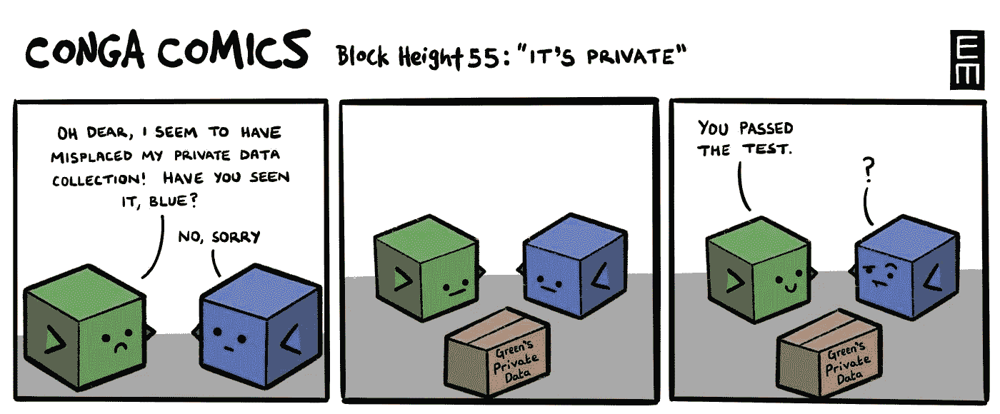
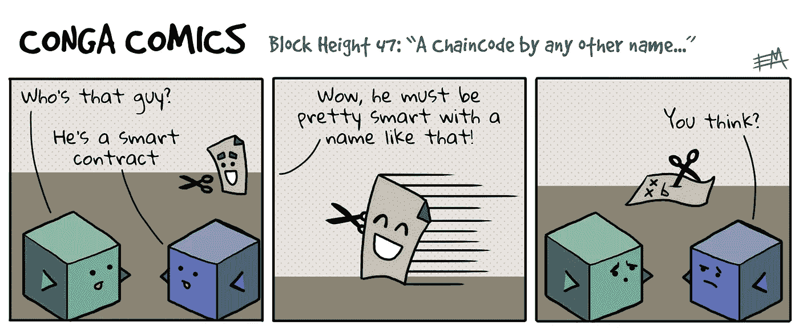
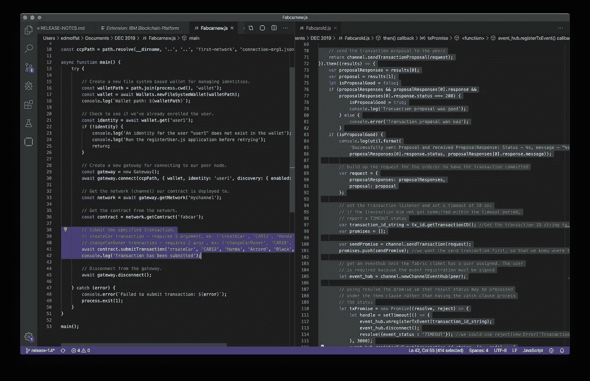

# Hyperledger Fabric 区块链开发在 2019 年有哪些改进？

> 原文：<https://medium.com/coinmonks/how-has-hyperledger-fabric-blockchain-development-improved-in-2019-116d409dc598?source=collection_archive---------2----------------------->

又到了 [Hyperledger](https://medium.com/coinmonks/hyperledger/home) Fabric 的年度业绩考核时间。过去一年取得了哪些成绩？

由于我不记得某件事是发生在上个月还是两年前(我的大脑把它全部归入“过去”)，这类任务总是让我通过演示文稿、文档、电子邮件等进行搜索。试着把去年的事件重建成一个时间线，就像一些低级的电视惊悚侦探一样。

Shame everything I’ve done in 2019 wasn’t recorded on an immutable ledger for convenient recall…

在我探索真相的过程中，我开始仔细阅读 IBM block chain Platform extension for VS Code 的发行说明。这是我的主要工作:它允许你在你的 IDE 中添加功能，使得开发和测试区块链契约和应用程序变得更加容易。它以“IBM 区块链平台”为名，因为它的工作团队，但它对*任何* Hyperledger Fabric 开发者都很有用。(Hyperledger Fabric 是一种开源的区块链技术——更多详情请参见我以前的博客或 Hyperledger 的网站)。

One of the best jokes I have ever written.

# 更好的开发工具

2019 年，我们已经发布了 28 个 VS 代码扩展。这使我们从 v0.1.1 升级到了 v1.0.17。因此，我们庆祝了我们的 v1 发布，这是一个重要的里程碑，我们保持了每两周发布一次的预期速度。

The free “IBM Blockchain Platform” extension for VS Code is suitable for any Hyperledger Fabric developer

就给用户带来多少“新东西”而言，各版本差别很大。一个版本修复了主页上的字体:

Big changes on Jan 30th

与此同时，一个更大的版本增加了对生成 Java 和 Go smart 契约的支持，从本地测试网络发布新身份的能力(允许开发人员在他们的契约中开始测试基于属性的事务访问控制)以及调试事务提交的能力。

所以，是的，有些发行比其他的大。

每一个版本都有自己的康茄漫画，而不是“在构建管道中卡住了，我们需要修改版本号，然后再试一次”。我仍然惊讶于我还没有用完令人畏缩的区块链笑话(我画这些漫画，团队帮我出主意！).这篇文章中散落着一些我最喜欢的 2019 年的漫画！

Unless you’re a green congablock, you’re probably wondering why they’re just staring at nothing.

# 更好的编程模型

工具只是开发者体验的一部分。请允许我打一个可怕的比方…如果你有一个非常棒的蛋糕盒，但是你橱柜里仅有的原料是牛肉末、水泥和蜜蜂，你仍然不会喜欢做那个蛋糕。没有人会喜欢吃它。

用糖、面粉和鸡蛋取代牛肉、水泥和蜜蜂，有点像织物“chaincode”和“client SDK”团队在 2019 年期间所做的事情。好吧，这并不是说以前的面料不好用，但仍有改进的空间…

最大的问题之一是，想要与区块链网络交互的客户端应用程序(例如，提交将更新共享的分布式分类帐的事务)需要了解该网络的太多信息。他们需要解释如何签署交易提案，具体说明如何联系到每个相关的同行。对于应用程序(在网络之外)来说，将运行时的内部细节编码到其中真的很奇怪——如果网络中发生了变化，这对应用程序的维护没有帮助！

至于智能契约(“链码”)，它们只有两个函数:init()和 invoke()。如果您不想在每次调用合同时都做同样的事情，该怎么办？当然，每次都要使用相同的样板代码让 invoke()处理代码中的路由！

Before 2019, Fabric smart contract dev had some room for improvement!

该团队提出了一个新的高级编程模型概念，并在 Fabric 使用的编程语言中稳步推广。

客户端应用现在受益于“网关”的概念——基本上，单个对等点可以充当应用进入网络的入口点，并处理如何代表客户端批准和提交给定交易的所有细节。它更容易、更明智，而且包含的代码更少。

New programming model (left) vs. old (right) for submitting a transaction using the Javascript SDK (apologies, the old one can’t even fit on the page!) — New = 53 lines, Old = 163 lines (same functionality & level of commenting)

TypeScript、JavaScript 和 Java 智能合约(Go 还在进行中！)现在可以在顶层为事务定义命名函数。这减少了大量的样板代码，使新开发人员更容易阅读合同。同样，更简单，更明智，更少的代码。

Smart Contracts can now extend the “Contract” class to cut out a bunch of boilerplate code. New = 143 lines, Old = 193 lines (same functionality & level of commenting)

# 概括起来

2019 年，Fabric 迎来了一个新的编程模型。与此同时，我们每两周都会推出新的开发工具版本。结果是开发者有了一套更好的工具，可以用更好的原材料来构建东西。我们也将在 2020 年推出一些很酷的新东西，但是无论您选择什么编程语言，有了成熟的开发工具和稳定、统一的编程模型，现在是时候开始尝试 Fabric 来开发您的区块链用例了！而且如果你问我，我会说安装[IBM block chain Platform extension for VS Code](https://marketplace.visualstudio.com/items?itemName=IBMBlockchain.ibm-blockchain-platform)并遵循内置的初学者教程是最好的入门方式；)

“…with mature dev tools and a stable, unified programming model… it’s the perfect time to JUMP IN!”

总之…

> [在您的收件箱中直接获得最佳软件交易](https://coincodecap.com/?utm_source=coinmonks)

