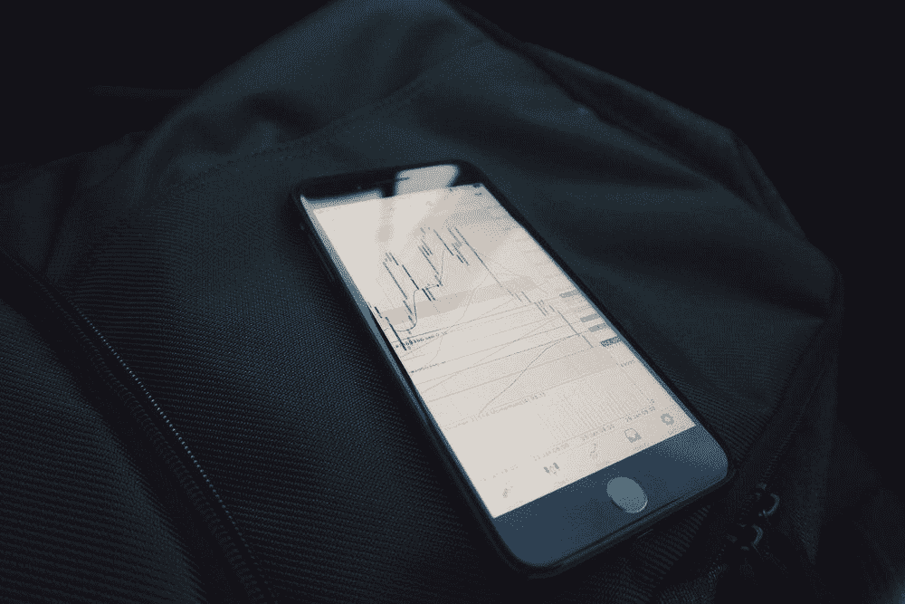

# 我是如何意外对冲并杀死了一种加密货币的

> 原文：<https://medium.com/coinmonks/how-i-accidentally-hedge-and-killed-a-cryptocurrency-ece9a071110b?source=collection_archive---------0----------------------->

> 我并不是想扼杀未来，只是想拯救我的未来

以下是 2019 年的一则新闻。这可不是什么值得我骄傲的事。我最终决定不写这篇文章，直到最近在 HBO 电视台首映的《黑色星期一》大约 10 分钟后。我想说的很快。我只是个犯了大错误的 80、90 后。