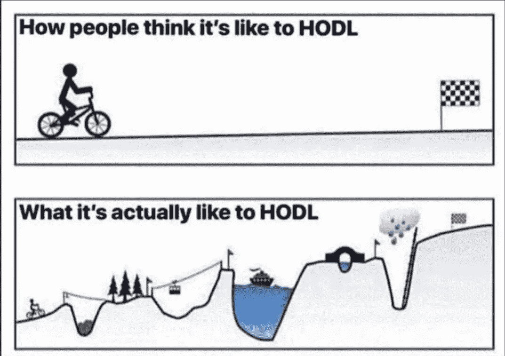
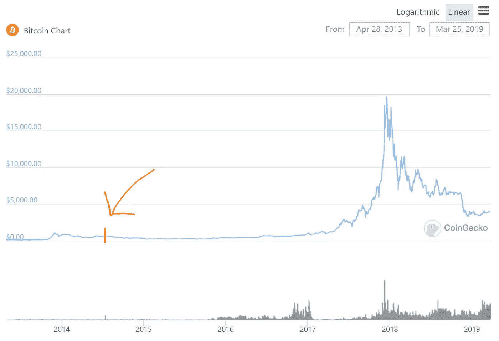
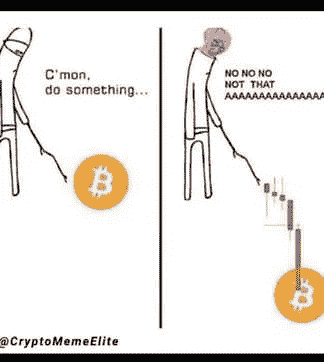
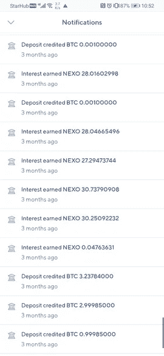
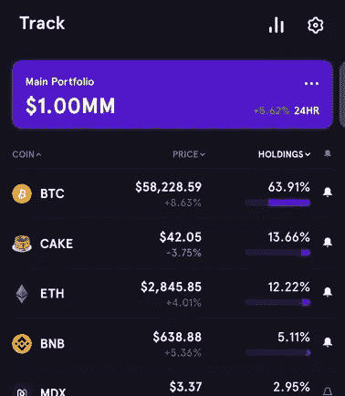
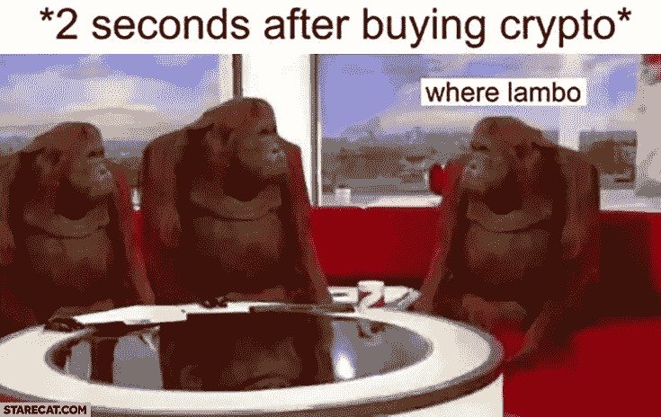

# 我是如何在 30 岁时成为一名密码百万富翁，把它变成一台 2 万美元/月的印钞机…并变得免费的🗽🌟

> 原文：<https://medium.com/coinmonks/how-i-became-a-crypto-millionaire-by-the-age-of-30-turned-it-into-a-20k-mo-money-printer-and-46dc09a3ca0?source=collection_archive---------0----------------------->

Me breaking free from the (block)chain.

三个月前，我拼命工作，试图让我的新健康科技创业公司起步，并从一个不知名的风险加速器那里筹集了 6 万美元，为了做到这一点。它不起作用。我一周工作 7 天。我和我的联合创始人一起奋斗，我努力寻找客户承诺哪怕是一分一毫，即使是在纸面上。我快累垮了…

三个月后，我的身价超过了 100 万美元，什么也没做，但每月收入超过 2 万美元。这是怎么发生的？嗯，我在撒谎。不是关于这些数字，而是关于我如何到达那里。这并不像我说的那么简单快捷。2014 年，在我那位极客开发者朋友向我提到比特币之后，我将第一笔钱投入了 crypto。

.

## **回到起点**

我的朋友对这项技术的潜力非常兴奋，我忍不住去做了一些研究。我并不完全理解其中的内在机制，但对我来说，它对世界的潜在影响和价格走向是显而易见的。回到 2014 年，我在建筑学院学习了 5 年，还有一年。我破产了。嗯，并不是真的破产，我有大约 4000 美元的存款，这是我 23 年来积累的。

当时我不是一个很会算计的人(把大部分时间和金钱花在垃圾上)，但这个决定的二元经济学对我来说很清楚。

*   **场景 A:** 我把所有的积蓄都投资到了 BTC。在 5-10 年的时间里，它会下降到 0。我将失去我所有的积蓄，但是到那个时候，我将已经毕业并且工作了 4-9 年。我将会多次赚回这$4k。我会做一个大胆的赌注，但没有成功，我不会后悔。
*   **场景 B:** 我把所有的积蓄都投资到了 BTC。在 5 到 10 年的时间里，它会增长 100 到 1000 倍。我会赚上百万，不用说，我欠 23 岁的我一个大大的感谢！
*   场景 C: 我通过了。在 5 到 10 年的时间里，BTC 将增长 100 到 1000 倍。
    %^@ %&($&(_！@!%:!抱歉，我不得不指责。:)

我想现在很明显我投资了。就在我们说话的时候，场景 B 正在展开。

**这对 HODL 真正意味着什么**

大多数投资加密技术的人最终没有变得富有的原因是他们不能持有——或者用加密术语 HODL 来说。霍德林比听起来难多了。在我投资 4k 美元的时候，一个比特币的价格大约是 600 美元。我得到了 6.55 BTC。我永远不会忘记那个数字。在接下来的半年里，比特币的价格持续下跌，直到 2015 年 1 月跌至 152 美元。在我知道投资(或加密)周期如何运作之前，就这样损失了 75%!

我想很多人在这里卖过，或者更早。我以为一切都完了，但我坚持住了。我的意思是去他妈的，现在我已经失去了 75%的生活积蓄，不妨，对不对？为了应对这种情况，我不再密切关注价格，可能一个月一次。毕竟，我还有自己的生活和最后一年的学业要完成。又过了 18 个月(几乎是整个熊市)，油价在 2016 年 6 月再次达到 600 美元。是的，非常成功！

那时我 25 岁，住在伦敦，开始了我的第一份真正的工作，同样，我太忙了，没有时间太担心这个。我过着简朴的生活，并设法让我的储蓄恢复到投资时的水平以上。至于我的投资，在我进来两年后，我的 4k 美元达到了盈亏平衡点。进入牛市。

价格从这里开始稳步攀升，直到 2017 年 4 月达到约 1.2k 美元。从那以后，事情就乱了套。在那之前不知道它是什么的每个人都开始谈论加密…并把他们自己(和他们祖母)的钱投入其中。从 4 月到 12 月，价格攀升了约 16 倍，直到在那年圣诞节前两周达到近 2 万美元的峰值。

又一次，我太忙了，没怎么注意。到目前为止，我已经放弃了我的(大约 1.5 年的)建筑生涯，加入了一家 proptech 初创公司。我们还在起步阶段，事情非常紧张。我当时管理着一个运营团队，每天 24 小时管理客人和酒店。我们经常超负荷工作而人手不足。向亚洲的国际扩张正在酝酿之中。我周围的人都在谈论密码，但我没有时间认真注意。我仍然只是每隔几周检查一次价格。

I bought in somewhere around the arrow. The long run up to the 2017 bull market, above.

**大起大落**

市场达到最高点后，价格立即开始下跌。哦，天啊，真的摔倒了！下降到 2018 年 6 月稍微稳定的 6k 美元，然后在 12 月第二次探底 31k 美元。这比最高值下降了 84%。再说一次，大多数人在顶部之前的最后几个月亏本卖出，远在到达这个阶段之前。看到我的持股从 128，000 美元缩水到 20，000 美元，我并不感到兴奋，但嘿，自从我投资以来，我仍然上涨了 400%。这相当于 4.5 年 43%的年回报率——仍然比任何一家银行给你的回报都要高，也比大多数交易员赚的都高。

这时候我有了更多的存款，在下跌之后，比特币在我看来又一次变得便宜了。在没有想太多的情况下，在 2018 年 12 月至 2020 年 1 月期间，我部署了大约 8.2 万美元，以每枚硬币平均 9.750 美元的价格(价格一直在上涨)购买了另一枚 8.4 BTC。到这个时候，我的净资产大约有 50%在 crypto。这似乎是正确的平衡。我对它的信念更加坚定。

此时，我刚刚搬到马来西亚，在那里管理一个更大的团队，仍然是同一家初创公司。我还是很忙！我并不认为 crypto 值得我花费太多时间(尽管我确实认为值得投入大部分资金)。直到那年 10 月，价格基本保持在 8000-10000 美元之间，而世界正忙于处理 covid(本应在下个月结束，似乎永远不会结束)。

去年 10 月本来是再次关注价格的好时机，但我太忙了，离开了之前的创业公司，试图创办一家新公司，这次是在新加坡。那是地狱般的几周(或地狱般的几个月！).不知道今年(2021 年)1 月初价格怎么就到了 30k 美元。我的总净值现在超过了 50 万美元(81%是加密的)。我注意到了。但是我真的，再一次，太忙了，没有时间参与更多。我继续努力，试图建立我的创业公司，筹集那该死的 6 万美元。

This is a pretty typical crypto market behaviour…

## **进入 CeFi**

到目前为止，DeFi 热潮已经达到了相对成熟的程度，我的室友(非技术、非加密)一直在谈论 BSC 上的产量农业。我是说，真的吗？我持怀疑态度。也没有时间去调查。尽管我的创业没有成功，我也没有真正的收入可以利用，我决定至少关注一下。三个月前，在二月底(BTC 的价格现在超过了 50000 美元)，我花了一个周末的时间进行研究，最终开立了 Nexo 和 Celsius 储蓄账户。这不是 DeFi，但这是一个进步，为我的(直到那时休眠)BTC。

我在抽屉里翻找我的私人钥匙的纸和笔记录(到现在已经快 7 年了)。然后我在网上挖得更深，想知道如何从 BIP38 格式中解密它们，这种格式几年前就已经停产了！经过几个小时的积极研究，我很幸运。我仍然记得我的解密密码，并设法将我的五个私人密钥刷到一个热钱包上。(是的，在 2014 年设置时，我花了很多精力来创建良好的安全性)。我价值 60 万美元的比特币出现在我火热的钱包里，我的壁炉都跳了起来。他们还在那里。他们是真实的！

从那以后，我花了一个月的时间慢慢想出如何建立正确的(集中的)储蓄账户，这样我就可以从我价值 60 万美元的密码中获得 6%的年化利息——基本上每月给我 3000 美元的收入。这可以支付我的账单！我可以继续创建我的创业公司，没有负罪感。这是多么美丽啊！

Nexo savings account. The daily accruing interest came to about $100 at that time.

## **然后 DeFi**

与此同时，我开始对去中心化金融(DeFi)感到好奇——它过去是、现在仍然是加密技术的狂野西部，是肾上腺素驱动的赌博……嗯，我是说投资……发生的真正舞台。我的记录显示，我在 3 月的最后一周买了我的第一个 178 蛋糕(用了价值约 2000 美元的 BTC ),来测试高产农业。天啊，天啊，我多么喜欢那些 100+%的年利率啊！

到 4 月 1 日，我已经用我的比特币将我的 altcoin 财富增加到 3.400 蛋糕(约 4 万美元)。在接下来的几周里，我记得看着我的月收入(本金之外的收益率)从 3000 美元增长到 6000 美元，然后是 12000 美元，然后是 30000 美元。我正在把越来越多的 BTC 作品转换成代用币，我喜欢我所看到的！

我将发表一篇单独的文章，介绍我的 DeFi yield 农业实验的来龙去脉——设置、投资策略、风险管理等。总的来说，我对我的资金分配还是非常保守的。现在我需要补充的是，我的净资产在 4 月 10 日突破了神奇的 100 万美元，几乎正好是我 30 岁生日的前一个月。我知道这是一个技术性问题，但它确实给了我额外的喜悦和胜利。到目前为止，我已经停止建立我的创业公司，并发现自己专注于研究和全职玩这个空间。

Definitely happy to open my blockfolio tracker app to this kind of home screen!

**请继续关注我的下一篇文章，详细介绍我是如何获得 20000 美元的收入，从事高产农业的**

我说的是 2 万美元，而不是 3 万美元，因为这个月所有密码的价格下降了 50%，我的收入数字也下降了。我不会过多关注这个问题，因为我现在对市场有所了解，我相信这只是一个技术性的修正，当前的牛市将会继续，甚至更高。与此同时，2 万美元足够支付我的账单，并让我有足够的额外现金继续再投资，因为我对这个领域了解得越来越多。

虽然我会继续努力，继续前进，但这是一个很好的时间来回顾和评估我过去 7 年的主要收获，看看我是如何走到这一步的-

1.  **耐心和冷静**。我看着我的股票在我买入后下跌了 75%。我拿着。然后我看着他们在 2018 年再次跳水 85%。我拿着。我买了更多。我甚至没有计算中间所有其他 20-40%的下跌。
2.  **时机为王**。是的，我很幸运在 2014 年听说了比特币。但我决定抓住今天，而不是等待几年来看看这项技术是否证明自己。话说回来，2019 年，价格低的时候，我充值了。尽管回报远非立竿见影，但现在正是时候。
3.  少即是多。我知道许多人在某个时候成为了活跃的加密交易者。所有人要么亏损，要么像我一样持有 BTC 股票，他们的收益是之前的几倍。交易的第一条规则是——不要亏钱。如果你缺乏经验(我几乎可以保证你会)，或者没有耐心等待合适的机会，就不要交易市场。

Most crypto buyers :)

就是这样！如果你喜欢这篇文章，➡️ [在推特上找到我](https://twitter.com/m_goes_distance)🐦。请随意跟我来或者鼓掌，像这样-

> 加入 Coinmonks [电报频道](https://t.me/coincodecap)和 [Youtube 频道](https://www.youtube.com/c/coinmonks/videos)获取每日[加密新闻](http://coincodecap.com/)

## 另外，阅读

*   [密码电报信号](http://Top 4 Telegram Channels for Crypto Traders) | [密码交易机器人](/coinmonks/crypto-trading-bot-c2ffce8acb2a)
*   [复制交易](/coinmonks/top-10-crypto-copy-trading-platforms-for-beginners-d0c37c7d698c) | [加密税务软件](/coinmonks/crypto-tax-software-ed4b4810e338)
*   [网格交易](https://coincodecap.com/grid-trading) | [加密硬件钱包](/coinmonks/the-best-cryptocurrency-hardware-wallets-of-2020-e28b1c124069)
*   [印度的加密交易所](/coinmonks/crypto-exchange-dd2f9d6f3769) | [印度的加密应用](/coinmonks/buy-bitcoin-in-india-feb50ddfef94)
*   开发人员的最佳加密 API
*   最佳[加密贷款平台](/coinmonks/top-5-crypto-lending-platforms-in-2020-that-you-need-to-know-a1b675cec3fa)
*   杠杆代币的终极指南
*   [ko only 回顾](https://coincodecap.com/koinly-review) | [Binaryx 回顾](https://coincodecap.com/binaryx-review)|[Hodlnaut vs CakeDefi](https://coincodecap.com/hodlnaut-vs-cakedefi-vs-celsius)
*   [40 个最佳电报频道](https://coincodecap.com/best-telegram-channels) | [1xBit 评论](https://coincodecap.com/1xbit-review) | [Keevo 钱包评论](https://coincodecap.com/keevo-wallet-review)
*   [如何在印度购买以太坊？](https://coincodecap.com/buy-ethereum-in-india) | [如何在币安购买比特币](https://coincodecap.com/buy-bitcoin-binance)
*   [在美国如何使用 BitMEX？](https://coincodecap.com/use-bitmex-in-usa) | [BitMEX 评论](https://coincodecap.com/bitmex-review) | [买入索拉纳](https://coincodecap.com/buy-solana)