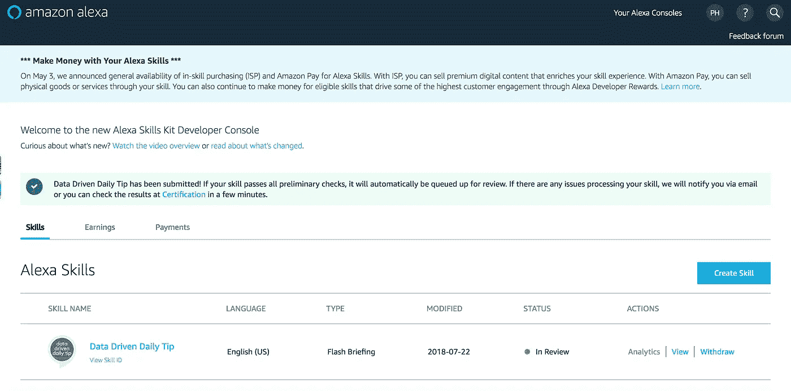

# 我如何建立我的第一个 Alexa Flash 简报技能

> 原文：<https://medium.com/coinmonks/how-i-built-my-first-alexa-flash-briefing-skill-61bfa59fbee5?source=collection_archive---------4----------------------->

# 刚刚开始构建 Alexa Flash 简报

我不知道这是否真的有用。

当我学习新东西并第一次尝试实现它时，这通常是我想的第一件事。

我刚刚建立了我的第一个 Alexa Flash 简报技能——名为数据驱动的每日提示——并提交给了 Alexa 技能商店，我不知道它听起来会是什么样子。

原因如下——我决定用我的 Anchor.fm 播客中的 RSS 提要来提交它，而不是创建我自己的 JSON 提要。

你看，[创建一个 Alexa Flash 简报技能](https://developer.amazon.com/docs/flashbriefing/steps-to-create-a-flash-briefing-skill.html)并不难，但是有一个稍微棘手的部分，创建你的 feed。我一会儿就会谈到这一点。

你需要做的第一件事是创建一个亚马逊开发者账户，这是免费的。

1.[在这里创建一个亚马逊开发者账户](https://developer.amazon.com/)。

2.一旦你注册了，

*   登录到开发人员控制台。
*   点击**创造技能**按钮。
*   为你的技能输入**技能名称**。这个名字出现在 Alexa 应用程序中的客户面前。确保该名称不暗示亚马逊的赞助，或侵犯第三方的版权、商标和宣传权。
*   在**默认语言**下拉列表中，选择适合您技能的语言。快速简报技能只针对一种语言，一旦选择就无法更改。此外，技能序言、错误消息、描述和内容应使用为该技能选择的语言。
*   选择 **Flash 简报**预建模型，然后点击**创建技能**。flash 简报模型是预定义的，讲英语的客户可以通过说出如下短语来获得 Flash 简报:
*   " Alexa，我的简报是什么？"
*   “Alexa，新闻里有什么？”

在这一点上，这已经是一种乐趣，但正如你所看到的，它“饲料”，你有一个决定。你不能只是上传音频 MP3 文件，就像我在这张截图中展示的那样。

3.你要么[创建自己的 JSON feed](https://developer.amazon.com/docs/flashbriefing/flash-briefing-skill-api-feed-reference.html#json-single-audio-item-example) ，使用亚马逊网络服务 S3 托管(这里有一篇很棒的文章解释了如何做)。

或者，

4.创建自己的 RSS 源。因为[创建你自己的 JSON feed 可能是高度技术性的](/@swyx/tutorial-how-to-host-an-alexa-flash-briefing-feed-on-aws-lambda-and-get-a-free-amazon-echo-dot-a50fa1c76a64)，我决定稍微欺骗一下，使用我自己的 Anchor.fm 播客 RSS feed 作为我的 Alexa Flash 简报技能 RSS Feed 提交，因为实际上，我希望数据驱动的每日提示 Flash 简报本质上是从我的播客重新利用的相同音频。

[以下是我如何找到我的 Anchor.fm RSS 订阅源的](https://www.youtube.com/watch?v=2mpEEZ4G-6A)。

5.一旦你的提要被保存，你可以提交你的技能到 Alexa 技能商店。

因此，如果这没有得到批准，或者听起来不像我希望的那样，我会做一些调整。我的第一个想法可能是回到创建我自己的 JSON 提要，但是我可能需要我的团队在编码部分提供一些技术帮助。音频文件托管部分超级简单。

另一个想法是使用类似于[故事情节](/storyline-blog/how-to-create-your-own-flash-briefing-skill-for-amazon-alexa-without-coding-fdf3376f0e69)的工具，我注册并提交了一个技能，但当它试图上传到 Alexa 技能商店时，它给了我一个错误。

感谢您的阅读、观看和收听，祝您有美好的一天！

继续营销！

*Paul Hickey，* [*数据驱动设计有限责任公司*](https://datadriven.design/) *的创始人/首席执行官/首席策略师，10 多年来一直通过数字战略和互联网营销来创建和发展业务。他最擅长的是使用分析来设计和建立网站，并通过 SEO/博客、Google Adwords、Bing 广告、脸书和 Instagram 广告、社交媒体内容营销和电子邮件营销来增加受众和企业收入。他最感兴趣的部分是基于真实数据量化接下来的营销行动。*