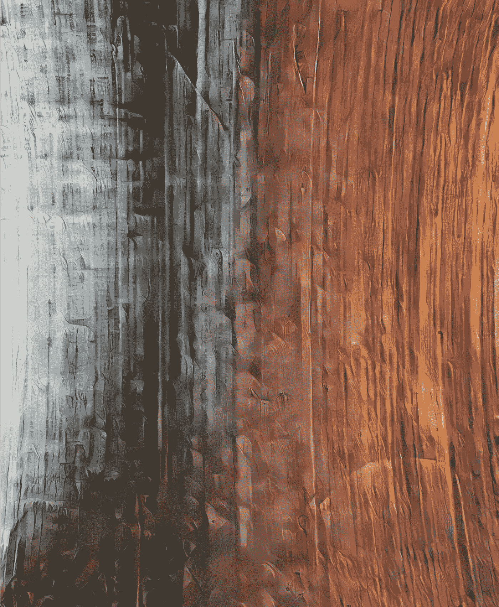

# 我如何免费创作一件 NFT 艺术品

> 原文：<https://medium.com/coinmonks/how-i-create-an-nft-art-piece-for-free-3032562ca2ea?source=collection_archive---------0----------------------->

*AI created art by Author.* [*See on Opensea as NFT*](https://opensea.io/accounts/createdd?ref=0xc36b01231a8f857b8751431c8011b09130ef92ec) *inspired by* [*Piwnicki*](https://unsplash.com/photos/JnXebVlsVrg)

目录

*   关于这篇文章
*   1.获取访问 Opensea 的元掩码
*   2.在 Opensea 上创建一个帐户
*   3.创作一件艺术品
*   4.铸造并出售你的艺术作品
*   放弃
*   关于

# 关于这篇文章